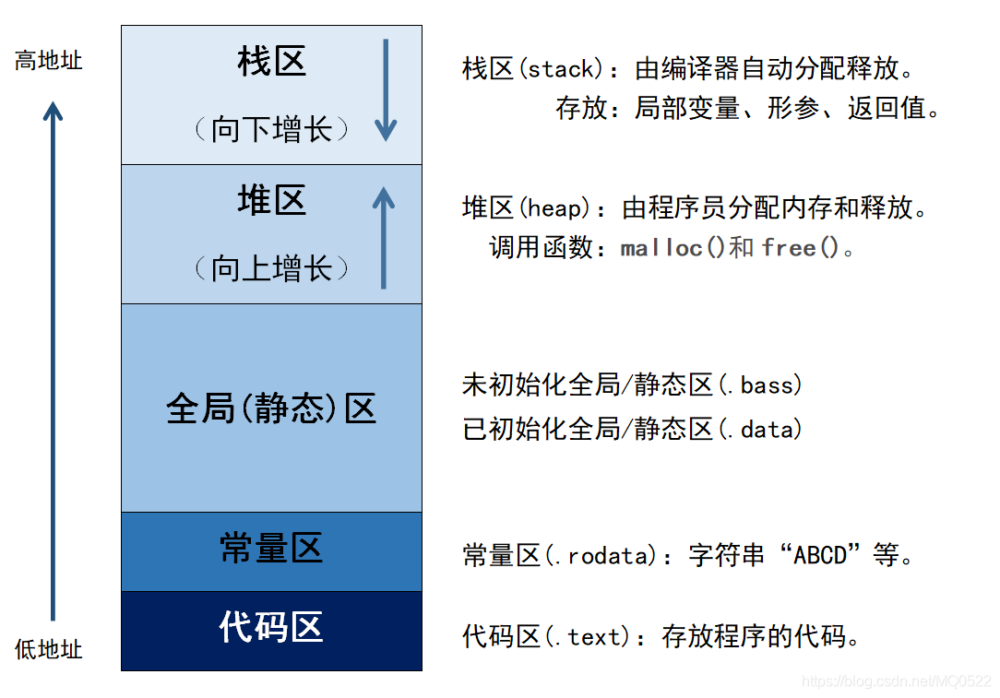

## C语言数组越界和内存分布
- 数组元素的地址是正确的，但是数组的容量却是小的。
```
#include <stdio.h>

// int a[5]; // 放在不同的地方 得出的结果是不同的 
// 参考 https://blog.csdn.net/weixin_55697693/article/details/127835873
int main() {
    int a[5];
    int i;
    for (i = 0; i < 100; i++)
        a[i] = i + 1;
    for (i = 0; i < 100; i++)
        printf("arr i, %d,: %d ", i, a[i]);
    printf("%d %d", &a[0], &a[200]);
    // 6422016  6422816
    // 打印发现两者的地址相差 800 也就是 200*4 因为一个int 占4个字节
    return 0;
}
```
- C/C++是不会对数组的越界做出判断的，也就是说可以对数组进行越界访问
- 在数组定义时，规定了数组的大小10，在程序运行的过程中，对数组进行赋值操作，当下标大于或等于10以后，此时继续操作进行存取操作是越界的，但是C/C++没有对数组越界的判断，所以可以对数组之外的内存区域进行了操作

## C语言内存管理
- 
- 栈区: 程序运行时由编译器自动分配，当我们的代码在编译时，就会为局部变量、形参、返回值分配内存，这段内存属于栈区，当程序结束时由编译器自动释放，栈的特点是先进后出，在内存中由高地址向低地址扩展。栈的空间比较小。一般是几M，所有一般数组开的太大，就会有爆栈。
- 堆区：堆区是我们自己可以手动分配的区域。平时我们用malloc calloc new free 等控制的就是堆区的内存，堆区的地址是有低地址向高地址扩展，我们在使用堆内存时，一定要牢记释放不用的内存区域。防止内存泄漏。
- 全局区：也叫静态区，这一段内存也是在编译时，有编译器分配的，全局变量和静态变量都是存储到这一块区域。程序结束后自动释放
- 常量区：存放常量类型，例如常量字符串
- 代码区：我们写的代码的二进制形式就存储到代码区，一般我们不用关心
- 由于局部数组分配到栈区，栈区较小，所以数组越界之后的内容不会稳定，会被其他的变量覆盖掉
- 全局数组分配到堆区，但是堆区比较大，数组虽然越界了，但是其他的变量的非配对越界的部分的内存影响率比较小
### 总结
- 数组大小根据实际的要求开，题目要求最大数据量是多少，尽量就开到多少，尽量将数组定义为全局变量。无论是全局还是局部数组，都不要数组越界，容易产生莫名其妙的错误。

