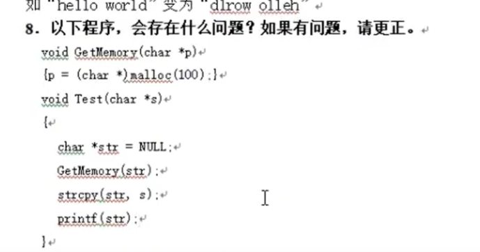
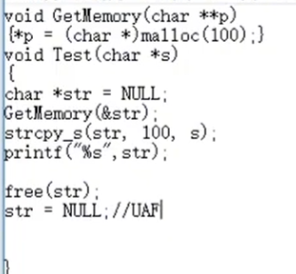

## 整型溢出例子
```
#include <stdio.h>

int main() {
    unsigned int x = 4294967295; // 2^32 - 1
    x = x + 1; // x 现在为 0
    printf("%d\n", x);

    int y = 2147483647; // 2^31 - 1
    y = y + 1; // x 现在为 -2147483648
    printf("%d\n", y);

    int h = 32767; // 2^15 - 1
    int i = 32767; // 2^15 - 1
    int g = h * i; // g 现在为 -32769
    printf("%d\n", g);

    int o = -2147483648; // -2^31
    int p = -1;
    int q = o / p; // q 的值未定义
    printf("%d\n", g);


    return 0;
}
```


面试题



1. 传值 GetMemory 返回后，临时变量释放 str 作为指针，没有拿到地址  
2. strcpy(str, s); 堆溢出风险。 也会空值会报错 499 
3. 内存泄漏，没有释放。
4. printf() 需要占位符来打印
5. 
6. 悬浮指针 