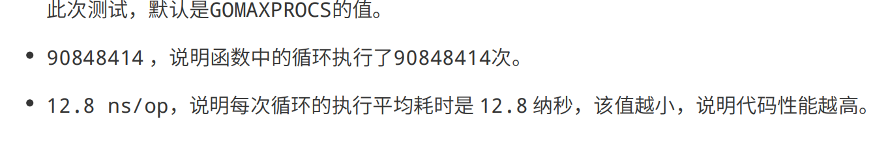

### 7 WaitGroup：协同等待，任务编排利器
- WaitGroup 不适合拷贝，不建议复用，使用时候，创建新的WaitGroup. 传递给函数入参时候，使用指针来传递。

### 基本类型和引用类型
- 基本类型 数值、浮点数、字符串、布尔、数组以及错误类型
- 引用类型 切片(slice)、字典(map)、接口(interface)、函数(function)、以及通道(chan)
- 注意：struct 不带指针是普通类型，带指针是引用类型。

### 10. Pool: 性能提升大杀器
- Pool 有内存泄漏的风险，放回缓存池的时候，buffer 容量过大，则不会回收，导致内存泄漏。一定要检查回收对象的大小
- Pool 内存浪费
- Pool 一段时间不使用，会给回收掉，建议使用其他的库，代替使用，
#### 建议使用的场景 
- 发现程序中有一种GC耗时特别高， 有大量的相同的类型的临时对象，不段的被创建销毁
- 在分布式或者微服务框架中， 可能会有大量的并发 Client 请求，如果 Client 的耗时占比很大，可以考虑池化 Client 
- 系统中的 goroutine 数量非常多，程序内存资源占用比较大，而且整体系统的耗时和GC 也比较高，通过 Worker Pool 解决大量的 goroutine 

#### GMP 模型
- G0, 本地队列，全局队列，挂起，唤醒。M 调度者， P 队列，本地队列中，没有可以执行的任务，则去全局队列拿，
- 加入队列，本地队列中是否有空间，有则加入，没有则放入到全局队列中。

- 监控 goroutine 不能太多，使用 pprof --gcflags="-m -m -l" 
- 查看runtime 运行的时间，监控，可以清晰的看出，调用关系链和执行时间。来分析项目运行的情况
- 可以使用 -test.bench=".*" 命令 压出函数执行的性能。
- - 

#### Channel Copy 知识点
- buffered channel 会发生两次 Copy
  - send goroutine -> buf
  - buf -> receive goroutine
- unbrffered channel 会发生一次 Copy
  - send goroutine -> receive goroutine
- unbrffered channel receive 完成后 send 才返回