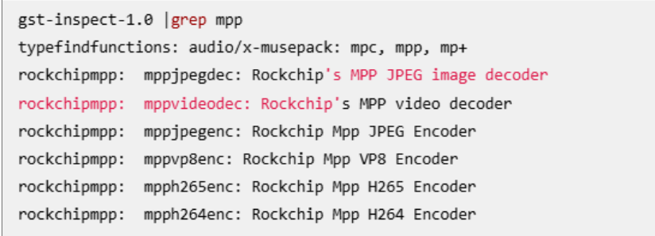

# 用 Hugging Face CLI 下载完整模型

```
# 1. 创建模型保存目录
mkdir E:\Models\gemma-4-31B-it

# 2. 安装 Hugging Face 下载工具
py -m pip install -U "huggingface_hub[hf_xet]"

# 3. 登录 Hugging Face
hf auth login

# 4. 下载完整模型仓库
hf download google/gemma-4-31B-it --repo-type model --local-dir E:\Models\gemma-4-31B-it
如果你这里网络访问 Hugging Face 慢，可以先加代理，按你之前的端口 7897

$env:HTTP_PROXY="http://127.0.0.1:7897"
$env:HTTPS_PROXY="http://127.0.0.1:7897"

然后执行：
hf download google/gemma-4-31B-it --repo-type model --local-dir E:\Models\gemma-4-31B-it

```


# SCP

```
# 本地 → 远程：拷贝单个文件
scp /home/user/a.txt root@192.168.1.100:/root/

 scp /e/share/docker-compose.influxdb-emqx.yml pyj@192.168.31.224:/home/pyj

# 远程 → 本地：拷贝整个目录
scp -r root@192.168.1.100:/var/log /home/user/
```


# micorcom

```
sudo apt install picocom
sudo picocom -b 115200 --echo /dev/ttyUSB2

然后确认没有进程占用：

sudo fuser -v /dev/ttyUSB2

如果还有占用，杀掉：

sudo fuser -k /dev/ttyUSB2

ping -I usb0 baidu.com
```


# dpkg

```
sudo apt-get install ./todesk-vx.x.x.x-arm64.deb


```


# Skills

```
# 使用绝对路径安装到项目中
npx skills add "E:\WorkSpace\taste-skill-main" --list

cd E:\WorkSpace\MyFrontendProject

npx skills add "E:\WorkSpace\taste-skill-main" --skill "gpt-taste" -a codex --copy


全局安装到 Codex：
npx skills add "E:\WorkSpace\taste-skill-main" --skill "gpt-taste" -a codex -g --copy

全局安装后，大概会在：

C:\Users\你的用户名\.codex\skills\


查看是否安装成功

执行：

npx skills list

使用 /redesign-existing-projects skill，先审查当前页面 UI 问题，再给出改造方案，并修改代码。
要求保留原来的业务逻辑、接口字段、路由名称，只优化布局、颜色、层级和交互。
```


# JAVA

```
 mvn clean package -DskipTests
 
```


# netstat

```
sudo netstat -tulnp | grep :80
# 或者使用
sudo lsof -i :80
```


# adb

```
# 查看包的信息
adb shell 
dumpsys webviewupdate 
adb shell 进入，再输入pm list packages | grep webview
```

# Node

```
 npm config set prefix "D:\Program Files\nodejs\node_global"
 npm config set cache "D:\Program Files\nodejs\node_cache"

 npm config get prefix
 npm config get cache
 
 mkdir %USERPROFILE%\.npm-cache
npm config set cache %USERPROFILE%\.npm-cache --global
node


查看所有可用版本：nvm list available
安装指定版本 Node.js：nvm install <版本号>（如 nvm install 18.16.0）
切换使用版本：nvm use <版本号>
查看已安装版本：nvm ls
安装最新版本：nvm install latest
先删掉有问题的版本：nvm uninstall 14.21.3

https://nodejs.org/zh-cn/download/archive/v14.20.0 下载地址

npm install --legacy-peer-deps

https://raw.giteeusercontent.com/mirrors/nvm/raw/v0.40.3/install.sh docker compose install

全局安装 ncu（只需一次）

npm install -g npm-check-updates

检查可升级的依赖（不写回 package.json）

ncu

如果看起来没问题，则写回 package.json 并重新安装

ncu -u
npm install

安装图片插件
npm cache clean --force
npm config set registry https://registry.npmmirror.com/
del package-lock.json
npm install react-photo-album --legacy-peer-deps --verbose
npm install yet-another-react-lightbox --legacy-peer-deps --verbose
npm install react-player --legacy-peer-deps --verbose

npm install chonky chonky-icon-fontawesome --legacy-peer-deps --verbose

npm install noty --save 
npm install noty --legacy-peer-deps --verbose

npm install @material-ui/core @material-ui/styles --save --legacy-peer-deps --verbose

npm install waveform-data pdfjs-dist hls.js --legacy-peer-deps 安装缺少的依赖 

```
# Git

```
git remote set-url origin http://old-domain.com:9090/repo.git

git remote add origin http://192.168.31.224:7902/qt/leak-system.git

# git submodule 管理子工程。
git clone --recursive https://github.com/barry-ran/QtScrcpy.git	
git submodule update --init --recursive

# 创建新的分支，并推送到远程。保持关联关系。
git checkout -b master
git add .
git commit -m"init"
git push -u origin master => git push --set-upstream origin master

git remote add origin  http://192.168.31.224:9008/crm/backend-python-api.git


$env:HTTP_PROXY="http://127.0.0.1:7897"
$env:HTTPS_PROXY="http://127.0.0.1:7897"
$env:ALL_PROXY="socks5://127.0.0.1:7897"


```


# GitLab

```
修复冲突：在 /etc/gitlab/gitlab.rb 中找到 puma['port']，将其改成其他空闲端口，比如 8081。

ruby
puma['port'] = 8081
nginx['listen_port']
sudo lsof -i:8080

让配置生效并验证
sudo gitlab-ctl reconfigure
sudo gitlab-ctl restart
sudo gitlab-ctl stop

# 停止底层的守护进程服务
sudo systemctl stop gitlab-runsvdir.service

# 彻底禁用开机自启
sudo systemctl disable gitlab-runsvdir.service

如果看到像 puma, sidekiq, nginx 这些关键服务的状态是 run 或 ok，就说明成功了。
sudo gitlab-ctl status

sudo gitlab-ctl tail

配置地址
external_url 'http://git.home.com:800'
```


# User 
```
Passwdudo passwd pyj

sudo usermod -aG sudo pyj 将当前用户 添加，可以使用 sudo 

```


# Docker
```
sudo snap install docker          # version 28.4.0, or
sudo apt  install docker-compose  # version 1.29.2-1

# 确保目录存在
sudo mkdir -p /var/snap/docker/current/config/

# 写入配置（使用当前可用的镜像加速器）
sudo tee /var/snap/docker/current/config/daemon.json <<-'EOF'
{
  "registry-mirrors": ["https://docker.1ms.run"]
}
EOF

sudo systemctl restart snap.docker.dockerd


docker ps 

 scp /e/share/index.php pyj@192.168.31.224:/home/pyj

 docker system prune -a -f 这个命令不能敲 会把镜像给清除了。

 docker compose logs nginx --tail=50

 docker compose rm -s -v nginx 清除 nginx 的 缓存
 
 docker compose up -d nginx php-fpm mysql redis openjdk
 
 docker compose -f docker-compose.yml -f docker-compose.influxdb-emqx.yml up -d influxdb emqx
 
 docker compose -f docker-compose.yml -f docker-compose.influxdb-emqx.yml up -d  emqx

```

# RTC

```
date 
date -u
hwclock -w
hwclock -s
```


# GStreamer

```
gst-inspect-1.0 --version

播放视频，把test.mp4换成实际的视频路径, mppvideodec就是尝试硬解
gst-launch-1.0 filesrc location=test.mp4 ! qtdemux ! queue ! h264parse ! mppvideodec ! videoconvert ! autovideosink

gst-inspect-1.0 |grep mpp



```