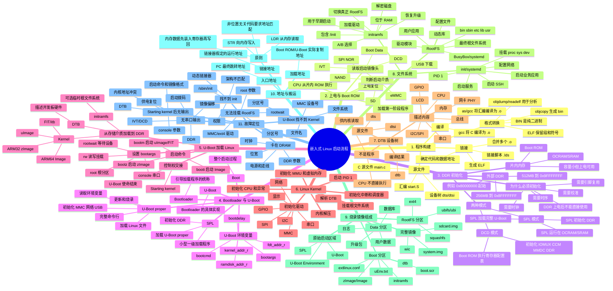
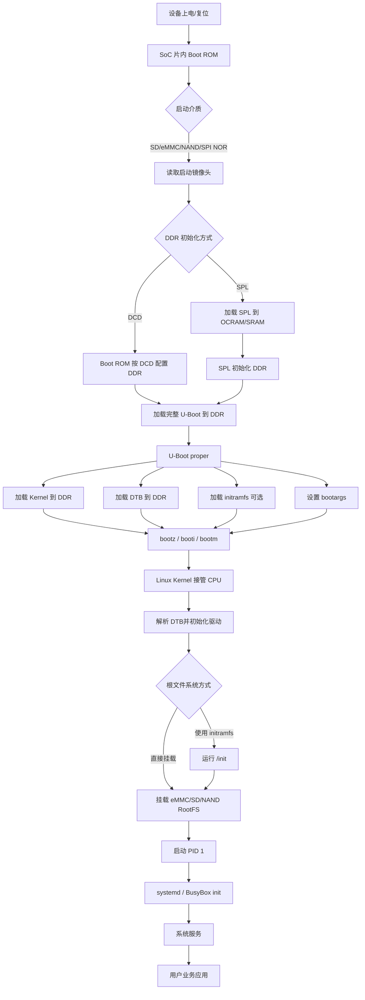
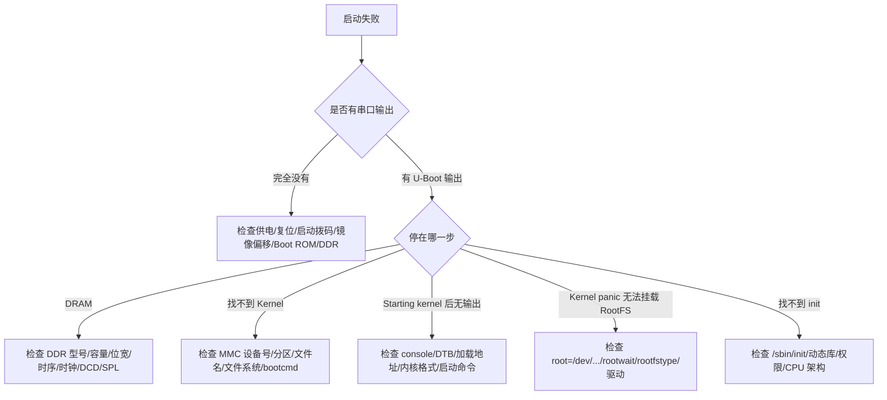

# 嵌入式 Linux 启动流程思维导图

> 适用范围：ARM / i.MX6ULL 等嵌入式 Linux 平台  
> 核心主线：**上电 → Boot ROM → DDR 初始化 → U-Boot → Linux Kernel → RootFS → init/systemd → 用户应用**

---

## 一、总思维导图



---

## 二、最核心的启动主线



---

## 三、各阶段职责对照

| 阶段 | 运行位置 | 主要作用 | 下一阶段 |
|---|---|---|---|
| Boot ROM | SoC 片内 ROM | 判断启动介质、读取镜像头、加载第一阶段程序 | SPL 或 U-Boot |
| DCD | 镜像中的配置数据 | 供 Boot ROM 初始化 DDR 和相关寄存器 | U-Boot |
| SPL | OCRAM/SRAM | 初始化 DDR、加载完整 U-Boot | U-Boot proper |
| U-Boot proper | DDR | 加载 Kernel/DTB/initramfs，设置 bootargs | Linux Kernel |
| Linux Kernel | DDR | 管理 CPU、内存、驱动、进程和文件系统 | PID 1 |
| DTB | DDR 中的数据 | 描述开发板硬件，不是可执行程序 | 供 Kernel 解析 |
| initramfs | RAM | 早期用户空间、寻找真正 RootFS | RootFS |
| RootFS | SD/eMMC/NAND/NFS | 提供命令、库、配置、服务和应用 | init/systemd |
| init/systemd | 用户空间 | 启动服务和业务程序 | 用户应用 |

---

## 四、烧录镜像常见结构

```text
SD / eMMC 整盘
│
├── 原始启动区域
│   ├── SPL（可选）
│   ├── U-Boot / u-boot.imx
│   └── U-Boot Environment
│
├── Boot 分区
│   ├── zImage / Image / uImage / fitImage
│   ├── board.dtb
│   ├── initramfs（可选）
│   ├── boot.scr
│   ├── uEnv.txt
│   └── extlinux/extlinux.conf
│
├── RootFS 分区
│   ├── /bin
│   ├── /sbin
│   ├── /etc
│   ├── /lib
│   ├── /usr
│   └── 用户程序
│
└── Data 分区（可选）
    ├── 日志
    ├── 数据库
    ├── 用户数据
    └── 升级包
```

---

## 五、构建产物归类

### 1. 启动程序

```text
SPL
u-boot-spl.bin
u-boot.bin
u-boot.img
u-boot.imx
u-boot-dtb.imx
u-boot.itb
```

### 2. Linux 内核

```text
zImage      ARM 32 位常见
Image       ARM 64 位常见
uImage      传统 U-Boot 格式
fitImage    FIT 打包格式
```

### 3. 硬件描述

```text
*.dts
*.dtsi
*.dtb
```

### 4. 文件系统

```text
initramfs.cpio.gz
rootfs.ext4
rootfs.squashfs
rootfs.ubifs
ubi.img
rootfs.tar.gz
```

### 5. 完整烧录镜像

```text
sdcard.img
system.img
*.wic
```

---

## 六、链接地址、加载地址和入口地址

```text
链接地址：
链接器认为代码将要运行的位置。

加载地址：
Boot ROM、SPL 或 U-Boot 实际将镜像复制到的内存地址。

入口地址：
CPU 最终写入 PC，并从该地址开始执行。
```

对普通非位置无关代码：

```text
链接地址 ≈ 实际执行地址 ≈ 入口地址
```

如果三者不匹配，可能导致：

```text
函数跳转错误
全局变量地址错误
常量表读取错误
程序跑飞或死机
```

---

## 七、汇编赋值与启动代码中的数据搬运

ARM 是典型 Load/Store 架构：

```text
内存 → LDR → 寄存器 → STR → 内存
```

示例：

```asm
LDR R0, =0x30    /* R0 保存地址 */
LDR R1, [R0]     /* 从地址 0x30 读取值 */

LDR R0, =0x20    /* R0 改为目标地址 */
STR R1, [R0]     /* 将值写入地址 0x20 */
```

记忆：

```text
R0   ：寄存器中的内容
[R0] ：R0 指向的内存内容
LDR  ：从内存装载到寄存器
STR  ：从寄存器保存到内存
```

启动程序中的 DDR 搬运同样遵循这个原则，只是数据量更大，通常由 Boot ROM、DMA、SPL 或 U-Boot 驱动完成。

---

## 八、故障定位思维导图



---

## 九、一句话总记忆

> **Boot ROM 找到第一阶段程序；DCD 或 SPL 让 DDR 工作；U-Boot 加载 Kernel、DTB 和可选 initramfs；Kernel 根据 DTB 初始化硬件并挂载 RootFS；init/systemd 最后启动系统服务和用户应用。**

---

## 十、极简记忆口诀

```text
ROM 找入口
DCD/SPL 开 DDR
U-Boot 搬内核
DTB 讲硬件
Kernel 管系统
RootFS 提供用户空间
init 启动服务和应用
```
