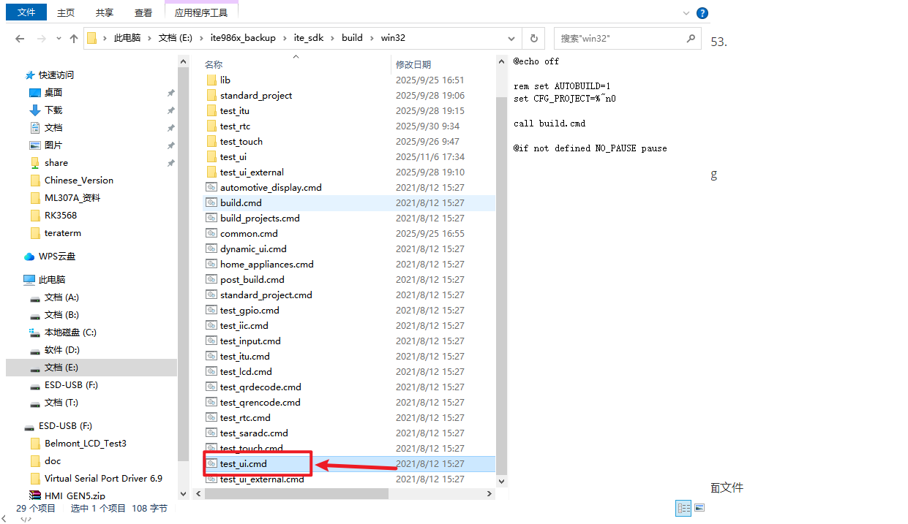
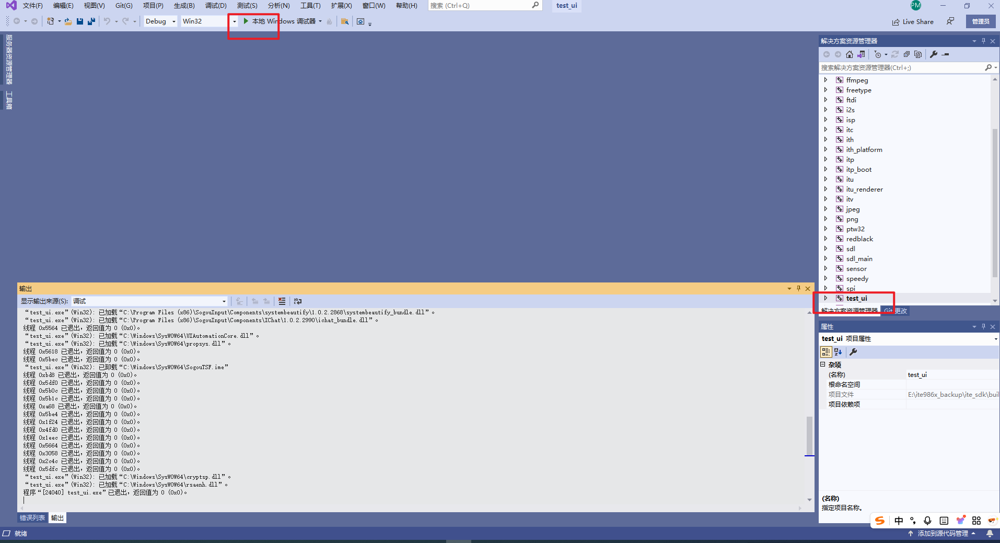
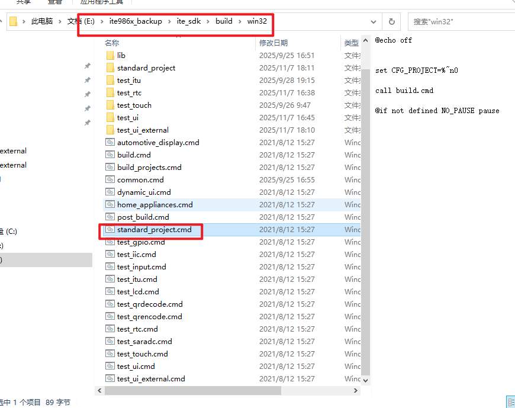
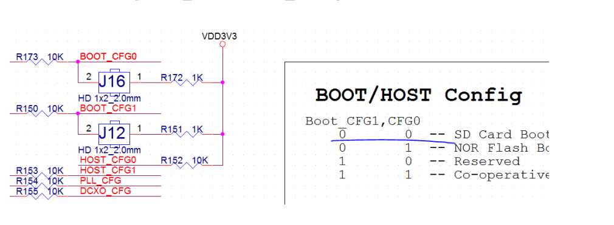
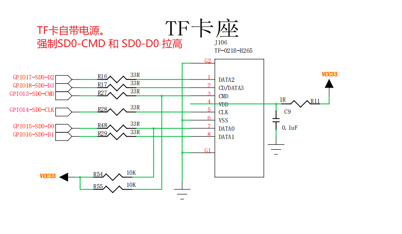

#### 使用VS studio 模拟图形化页面

带波形的图形化demo 使用 vs2019 打开

E:\ite986x_backup\ite_sdk\build\win32

eclipse    debug文档

TL068HWXH08 面板所對應的LCD script是 IT9860_MIPI_TL068HWXH08_EK79030_480x1280_4LANE_byteclk53.
txt ，位於 <sdk_root>/sdk/target/lcd 目錄下

ite986x的每个通讯部分的代码应该都是分开验证的，验证通过后可以移植到工程中，

4.1.2 如何手動載入 initial script
若想要讀寫記憶體，或進行記憶體讀寫測試等需要存取記憶體的動作，都必須先讓晶片內的韌體正確啟
動，或先透過 usb_spi_tool 軟體手動載入 initial script 以正確初始化記憶體所需的相關 clock。
C:\Users\Administrator\Desktop\work\project2\project-yedan\SDK\SDK_V2.4.4.2\ite_sdk\sdk\target\debug
IT9860_396Mhz_DDR2_396Mhz.txt

1. 點擊「Host」以切換到 Host 標籤頁。
2. 參考如何手動載入 initial script 載入 initial script 和 LCD script。務必先載入 initial script 再載入 LCD
script。

两种模式，一个是开机前按boot进入烧录模式，可以烧录文件
	二是在一之后重新上电，这个模式下可以用   .cmd  文件运行测试
 1. LCD屏幕测试，屏幕pwm背光是44引脚，LCD data format 是RGB888 ，长480，宽272
pitch 1920，load script使用IT9860_360Mhz_DDR2_360Mhz.txt

C:\Users\Administrator\Desktop\work\project2\project-yedan\SDK_V2.4.4.2\ite_sdk\sdk\target\lcd

SDK_V2.4.4.2\ite_sdk\sdk\itu\tool\bin\DrawrockerGUIDesigner.exe所在位置
SDK_V2.4.4.2\ite_sdk\data\font\ctrlboard.xml  或者 \ite_sdk\project\home_appliances\itu\1280x480   ui界面文件
SDK_V2.4.4.2\ite_sdk\project\test_itu\examples   界面示例文件

void ithGpioSetOut(unsigned int pin)
设为输出模式

void ithGpioSet(unsigned int pin)
设定高电平
unsigned int pinGPIO pin 編号

test_nor是spi

lcd 测试的时候   按照步骤手册
 1.5.11 利用 GDB 除錯程式执行
EVB 切換為 Co-operative Mode（也就是按住boot后开机后黑屏）
在这个模式下不要打开spi to usb 软件

模块测试完毕后，将代码文件放到工程中然后修改CMakeList.txt文件
add_executable(${CMAKE_PROJECT_NAME}
    audio.c
    config.c
    ctrlboard.h
    external.c
    external_process.c
    function_table.c
    main.c
    photo.c
    reset.c
    scene.c
    scene.h
    screen.c
    storage.c
    string.c
    upgrade.c
    backup.c
    test_lcd.c
    )
在其中加入新的模块文件

#### **工具**

图形化界面工具

  在项目中 SDK 中 DrawrockerGUIDesigher.exe 中 图形化文件 ctrlboard.xml

日志打印工具

  Tera Term VT 工具 选择 串口使用，设置 Port 后，即可打印出日志 

新创建一个专案

  wizard.exe 

项目目录：

  6_SDK_V2.4.4.2_net_over 

烧录

芯片型号 ITE 986X  主控芯片

TF 卡座电源供电

