# CRM 硬件监控系统通信流程 Mermaid 总结

> 适用项目：
>
> - `01_qt_qml_client`：Qt/QML 本地客户端
> - `02_agent_core_cpp`：C++ Agent Core 采集与执行端
> - `03_backend_python_api`：Python FastAPI 后端
> - `04_web_admin_vue`：Vue 后台管理端
> - `EMQX/MQTT`：设备消息通信服务
> - `InfluxDB`：实时/历史指标时序数据库
> - `MySQL`：设备、配置、用户、角色、权限、指令、日志等业务数据

---

## 1. 总体流程总结

系统整体链路可以理解为：

1. 用户开启 Qt/QML 客户端。
2. 客户端填写 Python API 服务器 IP 地址。
3. 客户端通过 REST / WebSocket 连接 Python API。
4. Agent Core 采集设备数据。
5. Agent Core 发布采集数据到 MQTT。
6. Python API 订阅 MQTT 数据。
7. Python API 保存实时指标到 InfluxDB，保存设备/状态/日志到 MySQL。
8. Qt/QML 或 Vue Admin 请求实时数据、历史数据。
9. Python API 返回数据，或通过 WebSocket 主动推送到 Qt/QML 显示。
10. Qt/QML / Vue Admin 下发开启软件、停止软件、压力测试等指令。
11. Python API 通过 MQTT 发布指令给 Agent Core。
12. Agent Core 执行动作并通过 MQTT 返回执行结果。
13. Python API 更新状态并通过 WebSocket 推送给客户端。

---

## 2. 总体通信架构图

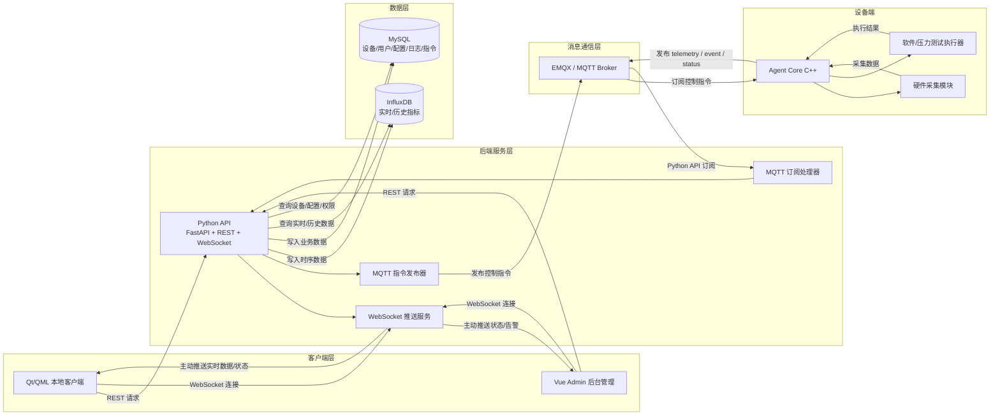

---

## 3. 开启客户端软件 → 填写服务器 IP → 连接 Python API → 保存配置流程

### 3.1 流程说明

Qt/QML 客户端首次启动时，用户需要填写 Python API 服务地址，例如：

```text
服务器 IP：192.168.31.206
HTTP API：http://192.168.31.206:8000
WebSocket：ws://192.168.31.206:8000/ws/realtime
```

客户端保存该配置后，后续所有 REST 请求和 WebSocket 连接都基于该地址。

### 3.2 Mermaid 流程图

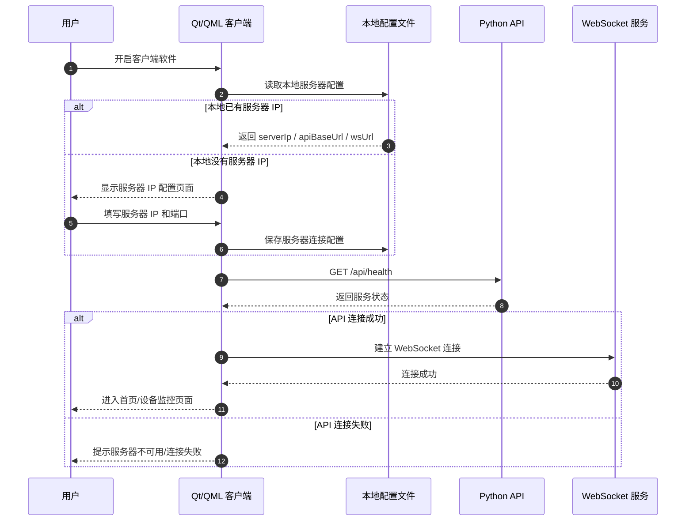

### 3.3 推荐配置字段

```json
{
  "serverIp": "192.168.31.206",
  "apiBaseUrl": "http://192.168.31.206:8000",
  "webSocketUrl": "ws://192.168.31.206:8000/ws/realtime",
  "deviceId": "device-crm",
  "connectTimeoutMs": 5000,
  "autoReconnect": true
}
```

---

## 4. 采集数据 → 发布 MQTT → Python API 订阅 → 保存 InfluxDB 流程

### 4.1 流程说明

Agent Core 负责采集硬件基本信息和实时指标。

- 基本信息：启动时采集，或手动刷新时采集。
- 实时指标：每 1 到 2 秒采集一次。
- Agent Core 不直接写数据库，而是通过 MQTT 发布到 EMQX。
- Python API 订阅 MQTT Topic，解析数据后写入 InfluxDB / MySQL。

### 4.2 Mermaid 流程图

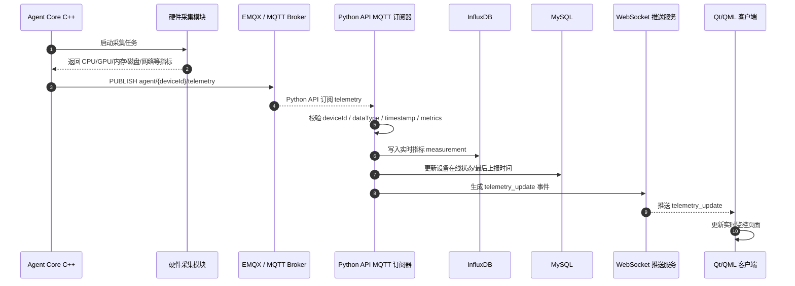

### 4.3 实时指标 MQTT Payload 示例

```json
{
  "dataType": "realtime_metric_v2",
  "messageId": "metric-1781333677601",
  "deviceId": "device-crm",
  "deviceName": "device-crm",
  "timestamp": 1781333677601,
  "metrics": {
    "cpu": {
      "name": "AMD Ryzen 5 5600GT with Radeon Graphics",
      "usage_percent": 12.5,
      "temperature_celsius": 48.2,
      "power_watt": null
    },
    "memory": {
      "total_gb": 31.8,
      "used_gb": 10.2,
      "usage_percent": 32.1
    },
    "disks": {
      "count": 2,
      "physical": []
    },
    "network": {
      "rx_kbps": 125.4,
      "tx_kbps": 32.8
    }
  },
  "issues": []
}
```

---

## 5. 客户端请求 → Python API 获取实时数据/历史数据 → 返回 Qt/QML 显示流程

### 5.1 实时数据有两种方式

方式一：客户端主动请求。

```text
GET /api/telemetry/latest/{deviceId}
```

方式二：Python API 通过 WebSocket 主动推送。

```text
ws://{serverIp}:8000/ws/realtime?device_id={deviceId}
```

### 5.2 历史数据请求

```text
GET /api/telemetry/history/{deviceId}?start=2026-06-13T00:00:00Z&end=2026-06-13T23:59:59Z&metrics=cpu.usage_percent,cpu.temperature_celsius,memory.usage_percent
```

### 5.3 Mermaid 流程图

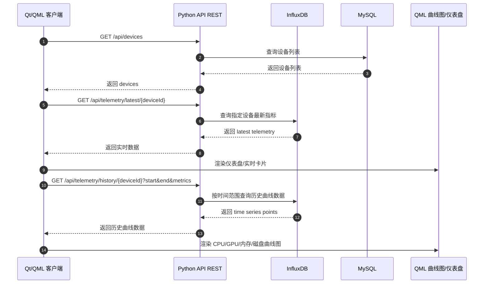

---

## 6. Python API 开启软件指令 → Agent Core 执行指令 → 执行动作 → 反馈结果流程

### 6.1 流程说明

Python API 作为指令中心，负责：

1. 接收 Qt/QML 或 Vue Admin 的开启软件请求。
2. 生成 commandId。
3. 保存指令记录到 MySQL。
4. 通过 MQTT 发布指令到 Agent Core。
5. Agent Core 订阅指令并执行。
6. Agent Core 通过 MQTT 返回执行结果。
7. Python API 更新指令状态。
8. Python API 通过 WebSocket 推送执行结果到客户端。

### 6.2 Mermaid 流程图

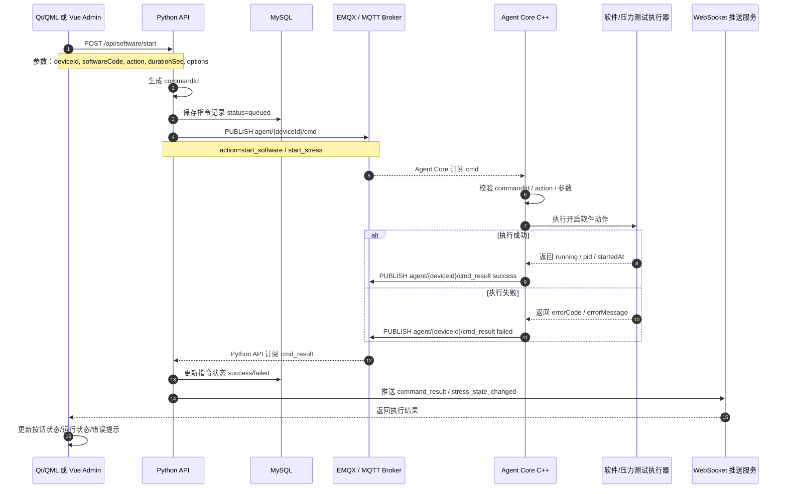

### 6.3 Python API 发布指令 Payload 示例

```json
{
  "dataType": "agent_command",
  "commandId": "cmd-20260613-000001",
  "deviceId": "device-crm",
  "action": "start_software",
  "softwareCode": "burnintest",
  "durationSec": 3600,
  "options": {
    "mode": "full",
    "cpu": true,
    "gpu": true,
    "memory": true,
    "disk": true
  },
  "createdAt": "2026-06-13T15:30:00+09:00"
}
```

### 6.4 Agent Core 返回执行结果 Payload 示例

```json
{
  "dataType": "command_result",
  "commandId": "cmd-20260613-000001",
  "deviceId": "device-crm",
  "action": "start_software",
  "softwareCode": "burnintest",
  "status": "success",
  "pid": 12345,
  "message": "software started",
  "timestamp": 1781333679000
}
```

---

## 7. Vue Admin 开启软件指令 → Python API → MQTT → Agent Core → 反馈结果流程

### 7.1 流程说明

Vue Admin 和 Qt/QML 的区别主要是入口不同：

- Qt/QML：本地客户端，偏设备现场操作。
- Vue Admin：后台管理系统，偏远程管理、批量设备控制、权限控制。

Vue Admin 开启软件前，一般需要经过用户登录、权限判断、设备选择、参数确认。

### 7.2 Mermaid 流程图

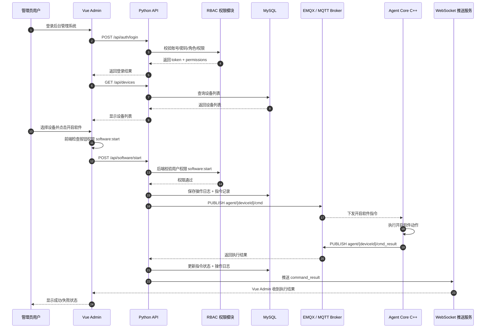

---

## 8. MQTT 订阅和发布总流程图

### 8.1 推荐 Topic 设计

| 方向 | Topic | 发布方 | 订阅方 | 用途 |
|---|---|---|---|---|
| Agent → API | `agent/{deviceId}/basic_info` | Agent Core | Python API | 基本信息上报 |
| Agent → API | `agent/{deviceId}/telemetry` | Agent Core | Python API | 实时指标上报 |
| Agent → API | `agent/{deviceId}/event` | Agent Core | Python API | 普通事件/告警事件 |
| Agent → API | `agent/{deviceId}/status` | Agent Core | Python API | Agent 在线状态/软件状态 |
| Agent → API | `agent/{deviceId}/cmd_result` | Agent Core | Python API | 指令执行结果 |
| API → Agent | `agent/{deviceId}/cmd` | Python API | Agent Core | 单设备控制指令 |
| API → Agent | `agent/all/cmd` | Python API | Agent Core | 广播控制指令，可选 |
| API → Agent | `agent/{deviceId}/config` | Python API | Agent Core | 下发配置，可选 |
| Agent → API | `agent/{deviceId}/heartbeat` | Agent Core | Python API | 心跳，可选 |

### 8.2 Mermaid MQTT 总览图

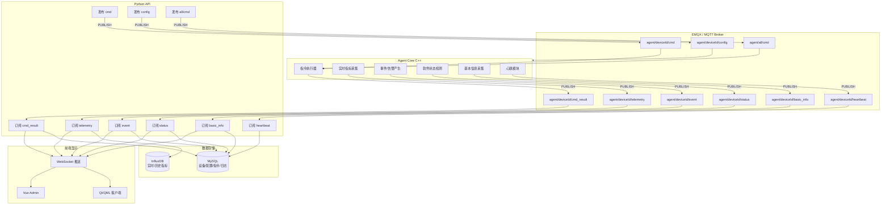

---

## 9. MQTT 发布/订阅完整时序图

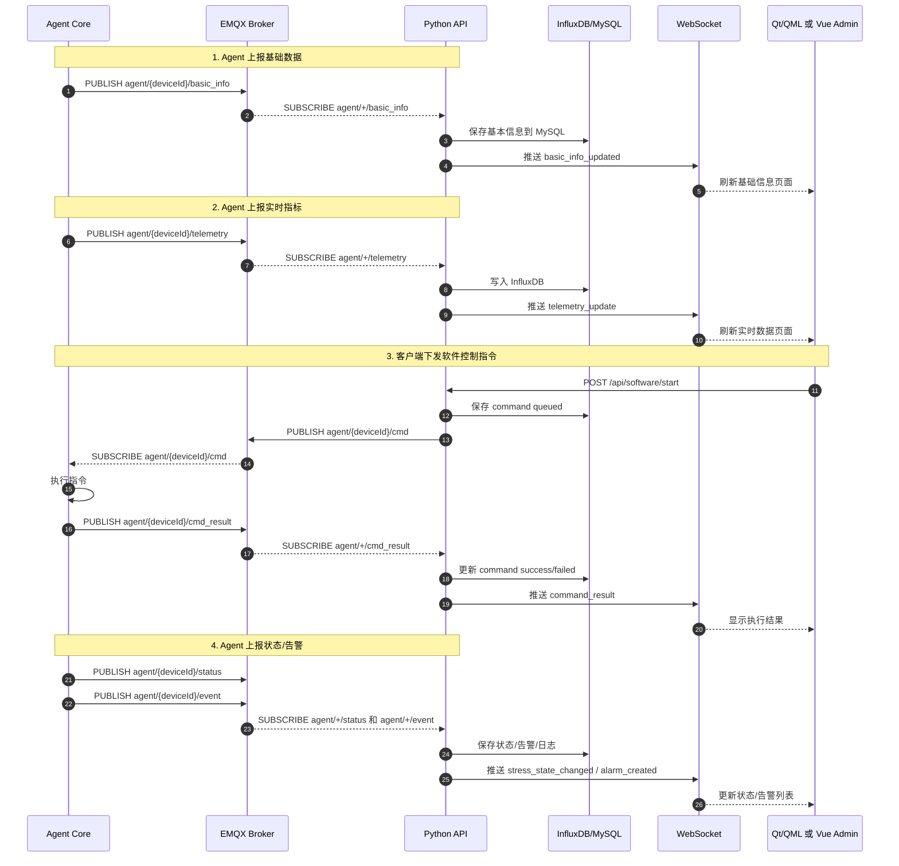

---

## 10. WebSocket 推送事件总流程图

### 10.1 WebSocket 事件列表

| 事件名 | 来源 | 推送给 | 用途 |
|---|---|---|---|
| `basic_info_updated` | MQTT basic_info | Qt/QML、Vue Admin | 基本信息刷新 |
| `telemetry_update` | MQTT telemetry | Qt/QML、Vue Admin | 实时指标刷新 |
| `stress_state_changed` | MQTT status/cmd_result | Qt/QML、Vue Admin | 压力测试状态变化 |
| `command_result` | MQTT cmd_result | Qt/QML、Vue Admin | 指令执行结果 |
| `alarm_created` | MQTT event | Qt/QML、Vue Admin | 告警产生 |
| `device_online` | MQTT heartbeat/status | Qt/QML、Vue Admin | 设备上线 |
| `device_offline` | 心跳超时 | Qt/QML、Vue Admin | 设备离线 |

### 10.2 Mermaid 图

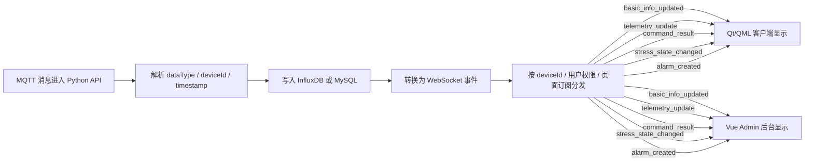

---

## 11. Python API 接口与连接地址建议

### 11.1 Qt/QML 客户端连接地址

```text
HTTP API Base URL:
http://{serverIp}:8000

WebSocket URL:
ws://{serverIp}:8000/ws/realtime?device_id={deviceId}
```

### 11.2 Vue Admin 连接地址

```text
VITE_API_BASE_URL=http://{serverIp}:8000
VITE_WS_URL=ws://{serverIp}:8000/ws/realtime
```

### 11.3 Agent Core MQTT 连接地址

```text
MQTT_HOST={serverIp}
MQTT_PORT=1883
MQTT_CLIENT_ID=agent-{deviceId}
MQTT_USERNAME={username}
MQTT_PASSWORD={password}
```

### 11.4 常用 REST API

| 方法 | 地址 | 用途 |
|---|---|---|
| GET | `/api/health` | 检查 Python API 是否可用 |
| GET | `/api/devices` | 获取设备列表 |
| GET | `/api/devices/{deviceId}` | 获取设备详情 |
| GET | `/api/devices/{deviceId}/basic-info` | 获取设备基本信息 |
| GET | `/api/telemetry/latest/{deviceId}` | 获取设备最新实时指标 |
| GET | `/api/telemetry/history/{deviceId}` | 获取设备历史曲线数据 |
| POST | `/api/software/start` | 开启软件 |
| POST | `/api/software/stop` | 停止软件 |
| POST | `/api/stress/start` | 开启压力测试 |
| POST | `/api/stress/stop` | 停止压力测试 |
| GET | `/api/commands/{commandId}` | 查询指令执行状态 |

---

## 12. 推荐落库规则

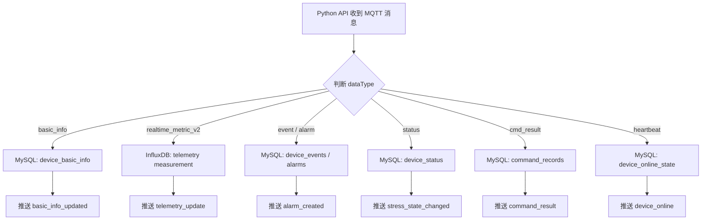

---

## 13. 给 Codex 的节省 Token 实现提示语

```text
请在 CRM 四个项目中按下面流程检查并最小范围修改：

项目：
01_qt_qml_client
02_agent_core_cpp
03_backend_python_api
04_web_admin_vue

目标：
补全 Qt/QML、Vue Admin、Python API、Agent Core、MQTT、InfluxDB 之间的完整通信链路。

必须实现/检查：
1. Qt/QML 启动后可填写 serverIp，并保存 apiBaseUrl、webSocketUrl。
2. Qt/QML 使用 http://{serverIp}:8000 请求 REST 接口。
3. Qt/QML 使用 ws://{serverIp}:8000/ws/realtime?device_id={deviceId} 接收推送。
4. Agent Core 采集 basic_info、realtime_metric_v2，并发布到 MQTT：
   - agent/{deviceId}/basic_info
   - agent/{deviceId}/telemetry
   - agent/{deviceId}/event
   - agent/{deviceId}/status
   - agent/{deviceId}/cmd_result
   - agent/{deviceId}/heartbeat
5. Python API 订阅：
   - agent/+/basic_info
   - agent/+/telemetry
   - agent/+/event
   - agent/+/status
   - agent/+/cmd_result
   - agent/+/heartbeat
6. Python API 收到 telemetry 后写入 InfluxDB。
7. Python API 收到 basic_info/status/event/cmd_result 后写入 MySQL。
8. Python API 提供 REST：
   - GET /api/health
   - GET /api/devices
   - GET /api/devices/{deviceId}
   - GET /api/devices/{deviceId}/basic-info
   - GET /api/telemetry/latest/{deviceId}
   - GET /api/telemetry/history/{deviceId}
   - POST /api/software/start
   - POST /api/software/stop
   - POST /api/stress/start
   - POST /api/stress/stop
9. Python API 下发指令到 MQTT：agent/{deviceId}/cmd。
10. Agent Core 订阅 agent/{deviceId}/cmd，执行开启/停止软件动作。
11. Agent Core 执行后发布 agent/{deviceId}/cmd_result。
12. Python API 收到结果后通过 WebSocket 推送：
    - basic_info_updated
    - telemetry_update
    - command_result
    - stress_state_changed
    - alarm_created
    - device_online
    - device_offline
13. Vue Admin 使用 VITE_API_BASE_URL 和 VITE_WS_URL，开启软件流程需要权限校验，并调用 POST /api/software/start。
14. 所有修改要求最小范围，不要重构无关模块，不要 mock 数据替代真实链路。
15. 输出修改文件清单、关键代码位置、启动验证命令。
```

---

## 14. 验证顺序

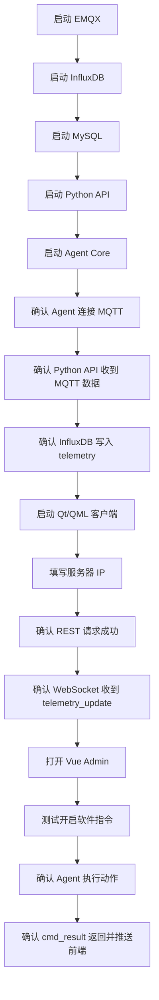

---

## 15. 最终目标

完成后，系统应满足：

1. Qt/QML 客户端可以配置服务器 IP。
2. Agent Core 真实采集数据，不再依赖 mock。
3. Agent Core 通过 MQTT 上报数据。
4. Python API 订阅 MQTT 并写入 InfluxDB / MySQL。
5. Qt/QML 可查看实时数据和历史曲线。
6. Vue Admin 可远程开启/停止软件。
7. Python API 可统一下发控制指令。
8. Agent Core 可执行动作并反馈结果。
9. Python API 可通过 WebSocket 把状态、数据、告警、指令结果实时推送给 Qt/QML 和 Vue Admin。
