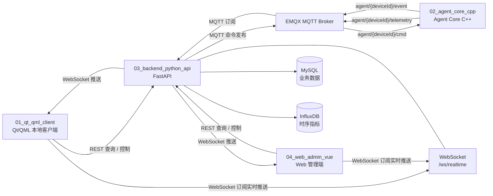
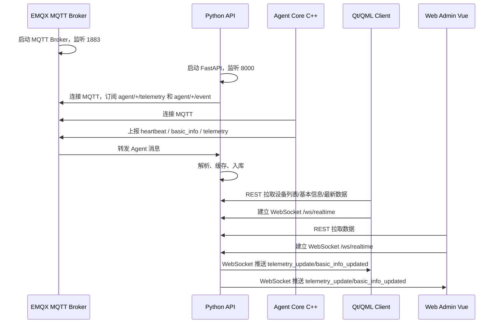
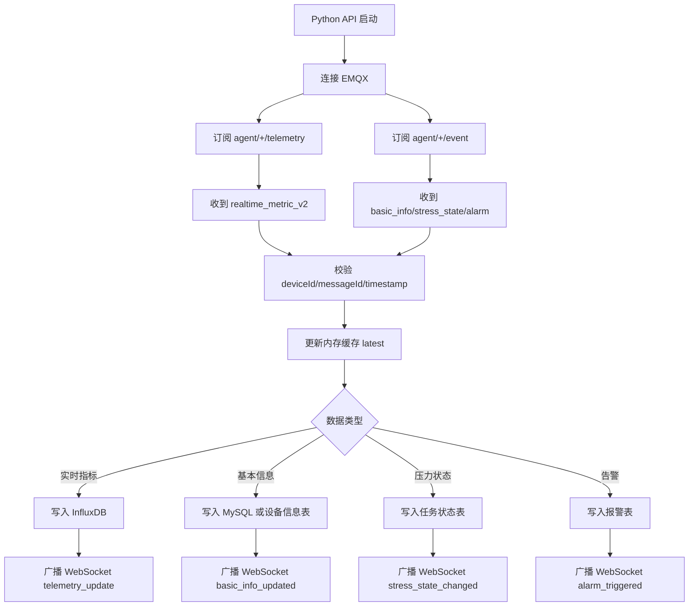
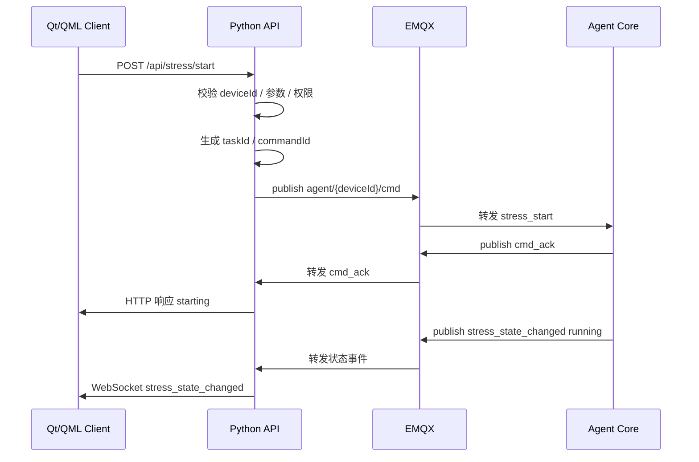
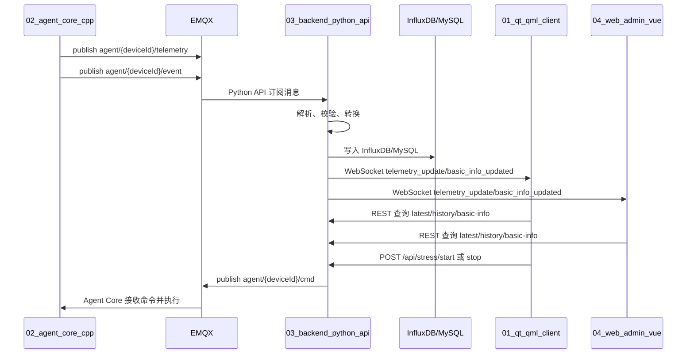

# CRM 硬件监控系统通信链路与接口文档

> 适用项目：`01_qt_qml_client`、`02_agent_core_cpp`、`03_backend_python_api`、`04_web_admin_vue`  
> 文档目标：总结客户端、WebSocket 通信、Agent Core 推送消息、Python API 订阅消息、Python API 推送数据到 Qt/QML 的全部相关连接地址、参数、接口与执行流程。  
> 推荐给 Codex 使用方式：先让 Codex 阅读本文档，再按文档中的“改造检查清单”逐项核对四个项目。

---

## 1. 总体通信目标

CRM 硬件监控系统的核心通信目标是：

1. `02_agent_core_cpp` 负责真实采集设备基本信息、实时指标、压力测试状态。
2. Agent Core 通过 MQTT 将采集数据发布给 `03_backend_python_api`。
3. Python API 订阅 MQTT 消息，完成数据解析、校验、入库、缓存。
4. Python API 通过 WebSocket 将实时数据推送给 `01_qt_qml_client` 和 `04_web_admin_vue`。
5. Qt/QML 客户端和 Web 管理端通过 REST API 拉取设备列表、最新数据、历史数据、基本信息、压力测试状态。
6. Qt/QML 客户端和 Web 管理端通过 REST API 下发控制命令，由 Python API 转发到 MQTT，再由 Agent Core 执行。

---

## 2. 总体架构图



---

## 3. 项目角色拆解

| 项目 | 角色 | 主要职责 |
|---|---|---|
| `01_qt_qml_client` | 本地客户端 | 显示设备基本信息、实时指标、历史曲线、压力测试状态；通过 REST 查询，通过 WebSocket 接收实时推送 |
| `02_agent_core_cpp` | 设备侧采集与执行器 | 采集 Windows/Linux/Android 指标；执行压力测试启动/停止；通过 MQTT 上报数据、接收命令 |
| `03_backend_python_api` | 中央服务 | REST API、WebSocket 服务、MQTT 订阅/发布、数据入库、数据缓存、状态分发 |
| `04_web_admin_vue` | Web 管理端 | 设备管理、用户/权限、系统配置、实时监控、历史数据、压力测试控制 |
| EMQX | MQTT Broker | 负责 Agent Core 和 Python API 之间的消息转发 |
| InfluxDB | 时序数据库 | 存储 CPU、GPU、内存、磁盘、网络等实时指标和历史曲线 |
| MySQL | 业务数据库 | 存储设备、用户、角色、权限、系统配置、压力测试任务等业务数据 |

---

## 4. 推荐统一连接配置

### 4.1 Python API 服务地址

开发环境推荐：

```ini
API_HOST=0.0.0.0
API_PORT=8000
BASE_URL=http://127.0.0.1:8000
LAN_BASE_URL=http://192.168.31.xxx:8000
```

Qt/QML 本机运行时，如果 Python API 也在本机：

```ini
apiBaseUrl=http://127.0.0.1:8000
webSocketUrl=ws://127.0.0.1:8000/ws/realtime
```

局域网其他机器访问时：

```ini
apiBaseUrl=http://192.168.31.xxx:8000
webSocketUrl=ws://192.168.31.xxx:8000/ws/realtime
```

> 注意：`192.168.31.xxx` 替换为运行 `03_backend_python_api` 的电脑 IP。

---

### 4.2 Qt/QML 客户端配置

建议在 `01_qt_qml_client` 中统一配置：

```json
{
  "apiBaseUrl": "http://127.0.0.1:8000",
  "webSocketUrl": "ws://127.0.0.1:8000/ws/realtime",
  "deviceId": "device-crm",
  "enableMock": false,
  "requestLogEnabled": true,
  "webSocketReconnectIntervalMs": 3000
}
```

参数说明：

| 参数 | 示例 | 说明 |
|---|---|---|
| `apiBaseUrl` | `http://127.0.0.1:8000` | REST API 基础地址 |
| `webSocketUrl` | `ws://127.0.0.1:8000/ws/realtime` | WebSocket 实时推送地址 |
| `deviceId` | `device-crm` | 当前显示或绑定的设备 ID |
| `enableMock` | `false` | 是否启用 mock 数据，真实联调必须为 `false` |
| `requestLogEnabled` | `true` | 开发环境打印请求与响应 |
| `webSocketReconnectIntervalMs` | `3000` | WebSocket 断线重连间隔 |

---

### 4.3 Agent Core MQTT 配置

建议在 `02_agent_core_cpp` 中统一配置：

```json
{
  "deviceId": "device-crm",
  "deviceName": "device-crm",
  "mqtt": {
    "host": "127.0.0.1",
    "port": 1883,
    "clientId": "agent-device-crm",
    "username": "",
    "password": "",
    "keepAliveSec": 30,
    "cleanSession": true,
    "qos": 1
  },
  "collector": {
    "basicInfoOnStart": true,
    "realtimeIntervalMs": 1000,
    "enableMock": false
  }
}
```

参数说明：

| 参数 | 示例 | 说明 |
|---|---|---|
| `deviceId` | `device-crm` | 设备唯一 ID，必须和后端、客户端一致 |
| `deviceName` | `device-crm` | 设备显示名称 |
| `mqtt.host` | `127.0.0.1` | EMQX 地址 |
| `mqtt.port` | `1883` | MQTT TCP 端口，不是 EMQX 后台端口 |
| `mqtt.clientId` | `agent-device-crm` | Agent MQTT 客户端 ID |
| `mqtt.qos` | `1` | 建议 telemetry/event/cmd 使用 QoS 1 |
| `collector.basicInfoOnStart` | `true` | 启动时是否主动上报基本信息 |
| `collector.realtimeIntervalMs` | `1000` | 实时指标采集周期 |
| `collector.enableMock` | `false` | 真实采集必须关闭 mock |

---

### 4.4 Python API 环境变量配置

建议在 `03_backend_python_api/.env` 中配置：

```ini
APP_HOST=0.0.0.0
APP_PORT=8000

CORS_ORIGINS=http://127.0.0.1:5173,http://localhost:5173,http://127.0.0.1:3000,http://localhost:3000

MQTT_ENABLED=true
MQTT_HOST=127.0.0.1
MQTT_PORT=1883
MQTT_CLIENT_ID=crm-python-api
MQTT_USERNAME=
MQTT_PASSWORD=
MQTT_KEEPALIVE=30

MQTT_TOPIC_TELEMETRY=agent/+/telemetry
MQTT_TOPIC_EVENT=agent/+/event
MQTT_TOPIC_CMD=agent/{deviceId}/cmd

INFLUX_URL=http://127.0.0.1:8086
INFLUX_ORG=aging
INFLUX_BUCKET=metrics
INFLUX_TOKEN=替换为真实 Token

MYSQL_HOST=127.0.0.1
MYSQL_PORT=3306
MYSQL_DATABASE=crm
MYSQL_USERNAME=root
MYSQL_PASSWORD=替换为真实密码
```

注意：

- EMQX Dashboard 默认常见端口是 `18083`，不能作为 MQTT 通信端口。
- MQTT TCP 通信端口通常是 `1883`。
- MQTT WebSocket 端口通常是 `8083`，但 Agent Core C++ 推荐优先使用 TCP `1883`。
- Python API 订阅 MQTT 时应使用 `agent/+/telemetry` 和 `agent/+/event`。

---

### 4.5 Web 管理端配置

建议在 `04_web_admin_vue/.env.development` 中配置：

```ini
VITE_API_BASE_URL=http://127.0.0.1:8000
VITE_WS_URL=ws://127.0.0.1:8000/ws/realtime
VITE_ENABLE_MOCK=false
```

---

## 5. 通信主题与接口总览

### 5.1 REST API 总览

| 类型 | 方法 | 地址 | 作用 |
|---|---|---|---|
| 健康检查 | `GET` | `/api/health` | 检查 Python API、MQTT、InfluxDB、MySQL 状态 |
| 设备列表 | `GET` | `/api/devices` | 获取设备列表 |
| 设备详情 | `GET` | `/api/devices/{deviceId}` | 获取单个设备详情 |
| 基本信息 | `GET` | `/api/devices/{deviceId}/basic-info` | 获取设备最新基本信息 |
| 最新实时数据 | `GET` | `/api/telemetry/latest/{deviceId}` | 获取设备最新实时指标 |
| 历史数据 | `GET` | `/api/telemetry/history/{deviceId}` | 获取历史指标曲线 |
| 压力测试启动 | `POST` | `/api/stress/start` | 下发压力测试启动命令 |
| 压力测试停止 | `POST` | `/api/stress/stop` | 下发压力测试停止命令 |
| 压力测试状态 | `GET` | `/api/stress/status/{deviceId}` | 获取压力测试状态 |
| 系统配置 | `GET` | `/api/system/config` | 获取系统配置 |
| 系统配置 | `PUT` | `/api/system/config` | 保存系统配置 |

---

### 5.2 WebSocket 总览

| 类型 | 地址 | 方向 | 作用 |
|---|---|---|---|
| 实时推送 | `/ws/realtime` | Python API → Qt/QML/Web | 推送基本信息、实时指标、压力测试状态、告警事件 |

完整地址示例：

```text
ws://127.0.0.1:8000/ws/realtime
ws://192.168.31.xxx:8000/ws/realtime
```

---

### 5.3 MQTT Topic 总览

| Topic | 方向 | 说明 |
|---|---|---|
| `agent/{deviceId}/telemetry` | Agent Core → Python API | 实时指标上报 |
| `agent/{deviceId}/event` | Agent Core → Python API | 基本信息、状态、告警、错误事件上报 |
| `agent/{deviceId}/cmd` | Python API → Agent Core | 控制命令下发 |
| `agent/{deviceId}/cmd_ack` | Agent Core → Python API | 命令确认，可选但推荐 |
| `agent/{deviceId}/heartbeat` | Agent Core → Python API | 心跳，可选但推荐 |

---

## 6. 项目启动执行流程

### 6.1 推荐启动顺序



---

### 6.2 启动检查清单

1. EMQX 已启动，`1883` 端口可连接。
2. InfluxDB 已启动，`8086` 可访问，`org`、`bucket`、`token` 正确。
3. MySQL 已启动，业务数据库可连接。
4. Python API 启动后 `/api/health` 正常。
5. Python API 日志中能看到 MQTT connected / subscribed。
6. Agent Core 日志中能看到 MQTT connected。
7. Agent Core 已关闭 mock，开始真实采集。
8. Qt/QML 配置的 `apiBaseUrl` 和 `webSocketUrl` 指向 Python API。
9. Qt/QML 不再走本地 mock 数据。
10. Web 管理端 `.env.development` 中 `VITE_ENABLE_MOCK=false`。

---

## 7. Agent Core → Python API：MQTT 上报接口

## 7.1 实时指标上报

Topic：

```text
agent/{deviceId}/telemetry
```

示例：

```text
agent/device-crm/telemetry
```

Payload：

```json
{
  "dataType": "realtime_metric_v2",
  "messageId": "metric-1781333677601",
  "deviceId": "device-crm",
  "deviceName": "device-crm",
  "timestamp": 1781333677601,
  "metrics": {
    "cpu": {
      "name": "AMD Ryzen 5 5600GT with Radeon Graphics",
      "usage_percent": 23.5,
      "temperature_celsius": 62.0,
      "power_watt": null,
      "frequency_mhz": 4200,
      "cores": [
        {
          "index": 0,
          "usage_percent": 20.1,
          "temperature_celsius": null,
          "frequency_mhz": 4100
        }
      ]
    },
    "memory": {
      "total_gb": 31.8,
      "used_gb": 12.6,
      "usage_percent": 39.6
    },
    "gpus": [
      {
        "id": "gpu0",
        "name": "AMD Radeon Graphics",
        "usage_percent": null,
        "temperature_celsius": null,
        "power_watt": null,
        "memory_total_mb": null,
        "memory_used_mb": null
      }
    ],
    "disks": {
      "count": 2,
      "physical": [
        {
          "id": "disk0",
          "name": "KINGSTON SNV2S1000G",
          "capacity_gb": 953.86,
          "used_percent": 51.2,
          "read_mb_s": 12.5,
          "write_mb_s": 4.2,
          "iops": 130
        }
      ]
    },
    "network": {
      "interfaces": [
        {
          "name": "Ethernet",
          "rx_kbps": 120.4,
          "tx_kbps": 88.1
        }
      ]
    }
  },
  "issues": [
    {
      "path": "cpu.temperature_celsius",
      "status": "unavailable",
      "reason": "cpu temperature JSON source unavailable"
    },
    {
      "path": "gpus.gpu0.temperature_celsius",
      "status": "unsupported",
      "reason": "GPU temperature collector unavailable"
    }
  ]
}
```

字段说明：

| 字段 | 类型 | 必填 | 说明 |
|---|---|---|---|
| `dataType` | string | 是 | 固定为 `realtime_metric_v2` |
| `messageId` | string | 是 | 消息唯一 ID |
| `deviceId` | string | 是 | 设备 ID |
| `deviceName` | string | 否 | 设备名称 |
| `timestamp` | number | 是 | 毫秒时间戳 |
| `metrics.cpu` | object | 是 | CPU 指标 |
| `metrics.memory` | object | 是 | 内存指标 |
| `metrics.gpus` | array | 否 | GPU 指标，没有 GPU 或采集不到时可为空 |
| `metrics.disks` | object | 否 | 磁盘指标 |
| `metrics.network` | object | 否 | 网络指标 |
| `issues` | array | 否 | 不支持或采集失败的指标说明 |

注意：

- `temperature_celsius`、`power_watt`、GPU 指标可能由于硬件、驱动、权限或采集库限制而不可用。
- 不可用时不要伪造数据，应返回 `null`，并在 `issues` 中说明原因。
- Python API 应兼容 `null`，Qt/QML 页面应显示“不可用”或“未支持”，不要显示为 0。

---

## 7.2 基本信息上报

Topic：

```text
agent/{deviceId}/event
```

Payload：

```json
{
  "dataType": "basic_info",
  "eventType": "basic_info_updated",
  "messageId": "basic-1781333600000",
  "deviceId": "device-crm",
  "deviceName": "device-crm",
  "timestamp": 1781333600000,
  "basicInfo": {
    "os": {
      "name": "Microsoft Windows 10 专业版",
      "version": "10.0 build 19045",
      "arch": "x64",
      "product_id": "00330-80000-00000-AA585"
    },
    "machine": {
      "name": "device-crm",
      "manufacturer": "Default string",
      "model": "Default string",
      "serial_number": "Default string",
      "uuid": "xxxxxxxx-xxxx-xxxx-xxxx-xxxxxxxxxxxx"
    },
    "mainboard": {
      "manufacturer": "ASUS",
      "product": "PRIME B550M-A",
      "serial_number": "Default string"
    },
    "bios": {
      "vendor": "American Megatrends Inc.",
      "version": "3607",
      "release_date": "2024-03-22"
    },
    "cpu": {
      "name": "AMD Ryzen 5 5600GT with Radeon Graphics",
      "cores": 6,
      "threads": 12,
      "base_frequency_mhz": 3600
    },
    "gpus": [
      {
        "name": "AMD Radeon Graphics",
        "vendor": "AMD",
        "memory_mb": null
      }
    ],
    "memory_modules": [
      {
        "slot": "DIMM_A1",
        "capacity_gb": 16,
        "manufacturer": "Kingston",
        "speed_mhz": 3200,
        "serial_number": ""
      }
    ],
    "disks": [
      {
        "id": "disk0",
        "name": "KINGSTON SNV2S1000G",
        "type": "NVMe",
        "capacity_gb": 953.86,
        "serial_number": ""
      }
    ],
    "network_adapters": [
      {
        "name": "Ethernet",
        "mac": "AA:BB:CC:DD:EE:FF",
        "ipv4": "192.168.31.206"
      }
    ]
  }
}
```

字段说明：

| 字段 | 类型 | 必填 | 说明 |
|---|---|---|---|
| `dataType` | string | 是 | 固定为 `basic_info` |
| `eventType` | string | 是 | 固定为 `basic_info_updated` |
| `deviceId` | string | 是 | 设备 ID |
| `timestamp` | number | 是 | 毫秒时间戳 |
| `basicInfo.os` | object | 是 | 操作系统信息 |
| `basicInfo.machine` | object | 否 | 整机信息 |
| `basicInfo.mainboard` | object | 否 | 主板信息 |
| `basicInfo.bios` | object | 否 | BIOS/固件信息 |
| `basicInfo.cpu` | object | 是 | CPU 型号信息 |
| `basicInfo.gpus` | array | 否 | GPU 型号信息 |
| `basicInfo.memory_modules` | array | 否 | 内存条信息 |
| `basicInfo.disks` | array | 否 | 磁盘信息 |
| `basicInfo.network_adapters` | array | 否 | 网卡信息 |

---

## 7.3 压力测试状态事件上报

Topic：

```text
agent/{deviceId}/event
```

Payload：

```json
{
  "dataType": "stress_state",
  "eventType": "stress_state_changed",
  "messageId": "stress-1781333700000",
  "deviceId": "device-crm",
  "timestamp": 1781333700000,
  "state": {
    "taskId": "stress-task-001",
    "status": "running",
    "targets": ["cpu", "memory"],
    "startedAt": 1781333600000,
    "durationSec": 3600,
    "elapsedSec": 120,
    "engine": "builtin_v2",
    "message": "CPU and memory stress running"
  }
}
```

`status` 推荐枚举：

| 状态 | 说明 |
|---|---|
| `idle` | 空闲 |
| `starting` | 启动中 |
| `running` | 运行中 |
| `stopping` | 停止中 |
| `stopped` | 已停止 |
| `error` | 异常 |

---

## 7.4 告警事件上报

Topic：

```text
agent/{deviceId}/event
```

Payload：

```json
{
  "dataType": "alarm",
  "eventType": "alarm_triggered",
  "messageId": "alarm-1781333800000",
  "deviceId": "device-crm",
  "timestamp": 1781333800000,
  "alarm": {
    "level": "critical",
    "metric": "cpu.temperature_celsius",
    "value": 92.5,
    "threshold": 90,
    "message": "CPU temperature critical",
    "action": "stop_cpu_stress"
  }
}
```

---

## 7.5 Agent 心跳上报

Topic：

```text
agent/{deviceId}/heartbeat
```

Payload：

```json
{
  "dataType": "heartbeat",
  "messageId": "heartbeat-1781333900000",
  "deviceId": "device-crm",
  "timestamp": 1781333900000,
  "agent": {
    "version": "1.0.0",
    "platform": "windows",
    "uptimeSec": 3600,
    "mqttConnected": true,
    "collectorRunning": true
  }
}
```

---

## 8. Python API → Agent Core：MQTT 命令接口

## 8.1 压力测试启动命令

Topic：

```text
agent/{deviceId}/cmd
```

Payload：

```json
{
  "commandId": "cmd-1781334000000",
  "commandType": "stress_start",
  "deviceId": "device-crm",
  "timestamp": 1781334000000,
  "params": {
    "taskId": "stress-task-001",
    "targets": ["cpu", "gpu", "memory", "disk"],
    "durationSec": 3600,
    "engine": "builtin_v2",
    "cpu": {
      "threads": 12,
      "loadPercent": 90
    },
    "gpu": {
      "backend": "direct3d",
      "loadPercent": 90
    },
    "memory": {
      "usagePercent": 80,
      "verify": true
    },
    "disk": {
      "path": "D:/stress-test",
      "mode": "mixed",
      "fileSizeGb": 10
    }
  }
}
```

字段说明：

| 字段 | 类型 | 必填 | 说明 |
|---|---|---|---|
| `commandId` | string | 是 | 命令唯一 ID |
| `commandType` | string | 是 | `stress_start` |
| `deviceId` | string | 是 | 目标设备 ID |
| `params.taskId` | string | 是 | 压力测试任务 ID |
| `params.targets` | array | 是 | 压测对象：`cpu/gpu/memory/disk` |
| `params.durationSec` | number | 否 | 持续时间，0 或空表示手动停止 |
| `params.engine` | string | 是 | `builtin_v2`、`aida64`、`burnintest` 等 |

---

## 8.2 压力测试停止命令

Topic：

```text
agent/{deviceId}/cmd
```

Payload：

```json
{
  "commandId": "cmd-1781334100000",
  "commandType": "stress_stop",
  "deviceId": "device-crm",
  "timestamp": 1781334100000,
  "params": {
    "taskId": "stress-task-001",
    "targets": ["cpu", "gpu", "memory", "disk"],
    "reason": "manual_stop"
  }
}
```

---

## 8.3 基本信息刷新命令

Topic：

```text
agent/{deviceId}/cmd
```

Payload：

```json
{
  "commandId": "cmd-1781334200000",
  "commandType": "basic_info_refresh",
  "deviceId": "device-crm",
  "timestamp": 1781334200000,
  "params": {}
}
```

Agent Core 收到后应重新采集基本信息，并通过 `agent/{deviceId}/event` 上报 `basic_info_updated`。

---

## 8.4 命令确认 ACK

Topic：

```text
agent/{deviceId}/cmd_ack
```

Payload：

```json
{
  "dataType": "cmd_ack",
  "commandId": "cmd-1781334000000",
  "commandType": "stress_start",
  "deviceId": "device-crm",
  "timestamp": 1781334000100,
  "ack": {
    "accepted": true,
    "status": "starting",
    "message": "stress task accepted"
  }
}
```

---

## 9. Python API → Qt/QML：WebSocket 推送接口

WebSocket 地址：

```text
/ws/realtime
```

完整地址：

```text
ws://127.0.0.1:8000/ws/realtime
```

---

## 9.1 连接建立后推荐推送格式

Python API 向 Qt/QML 推送时，建议统一使用如下包装结构：

```json
{
  "event": "telemetry_update",
  "deviceId": "device-crm",
  "timestamp": 1781333677601,
  "data": {}
}
```

通用字段说明：

| 字段 | 类型 | 必填 | 说明 |
|---|---|---|---|
| `event` | string | 是 | WebSocket 事件名 |
| `deviceId` | string | 是 | 设备 ID |
| `timestamp` | number | 是 | 毫秒时间戳 |
| `data` | object | 是 | 事件数据 |

---

## 9.2 实时指标推送 telemetry_update

事件名：

```text
telemetry_update
```

Payload：

```json
{
  "event": "telemetry_update",
  "deviceId": "device-crm",
  "timestamp": 1781333677601,
  "data": {
    "cpu": {
      "usage_percent": 23.5,
      "temperature_celsius": 62.0,
      "power_watt": null,
      "frequency_mhz": 4200
    },
    "memory": {
      "total_gb": 31.8,
      "used_gb": 12.6,
      "usage_percent": 39.6
    },
    "gpus": [
      {
        "id": "gpu0",
        "usage_percent": null,
        "temperature_celsius": null,
        "power_watt": null
      }
    ],
    "disks": {
      "count": 2,
      "physical": []
    },
    "network": {
      "interfaces": []
    },
    "issues": []
  }
}
```

Qt/QML 处理要求：

1. 收到 `telemetry_update` 后更新实时数据页面。
2. 不要把 `null` 显示为 `0`。
3. 对 `issues` 中的不可用指标显示“不可用/未支持”。
4. 曲线页面如需要历史数据，应调用 REST 历史接口，不建议只依赖 WebSocket 缓存。

---

## 9.3 基本信息推送 basic_info_updated

事件名：

```text
basic_info_updated
```

Payload：

```json
{
  "event": "basic_info_updated",
  "deviceId": "device-crm",
  "timestamp": 1781333600000,
  "data": {
    "os": {
      "name": "Microsoft Windows 10 专业版",
      "version": "10.0 build 19045",
      "arch": "x64"
    },
    "cpu": {
      "name": "AMD Ryzen 5 5600GT with Radeon Graphics",
      "cores": 6,
      "threads": 12
    },
    "gpus": [],
    "memory_modules": [],
    "disks": [],
    "network_adapters": []
  }
}
```

Qt/QML 处理要求：

1. 收到 `basic_info_updated` 后刷新基本信息页面。
2. 如果当前页面未打开，也要更新本地缓存。
3. 页面再次进入时优先显示最新缓存。
4. 如果 WebSocket 未连接，页面进入时通过 `GET /api/devices/{deviceId}/basic-info` 拉取。

---

## 9.4 压力测试状态推送 stress_state_changed

事件名：

```text
stress_state_changed
```

Payload：

```json
{
  "event": "stress_state_changed",
  "deviceId": "device-crm",
  "timestamp": 1781333700000,
  "data": {
    "taskId": "stress-task-001",
    "status": "running",
    "targets": ["cpu", "memory"],
    "elapsedSec": 120,
    "durationSec": 3600,
    "engine": "builtin_v2",
    "message": "CPU and memory stress running"
  }
}
```

Qt/QML 处理要求：

1. 根据 `status` 更新按钮状态。
2. `running` 时禁用重复启动按钮。
3. `stopping` 时禁用重复停止按钮。
4. `error` 时显示错误信息并允许重新启动。

---

## 9.5 告警推送 alarm_triggered

事件名：

```text
alarm_triggered
```

Payload：

```json
{
  "event": "alarm_triggered",
  "deviceId": "device-crm",
  "timestamp": 1781333800000,
  "data": {
    "level": "critical",
    "metric": "cpu.temperature_celsius",
    "value": 92.5,
    "threshold": 90,
    "message": "CPU temperature critical",
    "action": "stop_cpu_stress"
  }
}
```

---

## 9.6 WebSocket 心跳

Python API 可定期向客户端推送：

```json
{
  "event": "ping",
  "timestamp": 1781333900000,
  "data": {
    "server": "python_api",
    "status": "ok"
  }
}
```

Qt/QML 可响应：

```json
{
  "event": "pong",
  "timestamp": 1781333900100,
  "data": {
    "client": "qt_qml_client"
  }
}
```

建议：

- Python API 每 20–30 秒推送一次 ping。
- Qt/QML 超过 60 秒没有收到服务端消息，则主动重连。

---

## 10. Qt/QML → Python API：REST 请求接口

## 10.1 获取设备列表

请求：

```http
GET /api/devices
```

完整示例：

```text
GET http://127.0.0.1:8000/api/devices
```

响应：

```json
{
  "items": [
    {
      "deviceId": "device-crm",
      "deviceName": "device-crm",
      "status": "online",
      "lastSeenAt": 1781333900000,
      "platform": "windows"
    }
  ]
}
```

---

## 10.2 获取设备详情

请求：

```http
GET /api/devices/{deviceId}
```

示例：

```text
GET http://127.0.0.1:8000/api/devices/device-crm
```

响应：

```json
{
  "deviceId": "device-crm",
  "deviceName": "device-crm",
  "status": "online",
  "platform": "windows",
  "agentVersion": "1.0.0",
  "lastSeenAt": 1781333900000
}
```

---

## 10.3 获取最新基本信息

请求：

```http
GET /api/devices/{deviceId}/basic-info
```

示例：

```text
GET http://127.0.0.1:8000/api/devices/device-crm/basic-info
```

响应：

```json
{
  "deviceId": "device-crm",
  "timestamp": 1781333600000,
  "basicInfo": {
    "os": {},
    "cpu": {},
    "gpus": [],
    "memory_modules": [],
    "disks": [],
    "network_adapters": []
  }
}
```

---

## 10.4 获取最新实时指标

请求：

```http
GET /api/telemetry/latest/{deviceId}
```

示例：

```text
GET http://127.0.0.1:8000/api/telemetry/latest/device-crm
```

响应：

```json
{
  "deviceId": "device-crm",
  "timestamp": 1781333677601,
  "metrics": {
    "cpu": {},
    "memory": {},
    "gpus": [],
    "disks": {},
    "network": {}
  },
  "issues": []
}
```

---

## 10.5 获取历史指标曲线

请求：

```http
GET /api/telemetry/history/{deviceId}?metric=cpu.usage_percent&start=-1h&end=now&interval=10s
```

参数：

| 参数 | 示例 | 必填 | 说明 |
|---|---|---|---|
| `metric` | `cpu.usage_percent` | 是 | 指标路径 |
| `start` | `-1h` | 是 | 开始时间，可支持相对时间 |
| `end` | `now` | 否 | 结束时间 |
| `interval` | `10s` | 否 | 聚合间隔 |

示例：

```text
GET http://127.0.0.1:8000/api/telemetry/history/device-crm?metric=cpu.usage_percent&start=-1h&end=now&interval=10s
```

响应：

```json
{
  "deviceId": "device-crm",
  "metric": "cpu.usage_percent",
  "points": [
    {
      "time": 1781333600000,
      "value": 21.5
    },
    {
      "time": 1781333610000,
      "value": 24.8
    }
  ]
}
```

---

## 10.6 启动压力测试

请求：

```http
POST /api/stress/start
Content-Type: application/json
```

Body：

```json
{
  "deviceId": "device-crm",
  "targets": ["cpu", "gpu", "memory", "disk"],
  "durationSec": 3600,
  "engine": "builtin_v2",
  "params": {
    "cpu": {
      "threads": 12,
      "loadPercent": 90
    },
    "gpu": {
      "backend": "direct3d",
      "loadPercent": 90
    },
    "memory": {
      "usagePercent": 80,
      "verify": true
    },
    "disk": {
      "path": "D:/stress-test",
      "mode": "mixed",
      "fileSizeGb": 10
    }
  }
}
```

响应：

```json
{
  "success": true,
  "taskId": "stress-task-001",
  "commandId": "cmd-1781334000000",
  "status": "starting"
}
```

后续流程：

1. Python API 生成 `commandId` 和 `taskId`。
2. Python API 通过 MQTT 发布到 `agent/{deviceId}/cmd`。
3. Agent Core 收到命令并返回 `cmd_ack`。
4. Agent Core 状态变化后发布 `stress_state_changed`。
5. Python API 收到事件后通过 WebSocket 推送给 Qt/QML。

---

## 10.7 停止压力测试

请求：

```http
POST /api/stress/stop
Content-Type: application/json
```

Body：

```json
{
  "deviceId": "device-crm",
  "taskId": "stress-task-001",
  "targets": ["cpu", "gpu", "memory", "disk"],
  "reason": "manual_stop"
}
```

响应：

```json
{
  "success": true,
  "taskId": "stress-task-001",
  "commandId": "cmd-1781334100000",
  "status": "stopping"
}
```

---

## 10.8 获取压力测试状态

请求：

```http
GET /api/stress/status/{deviceId}
```

示例：

```text
GET http://127.0.0.1:8000/api/stress/status/device-crm
```

响应：

```json
{
  "deviceId": "device-crm",
  "taskId": "stress-task-001",
  "status": "running",
  "targets": ["cpu", "memory"],
  "elapsedSec": 120,
  "durationSec": 3600,
  "engine": "builtin_v2"
}
```

---

## 11. Python API 内部处理流程

### 11.1 MQTT 订阅处理流程



---

### 11.2 REST 控制命令处理流程



---

## 12. Qt/QML 客户端执行流程

### 12.1 客户端启动流程

```mermaid
flowchart TD
    A[Qt/QML 启动] --> B[读取配置 apiBaseUrl/webSocketUrl/deviceId]
    B --> C[GET /api/health]
    C --> D{API 是否正常}
    D -->|否| E[显示离线/重试]
    D -->|是| F[GET /api/devices]
    F --> G[选择或绑定 deviceId]
    G --> H[GET /api/devices/{deviceId}/basic-info]
    G --> I[GET /api/telemetry/latest/{deviceId}]
    H --> J[渲染基本信息]
    I --> K[渲染实时数据]
    G --> L[连接 /ws/realtime]
    L --> M[监听 telemetry_update/basic_info_updated/stress_state_changed]
```

---

### 12.2 Qt/QML 页面数据来源

| 页面 | 首次进入数据来源 | 实时更新来源 | 兜底方案 |
|---|---|---|---|
| 首页总览 | `GET /api/telemetry/latest/{deviceId}` | `telemetry_update` | WebSocket 断开后定时 REST 轮询 |
| 基本信息 | `GET /api/devices/{deviceId}/basic-info` | `basic_info_updated` | 手动刷新调用 REST 或命令刷新 |
| 历史曲线 | `GET /api/telemetry/history/{deviceId}` | 可选追加 WebSocket 最新点 | 查询 InfluxDB 历史数据 |
| 压力测试 | `GET /api/stress/status/{deviceId}` | `stress_state_changed` | REST 查询状态 |
| 告警列表 | `GET /api/alarms?deviceId=xxx` | `alarm_triggered` | REST 查询最新告警 |

---

### 12.3 Qt/QML WebSocket 事件处理伪代码

```javascript
function onWebSocketMessage(message) {
    const payload = JSON.parse(message)

    switch (payload.event) {
    case "telemetry_update":
        telemetryStore.update(payload.deviceId, payload.data)
        break
    case "basic_info_updated":
        basicInfoStore.update(payload.deviceId, payload.data)
        break
    case "stress_state_changed":
        stressStore.update(payload.deviceId, payload.data)
        break
    case "alarm_triggered":
        alarmStore.append(payload.deviceId, payload.data)
        break
    case "ping":
        webSocket.send(JSON.stringify({ event: "pong", timestamp: Date.now() }))
        break
    default:
        console.warn("Unknown websocket event", payload.event)
    }
}
```

---

## 13. InfluxDB 数据写入建议

### 13.1 Measurement 建议

| Measurement | 说明 |
|---|---|
| `cpu_metrics` | CPU 使用率、温度、频率、功耗 |
| `memory_metrics` | 内存占用 |
| `gpu_metrics` | GPU 使用率、温度、显存、功耗 |
| `disk_metrics` | 磁盘容量、吞吐、IOPS |
| `network_metrics` | 网络收发速率 |
| `stress_metrics` | 压力测试过程指标，可选 |

### 13.2 Tag 建议

| Tag | 说明 |
|---|---|
| `device_id` | 设备 ID |
| `device_name` | 设备名称 |
| `metric_group` | 指标组，如 cpu/memory/gpu/disk/network |
| `object_id` | 对象 ID，如 cpu0/gpu0/disk0/eth0 |

### 13.3 Field 建议

示例：

```text
cpu_metrics,device_id=device-crm,object_id=cpu usage_percent=23.5,temperature_celsius=62.0,frequency_mhz=4200 1781333677601000000
```

原则：

1. `device_id` 放 tag，方便按设备查询。
2. 具体数值放 field。
3. 不要将大量动态字段放 tag。
4. 不可用指标不要写入假值 0。
5. 需要记录不可用原因时，可写 MySQL 日志或单独事件表，不建议大量写入 InfluxDB。

---

## 14. 历史数据查询与曲线渲染

Qt/QML 历史曲线页面请求：

```text
GET /api/telemetry/history/device-crm?metric=cpu.usage_percent&start=-1h&end=now&interval=10s
```

Python API 查询 InfluxDB 后返回统一格式：

```json
{
  "deviceId": "device-crm",
  "metric": "cpu.usage_percent",
  "points": [
    { "time": 1781333600000, "value": 20.1 },
    { "time": 1781333610000, "value": 23.4 }
  ]
}
```

前端渲染要求：

1. 曲线图只关心 `points[].time` 和 `points[].value`。
2. 后端负责将 InfluxDB 查询结果转成统一格式。
3. 前端不直接拼 Flux 查询语句。
4. 如果没有数据，返回空数组，不返回 mock 数据。

---

## 15. 设备在线状态判断

推荐规则：

| 条件 | 状态 |
|---|---|
| 最近 10 秒内收到 heartbeat 或 telemetry | `online` |
| 10–60 秒未收到 | `warning` |
| 超过 60 秒未收到 | `offline` |

Python API 可在内存中维护：

```json
{
  "device-crm": {
    "lastSeenAt": 1781333900000,
    "status": "online",
    "lastTelemetry": {},
    "lastBasicInfo": {}
  }
}
```

---

## 16. 错误码建议

REST API 统一错误格式：

```json
{
  "success": false,
  "errorCode": "DEVICE_OFFLINE",
  "message": "device is offline",
  "details": {}
}
```

常用错误码：

| 错误码 | 说明 |
|---|---|
| `DEVICE_NOT_FOUND` | 设备不存在 |
| `DEVICE_OFFLINE` | 设备离线 |
| `MQTT_NOT_CONNECTED` | Python API 未连接 MQTT |
| `INFLUX_QUERY_FAILED` | InfluxDB 查询失败 |
| `INVALID_PARAMS` | 请求参数错误 |
| `STRESS_ALREADY_RUNNING` | 压力测试已经运行 |
| `STRESS_NOT_RUNNING` | 压力测试未运行 |
| `AGENT_COMMAND_TIMEOUT` | Agent 命令响应超时 |

---

## 17. 日志建议

### 17.1 Agent Core 日志

必须打印：

```text
[INFO] MQTT connected host=127.0.0.1 port=1883 clientId=agent-device-crm
[INFO] Publish telemetry topic=agent/device-crm/telemetry messageId=metric-xxx
[INFO] Publish event topic=agent/device-crm/event eventType=basic_info_updated
[INFO] Received command topic=agent/device-crm/cmd commandType=stress_start commandId=cmd-xxx
```

注意：

- Windows 中文乱码时，统一使用 UTF-8 输出。
- JSON 日志建议一行一条，方便排查。

---

### 17.2 Python API 日志

必须打印：

```text
[INFO] MQTT connected host=127.0.0.1 port=1883
[INFO] MQTT subscribed topic=agent/+/telemetry
[INFO] MQTT subscribed topic=agent/+/event
[INFO] MQTT message received topic=agent/device-crm/telemetry dataType=realtime_metric_v2
[INFO] InfluxDB write success deviceId=device-crm measurement=cpu_metrics
[INFO] WebSocket broadcast event=telemetry_update deviceId=device-crm clients=2
```

---

### 17.3 Qt/QML 日志

开发环境必须打印：

```text
[HTTP] GET http://127.0.0.1:8000/api/devices
[HTTP] RESPONSE 200 /api/devices
[WS] connecting ws://127.0.0.1:8000/ws/realtime
[WS] connected
[WS] received event=telemetry_update deviceId=device-crm
[WS] disconnected, reconnect after 3000ms
```

生产环境可通过配置关闭请求/响应详细日志。

---

## 18. 常见问题排查

### 18.1 Qt/QML 页面没有实时刷新

检查：

1. `webSocketUrl` 是否正确。
2. Python API 是否监听 `8000`。
3. 浏览器或客户端是否能连接 `ws://127.0.0.1:8000/ws/realtime`。
4. Python API 日志是否有 `WebSocket connected`。
5. Python API 是否收到 MQTT 消息。
6. Agent Core 是否真实发布 `telemetry`。
7. 前端是否根据 `event=telemetry_update` 更新 store。

---

### 18.2 Python API 收不到 Agent 消息

检查：

1. EMQX 是否启动。
2. Agent Core 配置的 MQTT 端口是否为 `1883`。
3. Python API 订阅 topic 是否为 `agent/+/telemetry` 和 `agent/+/event`。
4. Agent Core 发布 topic 是否为 `agent/{deviceId}/telemetry`。
5. `deviceId` 是否一致。
6. EMQX Dashboard 中是否能看到客户端连接。
7. EMQX Dashboard 或 MQTTX 中是否能订阅到消息。

---

### 18.3 InfluxDB 查询不到历史数据

检查：

1. `INFLUX_URL` 是否为 `http://127.0.0.1:8086`。
2. `INFLUX_ORG` 是否正确。
3. `INFLUX_BUCKET` 是否为 `metrics`。
4. `INFLUX_TOKEN` 是否有读写权限。
5. Python API 是否真的写入 InfluxDB。
6. 查询时 `deviceId` tag 是否一致。
7. 查询时间范围是否正确。

---

### 18.4 采集日志中温度、功耗、GPU 为 null

这是允许的，原因可能是：

1. 当前硬件或驱动不支持读取。
2. Windows 权限不足。
3. 未集成 LibreHardwareMonitor/OpenHardwareMonitor/NVIDIA NVML/AMD ADLX 等采集源。
4. 集成的采集源返回空。

要求：

- Agent Core 不要伪造数据。
- Python API 不要把 `null` 改成 `0`。
- Qt/QML 显示“不可用/未支持”。
- `issues` 字段中保留不可用原因。

---

## 19. 四个项目改造检查清单

## 19.1 `01_qt_qml_client`

需要检查：

1. 是否统一从配置读取 `apiBaseUrl` 和 `webSocketUrl`。
2. 是否关闭 mock 数据。
3. 首页实时数据是否来自 `/api/telemetry/latest/{deviceId}` 和 `telemetry_update`。
4. 基本信息是否来自 `/api/devices/{deviceId}/basic-info` 和 `basic_info_updated`。
5. 历史曲线是否来自 `/api/telemetry/history/{deviceId}`。
6. 压力测试按钮是否调用 `/api/stress/start` 和 `/api/stress/stop`。
7. WebSocket 是否支持断线重连。
8. `null` 指标是否显示为“不可用”，而不是 0。
9. 开发环境是否打印请求和响应日志。

---

## 19.2 `02_agent_core_cpp`

需要检查：

1. 是否统一配置 `deviceId`、`deviceName`、MQTT host/port/clientId。
2. 是否连接 EMQX `1883`。
3. 是否发布 `agent/{deviceId}/telemetry`。
4. 是否发布 `agent/{deviceId}/event`。
5. 是否订阅 `agent/{deviceId}/cmd`。
6. 是否支持 `stress_start`、`stress_stop`、`basic_info_refresh`。
7. 是否返回 `cmd_ack`。
8. 是否启动后主动上报 `basic_info_updated`。
9. 是否定时上报 `realtime_metric_v2`。
10. 是否关闭 mock，走真实采集。
11. 不可用指标是否返回 `null + issues`。
12. Windows 中文日志是否使用 UTF-8。

---

## 19.3 `03_backend_python_api`

需要检查：

1. 是否提供 `/api/health`。
2. 是否提供设备、基本信息、实时数据、历史数据、压力测试 REST 接口。
3. 是否启动时连接 MQTT。
4. 是否订阅 `agent/+/telemetry`、`agent/+/event`、可选 `agent/+/cmd_ack`、`agent/+/heartbeat`。
5. 是否解析 `realtime_metric_v2` 并写入 InfluxDB。
6. 是否解析 `basic_info_updated` 并保存设备基本信息。
7. 是否解析 `stress_state_changed` 并更新任务状态。
8. 是否解析 `alarm_triggered` 并保存告警。
9. 是否通过 `/ws/realtime` 广播事件。
10. 是否支持 CORS，允许 Web 管理端端口 `5173`。
11. 是否缓存设备最新数据，供 `/api/telemetry/latest/{deviceId}` 查询。
12. 是否不再返回 mock 数据。

---

## 19.4 `04_web_admin_vue`

需要检查：

1. `.env.development` 是否配置 `VITE_API_BASE_URL` 和 `VITE_WS_URL`。
2. 是否关闭 mock。
3. 实时监控页面是否调用真实 REST API。
4. 是否连接 WebSocket。
5. 是否处理 `telemetry_update`、`basic_info_updated`、`stress_state_changed`、`alarm_triggered`。
6. 历史曲线是否请求 `/api/telemetry/history/{deviceId}`。
7. 压力测试控制是否调用 `/api/stress/start` 和 `/api/stress/stop`。
8. 是否显示设备在线/离线状态。

---

## 20. 给 Codex 的节省 Token 提示语

```text
请先阅读 docs/crm_ws_mqtt_api_flow_doc.md，并严格按文档中的通信链路和接口约定检查四个项目：

1. 01_qt_qml_client：关闭 mock，统一 apiBaseUrl/webSocketUrl，REST 拉取设备/基本信息/实时/历史数据，WebSocket 处理 telemetry_update/basic_info_updated/stress_state_changed/alarm_triggered，支持断线重连，null 显示为不可用。
2. 02_agent_core_cpp：使用真实采集，MQTT 连接 1883，发布 agent/{deviceId}/telemetry 和 agent/{deviceId}/event，订阅 agent/{deviceId}/cmd，支持 stress_start/stress_stop/basic_info_refresh，返回 cmd_ack，不可用指标用 null + issues。
3. 03_backend_python_api：FastAPI 提供 REST 和 /ws/realtime；启动后连接 MQTT，订阅 agent/+/telemetry、agent/+/event、agent/+/cmd_ack、agent/+/heartbeat；收到 realtime_metric_v2 写 InfluxDB 并广播 telemetry_update；收到 basic_info_updated 保存并广播；历史接口从 InfluxDB 查询，不返回 mock。
4. 04_web_admin_vue：关闭 mock，使用 VITE_API_BASE_URL/VITE_WS_URL，请求真实 API，处理 WebSocket 事件，历史曲线走 /api/telemetry/history/{deviceId}。

要求：
- 最小范围修改。
- 不重构无关模块。
- 保持现有页面和接口兼容。
- 修改后列出变更文件、关键逻辑、运行命令、验证步骤。
```

---

## 21. 最小验证步骤

### 21.1 启动 EMQX

```bash
docker compose up -d emqx
```

检查：

```text
MQTT TCP: 1883
Dashboard: 18083
WebSocket: 8083
```

---

### 21.2 启动 Python API

```powershell
cd E:\WorkSpace\CRM\03_backend_python_api
.\.venv\Scripts\python.exe -m uvicorn main:app --host 0.0.0.0 --port 8000 --reload
```

检查：

```text
GET http://127.0.0.1:8000/api/health
```

---

### 21.3 启动 Agent Core

检查日志必须看到：

```text
MQTT connected
Publish telemetry topic=agent/device-crm/telemetry
Publish event topic=agent/device-crm/event eventType=basic_info_updated
```

---

### 21.4 启动 Qt/QML 客户端

检查日志必须看到：

```text
[HTTP] GET /api/devices
[HTTP] GET /api/devices/device-crm/basic-info
[HTTP] GET /api/telemetry/latest/device-crm
/api/telemetry/latest/device-crm?format=v2 能返回 CPU usage/temperature/power
[WS] connected ws://127.0.0.1:8000/ws/realtime
[WS] received event=telemetry_update
```

---

### 21.5 验证历史曲线

请求：

```text
GET http://127.0.0.1:8000/api/telemetry/history/device-crm?metric=cpu.usage_percent&start=-1h&end=now&interval=10s
```

期望：

```json
{
  "deviceId": "device-crm",
  "metric": "cpu.usage_percent",
  "points": []
}
```

说明：

- 有数据时 `points` 有曲线点。
- 无数据时返回空数组。
- 不允许返回 mock 曲线。

---

## 22. 最终数据链路总结



一句话总结：

> Agent Core 只负责采集和执行，通过 MQTT 上报和接收命令；Python API 是通信中心，负责订阅 MQTT、写库、缓存、REST 查询和 WebSocket 广播；Qt/QML 和 Web 管理端只通过 REST + WebSocket 与 Python API 通信，不直接连接 MQTT 或 InfluxDB。
