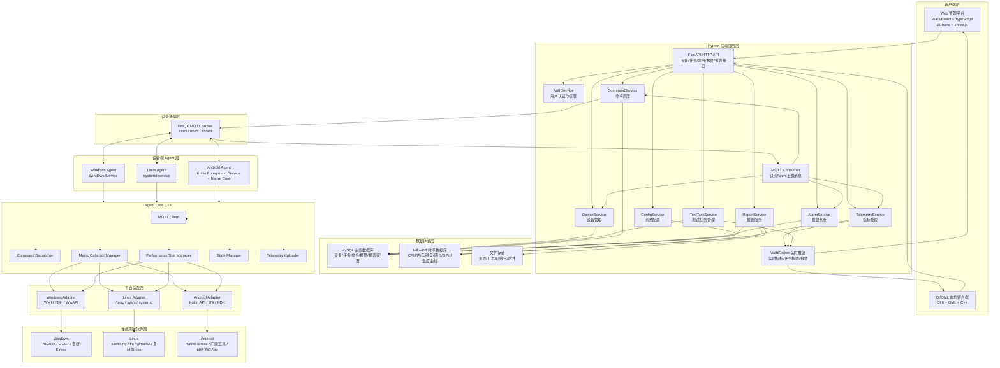
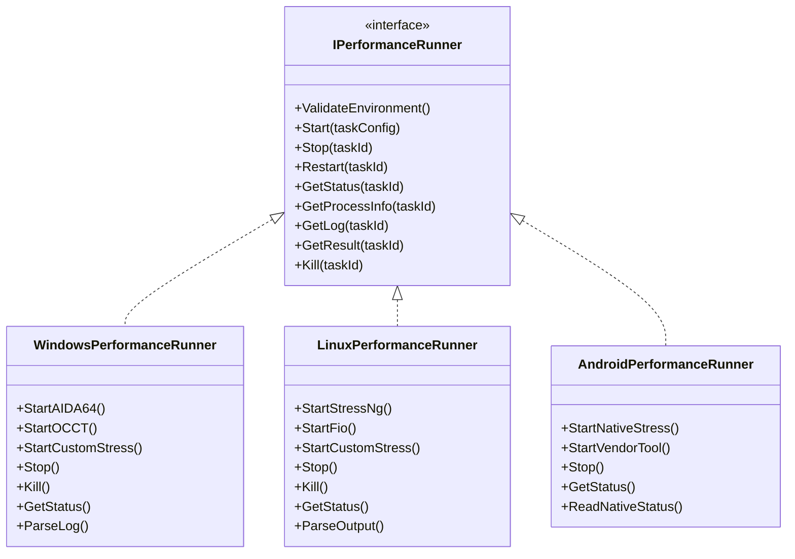
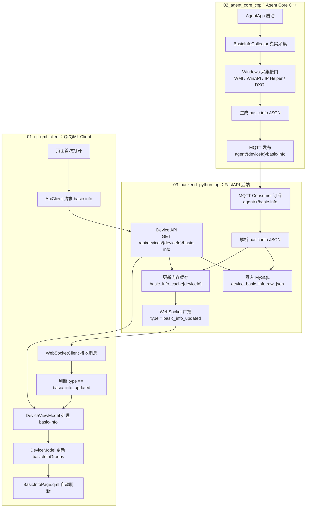
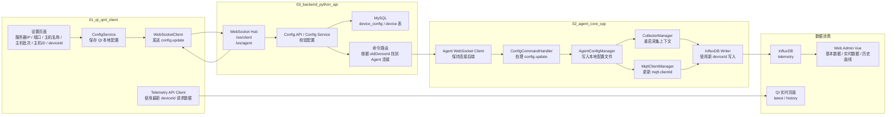
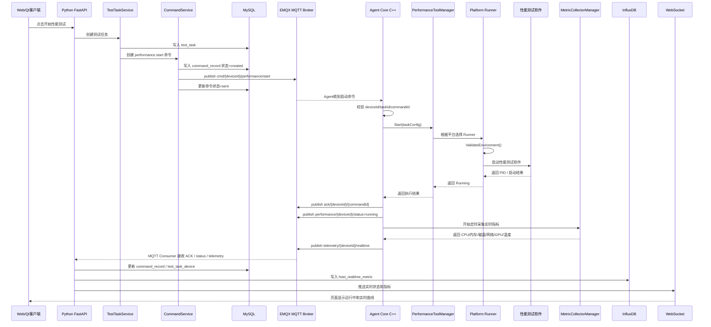
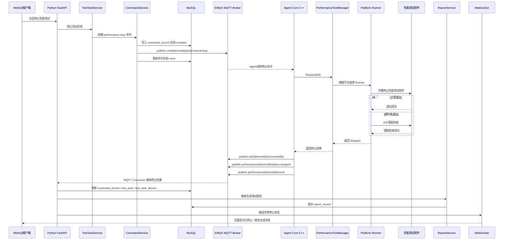
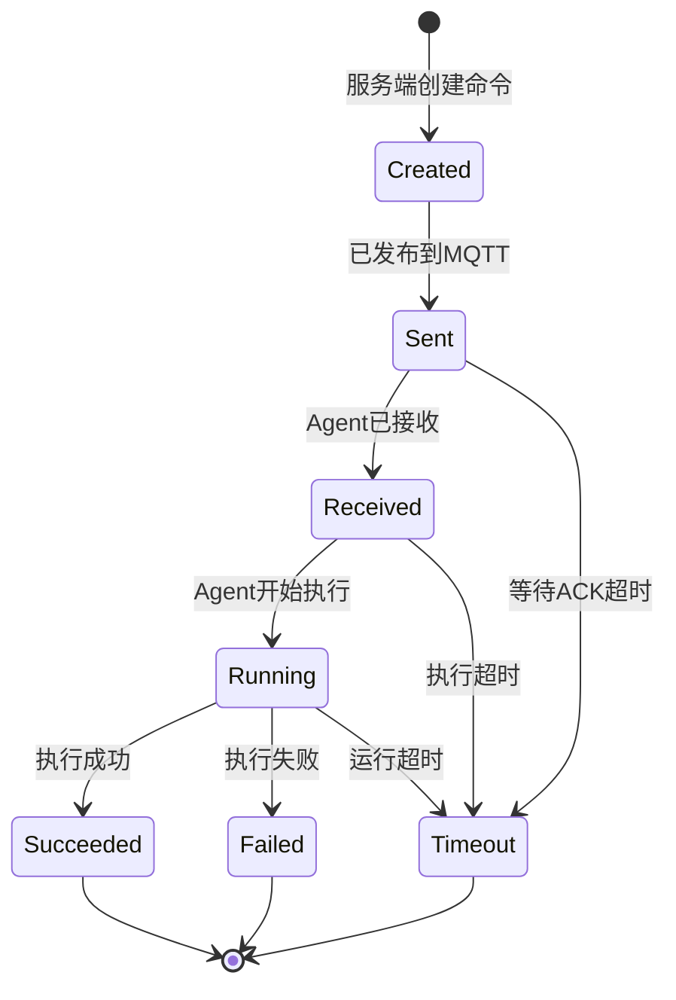
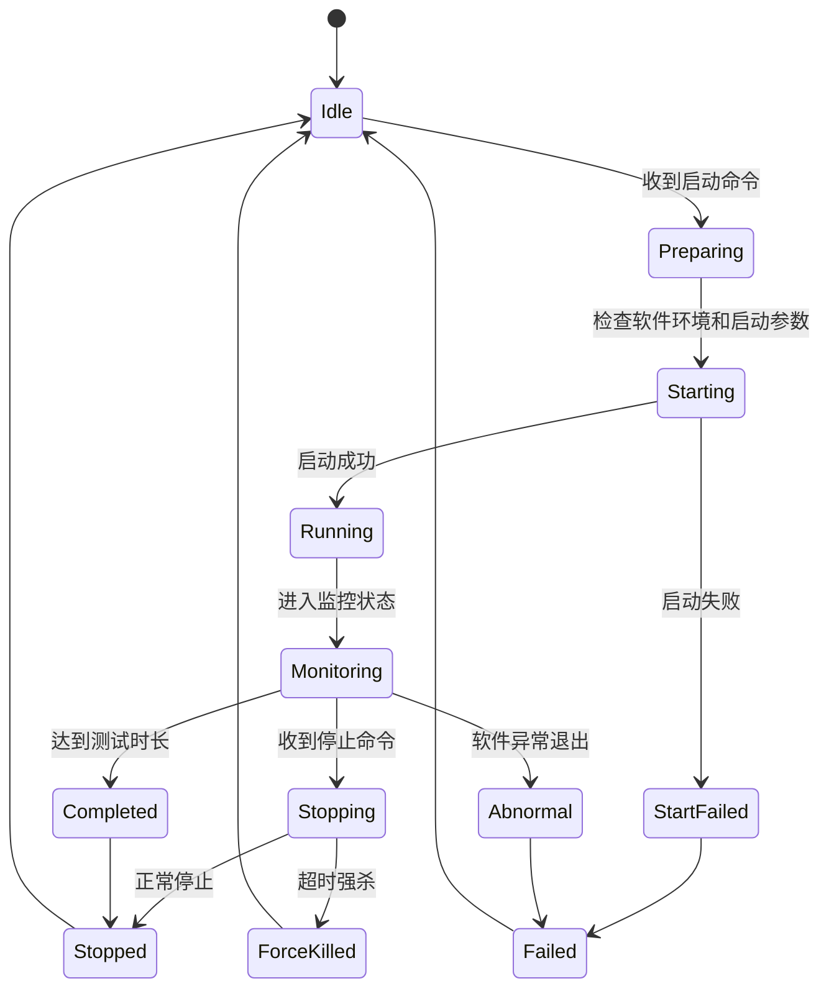

# 跨平台工业老化测试与硬件监控平台完整架构说明

> 技术栈约束：后端服务使用 **Python FastAPI**，Agent Core 使用 **C++**；设备通信使用 **MQTT/EMQX**；实时推送使用 **WebSocket**；业务数据库使用 **MySQL**；时序数据库使用 **InfluxDB**；Windows Agent 使用 Windows Service；Linux Agent 使用 systemd service；Android Agent 使用 Kotlin Foreground Service + Native Core。  
> 第一版暂不引入 Redis、本地 SQLite、断网续传、边缘服务器、Agent 自动升级等能力，后续按迭代增加。

---

## 一、重新定义系统目标

本系统定义为：**跨平台工业老化测试与硬件资源监控平台**。

系统核心目标不是简单做一个监控页面，而是实现“设备端采集 + 服务端调度 + 性能测试软件远程控制 + 实时可视化 + 历史追溯 + 报警报表”的完整闭环。

### 1. 核心业务目标

1. 支持 Windows / Linux / Android 三类设备接入。
2. 支持 Agent Core 自动采集硬件基本信息。
3. 支持 Agent Core 定时采集实时硬件资源指标。
4. 支持服务端远程下发命令，控制性能测试软件启动、停止、状态查询。
5. 支持 Web 页面实时展示设备状态、实时曲线、历史曲线、报警、报表。
6. 支持 Qt/QML 本地客户端展示本机状态和进行现场操作。
7. 支持测试任务全过程追踪：创建、下发、执行、停止、完成、异常。
8. 支持命令全过程追踪：创建、发送、接收、执行、成功、失败、超时。
9. 支持业务数据和时序数据分离存储。
10. 支持后续扩展更多平台、更多性能测试软件、更多指标和更多报警规则。

### 2. 系统核心闭环

```text
Web / Qt 发起操作
        ↓
Python 后端创建任务和命令
        ↓
MQTT 下发命令
        ↓
Agent Core 接收命令
        ↓
Agent Core 启动 / 停止性能测试软件
        ↓
Agent Core 采集实时指标
        ↓
MQTT 上报数据
        ↓
Python 后端写 MySQL / InfluxDB
        ↓
WebSocket 推送实时状态
        ↓
Web / Qt 展示实时曲线、任务状态、报警信息
```

---

## 二、总体架构设计

### 1. 推荐技术选型

| 层级 | 技术选型 | 作用说明 |
|---|---|---|
| Web 管理端 | Vue 3 / React + TypeScript + ECharts + Three.js | 管理后台、监控大屏、实时曲线、历史曲线、报警、报表、3D 场景 |
| 本地客户端 | Qt 6 + QML + C++ | 本地工业客户端，展示本机状态、实时指标、性能测试状态 |
| 后端服务 | Python + FastAPI + Uvicorn | HTTP API、WebSocket、任务管理、命令调度、数据处理 |
| 设备通信 | MQTT + EMQX | Agent 上报数据、服务端下发控制命令 |
| 实时推送 | FastAPI WebSocket | 服务端向 Web / Qt 推送实时指标和任务状态 |
| 业务数据库 | MySQL | 用户、设备、任务、命令、报警、报表、配置 |
| 时序数据库 | InfluxDB | CPU、内存、磁盘、网卡、GPU、温度等实时指标和历史曲线 |
| Agent Core | C++17 / C++20 + CMake | 跨平台采集、MQTT 通信、命令执行、性能软件控制 |
| Windows Agent | C++ Windows Service | Windows 后台常驻服务 |
| Linux Agent | C++ systemd service | Linux 后台常驻服务 |
| Android Agent | Kotlin Foreground Service + C++ Native Core | Android 后台常驻服务，通过 JNI 调用 Native Core |
| 性能测试软件 | AIDA64 / OCCT / stress-ng / fio / 自研 Stress | 实际执行老化和性能压力测试 |

### 2. 关键设计原则

| 原则 | 说明 |
|---|---|
| Agent 与服务端解耦 | 服务端只发命令，Agent 在本机执行 |
| 采集与控制解耦 | MetricCollector 负责采集，PerformanceToolManager 负责控制性能软件 |
| 平台差异隔离 | Windows / Linux / Android 差异放在 Platform Adapter |
| 性能软件插件化 | 通过 IPerformanceRunner 适配不同平台和不同软件 |
| 前端不直连数据库 | Web / Qt 只调用 Python API 和 WebSocket |
| Agent 不直写数据库 | Agent 只通过 MQTT 上报，由后端入库 |
| 业务数据与时序数据分离 | MySQL 保存业务，InfluxDB 保存曲线 |
| 命令必须可追踪 | 每条远程命令都有 command_id 和状态机 |
| 指标必须字典化 | 新增指标不应大改代码和数据库结构 |
| 第一版先跑通闭环 | 不引入 Redis、SQLite、断网续传，降低第一版复杂度 |

---

## 三、总体架构图



---

## 四、Agent Core 内部架构

Agent Core 是设备端最核心的组件。它负责采集、通信、命令执行、性能软件控制和状态上报。

```mermaid
flowchart TB
    subgraph AGENT_CORE["Agent Core C++ 跨平台核心"]
        BOOT["Bootstrap<br/>启动器"]
        CFG["ConfigManager<br/>配置管理"]
        ID["DeviceIdentity<br/>设备身份"]
        MQTT["MqttClient<br/>MQTT连接与发布订阅"]
        CMD["CommandDispatcher<br/>命令分发"]
        METRIC_MGR["MetricCollectorManager<br/>指标采集管理"]
        PERF_MGR["PerformanceToolManager<br/>性能软件管理"]
        STATE["StateManager<br/>状态管理"]
        UPLOAD["TelemetryUploader<br/>数据上报"]
        HEART["Heartbeat<br/>心跳上报"]
        LOG["Logger<br/>日志"]
    end

    subgraph COLLECTOR["指标采集插件"]
        BASIC["BasicInfoCollector<br/>基本信息采集"]
        CPU["CpuCollector<br/>CPU指标"]
        MEM["MemoryCollector<br/>内存指标"]
        DISK["DiskCollector<br/>磁盘指标"]
        NET["NetworkCollector<br/>网络指标"]
        GPU["GpuCollector<br/>GPU指标"]
        TEMP["TemperatureCollector<br/>温度指标"]
        PROC["ProcessCollector<br/>进程状态"]
    end

    subgraph RUNNER["性能测试执行器"]
        WIN_RUNNER["WindowsPerformanceRunner"]
        LINUX_RUNNER["LinuxPerformanceRunner"]
        ANDROID_RUNNER["AndroidPerformanceRunner"]
    end

    subgraph ADAPTER["平台适配层"]
        WA["WindowsAdapter<br/>WMI/PDH/WinAPI"]
        LA["LinuxAdapter<br/>/proc/sysfs/shell"]
        AA["AndroidAdapter<br/>Kotlin/JNI/NDK"]
    end

    BOOT --> CFG
    BOOT --> ID
    BOOT --> MQTT
    BOOT --> METRIC_MGR
    BOOT --> PERF_MGR
    BOOT --> HEART
    BOOT --> LOG

    MQTT --> CMD
    CMD --> PERF_MGR
    CMD --> METRIC_MGR
    CMD --> STATE

    METRIC_MGR --> BASIC
    METRIC_MGR --> CPU
    METRIC_MGR --> MEM
    METRIC_MGR --> DISK
    METRIC_MGR --> NET
    METRIC_MGR --> GPU
    METRIC_MGR --> TEMP
    METRIC_MGR --> PROC

    BASIC --> WA
    CPU --> WA
    MEM --> WA
    DISK --> WA
    NET --> WA
    GPU --> WA
    TEMP --> WA
    PROC --> WA

    BASIC --> LA
    CPU --> LA
    MEM --> LA
    DISK --> LA
    NET --> LA
    GPU --> LA
    TEMP --> LA
    PROC --> LA

    BASIC --> AA
    CPU --> AA
    MEM --> AA
    DISK --> AA
    NET --> AA
    GPU --> AA
    TEMP --> AA
    PROC --> AA

    PERF_MGR --> WIN_RUNNER
    PERF_MGR --> LINUX_RUNNER
    PERF_MGR --> ANDROID_RUNNER

    WIN_RUNNER --> WA
    LINUX_RUNNER --> LA
    ANDROID_RUNNER --> AA

    METRIC_MGR --> UPLOAD
    PERF_MGR --> UPLOAD
    HEART --> UPLOAD
    UPLOAD --> MQTT
```



---

## 五、性能测试软件控制设计

性能测试软件不应写死在业务逻辑中，而是通过 `PerformanceToolManager` 统一管理。不同平台、不同软件通过 `IPerformanceRunner` 插件化适配。

### 1. 统一接口

```cpp
class IPerformanceRunner {
public:
    virtual ~IPerformanceRunner() = default;

    virtual bool ValidateEnvironment() = 0;
    virtual RunnerResult Start(const TaskConfig& config) = 0;
    virtual RunnerResult Stop(const std::string& taskId) = 0;
    virtual RunnerResult Restart(const std::string& taskId) = 0;
    virtual RunnerStatus GetStatus(const std::string& taskId) = 0;
    virtual ProcessInfo GetProcessInfo(const std::string& taskId) = 0;
    virtual std::string GetLog(const std::string& taskId) = 0;
    virtual RunnerResult GetResult(const std::string& taskId) = 0;
    virtual RunnerResult Kill(const std::string& taskId) = 0;
};
```

### 2. 三个平台执行器



### basic-info 推送到 Qt/QML Client 正确流程图


### QT填写IP配置，Agent_core 消费流程图


---

## 六、性能测试软件适配方案

| 平台 | 推荐性能测试软件 | Agent 控制方式 | 第一版建议 |
|---|---|---|---|
| Windows | AIDA64 System Stability、OCCT、自研 Stress | CreateProcess、命令行参数、配置文件、进程 PID、窗口关闭、强制 Kill | 优先支持自研 Stress；AIDA64/OCCT 作为可配置路径启动 |
| Linux | stress-ng、fio、memtester、glmark2、自研 Stress | shell/process/systemd-run、PID 文件、/proc/{pid} 监控 | 优先支持 stress-ng + fio |
| Android | Native Stress、厂商工具、自研测试 App | Kotlin Foreground Service、Intent、JNI、厂商 API、shell | 优先做自研 Native Stress，第三方工具作为后期扩展 |

### Windows 执行策略

```text
1. 检查性能软件路径是否存在。
2. 根据任务配置选择 runner。
3. 使用 CreateProcess 启动性能软件。
4. 保存 task_id、runner_code、process_id。
5. 定时检查进程是否存在。
6. 收到停止命令时优雅停止。
7. 超时未停止则强制 Kill。
8. 上报 performance.status 和 result。
```

### Linux 执行策略

```text
1. 检查 stress-ng / fio 是否安装。
2. 根据任务生成命令行参数。
3. 使用子进程启动。
4. 保存 PID。
5. 通过 /proc/{pid} 检查运行状态。
6. 停止时先 SIGTERM，再 SIGKILL。
7. 解析 stdout/stderr 或结果文件。
```

### Android 执行策略

```text
1. Kotlin Foreground Service 保持后台常驻。
2. Kotlin 层负责权限、通知和生命周期。
3. Native Core 通过 JNI 暴露 start/stop/status。
4. 性能测试模块建议自研，避免第三方 App 权限限制。
5. 深层硬件指标需要厂商接口或系统签名权限支持。
```

---

## 七、完整调用关系：启动性能测试



---

## 八、完整调用关系：停止性能测试



---

## 九、命令状态机



### 命令状态说明

| 状态 | 中文说明 |
|---|---|
| Created | 服务端已创建命令 |
| Sent | 命令已发布到 MQTT |
| Received | Agent 已接收命令 |
| Running | Agent 正在执行命令 |
| Succeeded | 命令执行成功 |
| Failed | 命令执行失败 |
| Timeout | 命令超时 |

### 命令记录核心字段

| 字段 | 说明 |
|---|---|
| command_id | 命令唯一ID |
| task_id | 关联任务ID |
| device_id | 目标设备ID |
| command_type | 命令类型 |
| payload | 命令参数 |
| status | 命令状态 |
| timeout_seconds | 超时时间 |
| retry_count | 重试次数 |
| error_code | 错误编码 |
| error_message | 错误信息 |
| agent_response | Agent 回传结果 |
| created_at | 创建时间 |
| sent_at | 发送时间 |
| received_at | Agent 接收时间 |
| started_at | Agent 开始执行时间 |
| finished_at | 命令完成时间 |

---

## 十、性能测试软件状态机



### 性能软件状态说明

| 状态 | 中文说明 |
|---|---|
| Idle | 空闲 |
| Preparing | 准备执行 |
| Starting | 正在启动 |
| Running | 正在运行 |
| Monitoring | 运行监控中 |
| Stopping | 正在停止 |
| Stopped | 已停止 |
| Completed | 达到测试时长完成 |
| StartFailed | 启动失败 |
| Abnormal | 异常退出 |
| ForceKilled | 超时强杀 |
| Failed | 失败 |

---

## 十一、Agent Core 采集指标设计

指标分为两类：

| 分类 | 刷新方式 | 说明 |
|---|---|---|
| 基本信息 | 启动时采集一次，或手动刷新 | 操作系统、主板、BIOS、CPU 型号、GPU 型号、内存条、磁盘、网卡等，通常变化很少 |
| 实时信息 | 定时刷新，建议 1 秒或 2 秒一次 | CPU 利用率、CPU 温度、GPU 利用率、内存占用、磁盘读写速度、网络收发速度、性能测试软件状态等 |

### 1. 采集原则

1. Agent Core 统一组织采集流程。
2. 平台差异由 Platform Adapter 屏蔽。
3. 每个指标需要包含 `metric_code`、`value`、`unit`、`timestamp`、`supported`。
4. 对采集不到的指标返回 `unsupported`，不要返回假数据或 0。
5. 基本信息写入 MySQL，实时信息写入 InfluxDB。
6. 实时信息同时通过 WebSocket 推送到前端。

### 2. 指标编码建议

| 指标编码 | 中文名称 | 类型 |
|---|---|---|
| os.name | 操作系统名称 | 基本信息 |
| os.version | 操作系统版本 | 基本信息 |
| cpu.model | CPU 型号 | 基本信息 |
| gpu.0.name | GPU 名称 | 基本信息 |
| memory.total_gb | 内存总量 | 基本信息 |
| disk.0.name | 磁盘0名称 | 基本信息 |
| network.0.name | 网卡0名称 | 基本信息 |
| cpu.usage_percent | CPU 利用率 | 实时信息 |
| cpu.temperature_celsius | CPU 温度 | 实时信息 |
| memory.usage_percent | 内存使用率 | 实时信息 |
| disk.0.usage_percent | 磁盘0使用率 | 实时信息 |
| disk.0.read_mb_s | 磁盘0读取速度 | 实时信息 |
| disk.0.write_mb_s | 磁盘0写入速度 | 实时信息 |
| network.0.send_kbps | 网卡0发送速度 | 实时信息 |
| network.0.recv_kbps | 网卡0接收速度 | 实时信息 |
| gpu.0.usage_percent | GPU0 利用率 | 实时信息 |
| performance.status | 性能测试软件状态 | 实时信息 |

---

## 十二、基本信息采集技术方案

### 1. 操作系统信息

| 平台 | 获取方式 | 说明 |
|---|---|---|
| Windows | WMI `Win32_OperatingSystem`、Registry | 获取系统名称、版本、架构、安装时间、主机名 |
| Linux | `/etc/os-release`、`uname -a`、`hostnamectl` | 获取发行版、内核版本、系统架构 |
| Android | `Build.VERSION`、`Build.MANUFACTURER`、`Build.MODEL` | 获取 Android 版本、设备型号、厂商 |

输出字段：

```json
{
  "os.name": "Microsoft Windows 10 Professional",
  "os.version": "10.0.19045",
  "os.arch": "x64",
  "os.hostname": "HOST-001"
}
```

### 2. 主板信息

| 平台 | 获取方式 | 说明 |
|---|---|---|
| Windows | WMI `Win32_BaseBoard` | 主板厂商、型号、序列号 |
| Linux | `/sys/class/dmi/id/board_*`、`dmidecode` | 普通用户可读部分信息，完整信息可能需要 root |
| Android | 普通 App 通常无法获取主板级信息 | 需要厂商接口、系统签名或定制 ROM |

输出字段：

```json
{
  "mainboard.manufacturer": "Intel",
  "mainboard.product": "Default string",
  "mainboard.serial": "Default string"
}
```

### 3. BIOS / 固件信息

| 平台 | 获取方式 | 说明 |
|---|---|---|
| Windows | WMI `Win32_BIOS` | BIOS 名称、版本、序列号、发布日期 |
| Linux | `/sys/class/dmi/id/bios_*`、`dmidecode` | 工控机可用 |
| Android | `Build.BOOTLOADER`、厂商属性 | 信息有限 |

输出字段：

```json
{
  "bios.vendor": "American Megatrends",
  "bios.version": "5.27",
  "bios.release_date": "2024-01-01"
}
```

### 4. CPU 型号信息

| 平台 | 获取方式 | 说明 |
|---|---|---|
| Windows | WMI `Win32_Processor` | 型号、核心数、线程数、最大频率 |
| Linux | `/proc/cpuinfo`、`lscpu` | 型号、核心、线程、频率 |
| Android | `/proc/cpuinfo`、`Build.SOC_MODEL`、`Build.HARDWARE` | 字段完整度受 Android 版本影响 |

输出字段：

```json
{
  "cpu.model": "12th Gen Intel Core i5-12450HX",
  "cpu.cores": 8,
  "cpu.threads": 12,
  "cpu.max_frequency_mhz": 2400
}
```

### 5. GPU 型号信息

| 平台 | 获取方式 | 说明 |
|---|---|---|
| Windows | WMI `Win32_VideoController`、DXGI、厂商 SDK | 获取显卡型号、驱动版本、显存 |
| Linux | `lspci`、`/sys/class/drm`、`nvidia-smi`、`rocm-smi` | NVIDIA / AMD / Intel 需分别适配 |
| Android | OpenGL ES `GL_RENDERER`、Vulkan 信息、厂商属性 | 可获取 GPU 渲染器名称，深度信息有限 |

输出字段：

```json
{
  "gpu.0.name": "Intel UHD Graphics",
  "gpu.0.vendor": "Intel",
  "gpu.0.driver_version": "31.0.101.5382",
  "gpu.0.memory_mb": 128
}
```

### 6. 内存条信息

| 平台 | 获取方式 | 说明 |
|---|---|---|
| Windows | WMI `Win32_PhysicalMemory` | 每条内存容量、频率、厂商、插槽 |
| Linux | `dmidecode --type memory`、`/proc/meminfo` | 完整内存条信息通常需要 root |
| Android | `ActivityManager.MemoryInfo`、`/proc/meminfo` | 通常只能获取总内存，不能获取内存条明细 |

输出字段：

```json
{
  "memory.total_gb": 32,
  "memory.slot_count": 2,
  "memory.modules": [
    {
      "slot": "BANK 0",
      "size_gb": 16,
      "speed_mhz": 3200,
      "manufacturer": "Samsung"
    }
  ]
}
```

### 7. 磁盘信息

| 平台 | 获取方式 | 说明 |
|---|---|---|
| Windows | WMI `Win32_DiskDrive`、`MSFT_PhysicalDisk` | 型号、容量、接口类型、序列号 |
| Linux | `lsblk`、`/sys/block`、`smartctl` | NVMe / SATA 信息可获取 |
| Android | `StatFs`、`StorageManager` | 主要获取存储容量，硬盘型号通常受限 |

输出字段：

```json
{
  "disk.0.name": "UDSS UD2CMAHT301-001T",
  "disk.0.size_gb": 1024,
  "disk.0.interface": "NVMe",
  "disk.0.serial": "xxx"
}
```

### 8. 网卡信息

| 平台 | 获取方式 | 说明 |
|---|---|---|
| Windows | IP Helper API `GetAdaptersAddresses`、WMI `Win32_NetworkAdapter` | 网卡名称、MAC、IP、速率 |
| Linux | `/sys/class/net`、`ip addr`、`ethtool` | 网卡名称、MAC、IP、速率 |
| Android | `ConnectivityManager`、`NetworkInterface` | Android 10+ 对 MAC 地址有隐私限制 |

输出字段：

```json
{
  "network.0.name": "Intel Ethernet Controller I226-V",
  "network.0.mac": "E8:26:21:00:01:4B",
  "network.0.ip": "192.168.26.97",
  "network.0.type": "ethernet"
}
```

---

## 十三、实时信息采集技术方案

### 1. CPU 利用率

| 平台 | 获取方式 | 说明 |
|---|---|---|
| Windows | PDH / Performance Counter：`\\Processor(_Total)\\% Processor Time` | 稳定，适合服务采集 |
| Linux | `/proc/stat` 两次采样计算差值 | 标准方式 |
| Android | `/proc/stat` 或系统接口 | 部分版本受限 |

计算公式：

```text
CPU使用率 = 1 - idle_delta / total_delta
```

刷新周期：

```text
1 秒或 2 秒
```

### 2. CPU 温度

| 平台 | 获取方式 | 说明 |
|---|---|---|
| Windows | LibreHardwareMonitor、OpenHardwareMonitor、厂商 SDK、ACPI | Windows 原生接口不统一，建议集成硬件监控库 |
| Linux | `/sys/class/thermal`、`/sys/class/hwmon`、`lm-sensors` | 工控机比较适合 |
| Android | `/sys/class/thermal/thermal_zone*`、BatteryManager、厂商接口 | CPU 温度不一定开放，可能只能获取电池温度 |

设计要求：

```text
如果采集不到 CPU 温度，返回 unsupported，不返回 0。
```

### 3. GPU 利用率

| 平台 | 获取方式 | 说明 |
|---|---|---|
| Windows | PDH GPU Engine、DXGI、NVML、AMD ADL、Intel GPU 工具 | 普通显卡需要多方案适配 |
| Linux | `nvidia-smi`、`rocm-smi`、`intel_gpu_top`、`/sys/class/drm` | NVIDIA 最容易，Intel/AMD 需单独适配 |
| Android | 厂商接口、Perfetto、Root、系统签名或自研测试工具返回 | 普通 App 很难获取系统 GPU 利用率 |

第一版建议：

```text
Windows / Linux 实现 GPU 利用率。
Android 第一版只实现 GPU 名称和测试状态，GPU 利用率作为可选扩展。
```

### 4. 内存占用

| 平台 | 获取方式 | 说明 |
|---|---|---|
| Windows | `GlobalMemoryStatusEx`、Performance Counter | 总内存、已用、可用 |
| Linux | `/proc/meminfo` | 计算 MemTotal、MemAvailable |
| Android | `ActivityManager.MemoryInfo`、`/proc/meminfo` | 可获取总内存、可用内存 |

输出字段：

```json
{
  "memory.total_gb": 31.8,
  "memory.used_gb": 10.1,
  "memory.free_gb": 21.6,
  "memory.usage_percent": 31.9
}
```

### 5. 磁盘使用率

| 平台 | 获取方式 | 说明 |
|---|---|---|
| Windows | `GetDiskFreeSpaceEx`、WMI LogicalDisk | 获取分区容量和使用率 |
| Linux | `statvfs`、`df` | 获取挂载点使用率 |
| Android | `StatFs` | 获取内部存储 / 外部存储使用率 |

### 6. 磁盘读写速度

| 平台 | 获取方式 | 说明 |
|---|---|---|
| Windows | Performance Counter：PhysicalDisk Read/Write Bytes/sec | 推荐 |
| Linux | `/proc/diskstats` 两次采样计算差值 | 推荐 |
| Android | `/proc/diskstats` 或应用层 I/O 统计 | 部分设备受限 |

计算公式：

```text
read_speed = read_bytes_delta / interval_seconds
write_speed = write_bytes_delta / interval_seconds
```

### 7. 网络收发速度

| 平台 | 获取方式 | 说明 |
|---|---|---|
| Windows | IP Helper API `GetIfTable2`，或 Performance Counter | 推荐 |
| Linux | `/proc/net/dev` 两次采样 | 推荐 |
| Android | `TrafficStats`、`NetworkStatsManager`、`/proc/net/dev` | 普通 App 推荐 TrafficStats，但系统总流量可能受权限限制 |

计算公式：

```text
send_speed = tx_bytes_delta / interval_seconds
recv_speed = rx_bytes_delta / interval_seconds
```

### 8. 性能测试软件进程状态

| 平台 | 获取方式 | 说明 |
|---|---|---|
| Windows | PID、进程名、Job Object、WMI Process | 检测是否运行、CPU、内存、退出码 |
| Linux | PID 文件、`/proc/{pid}`、systemd、进程名 | 推荐使用 PID 管理 |
| Android | 自研 Service 状态、Intent 回调、AIDL、进程状态 | 第三方 App 受限，建议自研测试 Service |

输出字段：

```json
{
  "performance.status": "running",
  "performance.runner": "windows_aida64",
  "performance.process_id": 12345,
  "performance.started_at": 1717480000000
}
```

---

## 十四、指标采集汇总表

| 指标 | Windows | Linux | Android | 第一版建议 |
|---|---|---|---|---|
| OS 信息 | WMI / Registry | `/etc/os-release` | Build API | 必做 |
| 主板信息 | WMI | `/sys/class/dmi/id` / dmidecode | 厂商接口，普通 App 受限 | Windows/Linux 必做，Android 可选 |
| BIOS 信息 | WMI | dmidecode / sysfs | Build.BOOTLOADER | Windows/Linux 必做，Android 可选 |
| CPU 型号 | WMI | `/proc/cpuinfo` | `/proc/cpuinfo` / Build | 必做 |
| GPU 型号 | WMI / DXGI | lspci / drm / nvidia-smi | OpenGL Renderer | 必做 |
| 内存信息 | WMI | dmidecode / meminfo | ActivityManager | 必做 |
| 磁盘信息 | WMI | lsblk / sysfs | StorageManager | 必做 |
| 网卡信息 | GetAdaptersAddresses | `/sys/class/net` | ConnectivityManager | 必做 |
| CPU 利用率 | PDH | `/proc/stat` | `/proc/stat` 或系统接口 | 必做 |
| CPU 温度 | LibreHardwareMonitor | hwmon / thermal_zone | thermal_zone / BatteryManager | 可选增强 |
| GPU 利用率 | PDH / NVML / ADL | nvidia-smi / rocm / intel 工具 | 厂商接口 / 系统权限 | 可选增强 |
| 内存占用 | GlobalMemoryStatusEx | `/proc/meminfo` | ActivityManager | 必做 |
| 磁盘使用率 | GetDiskFreeSpaceEx | statvfs / df | StatFs | 必做 |
| 磁盘读写 | Performance Counter | `/proc/diskstats` | `/proc/diskstats` 或受限 | 必做 |
| 网络收发 | GetIfTable2 | `/proc/net/dev` | TrafficStats | 必做 |
| 性能软件状态 | Process API | `/proc/pid` | 自研 Service 状态 | 必做 |

---

## 十五、数据上报设计

### 1. 基本信息上报

触发时机：

```text
1. Agent 第一次启动
2. Agent 重启
3. 用户手动刷新
4. 服务端下发 basic-info.refresh 命令
```

MQTT Topic：

```text
agent/{deviceId}/basic-info
```

消息示例：

```json
{
  "messageId": "msg-basic-001",
  "deviceId": "device-001",
  "platform": "windows",
  "timestamp": 1717480000000,
  "dataType": "basic_info",
  "payload": {
    "os.name": "Microsoft Windows 10 Professional",
    "os.version": "10.0.19045",
    "os.arch": "x64",
    "cpu.model": "12th Gen Intel Core i5-12450HX",
    "cpu.cores": 8,
    "cpu.threads": 12,
    "gpu.0.name": "Intel UHD Graphics",
    "memory.total_gb": 31.8,
    "disk.0.name": "UDSS UD2CMAHT301-001T",
    "network.0.name": "Intel Ethernet Controller I226-V"
  }
}
```

后端处理：

```text
MQTT Consumer 接收 basic-info
        ↓
DeviceService 更新 device_node
        ↓
写入 device_basic_info
        ↓
通过 WebSocket 推送设备基本信息刷新事件
```

### 2. 实时信息上报

触发时机：

```text
每 1 秒或 2 秒上报一次
```

MQTT Topic：

```text
telemetry/{deviceId}/realtime
```

消息示例：

```json
{
  "messageId": "msg-metric-001",
  "deviceId": "device-001",
  "taskId": "task-001",
  "platform": "windows",
  "timestamp": 1717480001000,
  "dataType": "realtime_metric",
  "performanceStatus": "running",
  "metrics": {
    "cpu.usage_percent": 82.5,
    "cpu.temperature_celsius": 74.2,
    "memory.used_gb": 10.1,
    "memory.usage_percent": 31.9,
    "disk.0.usage_percent": 8.5,
    "disk.0.read_mb_s": 35.3,
    "disk.0.write_mb_s": 404.1,
    "network.0.send_kbps": 179.5,
    "network.0.recv_kbps": 85.7,
    "gpu.0.usage_percent": 45.0,
    "performance.status": "running"
  }
}
```

后端处理：

```text
MQTT Consumer 接收 telemetry
        ↓
TelemetryService 解析指标
        ↓
写入 InfluxDB host_realtime_metric
        ↓
更新内存 latest_metrics，第一版不用 Redis
        ↓
AlarmService 判断报警规则
        ↓
WebSocket 推送实时指标和报警
```

---

## 十六、服务端模块关系表

| 模块 | 主要职责 | 输入 | 输出 |
|---|---|---|---|
| FastAPI HTTP API | 提供前端调用接口 | Web / Qt HTTP 请求 | JSON 响应 |
| WebSocket Manager | 管理实时连接和推送 | 实时指标、报警、任务状态 | 推送给 Web / Qt |
| AuthService | 用户登录和权限 | 用户名、密码、Token | 用户信息、权限结果 |
| DeviceService | 设备注册、心跳、基本信息、在线状态 | Agent register、heartbeat、basic-info | device_node、device_basic_info |
| TestTaskService | 创建、开始、停止测试任务 | Web / Qt 任务请求 | test_task、test_task_device |
| CommandService | 创建命令、发布 MQTT、跟踪命令状态 | start/stop 请求 | command_record、MQTT 命令 |
| MqttConsumer | 消费 Agent 上报消息 | MQTT register / telemetry / ack | 调用业务服务 |
| TelemetryService | 处理实时指标 | telemetry JSON | 写 InfluxDB、推送 WebSocket |
| AlarmService | 判断报警规则 | 实时指标、报警规则 | alarm_record、报警推送 |
| ReportService | 生成测试报告 | 任务数据、历史曲线 | report_record、报表文件 |
| ConfigService | 管理系统配置 | 配置请求 | system_config、Agent 配置下发 |

---

## 十七、每个环节调用关系总表

| 序号 | 调用方 | 被调用方 | 方式 | 主要数据 | 结果 |
|---:|---|---|---|---|---|
| 1 | Web / Qt | FastAPI HTTP API | HTTP | 登录、查询、任务操作 | JSON 响应 |
| 2 | FastAPI | AuthService | 内部调用 | Token、用户信息 | 鉴权结果 |
| 3 | Web / Qt | TestTaskService | HTTP | 设备、测试时长、压力项目 | 创建任务 |
| 4 | TestTaskService | MySQL | SQL | test_task、test_task_device | 保存任务 |
| 5 | TestTaskService | CommandService | 内部调用 | task_id、device_id、command_type | 创建命令 |
| 6 | CommandService | MySQL | SQL | command_record | 保存命令 |
| 7 | CommandService | EMQX | MQTT Publish | cmd/{deviceId}/performance/start | 下发启动命令 |
| 8 | Agent Core | EMQX | MQTT Subscribe | cmd/{deviceId}/# | 接收命令 |
| 9 | Agent Core | CommandDispatcher | 内部调用 | command payload | 解析命令 |
| 10 | CommandDispatcher | PerformanceToolManager | 内部调用 | Start/Stop | 控制性能软件 |
| 11 | PerformanceToolManager | Platform Runner | 内部调用 | taskConfig | 选择执行器 |
| 12 | Platform Runner | 性能测试软件 | Process / Shell / Intent / JNI | 启动或停止参数 | 软件运行或停止 |
| 13 | Agent Core | EMQX | MQTT Publish | ack/result/status | 回传命令结果 |
| 14 | Agent Core | MetricCollectorManager | 定时调用 | 平台采集请求 | 指标快照 |
| 15 | MetricCollectorManager | Platform Adapter | 平台 API | WMI / proc / Android API | 采集数据 |
| 16 | Agent Core | EMQX | MQTT Publish | telemetry | 上报实时指标 |
| 17 | Python MqttConsumer | EMQX | MQTT Subscribe | telemetry / ack / status | 接收上报 |
| 18 | TelemetryService | InfluxDB | 写入 | host_realtime_metric | 保存历史曲线 |
| 19 | TelemetryService | WebSocket | 推送 | 实时指标 | 前端刷新 |
| 20 | AlarmService | MySQL | SQL | alarm_record | 保存报警 |
| 21 | ReportService | MySQL / InfluxDB | 查询 | 任务数据、曲线数据 | 生成报告 |

---

## 十八、第一版功能边界

### 1. 第一版必须实现

| 模块 | 功能 |
|---|---|
| Agent | 设备注册 |
| Agent | 心跳上报 |
| Agent | 基本信息采集 |
| Agent | 实时指标采集 |
| Agent | MQTT 连接 |
| Agent | 接收 start/stop 命令 |
| Agent | 启动/停止性能测试软件 |
| Agent | ACK / status / telemetry 上报 |
| 后端 | FastAPI 基础接口 |
| 后端 | MQTT 消费 |
| 后端 | MySQL 业务数据写入 |
| 后端 | InfluxDB 实时指标写入 |
| 后端 | WebSocket 实时推送 |
| Web | 设备列表 |
| Web | 设备详情 |
| Web | 实时曲线 |
| Web | 启动/停止性能测试 |
| Web | 任务列表 |
| Web | 报警列表 |
| Qt | 本地状态展示 |
| Qt | 本地实时指标展示 |
| Qt | 启动/停止按钮 |

### 2. 第一版暂不实现

| 功能 | 说明 |
|---|---|
| Redis | 第一版用 Python 内存保存 latest_metrics |
| Agent 本地 SQLite | 第一版不做离线缓存 |
| 断网续传 | 后期增加 |
| 多级边缘服务器 | 后期增加 |
| Agent 自动升级 | 后期增加 |
| 复杂权限模型 | 第一版只做基础登录和角色预留 |
| AI 异常检测 | 后期增加 |
| 复杂报表模板 | 第一版只做 report_record 和基础导出预留 |
| Android 深层 GPU/CPU 温度 | 需要厂商接口或系统权限，后期适配 |

---

## 十九、最终架构结论

最终推荐架构如下：

```text
Web / Qt 客户端
        ↓ HTTP / WebSocket
Python FastAPI 后端
        ↓
MySQL 业务数据库 + InfluxDB 时序数据库
        ↓
EMQX MQTT Broker
        ↓
Agent Core C++
        ↓
Windows / Linux / Android Platform Adapter
        ↓
AIDA64 / OCCT / stress-ng / fio / Android Native Stress / 自研Stress
```

### 1. 核心结论

1. 后端使用 Python FastAPI，负责 API、WebSocket、MQTT 消费、业务调度和数据入库。
2. Agent Core 使用 C++，负责跨平台采集和性能测试软件控制。
3. MQTT 是服务端和 Agent 的唯一控制通信通道。
4. Web / Qt 不直接控制性能测试软件，只通过后端发起任务和命令。
5. 性能测试软件通过 `PerformanceToolManager + IPerformanceRunner` 插件化适配。
6. MySQL 保存业务数据，InfluxDB 保存实时指标和历史曲线。
7. Windows / Linux / Android 差异通过 Platform Adapter 隔离。
8. 第一版先跑通最小闭环，后续再增加 Redis、SQLite、断网续传、自动升级等增强能力。

### 2. 后续可扩展方向

| 方向 | 扩展方式 |
|---|---|
| 新增性能软件 | 新增 IPerformanceRunner 实现 |
| 新增平台 | 新增 Platform Adapter |
| 新增指标 | 增加 MetricCollector 和 metric_dictionary 记录 |
| 增加 Redis | 替换 Python 内存 latest_metrics |
| 增加本地缓存 | Agent 加 SQLite 队列 |
| 增加断网续传 | Agent 本地队列 + 后端批量写入 |
| 增加报表 | ReportService 增加模板和导出 |
| 增加告警通知 | AlarmService 接入短信、邮件、企业微信 |
| 增加安全能力 | MQTT TLS、Token、设备证书、Topic ACL |

---

## 附录 A：推荐项目拆分

```text
aging-platform/
├─ 01_qt_qml_client/
│  └─ Qt + QML 本地客户端
├─ 02_agent_core_cpp/
│  └─ C++ Agent Core 服务
├─ 03_backend_python_api/
│  └─ Python FastAPI 后端
├─ 04_web_admin_vue/
│  └─ Vue3 Web 管理端
├─ deploy/
│  └─ MySQL / InfluxDB / EMQX / Nginx 部署脚本
└─ docs/
   └─ 架构文档、数据库文档、协议文档
```

## 附录 B：默认服务地址

```text
Python API:  http://192.168.31.224:8000
WebSocket:   ws://192.168.31.224:8000/ws/realtime
MQTT:        192.168.31.224:1883
MySQL:       192.168.31.224:3306
InfluxDB:    http://192.168.31.224:8086
EMQX管理台:  http://192.168.31.224:18083
```

## 附录 C：统一 MQTT Topic

### Agent 上报

```text
agent/{deviceId}/register
agent/{deviceId}/heartbeat
agent/{deviceId}/basic-info
agent/{deviceId}/status
telemetry/{deviceId}/realtime
performance/{deviceId}/status
performance/{deviceId}/result
ack/{deviceId}/{commandId}
```

### 服务端下发

```text
cmd/{deviceId}/performance/start
cmd/{deviceId}/performance/stop
cmd/{deviceId}/performance/restart
cmd/{deviceId}/performance/status
cmd/{deviceId}/basic-info/refresh
cmd/{deviceId}/config/update
cmd/{deviceId}/agent/restart
```
