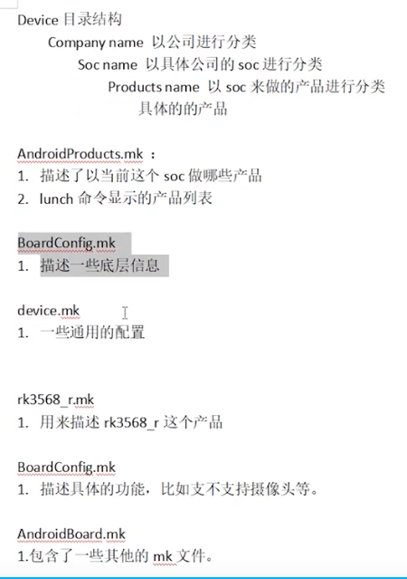

#### 命令

```
启动 
	source ...  lunch  ./build.sh -U 
	make 
	emulator emulator -verbose | grep kernel 启动带打印日志信息
	work/out/host/linux-x86/bin/adb   adb shell  命令
	
编译
	u-boot 编译生成的目录 uboot.img rk356x...bin 就是烧录代码时候的文件
	进入到 u-boot 目录下，然后 ./make.sh rk3568
	编译时候，修改 u-boot里面的配置。并保存。修改 make menuconfig 中的配置，并修改保存的路径即可。
	在 脚本中 set -x 打印信息。 
	
参数 
	在启动时候，按 ctrl+C 可以进入查看 u-boot 的打印信息。输入命令 pre
	bootargs 是 u-boot 参数传过来的 在内核中的名称是  cmdline 
	/proc/cmdline 编译中的配置参数
```

device 目录



