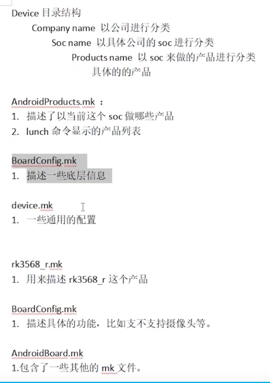

#### 命令

```
Uboot 编译
	在 u-boot 目录下 执行 ./make.sh loader
	安卓启动流程中，初始化内存相关。烧写的第一个 load.bin 文件。
	使用瑞芯微提供的 Uboot 工具，使用命令，修改uboot 配置参数，可以修改波特率等参数。
	修改后，将 .bin 文件。  然后再拷贝到 对应的原来的目录中。 

启动 
	source ...  lunch  ./build.sh -AUCKu 编译 uboot
	source ...  lunch  ./buils.sh -CKA 编译 Kernel 
	make 
	emulator emulator -verbose | grep kernel 启动带打印日志信息
	work/out/host/linux-x86/bin/adb   adb shell  命令
	
修改 cmdline 参数来源
	设备树dts的chosen节点
	安卓源码 defvice/rockchip/common/BoardConfig.mk 文件
	Uboot 源码自动设置。
	
编译
	u-boot 编译生成的目录 uboot.img rk356x...bin 就是烧录代码时候的文件
	进入到 u-boot 目录下，然后 ./make.sh rk3568
	编译时候，修改 u-boot里面的配置。并保存。修改 make menuconfig 中的配置，并修改保存的路径即可。
	在 脚本中 set -x 打印信息。 
	
	sudo apt-get install openjdk-8-jdk

	
参数 
	在启动时候，按 ctrl+C 可以进入查看 u-boot 的打印信息。输入命令 pre
	bootargs 是 u-boot 参数传过来的 在内核中的名称是  cmdline 
	/proc/cmdline 编译中的配置参数
	
kernel 
	本地化：进入到 device 目录：grep "rockchip_defconfig" -rw 查找出 .mk 文件。里面有宏定义的值。
		device/rockchip/common/BoardConfig.mk 文件
	dts 文件：device/rockchip/rk356x/rk356x_r/BoardConfig.mk 
	一种方法是：使用提供的原生的编译，不过比较慢。
	另一种是：在 kernel 目录中，创建一个 .sh 脚本，将原生的编译指令，重新拷贝一份，只需要kernel 的。
```


#### 自动开机系统

```
跳线帽连接方式：
	最上面两个连接的时候，则是 插上电源键的话，自动开机。拔掉电源不能自动输出点。必要的条件有，必须插上电源才能开机。
	当是最下面两个连接的时候，则是，关机后，不会自动开机。需要启动电容板才会自动开机。拔掉电源后，能自动开机保持输出电源。
	
	16:25 分 断电。
	
```

#### device 目录




#### uboot 编译


#### 单独编译 安卓 内核源码


