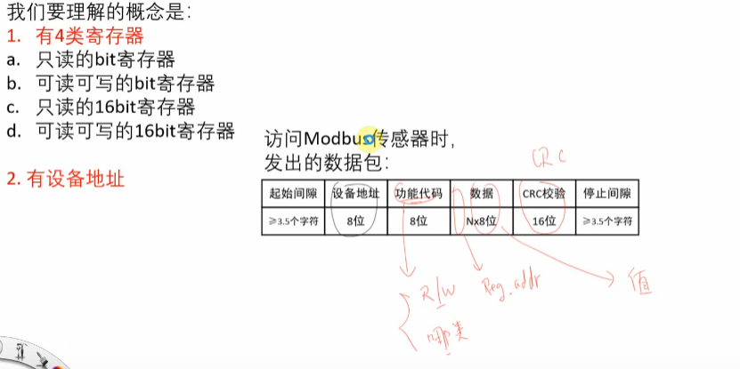

Modbus 

``` 
发送数据
[17:27:56.651]收←◆01 04 00 11 00 00 A0 0F 
[17:28:01.652]收←◆01 04 00 14 00 00 B0 0E 
[17:28:06.649]收←◆01 04 00 0D 00 00 61 C9 
[17:28:11.653]收←◆01 04 00 1A 00 00 D1 CD 
[17:28:16.654]收←◆01 04 00 11 00 00 A0 0F 
[17:28:21.655]收←◆01 04 00 14 00 00 B0 0E 
[17:28:26.656]收←◆01 04 00 0D 00 00 61 C9 
[17:28:31.656]收←◆01 04 00 1A 00 00 D1 CD 
[17:28:36.657]收←◆01 04 00 11 00 00 A0 0F 
[17:28:41.658]收←◆01 04 00 14 00 00 B0 0E 
[17:28:46.655]收←◆01 04 00 0D 00 00 61 C9 
[17:28:51.660]收←◆01 04 00 1A 00 00 D1 CD 
[17:28:56.660]收←◆01 04 00 11 00 00 A0 0F 
[17:29:01.660]收←◆01 04 00 14 00 00 B0 0E 
[17:29:06.662]收←◆01 04 00 0D 00 00 61 C9 
[17:29:11.663]收←◆01 04 00 1A 00 00 D1 CD 
[17:29:16.665]收←◆01 04 00 11 00 00 A0 0F 

[11:45:53.589]发→◇01 04 00 1A 00 01 10 0D □
[11:45:53.630]收←◆01 04 02 00 00 B9 30 
[11:46:01.800]发→◇01 03 00 02 00 01 25 CA □
[11:46:01.836]收←◆01 03 02 03 52 39 49 
[11:46:21.042]发→◇01 05 00 20 00 00 CC 00 □ // 关闭制冷机
[11:46:21.080]收←◆01 05 00 20 00 00 CC 00 
[11:46:43.406]发→◇01 05 00 20 FF 00 8D F0 □ // 开启制冷机
[11:46:43.448]收←◆01 05 00 20 FF 00 8D F0 
[11:47:03.009]发→◇01 05 00 20 00 00 CC 00 □
[11:47:03.047]收←◆01 05 00 20 00 00 CC 00 
[18:08:45.066]发→◇01 06 00 03 00 96 F9 A4 □
[18:08:45.104]收←◆01 06 00 03 00 96 F9 A4 
[11:23:10.159]发→◇01 04 00 1A 00 01 10 0D □// 当前运行时间
[11:23:10.195]收←◆01 04 02 00 00 B9 30
[11:27:20.911]发→◇01 04 00 11 00 01 61 CF □// 热端温度
[11:27:20.947]收←◆01 04 02 FB F4 FB 87
[11:29:00.071]发→◇01 04 00 14 00 01 71 CE □// 环境温度
[11:29:00.107]收←◆01 04 02 01 BA 39 13
[11:29:57.391]发→◇01 04 00 0D 00 01 A0 09 □// 输出功率
[11:29:57.427]收←◆01 04 02 00 00 B9 30


[17:35:35.665]收←◆CA 01 04 00 14 00 00 B0 0E AC 
[17:35:40.666]收←◆CA 01 04 00 0D 00 00 61 C9 AC 
[17:35:45.667]收←◆CA 01 04 00 1A 00 00 D1 CD AC 
[17:35:50.668]收←◆CA 01 04 00 11 00 00 A0 0F AC 
[17:35:55.667]收←◆CA 01 04 00 14 00 00 B0 0E AC 
[17:36:00.669]收←◆CA 01 04 00 0D 00 00 61 C9 AC 
[17:36:05.670]收←◆CA 01 04 00 1A 00 00 D1 CD AC 
[17:36:10.671]收←◆CA 01 04 00 11 00 00 A0 0F AC 
[17:36:15.672]收←◆CA 01 04 00 14 00 00 B0 0E AC 
[17:36:20.672]收←◆CA 01 04 00 0D 00 00 61 C9 AC 
[17:36:25.672]收←◆CA 01 04 00 1A 00 00 D1 CD AC 
[17:36:30.671]收←◆CA 01 04 00 11 00 00 A0 0F AC 
[17:36:35.675]收←◆CA 01 04 00 14 00 00 B0 0E AC 
[17:36:40.675]收←◆CA 01 04 00 0D 00 00 61 C9 AC 
[17:36:45.676]收←◆CA 01 04 00 1A 00 00 D1 CD AC 
[17:36:50.677]收←◆CA 01 04 00 11 00 00 A0 0F AC 
[17:36:55.678]收←◆CA 01 04 00 14 00 00 B0 0E AC 
[17:37:00.678]收←◆CA 01 04 00 0D 00 00 61 C9 AC 
[17:37:05.679]收←◆CA 01 04 00 1A 00 00 D1 CD AC 
[17:37:10.680]收←◆CA 01 04 00 11 00 00 A0 0F AC 
[17:37:15.681]收←◆CA 01 04 00 14 00 00 B0 0E AC 
```





修改 Kconfig


 编译		

​	编译错误，没有生效。直接把 Output 全部删除了。后来又重新编译


查看报错信息


 加入打印信息

​	hexdump 命令


调整屏幕坐标

​	按照坐标点 左上 右上 左下 右下的顺序调整


向厂商调试坐标de参数


Linux 应用问题

​	修改屏幕方向

​	buildroot/board/rockchip/common/base/etc/xdg/weston/weston.ini

​	[output]

​	name=DSI-1 // 根据输出名称配置

​	transform=rotate-90

​	i2c地址是不是0x5d 

​	找供应商调整固件还是驱动做转换, ic固件刷好对应的参数, 建议是找供应商按照当前显示的方向，刷触摸对应的参数


