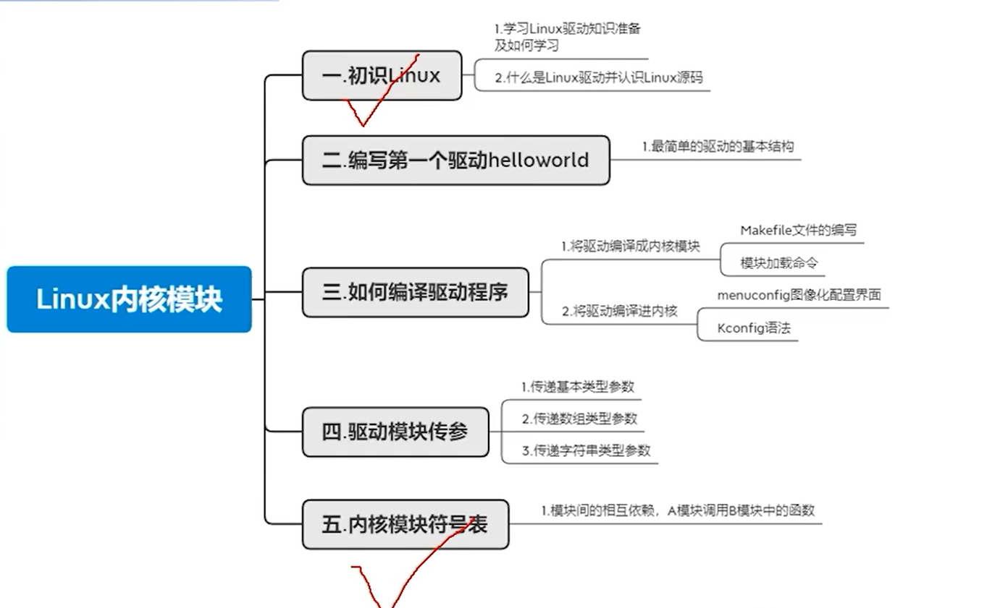
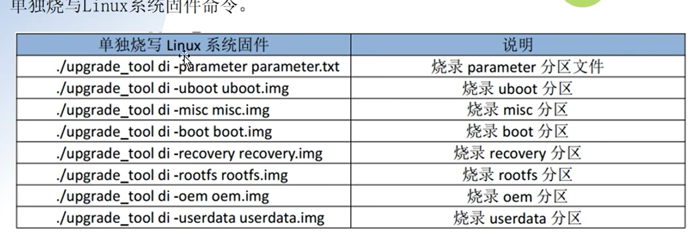
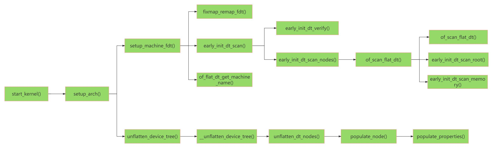
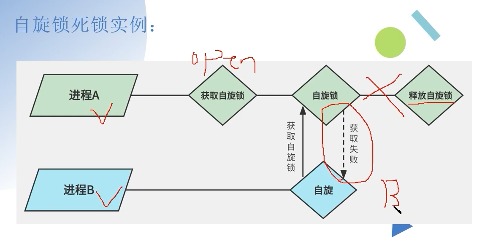

#### 打包镜像

​	./build.sh firmware

​	./build.sh updateimg 即可

​	lsusb 命令，查看是否挂载

​	ctags 工具查看 linux 源码


#### 烧写命令

​	./upgrade_tool uf update.img 烧写命令

​	./upgrade_tool pl 

​	./upgrade_tool ef update 擦除flash

​	./upgrade_tool lf update 格式化 flash 

#### 图形化配置界面操作

 	1. 把驱动编译成模块
 	2. 把驱动编译到内核里面，用*来表示
 	3. 不编译驱动
 	4. () 用来配置参数的。比如交叉编译的路径的。
 	5. make menuconfig 图形化操作
 	 	1. Kconfig(饭店菜单) 图形化配置界面的源文件。
 	 	2.  .config(我们使用菜单点完菜品) 
 	 	3. Makefile (菜的做法)
 	6. .config 是从默认配置文件复制来的， 添加新的模块
 	7. 读写权限 include/linux/stat.h incliude/uapi/linux/stat.h 

##### 模型传参 ： 

​	加载驱动时候，传参数 insmod param.ko a = 1 array=1,2,3 str=nihao

​	model_param(a, int S_IRUGO); 参数

​	model_param_array(array, int, &array_size, S_IRUGO); 数组

​	model_param_string(); 字符串

修改 Makefile 文件 

##### 内核符号表导出

​	Module.symvers 符号表

​	B 依赖 A 模块，先编译 A 再编译 B , 卸载时候，先卸载 B 再卸载 A 

​	使用的时候，需要把 A 目录中的 Modele.symvers 符号表，复制到 B 目录中 

##### 使用Makefile 的宏定义

前缀加上 -D    

KBUILD_CFLAGS_MODULE  := -DMODULE 

KBUILD_CFLAGS_MODULE  := -DMODULE=3

##### Insmod命令

​	busybox 

​	 file cxd2880-spi.ko  查看 ko 信息 包含 版本信息

​	dump_stack()  函数打印调用关系

​	内部自己实现一个 insmod 命令效果。

##### 将驱动编译到内核

```
目录中新增 /kernel/drivers/char/ 对应文件目录
添加对应 Kconfig 配置选项，并且验证 make menuconfig 中成功显示。
```


##### 向系统中添加一个系统调用

​	/home/yxw/myproject/rk356x_linux5.1/kernel/include/uapi/asm-generic/unistd.h 目录中配置  

​	#define __NR_helloworld 435

rk3568 手册名称：Rockchip RK3568 TRM P

#### 设备树

名称：

​	编译器 DTC 

​	dtc -I dts -O dtb -o xx.dtb  xxx.dts

​	反编译设备树

​	dtc -I dtb -O dts -o xxx.dts xxx.dtb 

​	插件：DeviceTree

#clock-cells = <1> 时钟信号

compatible 驱动关联文件 在 Kernel/drivers 目录下   

interrupt-controller 标签是中断控制器

interrupt-parent  = <&gpio> 引用那个标签 

 Interrupt-extended = <&gic1 9 1>,<&gic2 10 > 多组中断控制器

```
有级联的语法。
时钟树：时钟定义，分为生产者，消费者
	clock-cells 时钟输出路数。
	clock-output-name 输出时钟名称
	clock-frequency 时钟大小
生产者
	assigned-clocks<&pmucrn>
	assigned-clooc-parents:设置时钟的父时钟
消费者
	clocks:时钟源
	clock-names: 名称
```


###### CPU

cpus 

节点还可以包含其他用于描述处理器拓扑关系的节点， 以提供更详细的处理器拓扑信息。 这些节点可以帮助操作系统和软件了解处理器之间的连接关系、组织结构和特性。

cpu-map 节点： 描述处理器的映射关系， 通常在多核处理器系统中使用。 集群节点

socket节点： 描述多处理器系统中的物理插槽或芯片组。

cluster 节点： 描述处理器集群， 即将多个处理器组织在一起形成的逻辑组。

core 节点： 描述处理器核心， 即一个物理处理器内的独立执行单元。

thread 节点： 描述处理器线程， 即一个物理处理器核心内的线程。

###### GPIO

```
gpio => pinctr 映射关系

pinctrl 引脚设置复用关系。Pinmux功能(管教复用)

​	客户端：固定

​	服务端：平台差异

gpio-controller 表示 GIPO 控制器

#gpio-cells = <2> 2个参数代表gpio 必须有这个参数

gpio-ranges = <&foo 0 20 10>,<&bar 10 50 20> gpio 映射关系

pinctrl-0 做的关联的属性的名称，名称要一致对应。

文档目录 kernel/Documentation/devicetree/bingings/pinctrl
```

##### dtb 展开成 device_node 实验  

```
uboot 启动将 dtb 文件加载到内存中，将dtb 文件展开成内核可以识别的文件。
在 include/linux/of.h 文件中
struct device_node {
	const char *name; 
	phandle phandle;
	const char *full_name;
	struct fwnode_handle fwnode;

	struct	property *properties; // 指向该设备节点下一个属性。
	struct	property *deadprops;	/* removed properties */
	struct	device_node *parent;
	struct	device_node *child;
	struct	device_node *sibling;
#if defined(CONFIG_OF_KOBJ)
	struct	kobject kobj;
#endif
	unsigned long _flags;
	void	*data;
#if defined(CONFIG_SPARC)
	unsigned int unique_id;
	struct of_irq_controller *irq_trans;
#endif
};
在 init/main.c start_kernel(void) 开始函数,入口函数
只关心 dtb 展开的有关函数
找到 setup_arch(&command_line) 路径 arch/arm64/kernel/setup.c
setup.c 路径 kernel/arch/arm64/kernel/setup.c
memblock_reserve(dt_phys, size); 保存dtb 内存地址
unflatten_device_tree(); 展开 dtb 文件成 设备树。
最后转换成 platform_device() 
```



查看转换成的 /sys/bus/platform/devices 节点


查看开发板使用的哪个设备树配置文件 

​	编译内核中，打印信息里面有 TARGET_KERNEL_DTS = 

ranges 把子地址物理空间地址 映射父地址物理空间起始地址。长度。

​	有参数：地址映射关系。

​	无参数：只能用父节点访问


#### 字符设备

设备号宏定义

```
路径 include/linux/kdev_t.h 
注册设备号 路径：include/linux/fs.h 中 动态分配设备号，静态分配设备号，注销分配设备号
查看设备号 cat /proc/devices 
创建设备节点： mknod /dev/test c 236 0 => 手动创建   mdev => 自动创建
字符设备是桥梁
udev 设备节点创建与删除，是一个用户程序, mdev 是简化版本 cdev , 杂项设备使用的是 miscdevice 结构体
class_create 在 incluce/linux/device.h 中
copy_to_user从内核空间拷贝到用户空间 copy_from_user 从用户空间拷贝到内核空间
错误码，linux 地址落在指定的地址，就是返回的错误失败的错误标识0xffff ffff ffff f000~0xffff ffff ffff ffff，
使用 IS_ERR函数检查返回值。 定义在 <linux/errno.h>
goto 语句，是先进后出的顺序执行的。
```


查询io 命令：io -r -4 oxfdc200c => 0001 

#### 并行与并发

```
同步与互斥来解决并行与并发。
原子操作：操作期间，不被打乱。

自旋锁：原地等待的 spinlock_t 
	进入自旋锁，如果有休眠的情况，则放弃了CPU的使用权，CPU的抢占被禁止了。（等于链表，丢了头尾指针，自己的理解）运行结束后，要释放自旋锁。短时间内加锁。可以在中断中使用。
	
信号量：休眠的方式。有消息的时候，唤醒进程。 semaphore 结构体表示，会导致休眠，用在长时间的加锁场景中。中断中不能使用信号量。信号量可以指定大于0的值。

互斥锁：同一个资源同一个时间只有一个访问者在进行访问。其他的访问者访问结束后才可以访问这个资源。 mutex 结构体，会导致休眠，所以中断中不能使用互斥锁。不允许递归上锁和解锁。性能比信号量效率高一些。信号量的值为1.

```

​	自旋锁的使用步骤
​		1 在访问 <font color="red">临界资源</font> 的时候先申请自旋锁
​		2 获取到自旋锁以后就进入 <font color="red">临界区</font>，获取不到自旋锁就“原地等待”
​		3 退出临界区的时候要释放自旋锁。

​	自旋锁的注意事项

​		1 由于自旋锁会“原地等待”，因为原地等待，会继续占用CPU，会消耗CPU资源。所以锁的时间不能太长。临界区的代码不能太多

​		2 <font color="red">在自旋锁保护的临界区里面不能调用可能会导致线程休眠的函数，否则可能发生死锁</font>。

​		3 自旋锁一般是在多核的 SOC 上。




​		

#### IO模型

```
同步IO
	阻塞IO： 一直在这里等着。 scanf() 函数
	非阻塞IO：不等值，轮询查询调用结果。（等一个鱼竿钓鱼）
	IO多路复用：select 文件描述符的集合。监听。（钓鱼发烧友，挨个查看鱼竿上鱼时候）
	信号驱动IO: 不阻塞，使用信号的方式*（给鱼竿装上一个铃铛，有铃铛响的时候）	
异步IO
	数据没有准备好的时候，返回，数据准备好后，数据拷贝到用户空间。返回信号处理函数（找了一个中间人。用户空间有缓存区）
	IO多路复用：一个监视多个文件描述符集合。
		poll和select基本一样，都可以监听多个文件描述符，通过轮询文件描述符来获取已准备好的文件描述符。
		epoll是将主动轮询变成了被动通知，当事件发生时，被动的接收通知。
	
等待队列
	内核实现阻塞和唤醒的内核机制。 一循环链表表位基础结构。使用 wait_queue_head_t 来表示。
Linux 定时器
	在 timer_list 结构体中， expires 为计时终点的时间，单位是节拍数。基于未来时间的定时器。对应的宏，关于CPU 时间的精度。HZ 
综合应用：
	注册字符设备，秒定时器功能，（注册字符，全局变量保护，定时器）
```

poll

​	应用层：poll();

​	驱动层：poll_wait(); 不阻塞。

信号驱动

​	注册信号函数  实现 file_opperations 中 的 fasync 函数。

打印信息：

​	dmesg 命令 显示打印信息。


#### 显示驱动

使用的是 VOP2.0 架构

专有名称：

​	Plane: 图层。

​	Encoder: 把图像信号转换成显示器需要的信号

​	Connector ： 硬件接入

​	Panel: 一般指的是显示屏

​	GEM： 对DRM使用显存管理


HSYNC 是一行的数据，VSYNC 是一帧的数据。

转接板，信号转发，代理模式，信号转发。

DE和HV模式，同步模式

相关配置

​	vsync-len, hsync-len vback-porch

##### LVDS

	应用层: 摄像头，显示屏幕
	协议层: DSI CSI
	物理层：PHY

​	差分信号，6位 4对差分信号线。8位 5对差分信号线，

​	单路1路LVDS，双路：2路LVDS （4通道，5通道，6通道）

   线序要对接上，不然会烧屏幕。DSI 处理协议 PHY 是物理层的。MIPI手册 DSI specification

   HS High-Speed 模式 差分信号
   LP: low-power模式 控制配置，单端信号。命令 MIPI PHY 手册
   Line 模式，6种模式， 2+4种模式

   帧有缓存
   帧无缓存：视频高速模式，单向，命令使用LP 模式，双向

   视频传输模式 三种模式 8.11 小结
		有起始标志
		无起始标志
		传输RGB帧时候，可以使用低功耗。
   命令传输模式 
		带有帧buffer 的场景，屏幕撕裂问题，读和写速度不一致情况。
		TE 信号调整，读的快，写的慢。速度不一致，屏幕撕裂
	虚拟通道功能：主机处理器处理与多个设备之间通信，最多4个通道。
	桥接设备链接：可以创建多个显示模块或其他设备独立链接
	长包和短包：8.2小结
		短包：用于命令模式

	dsi, flags = 视频模式
	dsi,format = <MIPI_DIS_RGB888> 像素点长度，不是接口RGB888
	dis,lanes = <4> 差分信号数量
	panel-init-sequence = 初始化序列化配置（厂商提供，知识产权原因，不会告诉你具体的含义）
	panel-exit-sequence = 退出配置

##### HDMI
	手册：HDMI1.4.PDF
	有5种接口类型
	TMDS (最小化差分传输信号) 
	发送端对数据进行编码 和 并/串转换，接收端接收串行信号，并进行解码 和 串/并转换
	视频周期（有效视频行有效数据，有效像素，有前保护边界），
	视频岛周期（数据包，音频或者辅助数据，有前保护边界，后保护边界），
	控制周期（控制）
	前导码：每个视频线有一个前导码，下一个周期，是视频岛周期，还是视频周期。


##### EDID:

	外部显示设备标识数据，处于 PC CPU 显示器之间的传话筒。
	
	显示器相关参数：分辨率，时序信息，厂商信息，产品ID，生产信息等等。
	HDMI的EDID: 一般256字节，两个块，块0和块1，块0是必须的，块1不是必须的。


HDMI带宽计算

```htm
https://tomverbeure.github.io/video_timings_calculator  像素时钟计算器
```


