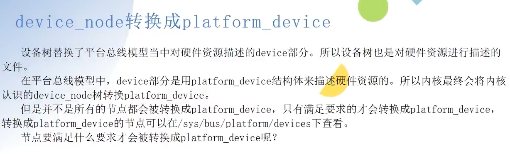
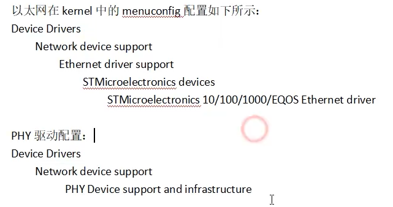
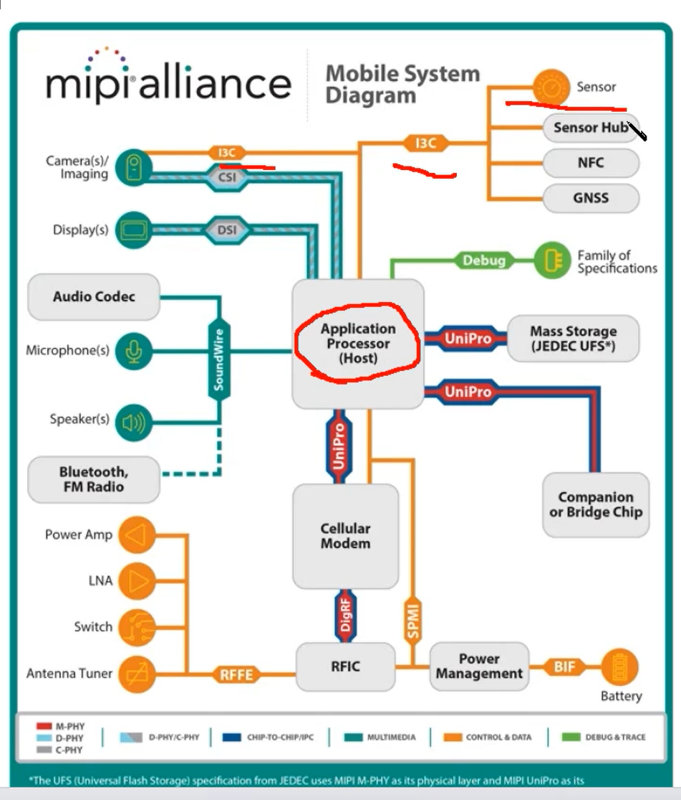
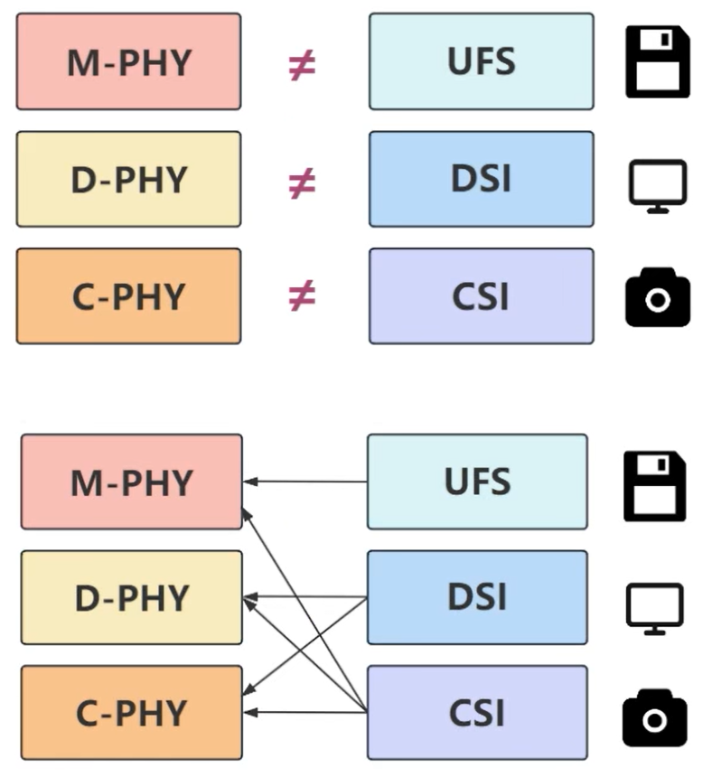
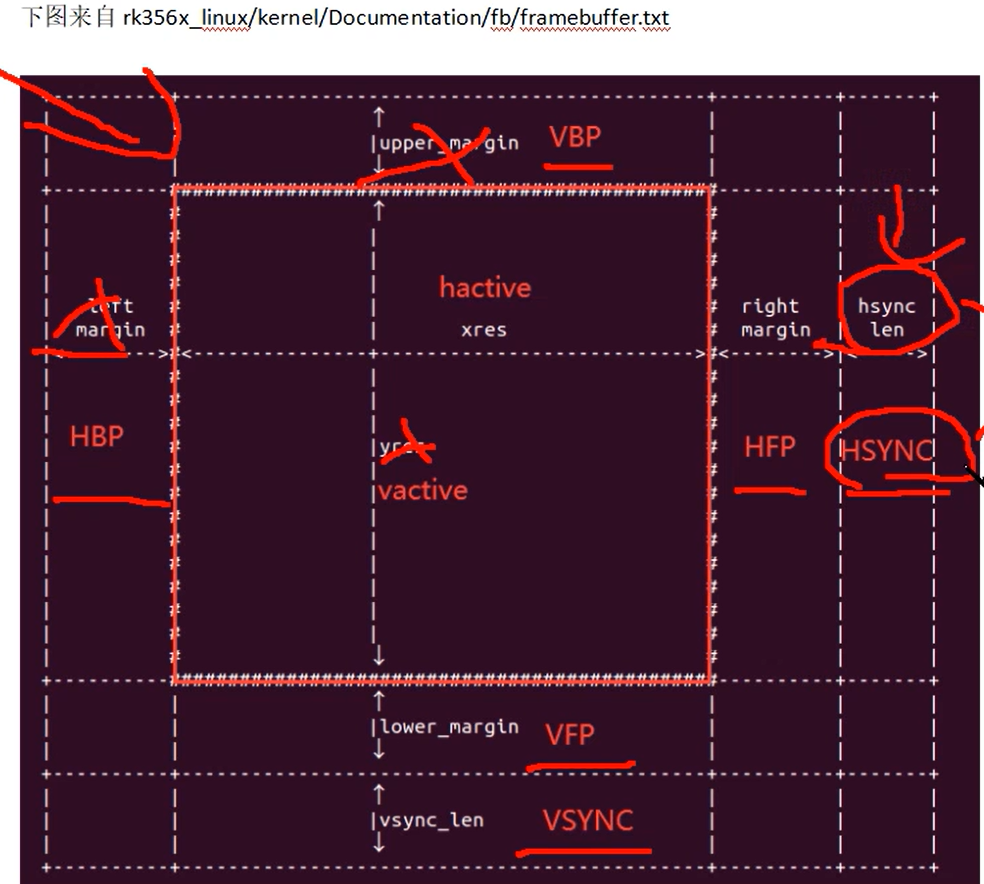

#### 打包镜像

​	./build.sh firmware

​	./build.sh updateimg 即可

​	lsusb 命令，查看是否挂载

​	ctags 工具查看 linux 源码


make ARCH=$RK_ARCH $RK_KERNEL_DEFCONFIG $RK_KERNEL_DEFCONFIG_FRAGMENT


#### 烧写命令

​	./upgrade_tool uf update.img 烧写命令

​	./upgrade_tool pl 

​	./upgrade_tool ef update 擦除flash

​	./upgrade_tool lf update 格式化 flash 

#### 图形化配置界面操作

 	1. 把驱动编译成模块
 	2. 把驱动编译到内核里面，用*来表示
 	3. 不编译驱动
 	4. () 用来配置参数的。比如交叉编译的路径的。
 	5. make menuconfig 图形化操作
 	 	1. Kconfig(饭店菜单) 图形化配置界面的源文件。
 	 	2.  .config(我们使用菜单点完菜品) 
 	 	3. Makefile (菜的做法)
 	6. .config 是从默认配置文件复制来的， 添加新的模块
 	7. 读写权限 include/linux/stat.h incliude/uapi/linux/stat.h 

##### 模型传参 ： 

​	加载驱动时候，传参数 insmod param.ko a = 1 array=1,2,3 str=nihao

​	model_param(a, int S_IRUGO); 参数

​	model_param_array(array, int, &array_size, S_IRUGO); 数组

​	model_param_string(); 字符串

修改 Makefile 文件 

##### 内核符号表导出

​	Module.symvers 符号表

​	B 依赖 A 模块，先编译 A 再编译 B , 卸载时候，先卸载 B 再卸载 A 

​	使用的时候，需要把 A 目录中的 Modele.symvers 符号表，复制到 B 目录中 

##### 使用Makefile 的宏定义

前缀加上 -D    

KBUILD_CFLAGS_MODULE  := -DMODULE 

KBUILD_CFLAGS_MODULE  := -DMODULE=3

##### Insmod命令

​	busybox 

​	 file cxd2880-spi.ko  查看 ko 信息 包含 版本信息

​	dump_stack()  函数打印调用关系

​	内部自己实现一个 insmod 命令效果。

##### 将驱动编译到内核

```
目录中新增 /kernel/drivers/char/ 对应文件目录
添加对应 Kconfig 配置选项，并且验证 make menuconfig 中成功显示。
```


##### 向系统中添加一个系统调用

​	/home/yxw/myproject/rk356x_linux5.1/kernel/include/uapi/asm-generic/unistd.h 目录中配置  

​	#define __NR_helloworld 435

rk3568 手册名称：Rockchip RK3568 TRM P

#### 设备树

```
DT: 设备树
FDT: 开放设备树
dts: 设备树源码
dtsi: 设备树通用源码
dtb: 编译设备树源码得到的文件
dtc: 设备树编译器
configfs 虚拟文件系统，Linux 内核和用户空间进行数据交换
dts => dtc => dtb => device_node => platform_device
匹配：name < id_table < of_match_table
在 probe 函数中，查找设备节点：of_find_node_by_name() 返回值：devece_node* 
	通过节点路径查找节点：of_find_node_by_path("/topeet/myled")
	通过devece_type和compatible属性来查找节点 of_find_compatible_node(NULL, NULL, "my_devicetree");
	of 获取属性
	从指定属性中获取指定标号的 u32类型的数据值。of_property_read_u32_index()
```


名称：

​	编译器 DTC 

​	dtc -I dts -O dtb -o xx.dtb  xxx.dts

​	反编译设备树

​	dtc -I dtb -O dts -o xxx.dts xxx.dtb 

​	插件：DeviceTree

​	make dtbs  : 有报错风险。

#clock-cells = <1> 时钟信号

compatible 驱动关联文件 在 Kernel/drivers 目录下   

interrupt-controller 标签是中断控制器

interrupt-parent  = <&gpio> 引用那个标签 

 Interrupt-extended = <&gic1 9 1>,<&gic2 10 > 多组中断控制器

```
有级联的语法。
时钟树：时钟定义，分为生产者，消费者
	clock-cells 时钟输出路数。
	clock-output-name 输出时钟名称
	clock-frequency 时钟大小
生产者
	assigned-clocks<&pmucrn>
	assigned-clooc-parents:设置时钟的父时钟
消费者
	clocks:时钟源
	clock-names: 名称
	添加测试
```


###### CPU

cpus 

节点还可以包含其他用于描述处理器拓扑关系的节点， 以提供更详细的处理器拓扑信息。 这些节点可以帮助操作系统和软件了解处理器之间的连接关系、组织结构和特性。

cpu-map 节点： 描述处理器的映射关系， 通常在多核处理器系统中使用。 集群节点

socket节点： 描述多处理器系统中的物理插槽或芯片组。

cluster 节点： 描述处理器集群， 即将多个处理器组织在一起形成的逻辑组。

core 节点： 描述处理器核心， 即一个物理处理器内的独立执行单元。

thread 节点： 描述处理器线程， 即一个物理处理器核心内的线程。

###### GPIO

```
gpio => pinctr 映射关系

pinctrl 引脚设置复用关系。Pinmux功能(管教复用)

​	客户端：固定

​	服务端：平台差异

gpio-controller 表示 GIPO 控制器

#gpio-cells = <2> 2个参数代表gpio 必须有这个参数

gpio-ranges = <&foo 0 20 10>,<&bar 10 50 20> gpio 映射关系

pinctrl-0 做的关联的属性的名称，名称要一致对应。

文档目录 kernel/Documentation/devicetree/bingings/pinctrl
```

##### dtb 展开成 device_node 实验  

```
uboot 启动将 dtb 文件加载到内存中，将dtb 文件展开成内核可以识别的文件。
在 include/linux/of.h 文件中
struct device_node {
	const char *name; 
	phandle phandle;
	const char *full_name;
	struct fwnode_handle fwnode;

	struct	property *properties; // 指向该设备节点下一个属性。
	struct	property *deadprops;	/* removed properties */
	struct	device_node *parent;
	struct	device_node *child;
	struct	device_node *sibling;
#if defined(CONFIG_OF_KOBJ)
	struct	kobject kobj;
#endif
	unsigned long _flags;
	void	*data;
#if defined(CONFIG_SPARC)
	unsigned int unique_id;
	struct of_irq_controller *irq_trans;
#endif
};
在 init/main.c start_kernel(void) 开始函数,入口函数
只关心 dtb 展开的有关函数
找到 setup_arch(&command_line) 路径 arch/arm64/kernel/setup.c
setup.c 路径 kernel/arch/arm64/kernel/setup.c
memblock_reserve(dt_phys, size); 保存dtb 内存地址
unflatten_device_tree(); 展开 dtb 文件成 设备树。
最后转换成 platform_device() 
```


查看转换成的 /sys/bus/platform/devices 节点



查看开发板使用的哪个设备树配置文件 

​	编译内核中，打印信息里面有 TARGET_KERNEL_DTS = 

ranges 把子地址物理空间地址 映射父地址物理空间起始地址。长度。

​	有参数：地址映射关系。

​	无参数：只能用父节点访问


示例：


#### 字符设备

设备号宏定义

```
路径 include/linux/kdev_t.h 
注册设备号 路径：include/linux/fs.h 中 动态分配设备号，静态分配设备号，注销分配设备号
查看设备号 cat /proc/devices 
创建设备节点： mknod /dev/test c 236 0 => 手动创建   mdev => 自动创建
字符设备是桥梁
udev 设备节点创建与删除，是一个用户程序, mdev 是简化版本 cdev , 杂项设备使用的是 miscdevice 结构体
class_create 在 incluce/linux/device.h 中
copy_to_user从内核空间拷贝到用户空间 copy_from_user 从用户空间拷贝到内核空间
错误码，linux 地址落在指定的地址，就是返回的错误失败的错误标识0xffff ffff ffff f000~0xffff ffff ffff ffff，
使用 IS_ERR函数检查返回值。 定义在 <linux/errno.h>
goto 语句，是先进后出的顺序执行的。
```


查询io 命令：io -r -4 oxfdc200c => 0001 

#### 并行与并发

```
同步与互斥来解决并行与并发。
原子操作：操作期间，不被打乱。

自旋锁：原地等待的 spinlock_t 
	进入自旋锁，如果有休眠的情况，则放弃了CPU的使用权，CPU的抢占被禁止了。（等于链表，丢了头尾指针，自己的理解）运行结束后，要释放自旋锁。短时间内加锁。可以在中断中使用。
	
信号量：休眠的方式。有消息的时候，唤醒进程。 semaphore 结构体表示，会导致休眠，用在长时间的加锁场景中。中断中不能使用信号量。信号量可以指定大于0的值。

互斥锁：同一个资源同一个时间只有一个访问者在进行访问。其他的访问者访问结束后才可以访问这个资源。 mutex 结构体，会导致休眠，所以中断中不能使用互斥锁。不允许递归上锁和解锁。性能比信号量效率高一些。信号量的值为1.

```

​	自旋锁的使用步骤
​		1 在访问 <font color="red">临界资源</font> 的时候先申请自旋锁
​		2 获取到自旋锁以后就进入 <font color="red">临界区</font>，获取不到自旋锁就“原地等待”
​		3 退出临界区的时候要释放自旋锁。

​	自旋锁的注意事项

​		1 由于自旋锁会“原地等待”，因为原地等待，会继续占用CPU，会消耗CPU资源。所以锁的时间不能太长。临界区的代码不能太多

​		2 <font color="red">在自旋锁保护的临界区里面不能调用可能会导致线程休眠的函数，否则可能发生死锁</font>。

​		3 自旋锁一般是在多核的 SOC 上。


​		

#### IO模型

```
同步IO
	阻塞IO： 一直在这里等着。 scanf() 函数
	非阻塞IO：不等值，轮询查询调用结果。（等一个鱼竿钓鱼）
	IO多路复用：select 文件描述符的集合。监听。（钓鱼发烧友，挨个查看鱼竿上鱼时候）
	信号驱动IO: 不阻塞，使用信号的方式*（给鱼竿装上一个铃铛，有铃铛响的时候）	
异步IO
	数据没有准备好的时候，返回，数据准备好后，数据拷贝到用户空间。返回信号处理函数（找了一个中间人。用户空间有缓存区）
	IO多路复用：一个监视多个文件描述符集合。
		poll和select基本一样，都可以监听多个文件描述符，通过轮询文件描述符来获取已准备好的文件描述符。
		epoll是将主动轮询变成了被动通知，当事件发生时，被动的接收通知。
	
等待队列
	内核实现阻塞和唤醒的内核机制。 一循环链表表位基础结构。使用 wait_queue_head_t 来表示。
Linux 定时器
	在 timer_list 结构体中， expires 为计时终点的时间，单位是节拍数。基于未来时间的定时器。对应的宏，关于CPU 时间的精度。HZ 
综合应用：
	注册字符设备，秒定时器功能，（注册字符，全局变量保护，定时器）
linux 打印等级 cat /proc/sys/kernel/printk 通过等级来控制日志的打印输出。
lseek() 函数实现。对数据流的操作.
ioctl命令:应用指令,驱动实现. cammand 设备类型 8bit 序列号 8bit 方向 2bit 数据尺寸  113/14bit 
	对位的合成(定义)或者拆解(驱动判断)的宏定义.  eg #define CMD_TEST2 _IOR('L',2,int)
	可以传递地址。指向的是结构体
code 函数 
ar rcs libtime.a time*.o  封装成一个库的语法
编译 加载库的命令
	gcc app.c -L./ -ltime 
	
api 文档编写
	驱动文件所在位置 驱动架构 设备树配置 内核配置 驱动编译 API接口介绍 应用编写 demo 
优化 if(likely(value))  == if (value)   if(unlikely(value))  == if (value)
打印函数
	dump_stack()  WARN(condition, fmt...) 或 WARN_ON(condition) 条件判断
	BUG 和 BUG_ON(condition) 条件判断 触发段错粗。 oops 致命错误。
	panic(fmt) 会造成系统死机并输出打印 最严重
```

poll

​	应用层：poll();

​	驱动层：poll_wait(); 不阻塞。

信号驱动

​	注册信号函数  实现 file_opperations 中 的 fasync 函数。

打印信息：

​	dmesg 命令 显示打印信息。

修改Linux 内核打印等级

	1. 修改 make menuconfig 图形化配置界面
	1. 调用 printK(KERN_EMERG "hello\n");
	1. echo  0 4 1 7 > /proc/sys/kernel/printk 设置系统日志打印级别


#### 中断

```
中断信号，中断响应，中断处理。保护现场，恢复现场，中断返回，中断屏蔽
中断上下文：上文：处理消息，下文：处理过程。 _tasklet 
GIC 名词
仲裁器：控制中断，设置中断。
IRQ
	SGI（中断号 0-15） PPI （私有中断号 16-31） SPI （共享，外设中断号 32-1020）LPI（不支持 GIC-V1, GIC-V2）
	IP:GIC600 GIC500 GIC400 
	软件中断，硬件中断
申请中断
	request_irq() 中断号，中断标志，中断名称，申请中断
		interrupt.h struct irqaction *action
	gpio_to_irq() 获取irq
	free_irq() 释放 irq
tasklet : 特殊的软中断。不能调用任何休眠函数。tasklet_init
软中断：自定义添加 open_softirq() 初始化 raise_softirq() 开始一个软中断  raise_softirq_irqoff() 关闭
导出到内核符号表 EXPORT_SYMBOL(raise_softirq) 函数

工作队列：可以调用休眠事情。共享工作队列，自定义工作队列。
	struct work_struct include/linux/workqueue.h
	初始化 DECLARE_WORK() 静态初始化 INIT_WORK() 动态初始化 关系是上下文多对一的关系，当前调度还未执行结束，则再次调用会无效。
	自定义工作队列 create_workqueue() 每个cpu 创建一个队列  调度工作队列 queue_work_on() 
	延迟工作： struct delayed_work 
	CMWQ => 并发管理 alloc_workqueu()
    中断线程化：中断下半部分处理。
```

#### 平台总线

```
原则：先分离，后搭档。通过字符串比较，将name 一致的进行工作。
device.c 设备，硬件相关，中断号，GPIO方向配置
driver.c 控制，相关
注册设备
	struct platform_device include/linux/platform_device.h 中
	platform_device_register() 注册 struct resource	*resource; 重点
注销设备
	platform_device_unregister()
驱动
	probe(匹配成功后自动执行函数) remove(卸载自动执行的函数) shutdown
结合实验：控制led灯的实验。
```


#### 设备模型

```
总线(bus_type)，设备(device)，驱动(device_driver)，类(class)。
	include/linux/device.h 文件中
	/sys/ （bus class devices） 目录下 父目录，kset 
		无父目录 无 kset
		无父目录 有 kset
		有父目录 无 kset
		有父目录 有 kset 
	总线和类的引用，都是 drvices目录下中的软连接
引用计数器（kref） 当减掉0的时候，自动调用释放驱动的函数。
```


<<<<<<< HEAD
#### 热插拔

```
udev:x86使用 netlink 机制 uevent
mdev:简化版 udev
udevadm 命令：监听是否有 uevent 事件。 udevadm monitor & 
netlink : 实现内核和用户空间的数据交互 基于 socket 机制。
	在用户空间，接收socket 消息。
配置 ueventhelp 
```

=======
#### GPIO子系统

```
make menuconfig 配置打开 Kernel hacking --> Compile-time checks and compiler options --> * Debug Filesystem
通过 debugs 查看 gpio 如果没有 debugs 则 mount -t debugfs none /sys/kernel/debug
cat /sys/kernel/debug/gpio 

进入到 /sys/kernel/debug/pinctrl/pinctrl-rockchip-pinctrl/
	cat pins cat pinmux-pins cat groups cat pinconf-pins cat pinmux-functions(查看复用).....
```


输入子系统

```
__set_bit() 设备驱动设置
```


#### GMAC

```
RG45(变压器) => PHY => MAC => MCU
PHY => MAC(RMII RGMII) RGMII 时钟：10M/100M/100M 分别是 2.5M/25M/125M 时钟 两层连接 数据传输
MDIO（MAC => PHY控制和指令协议） 管理与控制 数据线和时钟线。同步串行半双工模式 
PHY地址，决定 MDIO 连接哪个 PHY芯片 （ RTL8211FD 型号）
MDI(变压器 => PHY)协议 差分信号。
查看命令：/sys/bus/mdio_bus/devices/stmmac-0:00
phy: kernel/drivers/net/phy
GMAC: kernel/drivers/net/ethernet/stmicro/stmmac/*
网络源码：15-16节视频
```




STMicroelectronics Multi-Gigaabit Ethernet driver

Rockchip Ethernet PHYs

网络

基本函数

​	大小端转换函数，地址转换函数（ip转int, int转ip）


#### USB

```
版本：2.0，（1.0 1.1 2.0） 3.2() 4
USB3.0HOST DWC3 xHCI 通过电流RC时间判断是否插入。
	8根信号线
USB2.0 EHCI（高速模式） OHCI ，通过电流大于625mV时候，就断定是否拔出
	DP DM 信号
USBOTG : 功能设备（即插即用）
	判断主从身份切换：（主机需要使用供电电路 ID引脚：判断是否需要供电）
RK3568 支持4路 USB 
识别设备（设备描述符）
	lsusb -v 设备信息,
	设备描述符，配置描述符，接口描述符，端点描述符，一个USB设备有1个设备描述符，一个USB设备有1个或多个配置描述符，一个USB配置
	有1个或多个接口描述符，一个USB接口有0个或者多个端点描述符。
四种传输方式：控制模式（发送命令），实时模式（数据量大，实时要求高，视频通信），中断模式（数据量小，例如鼠标），批量模式（传送大文件）。
数据格式：数据域：同步域，地址域，端点域，桢号域，标识域，校验域，组合成包。
		数据包：令牌包，数据包，握手包，特殊包。组合成事务。
		数据事务：有令牌包，数据包，握手包组成。事务是最基本的单位。
USB: 链接过程,数据包枚举，数据包start data status 
libusb 库 交叉编译usb 
	./configure ---build=x86_64-linux --host=arm-linux --prefix=~ CC=/home/.... CXX=/home/.....
	libusb 中 键盘检测demo.
USB 驱动
	HOST： USB设备驱动， USB 核心层， USB主机控制驱动.
	Device: Gadget Function 驱动，Gadet Function API， UDC 驱动。
```


#### 显示驱动

```
VP(显示通路)
	
```


##### RGB

​	信号线：

​	 R[7:0] 8根红色数据线G[7:0] 8根绿色信号数据线 B[7:0] 8根蓝色信号数据线 DE 数据使能 VSYNC 垂直同步信号 HSYN 水平同步信号 PCLK 像素时钟信号

​	DE和HV模式

​		DE模式用到DE信号线，而HV模式不用使用DE信号线（使用 HSYNC和VSYNC 信号线来确定）


##### MIPI

```
CSI:摄像头串行接口
DSI:显示串行接口,数据经过封包处理。
BP:基带
PHY:提供物理层路定义
	D-PHY,C-PHY,M-PHY,A-PHY
	D-PHY 中的D 指的是 罗马数字 500 (500Mbits/s) C: 100 M:1000
	支持D-PHY 1.2版本
	单模式
	双模式：两路DSI 接一个屏幕
	4组line 4组差分信号
	电器属性相关。
DBI:内存单元少，主控传输命令和数据，有设有缓存。
DPI:显示像素接口，液晶模组中，没有显存
DCS：显示控制命令。读取、写寄存器。读取内存和写入内存
SDF：移动设备主机处理器与显示外设之间传输立体图像数据的方法。
```






使用的是 VOP2.0 架构

专有名称：

​	Plane: 图层。

​	Encoder: 把图像信号转换成显示器需要的信号

​	Connector ： 硬件接入

​	Panel: 一般指的是显示屏

​	GEM： 对DRM使用显存管理



HSYNC 是一行的数据，VSYNC 是一帧的数据。

转接板，信号转发，代理模式，信号转发。

DE和HV模式，同步模式

相关配置

​	vsync-len, hsync-len vback-porch


	应用层: 摄像头，显示屏幕
	协议层: DSI CSI
	物理层：PHY

​	差分信号，6位 4对差分信号线。8位 5对差分信号线，

​	单路1路LVDS，双路：2路LVDS （4通道，5通道，6通道）

   线序要对接上，不然会烧屏幕。DSI 处理协议 PHY 是物理层的。MIPI手册 DSI specification

   HS High-Speed 模式 差分信号 两种状态 高速模式
   LP: low-power模式 控制配置，单端信号。命令 MIPI PHY 手册 四种状态， 控制模式, 逃逸模式

​	LP-TX LP-RX HS-TX HS-RX LP-CD(检查竞争情况)

   在物理层：Line 模式，6种模式， 2+4种模式

   帧有缓存
   帧无缓存：视频高速模式，单向，命令使用LP 模式，双向

   视频传输模式 三种模式 8.11 小结
		有起始标志
		无起始标志
		传输RGB帧时候，可以使用低功耗。
   命令传输模式 
		带有帧buffer 的场景，屏幕撕裂问题，读和写速度不一致情况。
		TE 信号调整，读的快，写的慢。速度不一致，屏幕撕裂
	虚拟通道功能：主机处理器处理与多个设备之间通信，最多4个通道。
	桥接设备链接：可以创建多个显示模块或其他设备独立链接
	长包和短包：8.2小结
		短包：用于命令模式

	dsi, flags = 视频模式
	dsi,format = <MIPI_DIS_RGB888> 像素点长度，不是接口RGB888
	dis,lanes = <4> 差分信号数量
	panel-init-sequence = 初始化序列化配置（厂商提供，知识产权原因，不会告诉你具体的含义）
	panel-exit-sequence = 退出配置
	remote-endpoint = <&vp2_out_rgb> 关联语法


##### LVDS

```
低电压差分信号：低功耗，低串扰，低抖动.
医学显示器,笔记本电脑显示器.
单路6位: 4对差分信号线,3对数据线,1对时钟线 18位
单路8位: 5对差分信号线,4对数据线,1对时钟线 24位
双路6位 8对差分信号线,6对数据线,2对时钟线   18位 偶路 18位  总36位
双路8位奇路  10对差分信号线,8对数据线,2对时钟线 24位 偶路 24位 总48位
```


##### HDMI

	手册：HDMI1.4.PDF
	有5种接口类型
	TMDS (最小化差分传输信号) 
	发送端对数据进行编码 和 并/串转换，接收端接收串行信号，并进行解码 和 串/并转换
	视频周期（有效视频行有效数据，有效像素，有前保护边界），
	视频岛周期（数据包，音频或者辅助数据，有前保护边界，后保护边界），
	控制周期（控制）
	前导码：每个视频线有一个前导码，下一个周期，是视频岛周期，还是视频周期。


##### EDID:

	外部显示设备标识数据，处于 PC CPU 显示器之间的传话筒。
	
	显示器相关参数：分辨率，时序信息，厂商信息，产品ID，生产信息等等。
	HDMI的EDID: 一般256字节，两个块，块0和块1，块0是必须的，块1不是必须的。


HDMI带宽计算

```htm
https://tomverbeure.github.io/video_timings_calculator  像素时钟计算器
```


