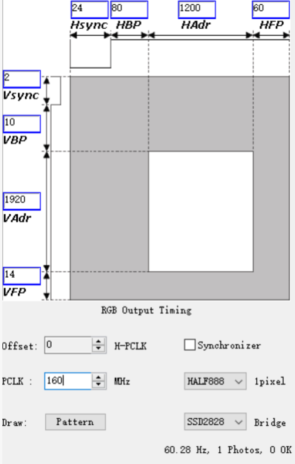

#### USB 设备

```
vcc5v0_usb: vcc5v0-usb {
		compatible = "regulator-fixed";
		regulator-name = "vcc5v0_usb";
		regulator-always-on;
		regulator-boot-on;
		regulator-min-microvolt = <5000000>;
		regulator-max-microvolt = <5000000>;
		vin-supply = <&dc_12v>;
		status = "okay";
	};

	vcc5v0_host: vcc5v0-host-regulator {
		compatible = "regulator-fixed";
		regulator-name = "vcc5v0_host";
		regulator-boot-on;
		regulator-always-on;
		regulator-min-microvolt = <5000000>;
		regulator-max-microvolt = <5000000>;
		enable-active-high;
		gpio = <&gpio2 RK_PD4 GPIO_ACTIVE_HIGH>; // 电源使能引脚
		vin-supply = <&vcc5v0_usb>;
		pinctrl-names = "default";
		pinctrl-0 = <&vcc5v0_host_en>;
	};

	vcc5v0_otg: vcc5v0-otg-regulator {
		compatible = "regulator-fixed";
		regulator-name = "vcc5v0_otg";
		regulator-min-microvolt = <5000000>;
		regulator-max-microvolt = <5000000>;
		enable-active-high;
		gpio = <&gpio0 RK_PA6 GPIO_ACTIVE_HIGH>; // USB OTG 监测引脚
		//gpio = <&gpio0 RK_PA6 GPIO_ACTIVE_HIGH  | GPIO_PULL_UP>;
		vin-supply = <&vcc5v0_usb>;
		pinctrl-names = "default";
		pinctrl-0 = <&vcc5v0_otg_en>;
	};
	
	usb {
		 vcc5v0_host_en: vcc5v0-host-en {
			rockchip,pins = <2 RK_PD4 RK_FUNC_GPIO &pcfg_pull_none>; // USB host 复用关系
		};

		vcc5v0_otg_en: vcc5v0-otg-en {
			rockchip,pins = <0 RK_PA6 RK_FUNC_GPIO &pcfg_pull_none>;
		};
	};
	
	// 打开配置
	&usb2phy0 {
		status = "okay";
    };

    &usb2phy1 {
        status = "okay";
    };

    &usb_host0_ehci {
        status = "okay";
    };

    &usb_host0_ohci {
        status = "okay";
    };

    &usb_host1_ehci {
        status = "okay";
    };

    &usb_host1_ohci {
        status = "okay";
    };

    &usbdrd_dwc3 {
        dr_mode = "otg";
        extcon = <&usb2phy0>;
        status = "okay";
    };

    &usbdrd30 {
        status = "okay";
    };

    &usbhost_dwc3 {
        status = "okay";
    };

    &usbhost30 {
        status = "okay";
    };

```


####  **使用 `fbset` 查看屏幕信息**

bash

```
fbset -i
```

- 检查当前分辨率和帧缓冲设备（如 `/dev/fb0`）。

#### 屏幕起始时序

```
dsi0_panel: panel@0 {
		status = "okay";
		compatible = "simple-panel-dsi";
		reg = <0>;
		backlight = <&backlight>; 这个是背光pwm
		reset-delay-ms = <60>; 复位时间
		enable-delay-ms = <60>; 供电使能后的时间
		prepare-delay-ms = <60>;
		unprepare-delay-ms = <60>;
		disable-delay-ms = <60>;
		init-delay-ms = <60>; 复位以后等待多少时间下发参数
		reset-gpios = <&gpio0 RK_PC6 GPIO_ACTIVE_LOW>;  复位脚配置
		width-mm = <68>;
		height-mm = <121>;
		dsi,flags = <(MIPI_DSI_MODE_VIDEO | MIPI_DSI_MODE_VIDEO_BURST |
			MIPI_DSI_MODE_LPM | MIPI_DSI_MODE_EOT_PACKET)>;
		dsi,format = <MIPI_DSI_FMT_RGB888>;
		dsi,lanes  = <4>; mipi lane数
		panel-init-sequence = [
			23 00 02 B0 01  //23是控制命令， 00是delay  02是参数个数 B0是厂商给的寄存器  01是寄存器的参数 后面的参数都是按这个排列的
			23 00 02 C0 26
			05 78 01 11 
			05 1E 01 29
		];

		panel-exit-sequence = [
			05 00 01 28 这个参数同上面一样格式，掉电需要刷的参数放这里，一般不用填或者修改
			05 00 01 10
		];

		disp_timings0: display-timings {
			native-mode = <&dsi0_timing0>;
			dsi0_timing0: timing0 {
				clock-frequency = <160000000>; 这个参数是htol x vtol x 帧率 htol=hactive+hbp+hfp+hsync
vtol=vactive+vbp+vfp+vbp
				hactive = <1200>;
				vactive = <1920>;
				hfront-porch = <60>; HFP
				hsync-len = <16>;  HSYNC
				hback-porch = <80>; HBP
				vfront-porch = <12>; VFP
				vsync-len = <8>; VSYNC
				vback-porch = <16>; VBP
				hsync-active = <0>;
				vsync-active = <0>;
				de-active = <0>;
				pixelclk-active = <1>;
			};
		};


&vcc3v3_lcd0_n {
	gpio = <&gpio1 RK_PB1 GPIO_ACTIVE_HIGH>; 这个供电控制，也可以按照reser脚的配置放在dsi0_panel节点下，在控制脚配置文件中解析应用
	enable-active-high;
};


u-boot/drivers/video/drm/rockchip_panel.c
这个里面是uboot中控制脚的配置
kernel/drivers/gpu/drm/panel/panel-simple.c
这个是kernel中的配置
对应的控制脚可按硬件配置
```




GMAC
```
&gmac1 {
	phy-mode = "rgmii";
	clock_in_out = "output";

	snps,reset-gpio = <&gpio2 RK_PD1 GPIO_ACTIVE_LOW>;
	snps,reset-active-low;
	/* Reset time is 20ms, 100ms for rtl8211f */
	snps,reset-delays-us = <0 20000 100000>;

	assigned-clocks = <&cru SCLK_GMAC1_RX_TX>, <&cru SCLK_GMAC1>;
	assigned-clock-parents = <&cru SCLK_GMAC1_RGMII_SPEED>;
	assigned-clock-rates = <0>, <125000000>;

	pinctrl-names = "default";
	pinctrl-0 = <&gmac1m1_miim
				&gmac1m1_tx_bus2
				&gmac1m1_rx_bus2
				&gmac1m1_rgmii_clk
				&gmac1m1_rgmii_bus>;

	tx_delay = <0x4f>;
	rx_delay = <0x26>;

	phy-handle = <&rgmii_phy1>;
	status = "okay";
};
&mdio1 {
	rgmii_phy1: phy@0 {
		compatible = "ethernet-phy-ieee802.3-c22";
		reg = <0x0>;
	};
};


使用 input gmac1_0
phy-mode = "rgmii";
clock_in_out = "input";
snps,reset-gpio = <&gpio2 RK_PD1 GPIO_ACTIVE_LOW>;
snps,reset-active-low;

/* Reset time is 20ms, 100ms for rtl8211f */
snps,reset-delays-us = <0 20000 100000>;
assigned-clocks = <&cru SCLK_GMAC1_RX_TX>, <&cru SCLK_GMAC1>;
assigned-clock-parents = <&cru SCLK_GMAC1_RGMII_SPEED>, <&gmac1_clkin>;
assigned-clock-rates = <0>, <125000000>;
pinctrl-names = "default";

pinctrl-0 = <&gmac1m0_miim
            &gmac1m0_tx_bus2
            &gmac1m0_rx_bus2gmac1m1
            &gmac1m0_rgmii_clk
            &gmac1m0_rgmii_bus
            &gmac1m0_clkinout>;
            
tx_delay = <0x4f>;
rx_delay = <0x26>;

phy-handle = <&rgmii_phy1>;
status = "okay";


使用 input gmac1_1 
	phy-mode = "rgmii";
	clock_in_out = "input";
	snps,reset-gpio = <&gpio3 RK_PD4 GPIO_ACTIVE_LOW>;
	snps,reset-active-low;

	/* Reset time is 20ms, 100ms for rtl8211f */
	snps,reset-delays-us = <0 20000 100000>;
	assigned-clocks = <&cru SCLK_GMAC1_RX_TX>, <&cru SCLK_GMAC1>;
	assigned-clock-parents = <&cru SCLK_GMAC1_RGMII_SPEED>, <&gmac1_clkin>;
	assigned-clock-rates = <0>, <125000000>;

	pinctrl-names = "default";
	pinctrl-0 = <&gmac1m1_miim
				&gmac1m1_tx_bus2
				&gmac1m1_rx_bus2
				&gmac1m1_rgmii_clk
				&gmac1m1_rgmii_bus
				&gmac1m1_clkinout>;

	tx_delay = <0x4f>;
	rx_delay = <0x26>;

	phy-handle = <&rgmii_phy1>;
	status = "okay";

```


触摸 gt928

```
&i2c1 {
	status = "okay";

	gt1x: gt1x@14 {
		status = "disabled";
		compatible = "goodix,gt1x";
		reg = <0x14>;
		pinctrl-names = "default";
		pinctrl-0 = <&touch_gpio>;
		goodix,rst-gpio = <&gpio0 RK_PB6 GPIO_ACTIVE_HIGH>;
		goodix,irq-gpio = <&gpio0 RK_PB5 IRQ_TYPE_LEVEL_LOW>;
	};
	gt9xx-i2c@5d {
			compatible = "goodix,gt928";
			reg = <0x5d>; 
			status = "okay";
			reset-gpios = <&gpio0 RK_PB6 GPIO_ACTIVE_HIGH>;
			irq-gpios = <&gpio0 RK_PB5 IRQ_TYPE_LEVEL_LOW>;
			irq-flags = <2>;

			touchscreen-max-id = <11>;
			touchscreen-size-x = <1200>;
			touchscreen-size-y = <1920>;
			touchscreen-max-w = <1024>;
			touchscreen-max-p = <1024>;
			/*touchscreen-key-map = <172>, <158>;*/ /*KEY_HOMEPAGE, KEY_BACK*/

			goodix,type-a-report = <0>;
			goodix,driver-send-cfg = <1>;
			goodix,create-wr-node = <1>;
			goodix,wakeup-with-reset = <0>;
			goodix,resume-in-workqueue = <0>;
			goodix,int-sync = <1>;
			goodix,swap-x2y = <0>;
			goodix,esd-protect = <1>;
			goodix,pen-suppress-finger = <0>; 
			goodix,auto-update = <0>;
			goodix,auto-update-cfg = <0>;
			goodix,power-off-sleep = <0>;
			
			goodix.cfg-group0 = [
				00 38 04 80 07 0A 3D 00 01 CA 28 0A 5A 3C 0A 04 00 00 00 00 11 11 00 17 19 1E 14 95 35 FF 
				2E 30 09 19 00 00 00 01 04 1C 00 00 00 00 00 00 00 00 00 00 00 19 41 94 45 02 07 00 00 04 
				9A 1B 00 85 21 FF 74 28 00 66 31 00 5B 3B 00 5B 00 00 00 00 00 00 00 00 00 00 00 00 00 00 
				00 00 00 00 00 00 00 00 00 00 00 00 00 00 00 00 00 00 00 00 00 00 1D 1C 1B 1A 19 18 17 16 
				15 14 13 12 11 10 0F 0E 0D 0C 0B 0A 09 08 07 06 05 04 03 02 01 00 2A 29 28 27 26 25 24 23 
				22 21 20 1F 1E 1D 1C 1B 19 18 17 16 15 14 13 12 11 10 0F 0E 0D 0C 0B 0A 09 08 07 06 05 04 
				03 02 01 00 89 01
			];
	};
};
```


sd卡

```
&sdmmc0 {
	max-frequency = <50000000>;
	supports-sd;
    no-sd-uhs-sdr104;
    no-sd-uhs-sdr50;
    no-sd-uhs-ddr50;
	no-sdio;
	no-mmc;
	bus-width = <4>;
	cap-mmc-highspeed;
	cap-sd-highspeed;
	disable-wp;
	//sd-uhs-sdr104;
	vmmc-supply = <&vcc3v3_sd>;
	vqmmc-supply = <&vcc3v3_sd>;		//vccio_sd

	post-power-on-delay-ms = <200>;
	rockchip,default-sample-phase = <90>;
	pinctrl-names = "default";
	pinctrl-0 = <&sdmmc0_bus4 &sdmmc0_clk &sdmmc0_cmd &sdmmc0_det>;
	status = "okay";
};

vcc3v3_sd: SWITCH_REG2 {
				compatible = "regulator-fixed";
				//gpio = <&gpio7 11 GPIO_ACTIVE_LOW>;
				pinctrl-names = "default";
				pinctrl-0 = <&sdmmc0_pwren>;
				regulator-always-on;
				regulator-boot-on;
				regulator-name = "vcc3v3_sd";
				regulator-min-microvolt = <3300000>;
				regulator-max-microvolt = <3300000>;
				startup-delay-us = <200000>;
				regulator-state-mem {
					regulator-off-in-suspend;
				};
			};
vccio_sd: LDO_REG5 {
				regulator-always-on;
				regulator-boot-on;
				regulator-min-microvolt = <3300000>;
				regulator-max-microvolt = <3300000>;
				regulator-name = "vccio_sd";
				regulator-state-mem {
					regulator-off-in-suspend;
				};
			};
```


#### GMAC

```
sudo ip link set eth0 up

&gmac1 {
	phy-mode = "rgmii";
	clock_in_out = "input";

	snps,reset-gpio = <&gpio3 RK_PA7 GPIO_ACTIVE_LOW>;
	snps,reset-active-low;
	/* Reset time is 20ms, 100ms for rtl8211f */
	snps,reset-delays-us = <0 20000 100000>;

	assigned-clocks = <&cru SCLK_GMAC1_RX_TX>, <&cru SCLK_GMAC1>;
	assigned-clock-parents = <&cru SCLK_GMAC1_RGMII_SPEED>, <&gmac1_clkin>;
	assigned-clock-rates = <0>, <125000000>;

	pinctrl-names = "default";
	pinctrl-0 = <&gmac1m1_miim
		     &gmac1m1_tx_bus2
		     &gmac1m1_rx_bus2
		     &gmac1m1_rgmii_clk
		     &gmac1m1_rgmii_bus
			 &gmac1m1_clkinout>;

	tx_delay = <0x4f>;
	rx_delay = <0x26>;

	phy-handle = <&rgmii_phy1>;
	status = "okay";
};

&mdio1 {
	rgmii_phy1: phy@0 {
		compatible = "ethernet-phy-ieee802.3-c22";
		reg = <0x0>;
		//phy-force-master;
	};
};

电压调整
&pmu_io_domains {
	status = "okay";
	pmuio2-supply = <&vcc3v3_pmu>;
	vccio1-supply = <&vccio_acodec>;
	vccio3-supply = <&vccio_sd>;
	vccio4-supply = <&vcc_1v8>;
	vccio5-supply = <&vcc_3v3>;
	vccio6-supply = <&vcc_1v8>;
	vccio7-supply = <&vcc_3v3>;
};
```

