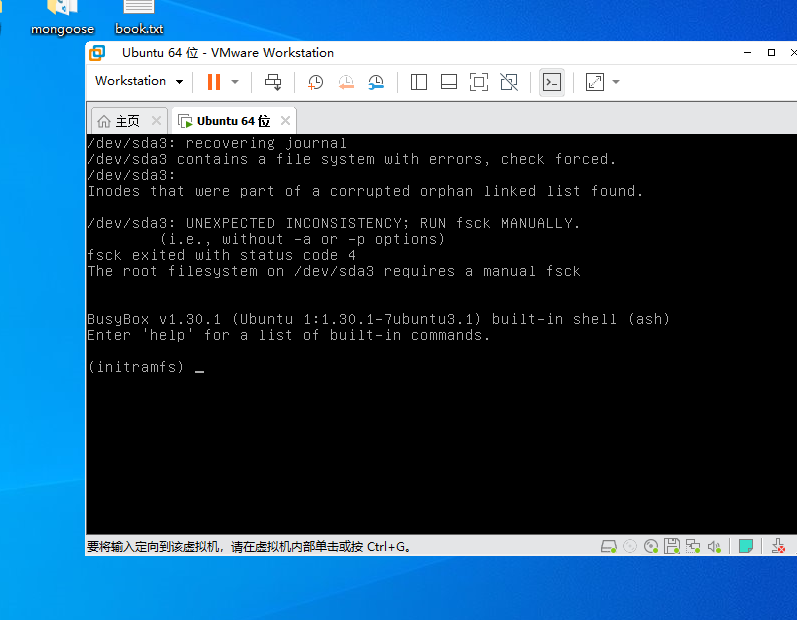

启动报错




```
df -T -h 查看文件类型
fsck.ext4 -y /dev/sda2 
```


调试RK3568命令

```
SD 卡使用
ls /dev/mmcblk*
查看SD卡信息：cat /sys/kernel/debug/mmc0/ios
写入测试： dd if=/dev/zero of=/mnt/test.bin bs=1M count=1024 conv=fsync
读写: dd if=/mnt/test.bin of=/dev/null bs=1M  
清除缓存: sync && echo 3 > /proc/sys/vm/drop_caches
查看挂载： mount | grep mmcblk1
```


#### 桥接模式不能上网

22.04

sudo service NetworkManager stop 

sudo rm /var/lib/NetworkManager/NetworkManager.state 

sudo service NetworkManager start


#### 复制文件到windows

sudo /usr/bin/vmhgfs-fuse .host:/ /mnt/hgfs -o allow_other -o uid=1000 -o gid=1000 -o umask=022


./build.sh lunch

./build.sh all


sudo cp -Lr ~/myproject/rk356x_linux5.1/output/firmware /mnt/hgfs/share/ 


grep 搜索

grep -wrnI "Page select and GOA/MUX setting"  ./

grep -wrnI "Rockchip Ethernet PHYs" --include="Kconfig" 指定文件名称

hexdump 命令：hexdump  /dev/input/event2


打印日志取消目录

```
output/buildroot/target/bin/list-iodomain.sh
```


vscode 配置引用

```
// c_cpp_properties.json
{
    "configurations": [
        {
            "name": "rk356x_linux5",
            "includePath": [
                "${workspaceFolder}/**",
                "/home/yxw/myproject/rk356x_linux5.1/kernel/include",
                "/home/yxw/myproject/rk356x_linux5.1/buildroot/package"
            ],
            "defines": [],
            "compilerPath": "/usr/bin/gcc",
            "cStandard": "gnu11",
            "cppStandard": "gnu++14",
            "intelliSenseMode": "linux-gcc-x64"
        }
    ],
    "version": 4
}
```


