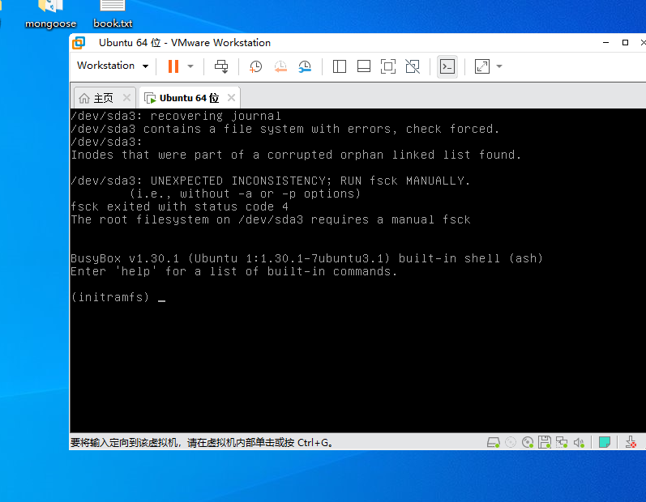

#### 汇湾镜像路径

```
Y:\BIOS\更新日志\ARM产品更新日志.xlsx
```


编译QT5.15

```
参考 https://blog.csdn.net/weixin_55944949/article/details/143095114
下载 qt-everywhere-src-5.15.2.tar.xz  https://download.qt.io/archive/qt/5.15/5.15.2/single/ 
	tar -xf qt-everywhere-src-5.15.2.tar.xz
./configure -release -opensource -confirm-license -xplatform linux-aarch64-gnu-g++ -prefix /opt/qt-5.15.2-arm64 -nomake examples -no-opengl -silent -qpa linuxfb  -skip qtlocation
make -j$(nproc)
make install


```

#### 报错

```
17:14:57: Starting /home/boot/myproject/cutecom-qt5-master/cutecom-qt5-master/build/gcc_64-Debug/cutecom...
qt.qpa.plugin: Could not load the Qt platform plugin "xcb" in "" even though it was found.
This application failed to start because no Qt platform plugin could be initialized. Reinstalling the application may fix this problem.

Available platform plugins are: eglfs, linuxfb, minimal, minimalegl, offscreen, vnc, wayland-egl, wayland, wayland-xcomposite-egl, wayland-xcomposite-glx, xcb.

sudo apt install \
libxcb-xinerama0 \
libxcb-xinerama0-dev \
libxkbcommon-x11-0 \
libxcb-icccm4 \
libxcb-image0 \
libxcb-keysyms1 \
libxcb-render-util0 \
libxcb-xfixes0 \
libxcb-shape0 \
libxcb-randr0 \
libxcb-sync1 \
libxcb-xkb1 \
libxcb-util1 \
libxrender1 \
libxi6
```


#### 更改源

```
sudo cp /etc/apt/sources.list /etc/apt/sources.list.bak

替换为国内镜像，例如阿里云：

deb http://mirrors.aliyun.com/ubuntu/ oracular main restricted universe multiverse
deb http://mirrors.aliyun.com/ubuntu/ oracular-updates main restricted universe multiverse
deb http://mirrors.aliyun.com/ubuntu/ oracular-security main restricted universe multiverse
deb http://mirrors.aliyun.com/ubuntu/ oracular-backports main restricted universe multiverse

清华大学镜像：

deb https://mirrors.tuna.tsinghua.edu.cn/ubuntu/ oracular main restricted universe multiverse
deb https://mirrors.tuna.tsinghua.edu.cn/ubuntu/ oracular-updates main restricted universe multiverse
deb https://mirrors.tuna.tsinghua.edu.cn/ubuntu/ oracular-security main restricted universe multiverse
deb https://mirrors.tuna.tsinghua.edu.cn/ubuntu/ oracular-backports main restricted universe multiverse

```

复制问题

```
# 配置Wayland禁用（如果是VMware）
sudo sed -i 's/#WaylandEnable=false/WaylandEnable=false/' /etc/gdm3/custom.conf

sudo apt install open-vm-tools-desktop

```


运行报错

```
不要更新 QTcreator 的版本，不要使用最新的版本。
./qtcreator
./qtcreator: /lib/x86_64-linux-gnu/libc.so.6: version `GLIBC_2.34' not found (required by ./qtcreator)
./qtcreator: /lib/x86_64-linux-gnu/libstdc++.so.6: version `GLIBCXX_3.4.29' not found (required by /opt/Qt/Tools/QtCreator/bin/../lib/qtcreator/libExtensionSystem.so.19)
./qtcreator: /lib/x86_64-linux-gnu/libc.so.6: version `GLIBC_2.32' not found (required by /opt/Qt/Tools/QtCreator/bin/../lib/qtcreator/libUtils.so.19)
./qtcreator: /lib/x86_64-linux-gnu/libc.so.6: version `GLIBC_2.34' not found (required by /opt/Qt/Tools/QtCreator/bin/../lib/qtcreator/libUtils.so.19)
./qtcreator: /lib/x86_64-linux-gnu/libc.so.6: version `GLIBC_2.33' not found (required by /opt/Qt/Tools/QtCreator/bin/../lib/qtcreator/libUtils.so.19)
./qtcreator: /lib/x86_64-linux-gnu/libstdc++.so.6: version `GLIBCXX_3.4.29' not found (required by /opt/Qt/Tools/QtCreator/bin/../lib/qtcreator/libUtils.so.19)
./qtcreator: /lib/x86_64-linux-gnu/libstdc++.so.6: version `CXXABI_1.3.13' not found (required by /opt/Qt/Tools/QtCreator/bin/../lib/qtcreator/libUtils.so.19)
./qtcreator: /lib/x86_64-linux-gnu/libc.so.6: version `GLIBC_2.32' not found (required by /opt/Qt/Tools/QtCreator/bin/../lib/qtcreator/libQtTaskTree.so.19)
./qtcreator: /lib/x86_64-linux-gnu/libstdc++.so.6: version `GLIBCXX_3.4.29' not found (required by /opt/Qt/Tools/QtCreator/bin/../lib/qtcreator/libQtTaskTree.so.19)
./qtcreator: /lib/x86_64-linux-gnu/libc.so.6: version `GLIBC_2.34' not found (required by /opt/Qt/Tools/QtCreator/bin/../lib/qtcreator/libNanotrace.so.19)
./qtcreator: /lib/x86_64-linux-gnu/libstdc++.so.6: version `GLIBCXX_3.4.29' not found (required by /opt/Qt/Tools/QtCreator/bin/../lib/qtcreator/libNanotrace.so.19)


```


编译 DEMOIO

```
cd ~/CODE/Demo_IO_Multi/build-arm
rm -rf CMakeCache.txt CMakeFiles   # 清理缓存
cmake -DCMAKE_TOOLCHAIN_FILE=../arm64-toolchain.cmake ../cmake
make -j$(nproc)
```


#### 压缩文件：必须包含 .repo

```
正确姿势（Android 工程唯一可行）
rsync -aHAX --numeric-ids android_src/ android_src_copy/
```


#### 安装 Python 2.7

```
# 安装 Python 2.7
sudo apt-get update
sudo apt-get install python2.7 python-is-python2

# 或者如果系统已经有 python2
sudo ln -sf /usr/bin/python2.7 /usr/bin/python

# 验证
python --version  # 应该显示 Python 2.7.x

android11_box 使用 python2.7 并修改创建文件 
vi /home/boot/android11_box/.repo/repo/formatter.py

class NullWriter:
    def __init__(self): pass
    def flush(self): pass
    def new_alignment(self, align): pass
    def new_font(self, font): pass
    def new_margin(self, margin, level): pass
    def new_spacing(self, spacing): pass
    def new_styles(self, styles): pass
    def send_paragraph(self, blankline): pass
    def send_line_break(self): pass
    def send_hor_rule(self, *args, **kw): pass
    def send_label_data(self, data): pass
    def send_flow_data(self, data): pass
    def send_literal_data(self, data): pass

class AbstractFormatter:
    def __init__(self, writer):
        self.writer = writer
    def end_paragraph(self, blankline): pass
    def add_line_break(self): pass
    def add_hor_rule(self, *args, **kw): pass
    def add_label_data(self, format, counter, blankline=None): pass
    def add_flow_data(self, data): pass
    def add_literal_data(self, data): pass
    def flush_softset(self): pass

class DumbWriter(NullWriter):
    def __init__(self, file=None, maxcol=72):
        self.file = file
    def send_flow_data(self, data):
        self.file.write(data)
```


#### 启动报错




```
df -T -h 查看文件类型
fsck.ext4 -y /dev/sda2 
```


#### git 

```
 eval "$(ssh-agent -s)"
 ssh-add /c/Users/admin/.ssh/id_rsa
 ssh-add /c/Users/admin/.ssh/id_ed25519
 ssh pyj@192.168.31.224

```


调试RK3568命令

```
SD 卡使用
ls /dev/mmcblk*
查看SD卡信息：cat /sys/kernel/debug/mmc0/ios
写入测试： dd if=/dev/zero of=/mnt/test.bin bs=1M count=1024 conv=fsync
读写: dd if=/mnt/test.bin of=/dev/null bs=1M  
清除缓存: sync && echo 3 > /proc/sys/vm/drop_caches
查看挂载： mount | grep mmcblk1
```


#### 桥接模式不能上网

22.04

sudo service NetworkManager stop 

sudo rm /var/lib/NetworkManager/NetworkManager.state 

sudo service NetworkManager start


#### 复制文件到windows

sudo /usr/bin/vmhgfs-fuse .host:/ /mnt/hgfs -o allow_other -o uid=1000 -o gid=1000 -o umask=022


sudo /usr/bin/vmhgfs-fuse .host:/ /mnt -o allow_other -o uid=1000 -o gid=1000 -o umask=022


./build.sh lunch

./build.sh all


sudo cp -Lr ~/myproject/rk356x_linux5.1/output/firmware /mnt/hgfs/share/ 


grep 搜索

grep -wrnI "Page select and GOA/MUX setting"  ./

grep -wrnI "Rockchip Ethernet PHYs" --include="Kconfig" 指定文件名称

hexdump 命令：hexdump  /dev/input/event2


打印日志取消目录

```
output/buildroot/target/bin/list-iodomain.sh
```


vscode 配置引用

```
// c_cpp_properties.json
{
    "configurations": [
        {
            "name": "rk356x_linux5",
            "includePath": [
                "${workspaceFolder}/**",
                "/home/yxw/myproject/rk356x_linux5.1/kernel/include",
                "/home/yxw/myproject/rk356x_linux5.1/buildroot/package"
            ],
            "defines": [],
            "compilerPath": "/usr/bin/gcc",
            "cStandard": "gnu11",
            "cppStandard": "gnu++14",
            "intelliSenseMode": "linux-gcc-x64"
        }
    ],
    "version": 4
}
```


Ubuntu 系统扩容磁盘空间（虚拟机）

```
# 1. 备份重要数据（建议但非必须，此操作通常是安全的）

# 2. 检查当前分区信息
sudo parted /dev/sda print

# 3. 启动 parted
sudo parted /dev/sda

# 在 parted 交互界面中：
(parted) print  # 再次确认
(parted) resizepart 3 100%  # 将第3分区扩展到100%
(parted) quit

# 4. 重新扫描分区
sudo partprobe /dev/sda

# 5. 扩展文件系统（先确认文件系统类型）
df -Th | grep sda3

# 6. 根据文件系统类型扩展：
# 如果是 ext4:
sudo resize2fs /dev/sda3

# 如果是 XFS:
sudo xfs_growfs /var/snap/firefox/common/host-hunspell

# 7. 验证扩展结果
df -h
lsblk

查看内容：如果只想确认里面是否有 .repo，而不完整解压
cat release_20211208.tgz.a* | tar -ztvf - 
```


#### Debian 系统 xterm 默认


