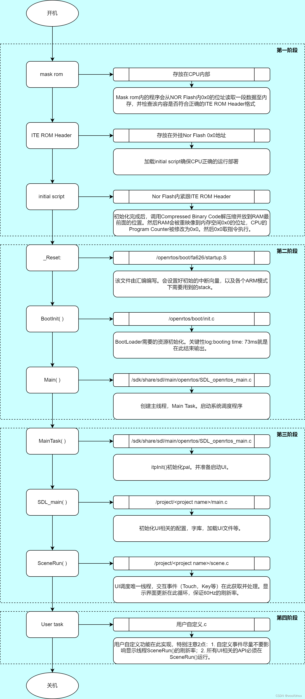
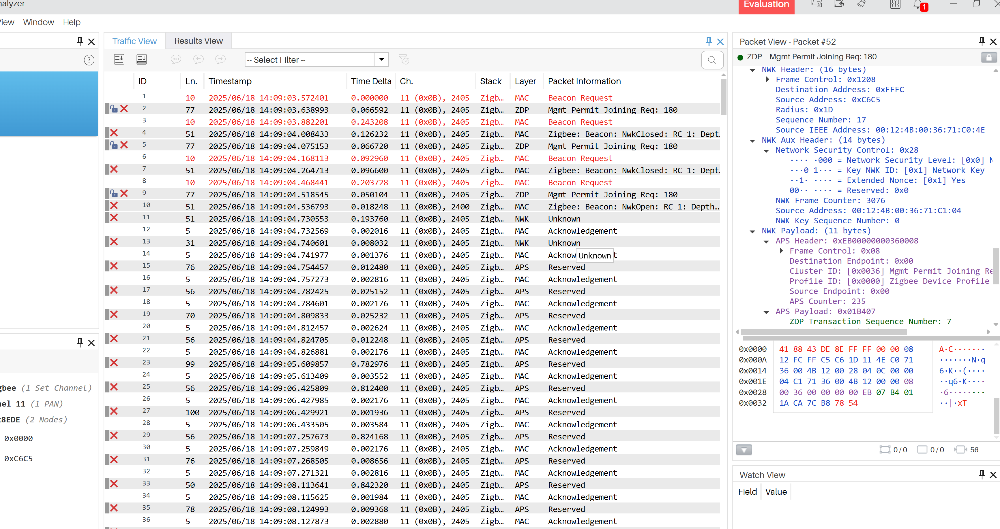
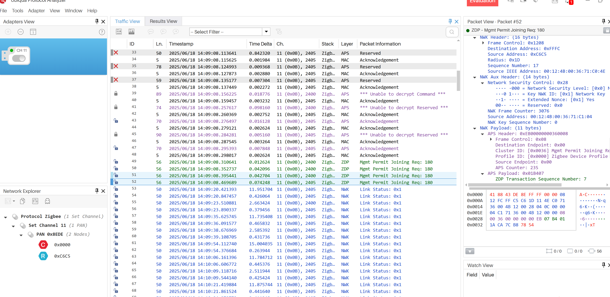

#### 2025-08-05 周二

联阳问题记录

​	图形页面，当业务逻辑跳转。页面添加。当业务逻辑检测到具体的值后，怎么跳转页面切换页面，有性能注意的点有哪些。

​		开机 Logo  和  itu 是怎么结合一起的。 没有 logo 页面的情况下，则开机白屏时间比较久。

​		想要跑通 test_ui 配置后引脚后，但是编译报错。根据原理图，如何配置。

​	烧录代码时候，当出现了错误后，烧录 ROM  代码后，才能再次烧绿 pkg  单独使用 USB2SPI 工具 没有生效。

​	内存划分区域，不是很理解。解释一下。 bootload Boot image ROM(for NOR only)  PKG macaddress.....

​	烧录了 .bin 文件后，再次烧录 .sys 文件。生效了测试。

​	连接时候， open_usb faid 错误。直接连接调试，没有成功。


编译设备树

​	修改3568没有生效，但是修改 3566 编译报错了。是修改3566 配置，还是 修改3568配置 影响到了3566 如何解决。

​	设备树信息，有了睡眠初始化指令后，是不是后面不再需要配置睡眠的信息了。

​	使用到的设备树文件，不需要其他的 3568 文件，就不要加入 $()... 配置了。是不是还有其他的依赖项了。


#### 2025-08-04 周一

联阳 NOR Boot 开启流程



以太网 芯片：裕太微电子  YT8512H 


W25Q256 NorInitial(） 函数实现方式。

#### 2025-06-30 周一

弘扬客户


+ make -C /home/yxw/myproject/rk356x_linux5.1/kernel/ -j9 CROSS_COMPILE=/home/yxw/myproject/rk356x_linux5.1/prebuilts/gcc/linux-x86/aarch64/gcc-arm-10.3-2021.07-x86_64-aarch64-none-linux-gnu/bin/aarch64-none-linux-gnu- ARCH=arm64 rk3568-evb1-ddr4-v10-linux.img


#### 2025-06-28 周六

后板：iviews_keys_idle 检查定时器是否激活。

录入人脸和语音小叮交叉进行时候，会错误，指纹录入会卡在那里异常。

为什么超时时间是150S左右，设置那里是30S?

#### 2025-06-27 周五

录入人脸，录入指纹。按键取消。按键跳过进行下一步操作（前板门铃按键按下。）

​	添加完了一轮人脸和指纹后，不按门铃按键的话，则不会操作（后面的话，是不是会超时）

​		按了门铃的话，会切换下一轮的录入人脸的语音提示。

​		wifi 的指令发送和接收的逻辑是怎么样的？

#### 2025-06-26 周四

前板发送指令上锁

电机发送函数： ivlock_motor_req(ctrl, iviews_lock_get_brake_duration(action));  // 请求电机执行

产测模式中，卡在了最后的一个节点连接 wifi 结束。看下是什么原因？

```
LOGD("req:%d err:%d user_for:%d id:%d perm:%d cnt_key:%d",user_resp->req,user_resp->err,user_resp->user_for,user_resp->user.user_id,user_resp->user.perm,user_resp->user.cnt_key);

	for (uint8_t i = 0; i < user_resp->user.cnt_key; i++) {
        ivkey_t *key = &user_resp->user.key[i];
        LOGD("\n  >> Key #%u user_id:%d key_id:%d type:%d perm:%d valid:%d len:%d", i,key->user_id,key->key_id,key->type,key->perm,key->valid,key->len);
    }
    
前板发起解锁请求：
iviews_lock_verfiy_for_unlock_req(
```


前板请求后板：iviews_lock_req

后板相应前板：

#### 2025-06-25 周三

​	跟着测试。有跑了一遍的测试流程

​		按键：前板，门铃

​		语音

​		APP 设置


#### 2025-06-24 周二

跟踪问题：进入测试模式时，滴一声不会进入，需多停留1~2秒，会滴两声才进入

后板老化模式：iviews_lock_life_test_next_step 

​	进入了老化模式后，就没有找到关闭老化模式的触发事件。断电后，就是关闭了。

#### 2025-06-23 周一

获取信息： 前板发送 iviews_lock_params_req IVLOCK_CMD_GET_PARAMS_REQ 指令 

后板接收 IVLOCK_CMD_GET_PARAMS_REQ 信息 相应 IVLOCK_CMD_GET_PARAMS_RESP信息

前板接收到信息后，使用 iviews_backlock_get_params_resp 保存信息


人脸验证的逻辑是：


后板事件上报：iviews_event_report_push 


电池电量低：复现，当指纹开锁成功后，如果电量低的话，会报电量低的语音提示。

​	前板：

​	后板：iviews_bat_check_and_read  标识：LOCK_EVENT_TYPE_LOW_BATTERY  


工具：

​	iviews_utils_printf2hex(data, len) // 以十六进制格式打印


指纹验证：

​	前板发送：从指纹回调执行 ivfp_action_status_changed_callback 根据类型 IVFP_ACTION_VERIFY  -> 

​		指纹验证逻辑 iviews_fp_verify_handle ->  发起解锁 iviews_lock_verfiy_for_unlock_req (类型指纹)  设置参数 -> 发送指令： IVLOCK_CMD_VERIFY_REQ

​			数据返回：

​	后板接收 ：IVLOCK_CMD_VERIFY_REQ -> 处理验证请求 ivlock_front_verify_req_handle 走的default赋值后，响应前板 IVLOCK_CMD_VERIFY_RESP

​	前板响应：iviews_backlock_cmd_recv_callback -> IVLOCK_CMD_VERIFY_RESP 走的是 defautl

#### 2025-06-21 周六

​	发送语音函数以及调用：ivlock_audio_req_play(ILAUDS_FACE_CAM,AUD_MODE_SEQUENTIAL,iviews_lock_get_cur_lan());

​	每次从休眠后，唤醒，都会从后板请求一次状态信息数据： IVLOCK_CMD_GET_PARAMS_REQ 标识

​	

​	后板

​		接收前板的逻辑的枚举值： ivlock_front_uart_data_recv 函数

​		接收后板的逻辑的枚举值：iviews_backlock_cmd_recv_callback函数 => IVLOCK_CMD_GET_PARAMS_RESP 获取信息。


​		iviews_verify_mode_switch 很多地方有调用 设置了模式后，定时器重置 30S 时间什么逻辑？


#### 2025-06-20 周五

从语音模块顺着思路摸索

​	

​	电源配置：在参考文档中：DriverLib文档 -> MSPM0G1X0X_G3X0X驱动程序库

​	DL_SYSCTL_getResetCause

​	iviews_buzzer_play 在初始化时候，程序执行到 iviews_buzzer_note_paly_handle 和定时器有交互的逻辑，不太明白什么问题？

​	后板烧录时候，电池方朝上，最上边是 VCC 电源

​	按照 功能，前板和后板所实现的逻辑来熟悉 比如： 前板发送上锁的指令 IVLOCK_CMD_LOCK_REQ 后板监听回调处。接收IVLOCK_CMD_LOCK_REQ 事件，处理执行的逻辑。

#### 2025-06-19 周四

芯片使用型号：

​	MSPM0G1505： 32KB 闪存、 16KB RAM   24PIN

​	MSPM0G1105： 32KB 闪存、 16KB RAM   48PIN

前板串口有

```
   NVIC_ClearPendingIRQ(I2C0_INT_IRQn);
	NVIC_EnableIRQ(I2C0_INT_IRQn);

	NVIC_ClearPendingIRQ(UART0_INT_IRQn);
	NVIC_EnableIRQ(UART0_INT_IRQn);

	NVIC_ClearPendingIRQ(UART1_INT_IRQn);
	NVIC_EnableIRQ(UART1_INT_IRQn);

	NVIC_ClearPendingIRQ(UART2_INT_IRQn);
	NVIC_EnableIRQ(UART2_INT_IRQn);

	NVIC_ClearPendingIRQ(UART3_INT_IRQn);
	NVIC_EnableIRQ(UART3_INT_IRQn);

	NVIC_ClearPendingIRQ(GPIOA_INT_IRQn);
	NVIC_EnableIRQ(GPIOA_INT_IRQn);

	NVIC_ClearPendingIRQ(GPIOB_INT_IRQn);
	NVIC_EnableIRQ(GPIOB_INT_IRQn);

	NVIC_ClearPendingIRQ(TIMG0_INT_IRQn);
	NVIC_EnableIRQ(TIMG0_INT_IRQn);
   NVIC_SetPriority(TIMG0_INT_IRQn, 1);
```
   后板串口有
```
   NVIC_ClearPendingIRQ(UART0_INT_IRQn);
	NVIC_EnableIRQ(UART0_INT_IRQn);

	NVIC_ClearPendingIRQ(UART2_INT_IRQn);
	NVIC_EnableIRQ(UART2_INT_IRQn);

	NVIC_ClearPendingIRQ(GPIOA_INT_IRQn);
	NVIC_EnableIRQ(GPIOA_INT_IRQn);


	NVIC_ClearPendingIRQ(TIMG0_INT_IRQn);
	NVIC_EnableIRQ(TIMG0_INT_IRQn);
 	NVIC_SetPriority(TIMG0_INT_IRQn, 1);
```

2025-06-18






2025-06-18 周三

​	自定义设备中，修改设备为路由器的情况，但是并没有给到另外匹配的示例是哪一个？所以尝试了一下。还是不能完成实验。


​	按照标准的自定义的门锁的实例，步骤从1到3都执行了。就是没有看到第四步的效果

​	门锁的实例代码如下

​	

​	使用的协调器是从


2025-06-17 周二

项目功能记录

​	workspace_ccstheia C盘 中 自定义开关灯

​	Custom_Device D 盘中 自定义开关灯

​	basic_ble_profiles 运行的基础项目


2025-06-16 周一

很抱歉，没有能运行成功，1,2,3步都做了。第四步中看不到标志 Door Lock: lock Door 

这个实验中，不清楚问题出在了哪里？是缺少设备？是路由器和协调器两个设备，还是终端和路由两个设备？或者是三个设备同时运行(三个设备，终端，路由，协调器)，


当设备一个为终端，一个为路由器的时候，两个打印的是 off_network_attention 指示灯也都在闪缩。使用 ubiqua 没有看到路由和设备的标识，能够看到的是 Beacon Request 的 

一个为路由，一个为协调器的情况下，建立连接不成功，没有看到有 lock 的标识。

如何才能在ubiqua 中看到 lock 的标志 


替换

```
Log_printf(LogModule_Zigbee_App, Log_ERROR,
Log_printf(LogModule_Zigbee_App, Log_INFO, 
Log_printf(LogModule_Zigbee_App, Log_WARNING, 

uart2_printf(

user_print(

```


#### 2025-06-11 周三

1. 协调器字符串函数具体的示例
2. 终端设备扫描端点，发送给协调器的自定义示例。

### **一、关键步骤**

1. **网络初始化（由协调器完成）**
   - 协调器上电后扫描可用信道（默认2.4GHz频段为信道11-26），选择一个干扰最小的信道。
   - 协调器建立网络，分配**PAN ID**（个人区域网络标识符，可固定或随机生成），并设置网络参数（如信标间隔、安全模式等）。
2. **终端设备入网**
   - **信道扫描**：终端设备扫描协调器广播的信标（Beacon）或主动发送信标请求（Beacon Request）。
   - **关联请求（Association Request）**：终端向协调器发送入网请求，协调器响应**关联响应（Association Response）**，分配16位短地址（默认为随机分配）。
   - **安全认证**（如果启用）：终端与协调器交换加密密钥（如预配置的**Network Key**或通过**Trust Center**动态分配）。
3. **数据通信**
   - **绑定（Binding）**（可选）：终端与协调器可建立绑定表，简化通信（如基于端点（Endpoint）和簇ID（Cluster ID）的匹配）。
   - **数据传输**：
     - 终端通过**单播**（直接发送到协调器短地址）或**间接传输**（协调器为终端缓存数据）发送数据。
     - 协调器通过**AF_DataRequest**等原语转发数据至应用层。
4. **低功耗管理（适用于Zigbee End Device, ZED）**
   - ZED周期性唤醒（通过**Parent Polling**）向父节点（协调器或路由器）查询缓存数据。

### **关键参数**

1. **网络层参数**
   - **PAN ID**（0x0000–0x3FFF）：网络唯一标识，需终端与协调器一致。
   - **Channel Mask**（如0x07FFF800）：指定扫描的信道范围（2.4GHz频段常用）。
   - **Short Address**（终端为0x0000–0xFFF7，协调器固定为0x0000）。
   - **Extended Address**（64位IEEE MAC地址）：设备唯一标识。
2. **安全参数**
   - **Network Key**（128位）：加密网络层数据，需预配置或通过**Trust Center**分发。加密网络层通信，所有设备必须共享相同密钥。
   - **Link Key**（128位）：端到端加密，用于应用层安全（如Zigbee 3.0的**TC Link Key**）。
3. **应用层参数**
   - **Endpoint ID**（1-240）：标识设备内的不同应用（如端点1为照明应用）。
   - **Cluster ID**：定义通信功能（如0x0006为开关控制，温度读取）。
   - **Profile ID**（如0x0104为Zigbee Home Automation， 标识应用场景）。
4. **通信配置**
   - **Transmit Power**：影响信号强度（如+3dBm）。调整射频输出功率
   - **Retry Count**：数据包重传次数（默认3次）。
   - **Poll Interval**（ZED）：终端查询父节点的间隔（如几秒到几分钟  单位 ms）。

#### 2025-06-10 周二

记录问题

需求是使用 zigbee 3.0 协议  替换智能锁的控制逻辑，有app 服务器 wifi 锁这些设备以及网路

目前跟TI 厂商沟通，回复的比较慢。希望能对于知识点的理解确认下。

需要了解公司有那些逻辑

​	单个锁和wifi 直连 然后服务器可以查看锁的状态。

zigbee 链接互联网的示意图，以及步骤。

链接内部网络的示意图，以及步骤。

使用的TI  CC2340R53 芯片。


大体思路是：

​	了解项目产品的技术实现

​	跑通TI  星型组网模式：熟悉扫描，绑定。下发，上报。函数  参数设置 IEE 64 MAC 地址。 PAN ID  

​	移植到项目中。（使用的FreeRTOS）

​	链接Yale 设备 需要哪些参数？（）


https://z7po9bxpe4.k.topthink.com/@zigbee-dev-guide/1.%20jianjie.html zigbee 视频教学


在接收函数中，并没有打印到 hello world 字符串


协调器 开机后，一直打印 test_device_interface_cb param 3分钟后，就停止了。是什么逻辑。


日志打印很不方便。还有其他的办法吗？