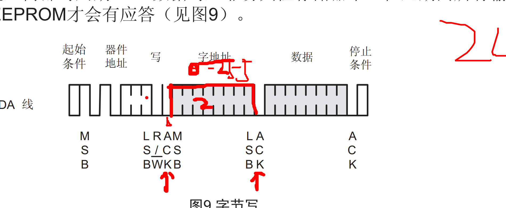

### 串口
#### 2024-12-04 串口作业讲解
- 发送一个字符串函数
  - 循环发送每个字符，遇到了 '\0' 字符停止发送
- 接收一个字符串函数
  - 循环接收每个字符，遇到标志字符 '#' 或者 换行 '\r\n' 则结束。并替换最后一个字符位 '\0'
- 综合实例，发送字符或者字符串来控制LED灯，并回显到 PC。检查按键，并发送到PC 端显示。
- 两个开发通信，通过检查按键，来控制另外一个板子的LED 灯，亮灭，并回显到PC 端。

#### 2024-12-05 串口&中断
- 芯片 F103 和 GD 串口芯片的设置
- 中断的执行过程和机制
- 中断执行控制 NVIC
- 普通函数和中断函数的区别
- 什么时候使用中断
- 中断的配置
  - 中断 抢占优先级
  - 中断 响应优先级
  - 中断 自然优先级
- 中断函数有哪些
  - 设置优先级分组
  - 计算优先级编码
  - 确定具体中断源和编码值绑定
  - 使能NVIC响应通道
### 中断
#### 2024-12-06 中断
- 中断的应用，中断使用三要素，使用结构体封装。
  - 发送一个字符控制LED的亮灭
  - 发送一个字符串控制LED灯亮灭，按键控制蜂鸣器
  - A板按键控制B板的流水灯，并显示到PC端

#### 2024-12-09 232和485&外部中断
- 232和485定义和区别
- 外部中断，流水线使用的例子。
- 芯片进入低功耗的状态，芯片不去执行代码的逻辑。PA0 唤醒可以。需要使用外部中断线中断
- 外部中断的配置，系统控制配置使能，每个中断源和时钟线的映射关系，上升或者下降沿配置。
- 实例：检查按键对应的电平，外部中断。红外感应。


#### 2024-12-10 定时中断
- 什么是定时器，按照一定的速度计数
- 定时器的内部框图分析，按照时钟频率，和总的计数值，向下计数位0 则触发芯片内部寄存器的16号位，置1.
- 延时：内核等待时间到了，才跳出事件逻辑代码。
- 定时中断：内核不用等待，则时间到了。NVIC 会通知到内核，然后去执行中断服务函数，执行结束后，再继续执行主函数逻辑。

### 定时器
#### 2024-12-11 基本定时器
- 不是有的芯片都有基本定时器，需要根据手册确定
- 预分频器，重载值，当前计数值。使能。重载值（16位65536）
- 影子寄存器：代码写入本体寄存器中，更新到影子寄存器中，保证中断周期数据的完整性。
- 基本定时器的配置。参考思路总结

#### 2024-12-12 通用定时器
- 功能
  - 延时
  - 定时中断
  - 输出比较 PWM 占空比
  - 输入捕获


#### 2024-12-13 通用定时器
- 通用模式1 TIM2 - TIM5  参考内部级联表
  - ITR 定时器级联：SMCR => TS 寄存器配置。级联表，使用那根级联线  TS 000 - 011
  - TI1F_ED 输入捕获信号没有经过滤波 100
  - TI1FP1 捕获信号经过了滤波 101
  - TI2FP2 捕获信号经过了滤波 110
  - ETRF 外部模式2 输入信号 111
- 通用模式1 TIM9 和 TIM12  参考内部级联表
  - ITR 定时器级联：SMCR => TS 寄存器配置。级联表，使用那根级联线  TS 000 - 011
  - TI1F_ED 输入捕获信号没有经过滤波 100
  - TI1FP1 捕获信号经过了滤波 101
  - TI2FP2 捕获信号经过了滤波 110
  - ETRF 没有 
- 通用模式1 TIM10/11/13/14.  
  - 只有内部时钟源
- 比较寄存器和重载值寄存器比较时候，中心对齐模式 边沿对齐
- 多通道配置，比较寄存器的值，重载寄存器（周期的值，是一个，固定的）
- 占空比作用是：驱动电压值的大小
an
按键4 随机变色模式

#### 2024-12-16 通用定时器，输入捕获
- 什么是输入捕获
  捕获的原理
- 如何配置定时器
  - GPIO 控制器配置
  - CR1 控制寄存器
  - SMCR 从模式寄存器
  - DIER 中断使能寄存器
  - CCMR1 捕获/比较寄存器
  - CCER 捕获/比较使能寄存器
  - PSC 预分频器
  - ARR 自动重载值寄存器
  - EGR 事件生成寄存器
  - NVIC 中断配置
- 捕获状态寄存器 SR
  - 重复捕获寄存器，使用需要，捕获不清零，捕获周期使用
- 捕获比较寄存器，可以配置成双通道使用。使用双通道的场景不多。
  
#### 2024-12-17 通用定时器，输入捕获原理以及应用
- 根据定时器，捕获两次边沿，捕获到的值，计算出频率的脉宽时间
  - 注意：
  - 65535*n - t1 + t2 
  - 溢出次数，每次计数完成++，注意开始捕获第一次边沿时候，清零。
  - 边沿捕获后，需要切换到另一个边沿。来回切换。
  - 计算时候，只能单次进入一个边沿，不能同时进入。

### ADC 模数转换

#### 2024-12-18 ADC 模数转换
- 什么ADC
  - 将电压量，转换成数字量
- ADC的原理
  - 将电压 3.3V 分成 4096份
- 怎配置ADC
  - 注入通道，配置成触发注入，会优先级抢占 规则通道的
  - 规则通道
  - 哪些通道对应那些IO 口，查表
  - 多个通道使用，怎么配置，排序。
    - 先填写通道数量，然后通道号，依次填写，对应的排序。
  - 扫描模式非扫描模式
  - 单次和循环

#### 2024-12-19 ADC 模数转换
- 应用
  - 查询等待 - 单通道ADC1 - 光敏电阻
  - 查询等待 - 单通道ADC2 - 毒气检测
  - 查询等待 - 双通道ADC1 - 光敏电阻、毒气检测
  - 查询等待 - 三通道ADC1 - 光敏电阻、毒气检测、芯片温度（公式）
  - 定时中断 - 三通道ADC1 - 光敏电阻、毒气检测、芯片温度

#### 2024-12-20 ADC 模数综合练习
- 注意：
  - 使用状态机扫描，定时中断中，只要执行每隔多久需要的时间即可，放入到事件绑定的变量中。
  - 在外部使用绑定的变量，当满足时候，执行对应的逻辑。当毒气阀门关闭后，毒气浓度小于20% 的时候，关闭风扇电机。
- 自动检测部分功能：
①光敏电阻每100ms检测光照强度调节LED的亮度(光照强度越强，灯的亮度越亮)
②毒气检测每100ms 检测毒气浓度，超过20%浓度，
通风(电机)启动同时关闭阀门(舵机转180度)，毒气越浓电机越快，
③每100ms通过串口显示芯片内部温度值
④在毒气泄漏情况，50cm内不能有人靠近，如果低于50cm，蜂鸣器报警
- 操作部分功能：
```
KEY1 ---RGB彩灯  红色
KEY2 ---RGB彩灯  绿色
KEY3 ---RGB彩灯  蓝色
KEY4 ---RGB彩灯  随机变换颜色

PC端口发送字符串open,阀门打开
PC端口发送字符串close,阀门关闭


	TIM14_CH1   PA7    舵机      5.5V
	ADC1_CH10   PC0    毒气      5V
	ADC1_CH12   PC2    光敏      3.3V
	TIM13_CH1   PA6    直流电机   3.3V
	
	TIM4_CH1    PB06   超声波距离 5V
	Echo        PB6
	Trig        PB8

	R           PA1    TIM5_CH2
	G           PA2    TIM5_CH3
	B           PA3    TIM5_CH4
	
	ADC1_CH16     温度
```

### IIC 通信

#### 2024-12-21 IIC 通信
- 双向二线制总线，其特点是同步，串行，半双工模式。
- 有两根线，一个时钟线，一个数据线，交叉写数据，时钟线低电平。平行读数据，时钟线高电平。
- 通信方式为：一主多从的方式通信。每个从设备都有一个设备地址。
- 通信配置方式，配置控制器方式，和 IO口模拟时序方式。
- 通信时序图为:
  - 空闲段     数据线为高电平，时钟线为高电平
  - 起始位     时钟线为高电平，数据线为下降沿
  - 数据段 发送 时钟线为低电平，数据线可以写 ODR 的值
  - 数据段 接收 时钟线为高电平，数据线可以读 IDR 的值
  - 应答段 
  - 停止位      时钟线为高电平，数据线为上升沿。
- MSB 先发送高位开始。
- 原理：通过高低电平代表二进制的0和1的代表八位数据的其中一位。
- 注意：
  - 当时钟线为高电平时候，不能修改数据的值，要不然会形成上升或者下降沿。导致起始或者停止。协议混乱。

#### 2024-12-23 IIC 通信
- 为什么 IIC 配置成开漏输
- 上拉电阻放在什么地方
  - 一般放在挨着从器件的地方。
- 数据线使用输出开漏模式，时钟线可以使用开漏和推挽。
- 使用开漏的作用，
  - 输出高电平，和输入低电平，防止短路，当输出信号位开漏时候，输入是通的，
  - 输出时候，低电平直接输出，输出高电平，会形成高阻态模式。从设备有上拉电阻输出高电平。
  - 输出开漏时候。输出高电平, 输入路是通的。能直接使用输入的电平信号。
- 应答断
  - 应答：时钟线为高电平，数据线 <保持> 低电平。不应答：时钟线为高电平，数据线 <保持> 高电平。注意保持含义。
  - 校验应答/不应答断：校验位应答表示，从机接收完成。不应答表示，从机没有完成接收数据
  - 发送应答/不应答断：应答代表的是从设备继续发送数据，不应答代表从设备不发送数据。

### ST24C02使用 - IIC 
#### 2024-12-24 ST24C02 - IIC 通信
- 存储：
  - 页写：按照8位字节存储，当页写满后，再写的话，会继续从当前页的起始位开始写。
  - 内部写周期（5毫秒）
  - AT24C04 分前区和后区 P0 是 来区域的地址。一位代表 0 和 1, 一个区域有 0-255个绝对地址。
  - 可读可写拉低电平。
- 有哪些存储 ROM  RAM  Eeprom  flash 
- AT24C02 手册
  - 看特点，看引脚，看如何操作。
- 地址编号，AT24C02有三位，8个从器件，地址是硬件工程师，根据 A2,A1,A0 三个引脚的高低电平表示。
- AT24C04，以上，是分区的。PO, 前区和后区。
- 时序图， 

#### 2024-12-25 ST24C02 - IIC 通信
- 应用
  - 存储一个字节函数，读取一个字节函数。
  - 存储一个字符串函数，读取连续多个字节函数。连续发送，数据按每页8个字节发。
  - 连续读取，是按照读取的字节数量来定的。注意发送应答和不应答的判断。
  - 存储一个结构体函数，读取连续多个字节函数。


#### 2024-12-26 ST24C02 - IIC 通信
- 使用结构体的方式，类型强转成需要的数据类型 u8 来存储多个字符。
- 读取的时候，也是需要强转成 u8 类型的。
- 应用，记录开始标志位，开机次数，和流水灯的速度。


### SPI 通信
#### 2024-12-27 SPI 通信
- 时钟极性：时钟线为高低电平
- 时钟相位：第一个边沿可以采集数据，第二个边沿可以采集数据。
- 配置方式：寄存器配置模式，模拟信号方式。
- 通信方式：同步，全双工，串行方式，有时钟线 SCLK, MOSI, SIMO, 以及CS 片选线。
- 时序图：设置好了片选开始，即可发送和接收数据。片选停止后，停止发送和接收。
- 发送一个字符，要接收一个字符。同样。接收一个字符前，也要发送一个字符。

#### 2024-12-30 W25Q64 - SPI 通信
- 标准引脚：SPI: CLK、CS、DI、DO、WP、HOLD.
- 8Mb 空间，地址编号有 块 扇区 页 字节的 分区
- 主控发送命令给到W25Q64，操作读写状态寄存器。
- 配置W25Q64
  - 初始化函数
  - 写寄存器使能函数
  - 读取状态寄存器
  - 写状态寄存器
  - 连续读函数
  - 页写函数
  - 擦除一个扇区函数
  - 连续写函数（可跨页）

#### 2024-12-30 W25Q64 - SPI 通信
- 块擦除（多块擦除）
- 看门狗介绍，相关寄存器介绍。

#### 2025-01-02 IWDG 看门狗 RTC 时间
- 看门狗
- 外部低速时钟，当不是默认 25MH的情况下，修改内核文件。对应的配置生效。
- RTC-时钟选择
  - 外部低速时钟
  - 内部低速时钟
- RTC,时间
  - 初始化配置RTC
  - 设置时间和日期
  - 获取时间和日期
  - 十进制转BCD
  - BCD转十进制

#### 2025-01-03 DMA
- 作用：存储器到外设，外设到存储器，存储器到存储器。
- 当使用 MCU 搬运大量数据的时候，
- 节省 MCU 执行搬运数据的时间。提高 MCU 的利用率。
- 总共8条数据流，每条数据流有8个通道使用。使用的时候，需要查表来确定使用那条数据流哪个通道。
- 源与目标地址和传输方向。
- 仲裁器，优先级配置（数值低的优先级高）
- 知道搬运次数的时候，就用DMA流控制器模式。
- DMA流控制器和外设流控制器 ， 流控制器，知道需要发送的大小。 外设流控制器，不知道接收数据的大小配置。

#### 2025-01-06 DMA
- 配置的时候，CR寄存器，需要先解除写保护，并且等待写保护解除 使用while(). 
- 需要在串口控制器中开启DMA的使能。
- 字库烧录过程
  - 长按按键2 然后按复位键，等待出现开始烧录 
  - 松开复位键。然后一直按着按键2，等准备好烧录。
  - 使用软件，烧录.bin 文件
- 智能锁项目验证板子的功能。熟悉流程。

#### 2025-01-07 项目架构
- 项目流程
  - 需求分析
  - 搭建架构
  - 测试架构
  - 写底层驱动和应用层功能移植到架构中
  - 功能测试
- 写一个模块
  - 沟通参数返回值。
- 搭建


#### 2025-01-08 串口固件库
- 串口的库函数的学习重点
  - 串口的配置
  - 中断的库函数配置
  - 如何根据库函数找到对应的寄存器位
  - 看其他函数的功能