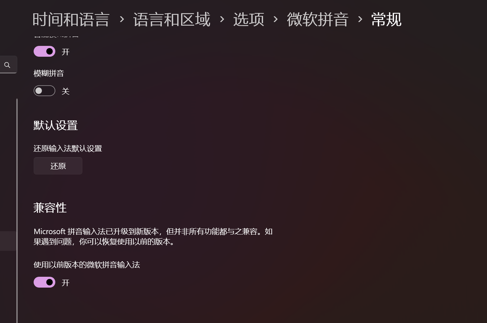
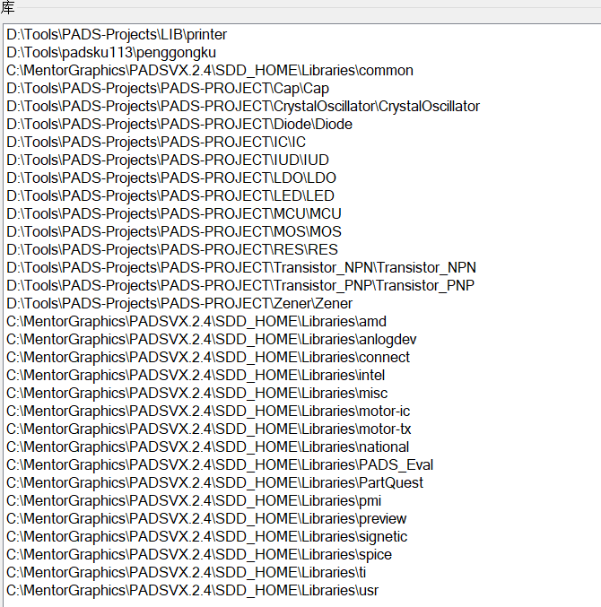
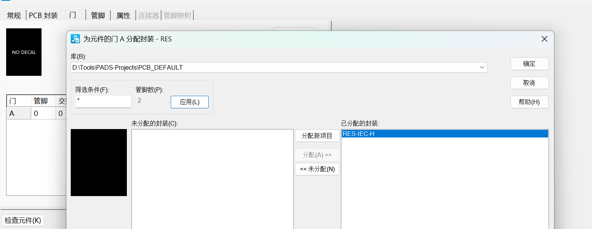
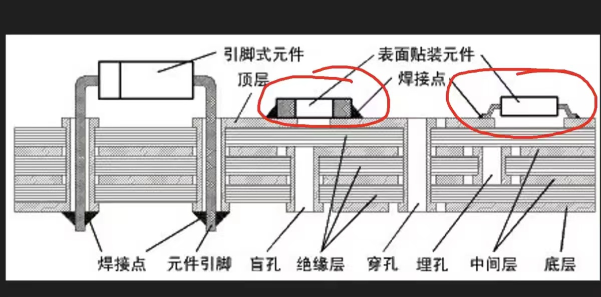
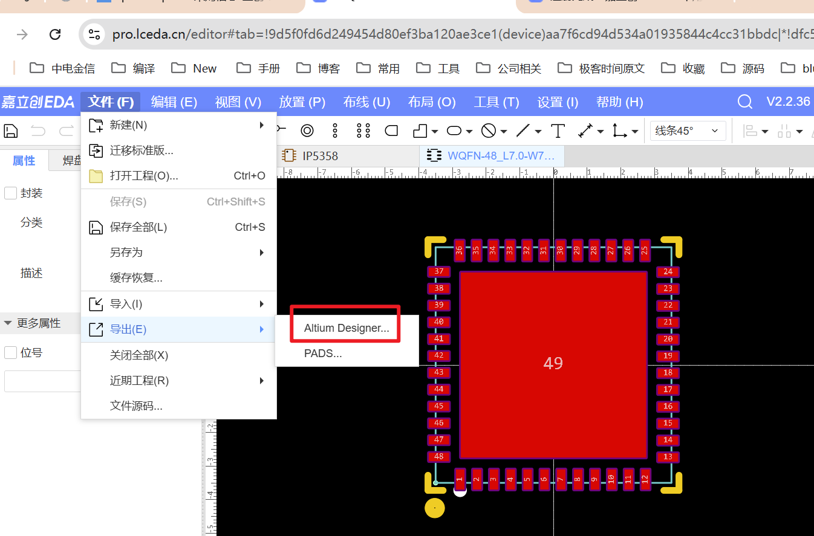
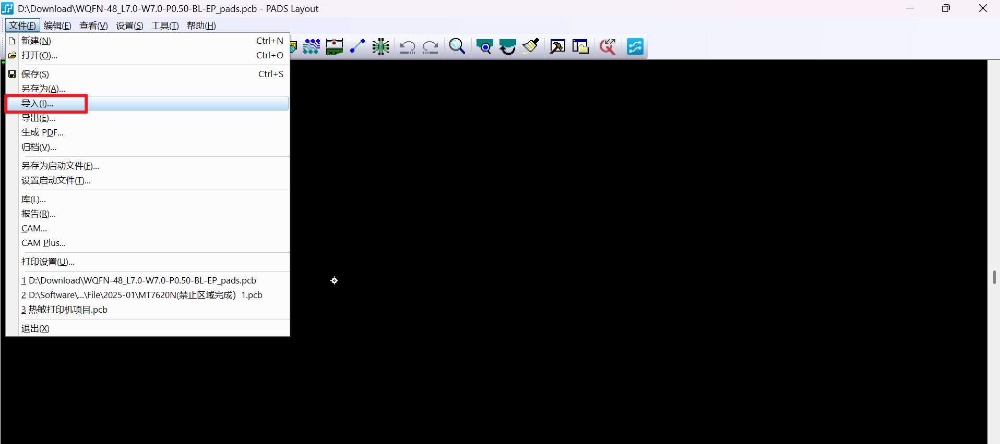

### 预习
#### 2025-02-17
- 摆放
  - 电源口摆放底边
  - 芯片放在中间位置
  - 细线走信号
  - 电源走粗线

#### 2025-02-20 
- 倾向使用软件,KICAD 开源，无版权。
- 全速运行，停止
- 软件输入法修改 
- 设置显示框->
  - 捕获至栅格 (勾选)
  - 设计 -> 允许悬浮连线 取消检查的完整些
- 最小显示的，小于最小显示的，是最细的显示
  - 同理：大于最小显示的最小就线变粗了。
- 字体版权
  - 宋体有版权
  - 微软雅黑没有版权
- 颜色不需要调整。
- 设置->图页->添加新的页面
- 平面直角坐标系
- 画圆
  - 显示栅格10 设计栅格20 最小显示宽度 10 然后修改线宽为40 即可

#### 2025-02-21 添加元器件，连线，库的结构
- 无模命令
- 从项目中添加，搜索 * 表示通配符。
- 选择项目，筛选条件
  - 选择2D线：选择绘图项
  - 任意：大多数都用到
  - 筛选条件里面可以设置具体的筛选条件
- 芯片的门：芯片中的一个模块，多个门。多个模块。
- 删除：不能删除零件的一部分。要么整体删除，要么不删除
- 选中零件后，右键可以查看特性。
- 不需要使用信号管脚：使用起来时候，导出的PDF时候，是看不出来的，会误导芯片引脚选型。
- 逻辑系列
  - 晶体管系列
- 连线
  - 带有圆点的是连接一起的线
  - 带有方框的是浮空连接。
  - 带 xx 表示可以连线
- 库 
- 
- 库的路径 D:\Tools\PADS-Projects\PADS-PROJECT
  - 元件类型（元器件名称）元件 .c后缀文件
  - CAE(对应图形的缩写)符号：电路图形符号（可以有四个符号）门封装 逻辑
  - 尺寸大小（可以一对多）封装 .p 后缀文件
  - 线是添加（单独使用的管理的）
  - 属性管理器：可以批量添加。
- 添加元件
  - 编辑电参数
- 封装
  - 封装编辑工具栏
  - 添加端点
  - 符号名称
  - free lable ??? 
  - PART-TYPE 类型
  - 设置 -> 设置原点
- 关联（元件关联逻辑）
  - 
  - 元件编辑
  - 元件的元件信息
  - 门添加
  - 管脚添加
  - 分配
  - 确定
- IEC 国际电工缩写
- 拉弧
  - 先拉条直线，然后编辑，出现小V表示，点击到直线上，然后右键，拉弧即可。
- 图形下方是原件名称 上方是逻辑系列中，参考前缀。

#### 2025-02-24 
- 最小引脚间距100密尔
- 问题：单位是密尔, 画图使用的单位是密尔。
- 快速方法：
  - 工具->元件编辑器->直接画，然后保存即可
- 水平 200 pin 100 pinshort
- 最小宽度 600，最小高度 600。
  - 设置管脚编号，自动递增时候，点击下半截数字
  - 双击排序，第一个框框点一下，然后点击粘贴
  - 横杠：输入右斜反斜杠, 低电平有效。建议使用带圆圈的引脚

#### 2025-02-25
- 添加备选：一个门有两种图形。
- PCB 封装，没有安装的零件的。板厂。
  - 颜色：红色，绿色，黄色，黑色。
    - 颜色有误导，其实绿色是好的，绿色的带透光，出了问题后，可以查看。
    - 
  - 200度以上，烙铁270度，机器280度。融化，焊在电路板上
  - SMD 贴片安装。元器件的安装方式
  - SMT 帮你贴元器件的过程，工序。
  - DIP 插件
  - 白线框：外框线，丝印。
  - 焊环：金属圈的大小。
  - 镀锡板，镀金板。
  - 绿色的：油漆。
  - 外形封装：SMA(DO-214AC), SOT-23 SOT-123 SOD-323 SMB(DO-214AA)
  - 有线的表示负极，
  - 顶视图，侧视图，
    - 宽可以不加，长度需要增加1.5倍。
  - 先改单位：umm 毫米 um 密尔 ui 英寸 g0 输入 w0.15 线宽宽度 q 回车测量
  - so 使用相对坐标设置原点
  - 画边框，按照框的最大和最小的中间值取
  - 端点->添加图标后，双击打开->焊盘栈->设置宽高->分布和重复
  - -> 画边框 -> 设置 x和y的坐标值。
    - 贴片类：贴装面，如果一个零件小于2毫秒一下，就不画了
    - 插件：三个面，贴装面，
  - 金属的脚，都需要电度。
- PCBA,安装好零件的。

#### 2025-02-26 插件的封装
- 顶层，内层(表示所有的中间层)，底层。
- 金属的脚，都需要电度。（防止生锈）
- 阴影交叉的，是铜箔，37微米， 有几层，就是铜箔有几层。
- 横线的阴影区，是绝缘层。
- 调整焊盘大小，就调整整个盘的大小
- 长条形的洞：槽，（锣刀，铣刀）宽减槽，转头（0.05递增）
- 插件需要打洞穿过零件。需要穿过所有层。需要和某一层项链，
- 
- 修改多个时候，记得（分配给所有选定的管脚）
- 空心圆，内部是不连接的。
- 非金属化的孔，直径是0
- 芯片引脚 宽度取中间，长度对应的增加。
- 热焊盘，为了导热，肚里里面有一个方形焊盘。
- 向导->布局边框(Silkscreen Top) 在丝印层。
- 修改边框层（选择形状->修改到丝印层 Silkscreen Top）
- 选择文本
- 圆圈，形状才是移动。随意的话，是修改大小
- 右键形状，点击特性，修改圆圈的层级（修改到丝印层）
- 倒角：右键随意选择，倒角，添加多个倒角，选择形状，然后添加倒角。
- 铜箔 画特殊型焊盘，双击画完形状
  - 端点关联：画一个端点：画的形状比端点小
  - 关联：右键选择形状，选择铜箔，选择关联

#### 2025-02-27
- 从嘉立创导出封装文件
  - 选择数据手册
  - 立即打开文件，跳转到嘉立创封装页面。修改页面。
  - 需要注册并且登录后，才能。
  - 上面导航栏选择文件，导出
  - 使用PADA Layout 导入文件
  - 添加电源符号
    - 手动填写电压。
    - 点击打开。打开电源。
    - 编辑电参数 添加：特殊符号 T 管脚类型 Power
    - 编辑图形，选则刚才添加的 T 符号 NAME网络名 SHEET 符号名称
    - 工具->从库中更新 !!!更新通用属性!!! 千万不要点击。
    - 修改封装中，0603 0805 

#### 2025-02-28
- 检查错误
  - 工具->对比/ECO工具：通过对比的方式检查错误。
  - 设计与库元件的一致性检查：图里面库里面不一致。使用的文件
  - 单个/零个管脚网络警告：有引脚没有连或者连接错误。编号可以重复。
  - 原理图连接性错误：项目浏览器中可以定位到具体的元件。
- 生成pcb -> 发送网表。只需要发送网表一次即可（修改后，使用对比的功能即可）
- 当打开了logic 中，不关闭链接，右键选择元件，在 layout 中也可以高亮显示。
  - 打开软件 PADS logic 和 PADS layout 
  - 在 PADS logic 中 菜单中找到 PADS Layout 按钮，弹出对话框，
    - 已连接到layout
    - 设计选项卡：
    - 发送网表：发送到layout
      - 在网表中包含规则：不要勾选，关于规则的选项不要勾选。
      - 对比ECO
        - 比较PCB: PCB有 layout有，点击出现未出现差异，比较两边有差异
          - 
          - PCB板和原理图中的差异。
        - 同步ECO至PCB:画的原理图给改了。。。。。
      - 同步ECO(原理图)至PCB（板）
      - 同步PCB至ECO这个是不能使用的。!!!!!!!!
    - 首选项
      - 勾选对比PCB封装分配
    - ECO名称
      - 选择 对比名称，但建议添加/删除元件而不是重命名(P).
      - 或者使用最下面的，最上面的不要使用。
  - 在 PADS layout 中
    - 先取消，在右键选择元件，鼠标框上所有的元件，然后右键 <<分散>>
    - 分散到右边的位置中了。
- 零件简单摆放：当打开了logic 中，不关闭链接，右键选择元件，在 layout 中也可以高亮显示
- 绘制板框
  - 预估板框大小：间距评估大小合适，分散所有的零件后，摆放长款合适的比例。
  - 使用2D线画，然后转板框。
  - 从原点开始画一个矩形框
  - 没有误差的原点，使用命令方式
  - 输入 s0 0 按空格 然后移动鼠标。
  - s90 90 空格 就画成了一个框
  - 选择形状，修改线宽。修改为板框
  - 画定位柱 螺丝孔 1.75毫米 修改宽度，修改为板挖空区域

-1.75009

