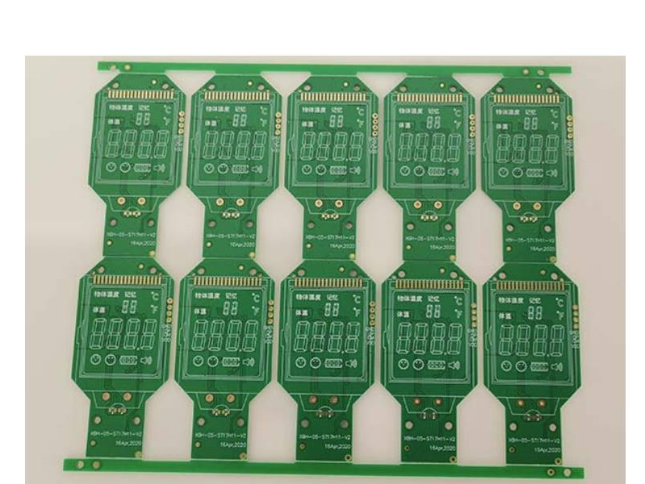

### 名称
- CI 代表的是 芯片的 
- PCB 走线能交叉不要平行。
- 深海赛尔品牌耳机
- 酷态科移动电源
- DLP 芯片 德州仪器 公司产出的。  TI（德州仪器）
- 法拉第笼效应，高铁的受电弓
- 人体阻值:交流 1.0k欧，直流 几千k欧
- 距离和电流成正比，辐射量大，只要走电线，电池波产生。跟电功率有关系。
- U 镀金厚度。单位，常规选 FR-4 板材类别。
- 拼版：一个板子有多个板子
  - 邮票孔拼版，（要连不连，不断）
  - V型切割： V割。
  - 厚度 1oz = 35um (微米)
- 注意点：  
  - 信号线，使用屏蔽线包地。
  - 功率线，使用宽的铜箔。
- 覆盖范围大的wifi 速度慢。 802.11/a/b/g/n/ab/ac  802.11ax
- 路由器系统， 软路由系统 （爱快路由系统，界面清晰）
- 串扰，压合结构。两层，四层，六层，八层板。