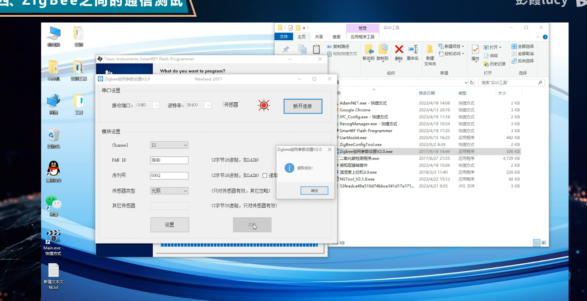

### TCP/IP 链接

- 超时重传时间计算。过大或者过小设置的都不是很合理。
- 流量控制：发送端和接收端都有缓冲，加上窗口大小可以知道接收方的情况，发送的四个状态，已发送并确认，已发送未确认，待发送（窗口允许）待发送（不能发送，接受方窗口已满）
- 网络协议比较
- 

路由管理配置

通信对话：安装485两个端口。通过串口通信接口。

访问，通信。发射，接收。

路由器 -> 协调器通信

传感器-> 路由器通信

打开两个窗口调试窗口。

烧录代码  通道号要一致

​	collector协调器 设置一次

​	 relay 继电器 

​	 Sensor Route 传感器  38400 波特率 PAN ID  保持一致 传感器类型选择 

管理系统设置

创建传感器

组网 网关设置配置。 路由器 WAN 口