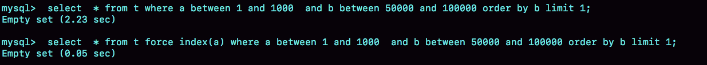
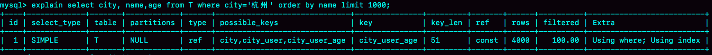
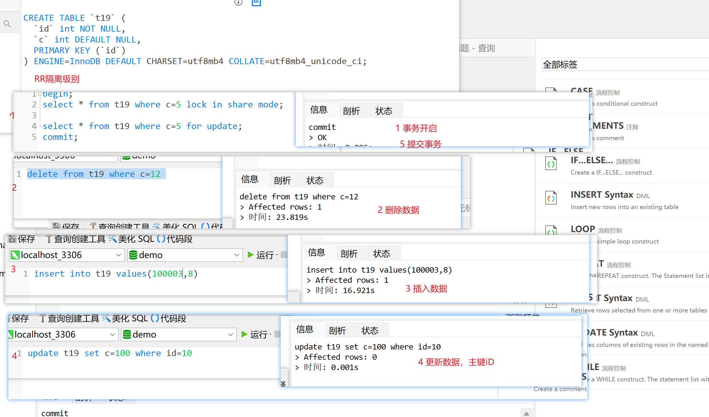
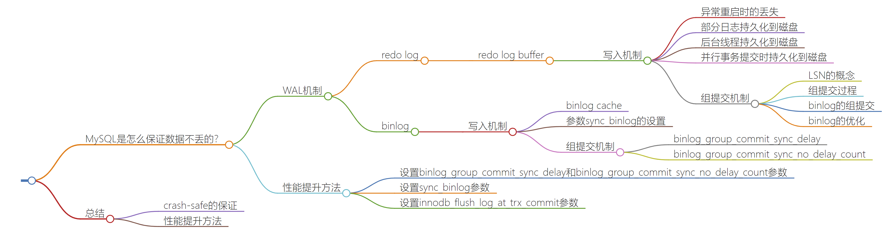

### Mysql45讲记录

- 1 两阶段提交 redo_log 和 bin_log  配置成双一模式。保证数据丢失的少，
- 2 事务隔离级别，读未提交，读提交，可重复读，可串行化。
- 3 加索引的时候，覆盖索引，最左匹配原则 索引可以添加多个唯一索引， 删除索引添加索引能够数据页重新排列。
- 4 读写锁应用，再表 ddl 时候，读锁不互斥，读写锁在读锁就会互斥。
- 5 InnoDb 里面每个事务有一个唯一的事务ID, 叫作 transaction id. , transaction id 赋值给这个数据版本的事务ID,记为 row trx_id 
- 6 update 语句更新时当前读，select语句如果是加锁，也是当前读。
- 7 lock in share mode S锁 共享锁 for update X锁 排他锁 select * from t where id = 1 for update ......
    事务更新 多个事务之间的 读取 MVCC 多版本区别
- 8 唯一索引和普通索引的应用，change_buffer 普通索引更新的时候能够使用到 change_buffer 唯一索引时候更新使用不了，适合的场景，对于写多读少的业务，写完- 后，马上被方访问的概率比较小，例如账单类，日志类的系统。
- 9 排序，全字段排序和rowid 排序 内存够大的情况使用全字段排序，内存不够的情况下，使用rowid，排序后再回表查询结构。可以加索引，最好使用覆盖索引，可以考- 虑使用临时表来优化


#### 10 Mysql为什么有的时候会选错索引
- show index from t10; 查看索引的区分度，查询语句时候，有另外一个线程在删除数据，引擎会扫描错行数，导致不走索引
- analyze table t 命令恢复的 重新统计索引信息 过程或加入MDL 读锁的。
- 
- 纠正索引的速度会快将近50倍
- between + order by 索引选错的情况下，可以来优化, between 选择大的区间来做索引。
- 
  - select * from (select * from t where (a between 1 and 1000) and (b between 50000 and 100000) order by b limit 100)alias limit 1;
  - select * from t where a between 1 and 1000 and b between 50000 and 100000 order by b, a limit 1;

#### 11 怎么给字符串加索引
```bash
mysql> select 
  count(distinct left(email,4)）as L4,
  count(distinct left(email,5)）as L5,
  count(distinct left(email,6)）as L6,
  count(distinct left(email,7)）as L7,
from SUser;
```
- 检查字符串的区分度，字符串使用前缀长度。缺点是，不能使用覆盖索引。

#### 12 为什么我的MySQL会“抖”一下
-  innodb_io_capacity innodb 刷脏页的配置 ， 脏页比，可以计算出来。innodb_flush_neighbors 刷脏页时候，是否顺带邻居。

#### 13 为什么表数据删掉一班，表文件大小不变
- Innodb删除数据，就标记删除，插入数据情况也会分页的情况，有数据空洞。重新创建表，可以解决表大小问题。Online 使用工具 Github->gh-ost 来完成

#### 14 | count(*)这么慢，我该怎么办？
- InnoDB 查询count(*) MVCC，版本控制，并发情况下结果是不同的。
- 解决方法是，引入第三方来保存 Count数量，比如 Redis 和 Mysql.
#### 15 | 答疑文章（一）：日志和索引相关问题
#### 16 | “order by”是怎么工作的？
- 
- 普通索引 sort_buffer 够用 使用sort_buffer 查询索引->回表写入到缓存中->排序->输出
- 普通索引 sort_buffer 不够用 使用sort_buffer 查询索引->写入到缓存中->排序->回表查询数据->输出
- 关联索引 使用 sort_buffer 查询索引->回表写入到缓存中->输出，默认排好的顺序
- 覆盖索引 使用 sort_buffer 查询索引->输出 不经过排序了。
#### 17 | 如何正确地显示随机消息？
- 随机显示随机消息，可以先查询count,再计算随机值，再去查询结果 limit 1方式查询。
#### 18 | 为什么这些SQL语句逻辑相同，性能却差异巨大？
- 使用 Mysql 函数执行和数据类型不一致的情况，join 会放弃索引。
#### 19 | 为什么我只查一行的语句，也执行这么慢？ 慢的原因。
- 
- 查询时间长，不返回， 等MDL锁，等flush,等行锁。
- 查询慢：全表扫描，扫描一行执行的很慢，加锁读。能保证当前读数据
- RR事务隔离级别，for update 并发情况，会锁表，提交后，才会释放锁。
- RR隔离级别下，为保证binlog记录顺序，非索引更新会锁住全表记录，且事务结束前不会对不符合条件记录有逐步释放的过程。
#### 20 | 幻读是什么，幻读有什么问题？******* 重点*******
- 幻读指的是，新插入的行。间隙锁只存在可重复读的情况下。next-key lock = 间隙锁+行锁
- 对到从库中执行binlog 的情况会影响结果错误。比如，当前事务操作的值 c=15的where条件，另外一个事务插入了 c=15的数据，当前事务，把c=15的符合条件的数据，更新了其他字段的值，就导致，新插入的行的数据受影响了。
#### 21 | 为什么我只改一行的语句，锁这么多？
- 等值查询和范围查询的加锁是不一样的。删除数据的情况下，加上limit 会让间隙锁的范围影响缩小。
- 等值查询的间隙锁范围会小一些，范围查询的语句，影响锁的范围会扫描到不符合数据为止。
- 查询记录不存在和存在，情况，加锁范围也是不同的，主键记录存在退化为行锁，加锁范围不存在退化为间隙锁。
- 查看是主键还是普通索引的查询，是范围查找，还是等值查找，加锁范围，行锁、间隙锁、向后扫描到不符合条件的数据为止（next-key lock 或者间隙锁）。
#### 22 | MySQL有哪些“饮鸩止渴”提高性能的方法？
- Mysql 短链接风暴，kill 掉 Sleep 的链接，查询卡主了，关键查询，发布代码，select 1 返回，保证 数据库能使用。跳过验证。注意磁盘空间是否够用。
#### 23 | MySQL是怎么保证数据不丢的？
- 
- 设置双1配置，redo log 和 binlog 的缓存都是实时刷盘，并有合并日志的机制。
#### 24 | MySQL是怎么保证主备一致的？
#### 25 | MySQL是怎么保证高可用的？
#### 26 | 备库为什么会延迟好几个小时？
#### 27 | 主库出问题了，从库怎么办？
#### 28 | 读写分离有哪些坑？
#### 29 | 如何判断一个数据库是不是出问题了？
#### 30 | 答疑文章（二）：用动态的观点看加锁
#### 31 | 误删数据后除了跑路，还能怎么办？
#### 32 | 为什么还有kill不掉的语句？
#### 33 | 我查这么多数据，会不会把数据库内存打爆？
#### 34 | 到底可不可以使用join？
#### 35 | join语句怎么优化？
#### 36 | 为什么临时表可以重名？
#### 37 | 什么时候会使用内部临时表？
#### 38 | 都说InnoDB好，那还要不要使用Memory引擎？
#### 39 | 自增主键为什么不是连续的？
#### 40 | insert语句的锁为什么这么多？
#### 41 | 怎么最快地复制一张表？
#### 42 | grant之后要跟着flush privileges吗？
#### 43 | 要不要使用分区表？
#### 44 | 答疑文章（三）：说一说这些好问题
#### 45 | 自增id用完怎么办？
