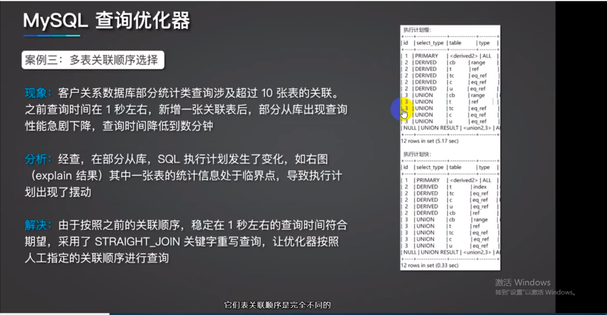

### 记录
- windows 将 mysql-bin.000001 转成 sql  mysqlbinlog --no-defaults mysql/data/mysql-bin.000001 > output.sql
- 直接查看binlog 内容 show binlog events 对应的sql 文件
- SELECT * FROM performance_schema.data_locks; 查看有哪些锁记录。
- 导入到数据库命令，mysqlbinlog master.000001  --start-position=2738 --stop-position=2973 | mysql -h127.0.0.1 -P13000 -u$user -p$pwd; 

#### Mysql 优化 极客时间 Qcon 性能优化及在搜狗的实践
- 不同层的优化
  - 查询需求， SQL 层， 减少查询
  - 查询优化器， MySQL 层， 查询路径优化。
  - 存储引擎， InnoDB 层， 锁和缓存优化。
  - 资源， 硬件层， 硬件优化、扩容。
- 上层的异常，比如缓存失效。数据库压力增加，需要优化 Redis.  
- 减少大事务，比如，删除千万数据，插入千万数据，就是大事务
- 场景一 自动审核业务负载不定时偏高。
  - 峰值时候是平常的10倍，但是慢查询的配置是0.2秒，其实并没有慢查询，分析定位问题。没有 insert update delete 语句，
  - 使用迁移数据时候，迁移一条查询时候，发现查询会引起从库负载出现明显增加。找到了问题的sql,执行时间 0.06s 记录不到慢查询中。峰值的时候，1000 QPS 时候，单条性能已经够好的了。
  - 结果是，一个定时脚本任务，100个线程，每2秒执行一次。优化为数据少于5条，sleep(6s) 查询没有数据的情况下 sleep(12s) 较少查询频率。
- 场景二 可以调用 API 修改价格字段频度增加，数据库峰值 QPS 15000+
  - SQL 中的修改价格字段后，修改了时间字段，业务优化，如果价格一致的情况下，则不去修改。负载 QPS 减少了 20%。
- 场景三，问题时间点，负载有正常值飙升 100 倍。主要问题是 cpu 利用率高，分析有慢查询。
  - SQL select count(*) FROM app WHERE bid = 18171817 and appid = 251 17分钟，查询 25682 次
  - 业务是判断记录数是否大于0 然后执行逻辑，查询省不了，这个查询是多个业务功能的第一步。
  - 数据分析情况，select appid count(appid) as num form app group by appid; 大约是 60865条数据
  - 查询条件增加 limit 1 改为 SELECT count(*) FROM (select appid from app where bid = 18171817 and appid = 251 limit 1) tb; 
- 场景四：某调度任务过去平均时间执行分钟级。问题日增长到了小时级。
  - 关联查询，查询分析器，或误判条数，a 关联 b 会有 b 关联 a 的情况，
  - SELECT b.indid,a.countent,a.url,a.type,a.created FROM black a, black_ind b WHERE a.id = b.blackid and a.status = 1 order by a.id limit 300000, 5000;
  - 优化，指定 left join 查询，指定关联顺序，一定要小表驱动大表，然后被驱动表上关联字段有索引才行。
- 场景五：多表关联顺序选择，客户关系数据库部分统计类查询涉及 10 张表的关联。之前查询时间在 1 秒左右，新增一张关联表后，部分从库出现查询性能急剧下降，查询时间分钟级。
  - 
  - 分析，部分从库，SQL 执行计划发生变化，
  - 使用指定的查询顺序，采用了 STRAIGHT_JOIN 关键字重写查询。优化器按照人工指定的关联顺序查询
- InnoDB 存储引擎
  - 是什么? InnoDB 采用 MVCC 支持高并发，默认给级别是可重复读，通过间隙锁防止幻读。默认隔离级别高。代价是锁和死锁问题相对多。
  - 特点是什么？InnoDB 表是基于聚集索引建立的。聚集索引主键查询性能好。但二级索引包含主键列。要求主键列尽量小。
- 查询语句的时候，不能使用函数查询，（查询的列上不能有索引，查询的 WHERE 条件上可以使用函数的）
- SELECT cpc FROM cpc_daily WHERE `time` > DATE_FORMAT(NOW(), '%Y-%m-%d');