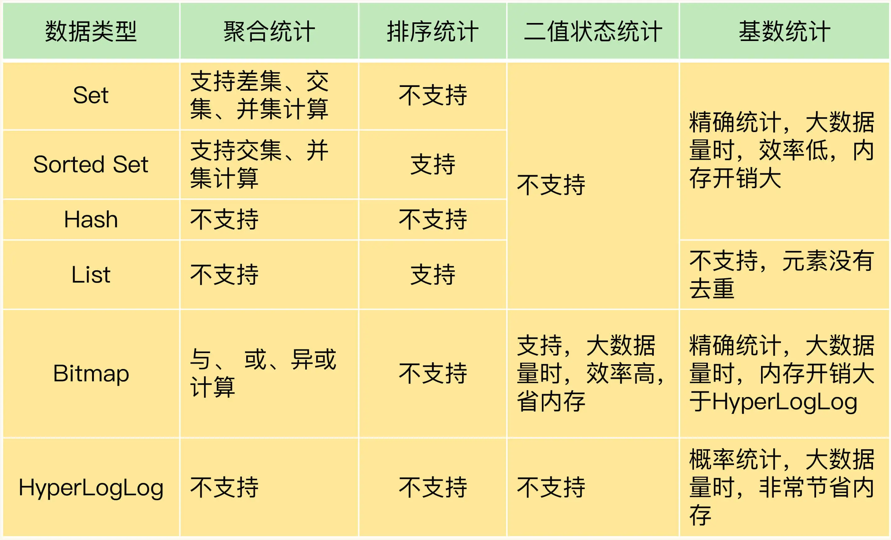

### 极客时间，Redis核心技术与实践
#### 问题总结地址
```bash
https://www.yuque.com/kaito-djycs/kb/rflg1l?
```
- 


#### 01 | 基本架构：一个键值数据库包含什么？
- 
#### 02 | 数据结构：快速的Redis有哪些慢操作？
- redis 客户端代码链接协议。网络链接处理，网络请求处理，以及数据存取处理。数据压缩，过期机制，数据淘汰策略，主从复制，集群化，高可用等。还可以增加统计模块，通知模块，调试模块，元数据等辅助功能。
- 5中数据结构 简单动态字符串、双向链表、压缩列表、Hash表、 跳表、整数数组。
- - 
#### 03 | 高性能IO模型：为什么单线程Redis能那么快？
- Redis 使用epoll 多路复用，单线程非阻塞方式处理请求和执行和响应，像是golang的并发模型，放入到监听的队列中，消费队列，执行回调，返回响应。 
#### 04 | AOF日志：宕机了，Redis如何避免数据丢失？
- AOF 日志，三种写盘策略。是权衡的问题。日志过大的情况下，重写日志，可以压缩，一个命令的多次修改，记录最终的结果。重写是有子进程来完成的。重写的时候，两处日志，都保存最新的修改日志，等重写日志完成后，切换即可。写时复制，重做日志，关闭大页内存。 
#### 05 | 内存快照：宕机后，Redis如何实现快速恢复？
- RDB 全量日志，有两种方法，一种阻塞，一种非阻塞。写时复制，对修改的数据，生成一个副本，进行修改，做增量快照。AOF + RDB 组合保存日志，问题恢复的很好，多写少读 8:2 的情况，会有内存 cpu 的影响。不过一点需要注意，同时开启 RDB + AOF 不要绑定内核cpu . 如果只是GET 和 PUT 没有bigkey，没有复杂命令。没有开启RDB + AOF 可以绑定内核，利用 cpu,NUMA架构，提高缓存使用率。
#### 06 | 数据同步：主从库如何实现数据一致？
- 实现数据的一致的，主从复制的，写主库，读从库的方式。建立连接的时候，从库连接主库。（命令 replicaof）发送从库RDB, 还有发送期间的生成新的记录(在buffer中)，一主多从的方式，主库的压力，多次发送RDB, 优化成级联方式发送，（主 - 从 - 从）
- 如果网络断开了，主库有一个环形缓冲区，（缓冲区的大小计算配置），从库连接上的时候，根据 offset 来计算主从库的差距，来发送，如果从库写时慢，没有追上的话，会丢失一部分数据。最后会全量发送，保证数据一致性。
#### 07 | 哨兵机制：主库挂了，如何不间断服务？
- 三个流程，监控（主观下线，客观下线，网络压力较大，网络拥塞，主库压力本身大，选举是否下线，多数服从少数），选主（依次按照优先级、复制进度、ID大小，来进行打分），通知
#### 08 | 哨兵集群：哨兵挂了，主从库还能切换吗？
- 从库都链接的主库，消息发布链接信息，都知道了所有的链接集合信息。订阅统一频道使用（类似于kafka 的 topic订阅），哨兵和客户端也是通过订阅的方式，知道集群中的状态。哨兵通过选举投票，选出哨兵执行主从切换的哨兵。
#### 09 | 切片集群：数据增多了，是该加内存还是加实例？
- 数据25G的情况，使用切片集群，可以分担压力。数据切片后，多个实例分布，和访问时候，确定落到哪个实例上。总共16383个槽位，平均分配到切片中。
- 牵扯出了添加切片的场景。请求的槽位，没有数据，会返回新的槽位的地址，如果在切片数据较大，返回信息包含 ACK 代表的是，切片在迁移中。
#### 10 | 第1～9讲课后思考题答案及常见问题答疑
- 
#### 11 | “万金油”的String，为什么不好用了？
#### 12 | 有一亿个keys要统计，应该用哪种集合？
- 
-  手机 App 中的每天的用户登录信息：一天对应一系列用户 ID 或移动设备 ID；
- 电商网站上商品的用户评论列表：一个商品对应了一系列的评论；
- 用户在手机 App 上的签到打卡信息：一天对应一系列用户的签到记录；
- 应用网站上的网页访问信息：一个网页对应一系列的访问点击
- 使用zset 阅读排序
- 使用set 记录网页的 UV 值。
- 使用 Bitmap 实现记录签到的功能。
#### 13 | GEO是什么？还可以定义新的数据类型吗？
- 列出了 GEO 的结构原理，区间二分的形式，二进制，经度和纬度组合的方式保存，使用的是 Zset, 以及 GEO 的使用命令。
- 讲解，自定义类型的步骤，还需要在 持久化保存中增加，新的数据类型。
- 评论区，讲述了，list 作为队列的优缺点，stream 模仿专业的队列消息，提供了保存消息机制，ack 支持多消费者。
#### 14 | 如何在Redis中保存时间序列数据？
- 时序数据，例如保存一组有时间序列的 万台设备的 设备ID、压力、温度、湿度、时间。和互联网很像场景，是用户ID、行为（登录，下单，浏览）、时间。
- 特点就是，多写，不会修改，查询模式多（计算平均值，最大，最小，求和）
- 使用 Hash 和 Zset 一起保存数据，每3分钟，保存400万条数据，聚合后33万条数据的情况下。（使用 Mutli, exec）满足不了写入和聚合，需要网络上传输大量数据。
- 使用 RedisTimeSeries 模块保存时间序列数据，需要编译安装模块。生成.so 动态链接库引用文件。优点是在节点内部就做了计算好的结果，返回给客户端。减少了网络传输数据。
#### 15 | 消息队列的考验：Redis有哪些解决方案？
- List, 可以当做队列，当执行失败，宕机时候，可以保存消息。可以阻塞消息使用 BRPOP 命令。
- Streams 消息队列，支持一写多读的场景。可以分组，需要回复 ACK 命令，来确认消息已经被消费过了。
- 消息队列，不能保证严格的数据完整性和主从切换时的数据一致性。
#### 16 | 异步机制：如何避免单线程模型的阻塞？
- 场景有，客户端交互，磁盘交互，主从集群交互，切换集群交互。请求数据的增删改查操作，也有保证可靠性持久化操作，还有主从复制数据同步操作。
- 异步操作，是有内部实现的队列来执行任务的。异步操作，删除bigkey,AOF日志重写，清空数据库。
- 关键路径操作有，读取key,从库加载RDB文件。
#### 17 | 为什么CPU结构也会影响Redis的性能？
- cpu中 NUMA 架构，导致会通过总线读取其他 cpu 上的数据，使用不到缓存。
- 绑定CPU 的操作，可以使用CPU缓存，还有另外一个问题，就是网络中断处理程序，和Redis如果不在同一个核上的话，影响执行时间，需要通过总线来通信。
- 还存在另外一个问题，绑定物理核后，异步执行的线程，会阻塞，影响性能。需要注意 例如后台线程，RDB + AOF,子进程执行的任务。
- 可以使用优化的点，（有物理核，逻辑核），可以绑定在物理核上，不是绑定逻辑核，会分开一些异步执行的任务。还可以优化的点，修改 绑定内核的源码，使同步线程和异步线程绑定不同的 CPU 上。（具体命令代码，文章中说明）。
- 问题答疑中，建议使用 2个 CPU Socket 上各运行4个实例。可以使用到不同 CPU Socket中的 L3缓存。如果绑定相同的 CPU Socket 中运行8个实例并绑定 CPU 核，就会使用同一个 L3 缓存。通过总线的方式，影响性能。
#### 18 | 波动的响应延迟：如何应对变慢的Redis？（上）
- 包含三个方面（自身操作、文件系统、操作系统）
- 判断 Redis 是否变慢 ./redis-cli --intrinsic-latency 120 （检测 120 秒内最大延迟）有慢查询和过期 key 操作的影响。
- 如何应对 Redis 变慢，慢查询看日志，过期 key 可以设置随机的过期时间。有一个配置，默认每 100 毫秒会删除一些过期 key 1 配置删除数量，2.如果超过了 25% 的过期 key 会一直重复删除。
- Redis Scan 命令当扩容、缩容的时候，会扫描到重复的 key 采用的是 “高位进位法”(评论区的)
#### 19 | 波动的响应延迟：如何应对变慢的Redis？（下）
- 文件系统
  - 依赖文件系统 Write 和 fsync， Write 只要把日志记录到内核缓冲区，就返回了。fsync 需要把日志记录写磁盘后，才能返回。时间较长。
  - 主线程使用后台子线程执行 fsync 需要再次接收操作记录写会磁盘时，如果主线程发现上次执行的 fsync 还没有执行完，那么就会阻塞。根据业务来配置。优化，写入固态硬盘 作为 AOF 的日志写入.
- 操作系统
  - 操作系统产生 Swap 交换分区。GET 性能下降了 50 倍，优化，增加内存，或者使用 切片集群。
  - 操作系统-内存大页，问题在于写时复制时候，分配的大页是不合理的，一次分配2M, 关闭大页即可。
#### 20 | 删除数据后，为什么内存占用率还是很高？
- 内存碎片 1. 操作系统内存分配器分配策略问题，2. Redis 申请内存，大小不一定问题。
- mem_fragmentation_ratio:1.86 内存使用率 计算公式，系统申请的内存/Redis使用的实际内存
- 启动自动清理内存碎片功能。config set activedefrag yes
#### 21 | 缓冲区：一个可能引发“惨案”的地方
- 缓冲区的使用，当数据命令的处理速度慢与发送的速度不匹配的情况，而导致数据丢失和性能问题。缓冲区占用内存超出了设定的阀值。就出现缓存溢出。
- 输入缓冲区，原因，写入bigkey，导致输入缓冲区溢出。解决方法是，写入bigkey，控制数据命令和处理速度。
- 输出缓冲区，原因，返回大量数据，不合理的设置，解决方法是，避免bigkey的操作，设置合理的缓冲区大小。
- 主从复制集群中的缓冲区，原因，全量复制缓冲区溢出。解决方案是，控制主节点保存的数据量，设置合理的缓冲区大小，控制从节点数量。
- Redis交互客户端有两类，
  - 常规和Redis服务器端读写命令交互的普通客户端，以及订阅了 Redis 频道的订阅客户端。
  - 从节点客户端，用来和从节点进行数据同步。
#### 22 | 第11～21讲课后思考题答案及常见问题答疑
- 
#### 23 | 旁路缓存：Redis是如何工作的？
- 查询数据的时候，先查询 Redis 有数据则返回，没有数据则查询 Mysql.
- 只读缓存，先插入或修改数据，然后删除缓存，另外线程读取数据的时候，查询 Mysql 然后写入到缓存中，保证了数据的一致性。
- 读写缓存，不能保证数据的一致性，使用读写缓存一致性不高的场景。先写如缓存，然后分同步和异步的情况，写入数据库，主要也是根据使用场景来定的。比如商品大促，商品库存一直在修改，如果修改都处理数据库，则拖慢整个数据库。
- 短视频 APP 场景中，保存固定的缓存数据。
#### 24 | 替换策略：缓存满了怎么办？
- 权衡策略：大容量的缓存能带来性能加速的收益，但是成本也会更高。
- 缓存策略：不删除缓存、随机删除缓存、根据时间TTL来删除缓存、LRU删除，LRU删除策略。根据具体的场景选择淘汰策略。
  - 访问频率不大，没有明显的冷热数据，优先使用随机。如果有置顶新闻，置顶视频，可以不设置过期时间。其他数据使用 LRU 策略进行淘汰。
- 设置容量的大小也很重要。注意干净的数据，和频繁修改的脏数据。
#### 25 | 缓存异常（上）：如何解决缓存和数据库的数据不一致问题？
- 只读缓存，新增缓存，写入Mysql,当查询时候，从Mysql 获取，写入到 Redis 中，修改缓存，先修改数据库，然后删除缓存，当再次读取的时候，从数据库中查询，然后再写入缓存中。能够保证数据的一致性。
- 读写缓存：不能保证数据的强一致性，写入数据库，和 Redis 的任何一方异常，都会有脏数据。使用要求不高一致性的场景中。
#### 26 | 缓存异常（下）：如何解决缓存雪崩、击穿、穿透难题？
- 缓存雪崩：大量数据同时过期，缓存实例宕机。
  - 给缓存数据的过期时间加上小的随机值。避免同时过期。
  - 服务降级，服务熔断，请求限流。Redis缓存主从集群。
- 缓存穿透：访问非常频繁的热点数据过期，解决方法，不给热点数据设置过期时间，一直保留。
- 缓存击穿：缓存和数据库中都没有要访问的数据，
  - 缓存空置或者缺省值。
  - 请使用布隆过滤器快速判断。
  - 请求入口前端对请求合法性进行检查。
- 降级，限流的场景，看是否是恶意攻击，是的话，采取。如果是新的业务上线，导致的缓存问题，则不用降级，限流。
#### 27 | 缓存被污染了，该怎么办？
- 缓存污染是，有些数据被缓存了，就访问了一次，继续留在缓存中，浪费缓存空间。
  - 需要把不被访问的缓存，从缓存中淘汰掉。
- 针对缓存淘汰策略的分析，LRU 算法淘汰掉时间比较久的缓存，弊端就是，全扫描后，存入缓存，失效的比较慢。
- 针对LRU 问题，做了基于访问次数的优化
  - 访问次数是后8位 总值为255 使用配置，访问值增加的速度是可以配置的。（配置项设置，需要理解...）
  - 前8位是保存的时间
#### 28 | Pika：如何基于SSD实现大容量Redis？
- 
#### 29 | 无锁的原子操作：Redis如何应对并发访问？
- RMW 读取，修改，写入。三个步骤
- 内部命令： INCR/DECR 对单个数值操作。可以
- 使用 LUR 脚本，可以使用多个命令，保证原子操作， 使用 LUR 脚本，可以优化，命令，不用每次网络传输命令。建议先使用SCRIPT LOAD命令把 lua 脚本加载到 Redis 中，然后得到一个脚本唯一摘要值，读取摘要值即可。
#### 30 | 如何使用Redis实现分布式锁？
- SET 参数 NX 代表的是，如果 key 不存在，则写入成功，如果存在的话，则写入失败。
- 单机的分布式锁，需要注意的是，解锁的客户端需要和加锁的客户端一直，写入是，写入一个随机值，锁释放是时候，判断随机值是否一致。一致则 DEL 不一致 则 解锁失败。
- 多节点的分布式锁，是向多个节点请求加锁，当大于 N/2 + 1 成功的时候，代表请求锁成功，要注意的是，请求锁使用的时间总和，和过期时间，是否够执行任务的时间够用，如果不够，则释放锁。
- Golang 建议使用 ETCD 来使用分布式锁。
#### 31 | 事务机制：Redis能实现ACID属性吗？
- 配合 Pipeline 使用, WATCH 监听。一起使用即可。
- 不支持事务回滚操作。
#### 32 | Redis主从同步与故障切换，有哪些坑？
- 主从数据不一致，和MySQL 很像，查询主从库同步的进度差值，判断查询主库或者从库，避免主从库在不同的机房。
- 读到了过期数据
- 配置项设置的不合理导致服务不可用。
#### 33 | 脑裂：一次奇怪的数据丢失
- 
#### 34 | 第23~33讲课后思考题答案及常见问题答疑
- 
#### 35 | Codis VS Redis Cluster：我该选择哪一个集群方案？
- 
#### 36 | Redis支撑秒杀场景的关键技术和实践都有哪些？
- 
#### 37 | 数据分布优化：如何应对数据倾斜？
- 
#### 38 | 通信开销：限制Redis Cluster规模的关键因素
- 
#### 39 | Redis 6.0的新特性：多线程、客户端缓存与安全
- 
#### 40 | Redis的下一步：基于NVM内存的实践
- 
#### 41 | 第35～40讲课后思考题答案及常见问题答疑
- 
#### 加餐（一）| 经典的Redis学习资料有哪些？
- 
#### 加餐（二）| 用户Kaito：我是如何学习Redis的？
- 
#### 加餐（三）| 用户Kaito：我希望成为在压力中成长的人
- 
#### 加餐（四） | Redis客户端如何与服务器端交换命令和数据？
- 
#### 加餐（五） | Redis有哪些好用的运维工具？
- 
#### 加餐（六）| Redis的使用规范小建议
- 
#### 加餐（七） | 从微博的Redis实践中，我们可以学到哪些经验？
- 
#### 
- 