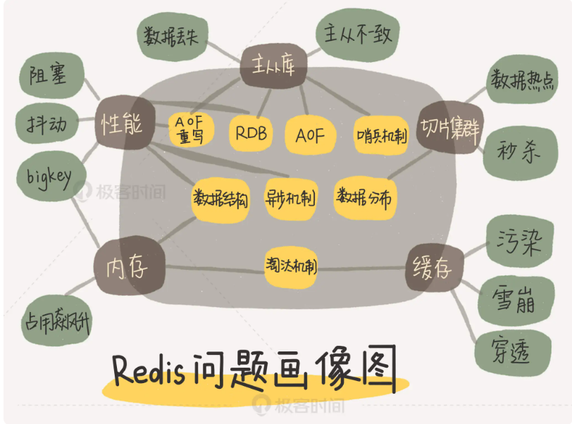
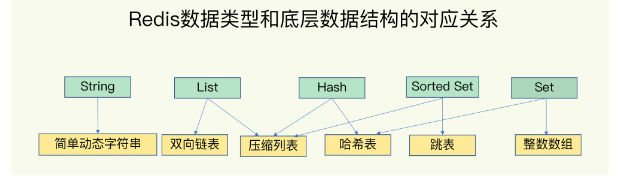

### 极客时间，Redis核心技术与实践
#### 问题总结地址
```bash
https://www.yuque.com/kaito-djycs/kb/rflg1l?
```
- 


#### 01 | 基本架构：一个键值数据库包含什么？
- 
#### 02 | 数据结构：快速的Redis有哪些慢操作？
- redis 客户端代码链接协议。网络链接处理，网络请求处理，以及数据存取处理。数据压缩，过期机制，数据淘汰策略，主从复制，集群化，高可用等。还可以增加统计模块，通知模块，调试模块，元数据等辅助功能。
- 5中数据结构 简单动态字符串、双向链表、压缩列表、Hash表、 跳表、整数数组。
- - 
#### 03 | 高性能IO模型：为什么单线程Redis能那么快？
- Redis 使用epoll 多路复用，单线程非阻塞方式处理请求和执行和响应，像是golang的并发模型，放入到监听的队列中，消费队列，执行回调，返回响应。 
#### 04 | AOF日志：宕机了，Redis如何避免数据丢失？
- AOF 日志，三种写盘策略。是权衡的问题。日志过大的情况下，重写日志，可以压缩，一个命令的多次修改，记录最终的结果。重写是有字进程来完成的。重写的时候，两处日志，都保存最新的修改日志，等重写日志完成后，切换即可。写时复制，重做日志，关闭大页内存。 
#### 05 | 内存快照：宕机后，Redis如何实现快速恢复？
- RDB 全量日志，有两种方法，一种阻塞，一种非阻塞。写时复制，对修改的数据，生成一个副本，进行修改，做增量快照。AOF + RDB 组合保存日志，问题回复的很好，多写少读 8:2 的情况，会有内存 cpu 的影响。不过一点需要注意，同时开启 RDB + AOF 不要帮内核cpu .
#### 06 | 数据同步：主从库如何实现数据一致？
- 实现数据的一致的，主从复制的，写主库，读从库的方式。建立连接的时候，从库连接主库。（命令 replicaof）发送从库RDB, 还有发送期间的生成新的记录(在buffer中)，一主多从的方式，主库的压力，多次发送RDB, 优化成级联方式发送，（主 - 从 - 从）
- 如果网络断开了，主库有一个环形缓冲区，（缓冲区的大小计算配置），从库连接上的时候，根据 offset 来计算主从库的差距，来发送，如果从库写时慢，没有追上的话，会丢失一部分数据。最后会全量发送，保证数据一致性。
#### 07 | 哨兵机制：主库挂了，如何不间断服务？
- 三个流程，监控（主观下线，客观下线，网络压力较大，网络拥塞，主库压力本身大，选举是否下线，多数服从少数），选主（依次按照优先级、复制进度、ID大小，来进行打分），通知
#### 08 | 哨兵集群：哨兵挂了，主从库还能切换吗？
- 从库都链接的主库，消息发布链接信息，都知道了所有的链接集合信息。订阅统一频道使用（类似于kafka 的 topic订阅），哨兵和客户端也是通过订阅的方式，知道集群中的状态。哨兵通过选举投票，选出哨兵执行主从切换的哨兵。
#### 09 | 切片集群：数据增多了，是该加内存还是加实例？
- 数据25G的情况，使用切片集群，可以分担压力。数据切片后，多个实例分布，和访问时候，确定落到哪个实例上。总共16383个槽位，平均分配到切片中。
- 牵扯出了添加切片的场景。请求的槽位，没有数据，会返回新的槽位的地址，如果在切片数据较大，返回信息包含 ACK 代表的是，切片在迁移中。
#### 10 | 第1～9讲课后思考题答案及常见问题答疑
- 
#### 11 | “万金油”的String，为什么不好用了？
- 手机 App 中的每天的用户登录信息：一天对应一系列用户 ID 或移动设备 ID；
- 电商网站上商品的用户评论列表：一个商品对应了一系列的评论；
- 用户在手机 App 上的签到打卡信息：一天对应一系列用户的签到记录；
- 应用网站上的网页访问信息：一个网页对应一系列的访问点击
#### 12 | 有一亿个keys要统计，应该用哪种集合？
- 
#### 13 | GEO是什么？还可以定义新的数据类型吗？
- 
#### 14 | 如何在Redis中保存时间序列数据？
- 
#### 15 | 消息队列的考验：Redis有哪些解决方案？
- 
#### 16 | 异步机制：如何避免单线程模型的阻塞？
- 
#### 17 | 为什么CPU结构也会影响Redis的性能？
- 
#### 18 | 波动的响应延迟：如何应对变慢的Redis？（上）
- 
#### 19 | 波动的响应延迟：如何应对变慢的Redis？（下）
- 
#### 20 | 删除数据后，为什么内存占用率还是很高？
- 
#### 21 | 缓冲区：一个可能引发“惨案”的地方
- 
#### 22 | 第11～21讲课后思考题答案及常见问题答疑
- 
#### 23 | 旁路缓存：Redis是如何工作的？
- 
#### 24 | 替换策略：缓存满了怎么办？
- 
#### 25 | 缓存异常（上）：如何解决缓存和数据库的数据不一致问题？
- 
#### 26 | 缓存异常（下）：如何解决缓存雪崩、击穿、穿透难题？
- 
#### 27 | 缓存被污染了，该怎么办？
- 
#### 28 | Pika：如何基于SSD实现大容量Redis？
- 
#### 29 | 无锁的原子操作：Redis如何应对并发访问？
- 
#### 30 | 如何使用Redis实现分布式锁？
- 
#### 31 | 事务机制：Redis能实现ACID属性吗？
- 
#### 32 | Redis主从同步与故障切换，有哪些坑？
- 
#### 33 | 脑裂：一次奇怪的数据丢失
- 
#### 34 | 第23~33讲课后思考题答案及常见问题答疑
- 
#### 35 | Codis VS Redis Cluster：我该选择哪一个集群方案？
- 
#### 36 | Redis支撑秒杀场景的关键技术和实践都有哪些？
- 
#### 37 | 数据分布优化：如何应对数据倾斜？
- 
#### 38 | 通信开销：限制Redis Cluster规模的关键因素
- 
#### 39 | Redis 6.0的新特性：多线程、客户端缓存与安全
- 
#### 40 | Redis的下一步：基于NVM内存的实践
- 
#### 41 | 第35～40讲课后思考题答案及常见问题答疑
- 
#### 加餐（一）| 经典的Redis学习资料有哪些？
- 
#### 加餐（二）| 用户Kaito：我是如何学习Redis的？
- 
#### 加餐（三）| 用户Kaito：我希望成为在压力中成长的人
- 
#### 加餐（四） | Redis客户端如何与服务器端交换命令和数据？
- 
#### 加餐（五） | Redis有哪些好用的运维工具？
- 
#### 加餐（六）| Redis的使用规范小建议
- 
#### 加餐（七） | 从微博的Redis实践中，我们可以学到哪些经验？
- 
#### 
- 