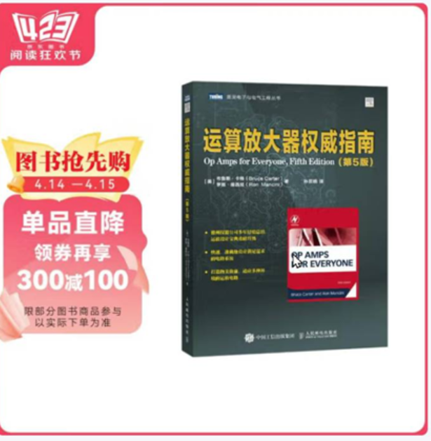
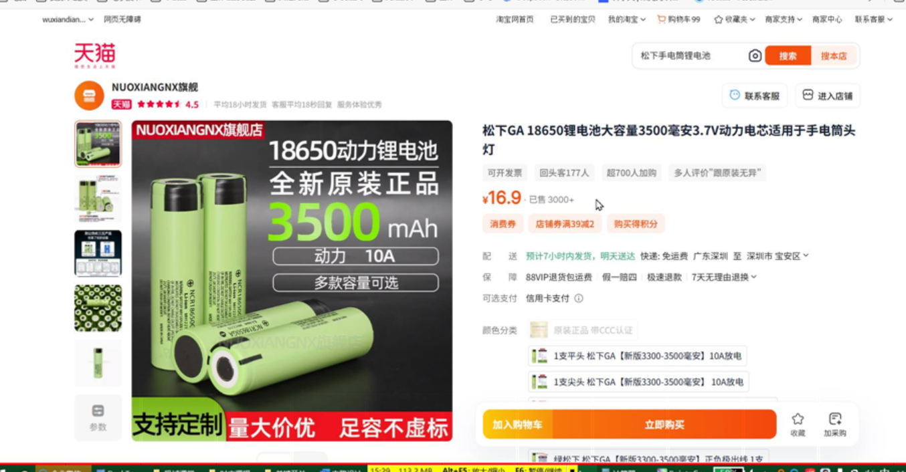

#### 常识
- 内存条品牌
    - 金士顿
    - 三星
    - 威刚科技
    - 骇客(Hyperx) 金士顿的高性能内存
    - 海力士(SK Hynix)

- 冬天手上有静电，不要手触摸芯片，有上万伏的静电。
- 在地上绿色的油漆，有导电的作用。
- ESD二极管可以防静电。
- 毫安的电流，人是受不了的。
- 交流电使用万用表没有意义。
- 电网：把晚上发的电，使用电机把水抽到高位，白天使用水转成电能。
- 数字电桥：LCR表，同惠品牌。
    -  测量：电阻，电感，电容的工具
    -  测量的是交流的。
- 灯，偏色灯（菜市场卖肉的灯。）
- 灯品牌是飞利浦的， 做的比较好，占灯市场的 1/3。
- 轮船使用的是 110V的有效值。
- 220v电压，家用功率是1万瓦特。也就是50A电流。
- UFCS融合快充协议。安可，酷态科电源品牌。（PD3.1协议。可以到140W 28V 5A ）
- 螺丝钉镀镍，放氧化。
- 一度电 = 1千万/小时
- 热水器，电饭锅。使用的是焦耳定律。
- PD 快充，（USB官方充电技术）
- 短路：正负极短路到一起了。
- 电永远走最近的路。
- 两个电阻并联，电流倾向于阻值小的那个线路。
- 空调 匹， 输入功率 1匹 = 735 W (耗电量)
- 笔记本工作电压（15~20V）之间。
- 电池充放电次数 1000 次左右。容量还需要达到原来的 80%。
- 酷泰克的碱性电池，性价比高，和南孚差不多。
- 6f22 9V电池
- 铅酸电池，（电瓶电池）超威，天能品牌
- 空气的耐压，1cm 30KV 超过的话，会发生闪电。
- 显示屏 英寸 是对角线的距离，1英寸 = 2.54厘米
- 关注公众号
  -  硬件学习相关公众号：
       8号线攻城狮
       硬件攻城狮
       南山扫地僧
       电子设计实战派
       电路一点通
       电磁兼容之家
       面包板社区
       硬十
       电子元件技术圈
       信号完整性
       芯片之家
       记得诚
       电子芯期天
       轩哥谈芯
       李皆宁
       疯狂的运放
       大话硬件
       小鱼教你模数电
       工程师看海
   - 指南针是指向 N 的，指向北。
  - 继电器：欧姆龙 国内（宏发）
  - 卫生间里有等电位端子盒。
- 售楼处：不利因素公示牌

### 品牌
- 万用表：福禄克
- 测试出来的是直流的
- 万用表，测试的阻值是没有通电的阻值。
- 内部使用一个很小的阻值的电阻。别名：检流电阻。
- 检测电流，一定要串联使用。
- 台式万用表（DMM 缩写，交流测量法）手持式万用表（常用的万用表，直流测量法）
- 电离辐射对人体有危害。
- 电磁辐射：电磁对空中的辐射向周围发送电磁波。
  - 电流越大的辐射对周围造成的危害就越大。
- EMC: 法律法规, EMS: 电磁抗绕度。（EMC测试包含哪些项目）（EMC整改案例）
  - 微波暗室：周围产生的无线电波给挡住。在房间内，电磁波为0，在放到房间里面。然后再测试。稀薄材料。建造便宜，在地下一层。
- 全国标准信息公共服务。

#### 电容
- F(法拉) mF(毫法) uF(微法) nF(纳法) pF(皮法)
- 电感：H(亨利)
- 高音 动铁 低音 动圈

### 放浪涌
- 压敏电阻
- 气体放电管
- 瞬间抑制二极管

#### 电路
- 
- 音质差，
- NTC 负温度温度检测
- 工具：负载调整率
- （小米隔空充电，没法应用，相控阵雷达先进手段）
- buck型降压电路，已知开关频率为500Khz, 输入电压15V, 输出电压 5V, 文波电流 20%， 输出电流3A,请帮我计算电感感值。
- 偏置
- 正弦波
- AC 交流 DC 直流。
- 人的阻值：1k~10K欧。
- 电焊机：低电压，高电流。品牌 白光 （FX 951）JBC 快客  
- 高铁轨道，连接（高温起热，使用融化的铁轨连接）
- 音响：EDIFIER 品牌。惠威，JBL. 深海赛尔 HD800S 耳机 奥菲斯耳机 （阻抗高的，灵敏度高）索尼 
- 麦克风：品牌：舒尔
- 手机CPU天梯。
- 移动电源：酷态科品牌
- 氮化镓材料充电器。
- TVS 使用，工业级电路保护
- 华硕的路由器质量比较好。
- 贴片的元器件，体积小，性能和质量没有插件的好用。
- 开路：就像是断开了。击穿：就像一根导线 
- 压降：经过了元器件后，电压降低了。压降0.7V = 降低了0.7V
- 三星或者LG面板才有OLED 电视技术。
- 手机均热板，散热。刷新了认知，手机散热，均匀的散热到每个器件上，是好的散热，不是芯片发热了，外面还不均匀受热。芯片就是自己承受热度了。
- 反包场地。产品翻新使用。
- 凌力尔特公司，器件。被亚德诺半导体收购了， 意法半导体ST  恩智浦半导体（前身飞利浦） 安森美
- 钮钜：马达的转动的力度。电压调整改变，钮钜变化，调整交流电频率，钮钜不变。
- 调冷的技术：变频。
  - 空调定频：转速不能调整。
  - 压缩机：压缩空气。气体转液体会放热。空气换成制冷剂。能效比。外机重量，越重铜管越高。  冷凝器 三菱 松下
- 共振：频率一致。军队过桥示例。
- 脉冲直流：从另一个角度是交流。
- 随身听：
- 收音机：德生 PL-330  K-480WLA 天线
- 44.1KHZ 音乐采样率。
- 哇瑟纳协议：电子协议
- 中国收音机频段 87-108MHZ
  - 长波：波越长，天线尺寸大
  - 频率越高，天线越短。
- AP面板 ：路由器，用电量大，30W.
- 示波器：配件，差分探头 电流探头
- 电流电阻PCB 检流电阻PCB
  - 

- 数控电源

  - 

- 公司使用程控电源：散热好

  - 
  - 电压范围，电流范围，输出文波，限流反应速度快慢。

- #### 电桥（LCR桥）

- 所有的工具都是使用的GND,都是接到了插板电源上。

- 测试电容电感的容量的仪器

  - 电容电感损耗。
  - 
  - 两个夹子都要接到金属上。
  - 
  - 
  - 
  - 
  - 频率变高，感量变小
  - 频率越高的，电桥越贵了。
  - 使用前，提前矫正。归零。
    - 短路清零：夹子夹在一起。
    - 开路清零：夹子放空，点开路，再确认即可
  - 
  - 
  - 磁铁放入到电感旁边，感量下降或者上升（放的角度不一样就效果不一样）。
  - 

- 电容测量前先放电（短接）

  - 
  - 电容器的容量，跟测量的频率很关键
    - 频率需要调低 120HZ
  - 
  - 

- 电阻测量

  - 低于1Ω的不准。可以测量非常小的电阻
  - 并联，阻值减小。
  - 
  - 

- 频谱分析仪：EMI干扰测试。天线测试。

- 

- 拉普拉斯变换。弧度制，角度制。

- 运算放大器权威指南

- 索尼：WF-xm5 降噪效果好

  - oppo enco  

- 固纬线性电源。

- DC-DC 升压芯片 南芯科技

- 半导小芯网站查询芯片的网站。

- 电源制造商：江苏晨阳电子

- 金升阳：专门做开关电源的工厂。

- 台达电源：服务器电源。

- CMOS传感器：数码相机。CCD传感器（电路的类型）

- 电波钟

- 几素小风扇比较好。 松下18650 锂电池 3500毫安。

- 蝰蛇峡谷: 主机 

- 芯片厂商：全志（摄像头)、瑞芯微、炬力、

- 充电器：安克手机充电器。支持PD3.1 支持功率比较大。

- 扩展坞：奥睿科品牌。

- 机械师M2: 电动车。

- 华星光电：显示屏。

- 高压汞灯：投影仪灯。大功率使用。

- 亿纬锂能，宁德时代。电池品牌。
