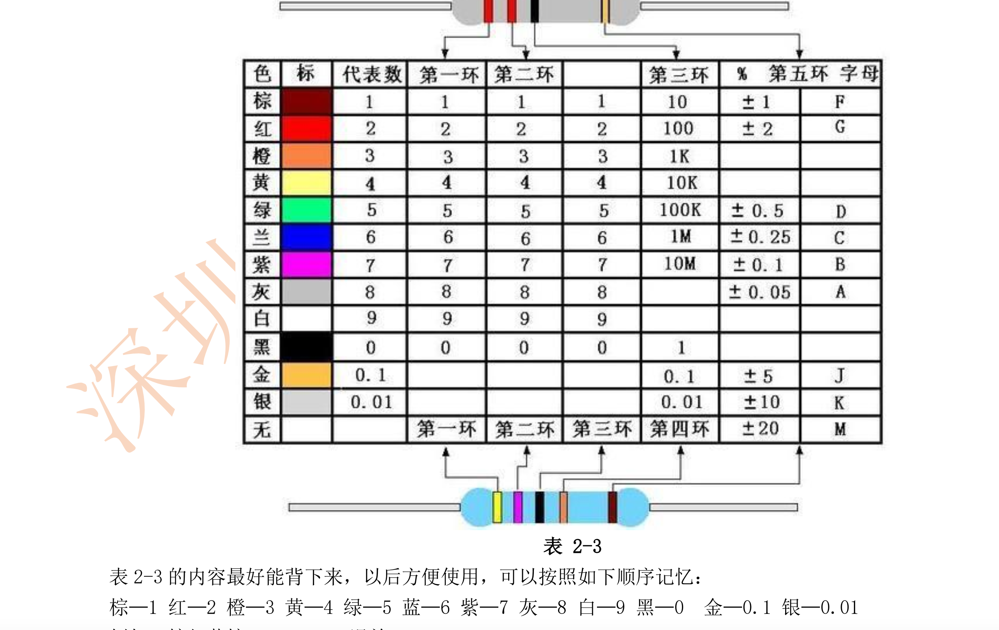
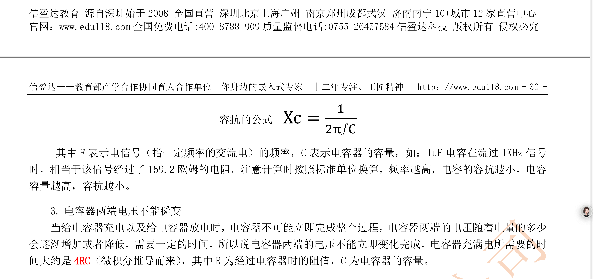
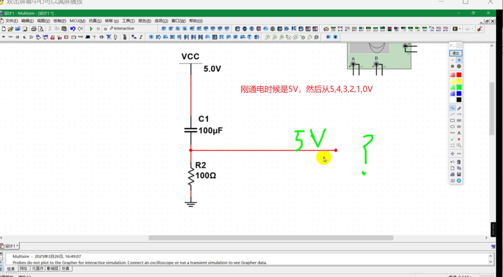
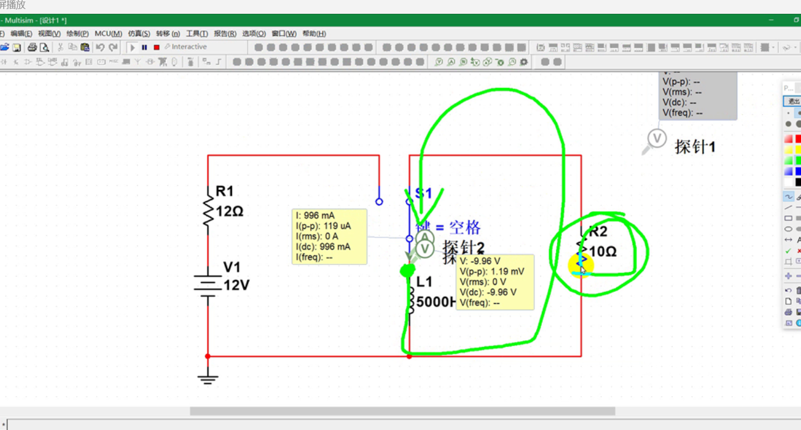
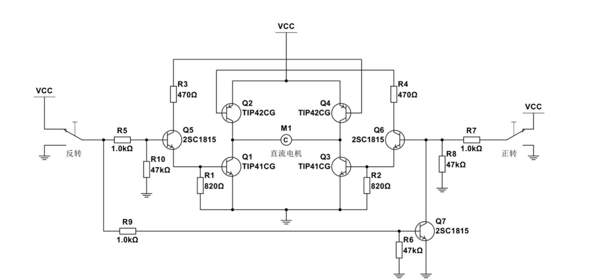
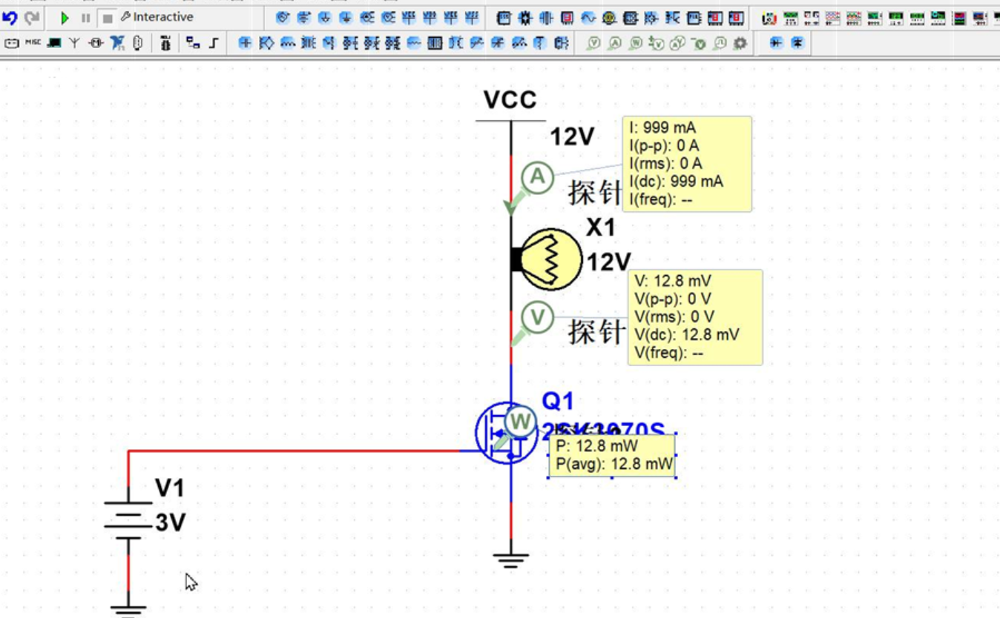

### 2025-03-24 电压(Voltage)
- 作用：产生电子流动。流动了，才能做功。电流从高流向低。
- 兆伏MV -> 千伏kV -> 伏V -> 毫伏mV -> 微伏（μV）-> 纳伏（nV）-> 皮伏（pV）
  - 1 千伏 = 1000 伏特（1 kV = 10³ V）
  - 1 毫伏 = 0.001 伏特（1 mV = 10⁻³ V）
  - 1 微伏 = 0.000001 伏特（1 μV = 10⁻⁶ V）
  - 1 纳伏 = 10⁻⁹ 伏特（0.000000001 V）
  - 1 皮伏 = 10⁻¹² 伏特（0.000000000001 V）
- 电压高，不代表电流大。
- 单位：伏特(V) 1伏特 = 1库伦
- 端电压：两端之间的压差, 电阻两边的电压是多少？
- 点电压：某处，到接地（0V）的压差。
- 双电源：有正压和负压。
- 所有的接地符号都是相连的。
- 电源符号都可以使用正极和负极来表示。(VCC，VDD，VSS, VEE,GND)
- 电路中可以没有负极，或者说负极中带电，关键是电压中带的有差值。
- 直流电(DC)
  - 方向不变，大小可变。电路板使用直流电。
  - 波形显示，时间和电压的坐标表示. 纹波(波动的大小,百分比表示,小于10%合格,5%良好,1%优秀),待负载时候去测试才有意义.
- 交流电(AC)
  - 符号一个波浪。随时间变化而变化的。正负极交替变化。
  - 交换的次数，成为频率。单位HZ 国家电网 50HZ.表示 正弦波。发电时候，在旋转。一个周期，360度。一圈。
  - 电压：峰值（最高值的电压，正半周或者负半周的最大值）或者
  - 有效值，正玄函数的面积，做功的。正玄对应的关系 有效值*根号2 就是峰值。
  - 有效值比峰值低。排插电是有效值。
  - 峰峰值： | 正峰值电压 | + | 负峰值电压 |
  - 测量波形峰值或者峰峰值，测量做功用有效值。
  - 焦耳定律：I平方 * R * T （功率 = 电压 * 电流） 电流越小，功率越小，能量使用较少。电流更大，就功率使用多。能量损耗小。
- 电流
  - 安A -> 毫安mA -> 微安（μA）-> 纳安（nA）
  - 插线排能，最大承载的电流。
  - 电流是有负载决定的。如果是5V,2A的手机充电器，给到5V,6A的充电器，是可以的。
  - 电压一样，电压稳定，电流随意使用。
- 恒压源：电压不变的电源。
- 电阻
  - 阻碍电流，电压下降。
  - 单位：兆欧(MQ),千欧(KQ)，毫欧（mQ）
  - 金抗氧化性好，银行卡 铜和银氧化没有金好。
- 欧姆定律
  - U:电压 I:电流 R:电阻
  - U = R * I
  - I = U / R
  - R = U / I
- 串联电路
  - 
  - 串联电路总阻值：R总 = R1 + R2 + R3 + Rn + 。。。。。。。。一定大于单个的阻值。
  - 处处电流是相等的。电流是一样的。
  - 两个阻值一样的情况下，电压减半。
- 并联电路
  - 
  - 电流之和 = 所有的电流之和 I1 + I2 + I3 + In + 。。。。。。。。
  - 总阻值一定是小于最小的原件的阻值
  - R总 = （R1*R2）/ (R1+R2)
  - 值是一样的并联，是原来的阻值的一半。
- 功率（W）
  - 做功的速度。车速 做功的快慢。
  - 功：功率 * 时间 （1度 = 1000W/s）
  - 单位：瓦特 
- 焦耳定律
  - Q = I平方 * R * T T 表示时间 。
  - 提高电压：可以电流小一些。可以发热量小一些。
- 恒压源
  - 不考虑电流，无穷大的电流。理想的电压源
  - 电压在变。电压随负载变化而变化。
- 恒流源
  - 不考虑电压，电压随负载变化而变化。理想的电流源。
  - 电流不变。不管负载是什么？就需要这么大的电流经过。

### 2025-03-25 电池
- 电池(Battery)
  - 
  - 输出直流电。
  - 电池电量流失，电压会下降。电池 1.6V 电压。
  - 电压不足的情况，可以串联电池。
  - 容量：安培/小时。  10A/H  每个小时以10A的容量。并联可以增加电池的容量。（）
  - 内阻：电池内部有阻值，电池输出电流最大值取决于电池的内阻（不可能无穷大）
  - 种类
    - 碳性干电池
    - 碱性电池
  - 二次电池（充电电池）
    - 镍铬电池 5号电池（寿命短）NI-cd
    - 镍氢电池（牺牲了内阻，换来了容量和寿命）
    - 铅酸电池，（电瓶电池）超威，天能品牌
    - 锂电池（钛酸锂电池，效率不高。寿命长。 电池使用次数 >=25000）安全性差。
    - 磷酸铁锂电池

### 2025-02-18 电阻 2025-03-25
- 电阻
  - 种类
    - 金属膜性
    - 碳膜电阻。
    - 金属氧化膜。
  - 电阻的读法，103 10K 最后的一位数字代表的是 10的3次方。
- 电阻的参数
  - 阻值
  - 功率：超过了，就会坏了。大于做功的功率，大于1.5倍以上。
  - 精度：分压电路中使用。采样电路。（高精度电路）精度影响电路的性能。
  - 耐压
  - 温飘:温度变化对阻值的影响率。100PPM，温差大的场景使用。
    - 商业级(0~+70)，工业级(-40~+85)，汽车级(-40~+125)，军工级(-55~+150)，航天级(-55~+150)。
  - e24系列电阻。
  - e96系列电阻，误差小。
- 电子和电流的方向是相反的 
- 二极管
  - 有标识的是负极

#### 2025-02-23 电阻 2025-03-26
- 耐压值，体积小的耐压就小，体积大，耐压就大，超过了能承受的电压的话，会起不到阻力的作用，漏电。
  - 过载电压：超过了后，物理损坏。0603规格：耐压 75V
- 电阻串联可以提高耐压。
  - R 等于 。
  - 带字母的是拼接的，字母代表次方。使用映射关系表示的。
  - 数字的是，最后一位是代表次方的意思。
  - 色环电阻
    - 
    - 宽的是第一位，依次读取，离电子近的是第一个位
      - 靠近管脚的根部，或者误差环离的比较远。
    - 倒数第二位是次方的意思，
    - 倒数第一位是误差的意思。
  - 电阻的尺寸
    - 插件：0.5W 1cm 左右。
    - 贴片：0805 长80密尔 宽 50密尔 1英寸 = 2.54 厘米
- 普通电阻：寿命长（使用不超过功率，可以很久。）
- 碳膜电阻：最便宜。金属膜电阻：功率比碳膜大一些功率。水泥电阻：功率大一些。或者线绕电阻。100
- 可调电阻：电位器（寿命比较短）。多圈电位器，碳膜，（使用音响。调音量）P 接地线。
  - 双联电位器，单联电位器。
  - 多圈电位器，
  - 不是所有的旋转都是电位器，还有旋转编码器。（鼠标用的是编码器）（可以旋转，一直转，只要旋钮不坏）
    - 动子，定子，爆炸图
    - 光学编码器，向左转或者向右转，识别电机转动的角度，寿命最长，光编码器，
    - 旋转编码器：示波器使用，（示波器使用的就是。内部是轴承，寿命长，）
    - 伺服电机贵，转速快，步进电机便宜，转速慢。
    - 模拟电路用电位器比较多，数字电路不使用。
  - 敏感电阻：热敏电阻。
    - 过温，保险丝，正温度系数 PTC，自恢复保险丝。（比价贵，医疗，笔记本电脑，缺点：故障率比较高，智能扫地机，当扫地时候，有头发缠住了电机，需要使用，使用频繁断开的话，会坏的，故障率高。）
    - 负温度系数：用于测温（温度计）。NTC,保护电路浪涌使用。(温度越高，阻值越小。 温度越低，阻值越大)
    - 正温度系数：PTC (温度增高，阻值越大， 温度越低，阻值越小) 保险丝。当慢速保险丝使用。
    - 快速认证群。（和浪涌都是专业名词。）
  - 光敏电阻：半导体材料做的，光变强，阻值变小。单位 勒克斯（1根蜡烛一米的光的强度）
  - 热敏电阻再高一些，热电偶温度更高
    - 玻璃管的电阻，
  - 气敏电阻：特殊气体，检测。（可燃气体二氧化碳，甲烷......）可燃气体浓度越高，阻值越小。
  - 压敏电阻：电压越高，电流越高。（检测电压使用的）过压导通的作用，接法：（接到电源的正负极之间，并联正负极之间）过压保护。前面配合保险丝使用。手机充电器，笔记本充电器使用。有几百瓦
    - 类似的器件：GDT(气体放电管)
  - 压力应变片电阻：里面包含有金属丝，挤压或者拉伸，电阻变小或者变大。（体重秤用的就是这种）横截面积。
    - 具有一定的电阻丝。弯曲，拉伸，缩短。材料型变。变胖阻值变小，拉伸阻值变大。
    - 洗衣机重量够了。就停了上水了。
  - 零殴电阻：调试用，当跳线用，降低干扰。可以从电阻中间过线。（串万用表使用）
    - 数字地和模拟地之间连接。
    - 数电产生很大的干扰。接0欧电阻，可以降低干扰。

#### 2025-03-02 电容 2025-03-26
- 电容用C表示 关注：耐压，容量。电流方向充放电不一致。单位 F拉 mF(毫法)、 uF（微法）、 nF（纳法）、 pF（皮法）， 
  - 恒压的器件。
- 充电完成后，和电源值是一样的。不会影响结果。影响过程，速度。充电：两边的压差变大。
- 两个导电材质挨得很近就会形成电容，低通滤波器  => 高频抵消， 通低频 高通滤波器 => 低频抵消 通高频
- 电容两边的电压是一样的，所有（VCC和GND是一样的）
- 每增加20db,电压增加10倍（电压相乘关系）
- 非线性
- 三层，上层和下层是绝缘的。
- 电容率（电介质）电容率越高，电荷越高。还要包含空气的电容率。
- 距离越近，电容越大（电场越大），相对面积越大（重合面积），电容越大。电容 = 电容面积/导电材质距离。 （降低距离会导电。不太好）
- 电容率目前高的电解液。（电解液：稀硫酸）
- 正负极和不区分正负极
  - 两个电极材料相同，不区分正负极。
  - 区分正负极容量比较大。不区分的正负极的容量比较小。
- 10uF以上是比较大的电容。分10uF(微法)是大电容和小容量的分水岭
- 有极性：铝电解电容，钽电解电容，固态电解电容。电容容量大。
  - 铝电解电容，容量大，电容价格低，寿命短。漏电大，耐温差，绝缘差。所有电容最差的。有颜色的是负极。黑白色。
  - 固态电解电容，有颜色标记的是负极，彩色的。（高分子材料卷绕而成。）寿命相对高，
  - 钽电解电容，色带，有标志的是正极，价格贵。（军工使用）漏电小，寿命长，损耗小，缺点：成本高。
- 无极性电容：容量小。个头小的，性能差。 性能好的。个头大。
  - 种类多，根据材质区分，金属化聚丙烯。
  - 4. 陶瓷电容（MLCC,使用普遍，容量大，叠了几百层，差等生中优等生，容易出现裂痕。电容短路）贴片陶瓷电容，RSR 比较好。
    - 体积小。
    - 独石电容插件的MLCC（淘汰了）涤纶电容
  - 涤纶电容（淘汰了，老产品中用）
  - 1. 安规电容（MKP,体积大，自愈性好，阻燃性好，金属化聚丙烯），安规行业使用《X1 X2（串联） Y（并联） 电容》，薄膜性。缺点：体积大。
    - 有的做成了黑色。
  - 2. CBB(工业上，消费类电子, 聚丙烯) 一档 薄膜电容 比金属化差一些，体积大。
  - 3. 高压瓷片（瓷片电容，电压做高了，和压敏电阻很像。 有电压的是高压瓷片电容。 压敏电阻没有电压。）
  - 穿心电容：（音频行业使用，优化失帧）
  - 电解电容，头顶有一个防炸的设置。电解电压误差20%，安规电容 5~10%，谐振电路使用误差小的 1-5%。
  - 高频，射频，军工使用云母电容。
- 超级电容：替代电池，优点不容易坏，不影响寿命。
  - 电池容量大，电容容量赶不上电池
- 特性：
  - 存能
    - 电网：把晚上发的电，使用电机把水抽到高位，白天使用水转成电能。
    - 
  - 隔直通交：能通过一部分作用
    - 直流电，当串联的时候，电容电压升高，负载电压降低。有效值（rms）
    - 交流电中有直流电,电容器，充放电一直交替。所以能通过电流。
    - 交流电有负极
    - 波形带有直流电。
    - 实现电路中需要的信号。
    - 电源和电源可以串联
    - 信号和信号串联
    - 电源和信号不能串联。
    - 能通过去，不代表全部都通过去。有阻碍的作用，叫做容抗。如果想多通过一些，就需要远小于负载的阻值。大容量好通过，小容量不好通过。
      - 电容器对交流电有阻碍的作用。跟电容的容量，和交流电的频率有关。公式 容抗 =  1/2πfc 
    - 声音的频率20HZ ~ 20KHZ
  - 电容器两端电压不能瞬变
    - ：容量，阻值，电流。需要经过一段时间。 t 时间 约等于 5*R*C， 电压不喜欢改变。会漏电。当充到了 99.99%时候。当做充满。
    - 根据电容算电阻。电容器充电，后期充电很慢。越充电流越小。（串联分压，电容电压在上升，分的电压就改变，就影响到了电流）充电的瞬间时候，像是闭合一根导线，（电流是需要非常大的。是0V ）充满的时候就是断开的导线。
    - 充电和放点都不是立即完成的。放电，刚开始放的快，后面就比较慢。
    - 使用场景：单片机的复位电路
    - 交流串直流，（混合电流，还是一个直流。 直流有波动。）
    - 滤波：并联接。需要配合电阻（离不开电阻）滤电源的波，电阻很小，这种情况下，需要很大的电容。
    - 
    - 
    - 
  - 电容参数
    -  容量：容量越大，体积越大。 1uF 2.2uF 4.7uF 6.8uF 10uF 47uF 100uF 220uF 470uF 1000uF
       -  容量小，耐压高，容量大，耐压低。（可以并联，提高容量，耐压相同，）
       -  串联，容量减半，型号一样，可以增加耐压。同等材料相同。在搞出一个金属板。中间距离大了一倍。
    -  耐压：高压性：高压电容，耐压越高，体积越大。（安规，薄膜）是电压 1.5 倍, 能够接触到的最高电压，超过电压，就会损坏。高压瓷片电容耐压就比较高。（两块金属板的距离， 距离近，耐压就高。）
    -  容差：B—±0.1% C—±0.25% D—±0.5% F—±1% G—±2% J—±5% K—±10% M—±20%  N—±30% Z—+80% -20%
    -  寿命：短命器件。针对铝电解，无极性电容是无穷大的，温度降低10度，时间成倍增加。固态电容，不超压的话，^_^ （不坏）
       -  一个电解电容规格书标识： 1000hrs@105℃，表示此电容在 105摄氏度温度下，最高运行 1000 小时， 如果工作在 95℃，寿命就会为 2000 小时，工作在 85℃，寿命就为 4000 小时，依次类推
    -  ESR：等效串联电阻， 电容电阻，和频率有关系，（低频用大电容，高频用小电容，容抗）曲线图
       -  
       -  在震荡电路等场合。ESR也会引起电路上的功能变化，引起电路失效甚至损坏。
       -  会在充放电过程中，引起发热。I 平方 * R * T
       -  储能变小。影响，电容两端不能瞬变。
    -  低频下，容量越大，滤波越好。
- 损耗因数
    -  
    -  损耗：D值，铝电解损耗比价大。 越低越好。
    -  D 值的倒数也称为电容的 Q 值（品质因数）越高越好。
    -  损耗为1 500uF 需要1000uF的电容。
    -  和 ESR 有直接关系。
- 陶瓷电容温度系数
    -  商业级(0~+70)，工业级(-40~+85)，汽车级(-40~+125)，军工级(-55~+150)，航天级(-55~+150)。
    - X8R (−55/+150, ΔC/C0 = ±15%) 军工
    ⚫    X7R (−55/+125 °C, ΔC/C0 = ±15%) 汽车级 ！
    ⚫    X5R (−55/+85 °C, ΔC/C0 = ±15%) ！工业级 好一些。
    ⚫    X7S (−55/+125, ΔC/C0 = ±22%)
    ⚫    Z5U (+10/+85 °C, ΔC/C0 = +22/−56%)
    ⚫    Y5V (−30/+85 °C, ΔC/C0 = +22/−82%)  ！工业级，差一些
    - C0G(-55/+125C, 30PPM) 国际电工委员会规定 普通商品， 奢饰品。！
    - NPO(-55/+125C, 30PPM) 美国EIA规定， 容量非常小的，才会使用。！
- 标识
    - 大容量直接写在外壳上。
    - 无极性的，使用数字代号表示。贴片的使用仪器测量。
    - 单位默认是 pF 
- 数字电桥：
    -  测量：电阻，电感，电容的工具
- 

- 
- 

  - 启动电容：
  - 相位差绕阻，串联电容，提前（）

#### 2025-03-09 电感 ind 2025-03-27

- 电流不变，电流方向不变。针对交流电。电压变化非常剧烈的。电流瞬变。有一定的阻力。帮你把电流的变缓了。
  - 电流多的时候存起来，少的时候释放出来。 
  - 电生磁，右手。磁生电，左手。 
- 差模电感。越是高频越有效。
- 电容：越是低频的越有效。
- 自感，互感。默认单位微亨(uh)，叠层型。常用的单位为： mH（毫亨）、 uH（微亨），存储的能量越大，感量越大。
  - S: 线圈的圆的直径 ,线圈的长度，线圈的圈数。
  - 很强的磁导率的情况下，加入圈数。可以增加感量。
  - 跟电磁学相关。公式很多的。
  - 色环的电感。是绿色的，
  - 大部分是没有标记的单位的。
  - 自感：自己的线圈，
  - 互感：两个线圈，另外的线圈的。
- 磁导率：越高，导电越好。
- 电阻：顶层黑色，电容：咖啡色，电感：全黑色，磁珠：全黑色。电阻没有绿色的。
- 电感类型
  - 贴片电感：小卡拉米。阻值大，额定电流小 50mA。
  - 功率电感：电流大。
  - 感量大，DCR也小。加粗线圈。
  - 空心电感，间距不一致。谐振电路，感量小。
- 电感可以升压的。电流不变，释放电流时候，放一个很大的电阻后，即电压相对应改变。使用的时候，必须有泄压回路。
- 使用器件：电苍蝇拍，特斯拉实验，电警棍。防身手电筒。电子打火机。
- 特性：
  - 储能：存储的磁能。间接的，短暂的存储。不去使用，就会消失能量。断电，会立即释放电。
    - 电流不变，电流方向不变。电压方向改变。
    - 电感：充满了，是闭合导线，没有电压。充电是正，放电的时候，是负压。当瞬间的时候是断开的导线。
    - 电容：充电的瞬间时候，像是闭合一根导线，（电流是需要非常大的。是0V ）充满的时候就是断开的导线。
    - 恒流的器件。
  - 通直流阻交流
    - (p-p)工具中代表的是交流的符号。对于交流电的阻力，感抗（相当于几万的电阻）
    - 交流电
    - 感抗的公式：
  - 通过电感的电流不能瞬变。
    - 充满电后，压差是0V，电流是不变的。
    - 带线圈的断点的话，就形成一个反向的高压。
    - 电流方向。上底，下高。地是0V, 上面的是低的，所以是负电压。
  - 谐振电路
    - LC 并联谐振，串联谐振，交流正玄电。
    - LC 谐振公式：震荡频率法：
    - 有消耗能量，保证电容的能量是满的。谐振频率相同的电压。开关和谐振频率相同。
      - 每次补充缺少的部分，如果补充的频率不对，电流变大了。（电容放电，你还来充电。）
      - 偏小的频率，电流变大，电压变小。
      - 并联谐振：选频电路：频率恰到好处，输出电压是最大的。才能够通过。选的电流的电压
        - 收音机（可调电容或者电感。可以选频）使用Q值高的电阻。
      - 串联谐振：滤频。特定频率，电流是最大的。可以用来陷波器，选的是电压。（无线充电使用就是）
        - 判断电流的最大值，细节，原件有误差，匹配电流的最大化，调节自适应电流的最大化。
    - 电感放电的电压，取决于充电的电流，和放电时候的电阻。
    - 感性负载：电机，直流电加了一个电感。
    - 应用：手机的频率的本振频率，手机的无线充电。（小米隔空充电，没法应用，相控阵雷达先进手段）
  - 参数，选型注意电流。
    - 电感量: 感量使用数字电桥测量。（LCR表）
    - 电感电阻（DCR）：造成损耗。越低越好。和电容的ESR 一样。
    - 允许误差 功率误差20%，默认是20%误差。（谐振电路，不允许误差大）
    - 电流：磁饱和的最大值（电感最大，并没有坏），磁饱和典型值。热电流（线圈达到了极限，烧了）看额定电流，不能看饱和电流，小于饱和电流。大于实际电感的电流的 1.5倍。
    - 品质因数(Q值)，大容量的使用低频中，小容量的使用高频中。值越高，品质越好。
      - 电感的感抗除以电感的DCR.
    - 自谐振，不能让电感产生。感量越大，电感的频率远远低于自谐振频率。使用的信号要低于自谐振。
      - 线圈挨的比较近，会形成微弱的电容，漆包线。
      - 一个电感自身有电容存在，寄生电容。
      - 一个电容自身也有电感，寄生电感。
      - 让电流更稳，出现了自谐振，出现了不稳定。
- 磁珠：为了过3C认证，电路有好处的。
  - 高频率有过滤抑制噪声作用，串联使用。
  - 导线磁珠，插件磁珠，贴片磁珠。
  - 分压的结果。干扰被磁珠给吸收。只讲欧姆数，针对100MHz 的 欧姆数。
  - 大于100MHz的交流信号抑制。感量比较小，对电流电几乎不怎么影响。经常串联在直流电中。传导辐射。
  - 经验：额定电流大于实际1-2倍的。一般不能影响对电流的影响，（电流大的地方，会超过。 相同磁场下，频率越高，越会超标）
  - 参数
    - 阻抗：对 100MHz 信号的阻力，阻抗越高，代表磁珠对 100M 以上信号过滤好。
    - DCR: 阻值越小，对直流电的影响越小，一般为几欧以下。
    - 直流电阻：
    - 电流：

### 2025-03-16 电感+继电器 2025-03-28
### 共模电感
- 是针对共模的。共模电阻，过滤共模干扰。（开关电源），是有阻值的。
- 高频的，缠绕的方向是相同的。电流方向相反，（磁场相互抵消，磁力相反。）可以工作交流和直流中。
  - 差模信号，不起作用。
  - 感应电磁波，传递，从高处流向低处。骚扰。
  - 骚扰电流：磁场翻倍，磁力翻倍。两个信号都有，是共模信号。遇到了双倍的影响。阻值增大。（感抗）
- 干扰的电流方向是同一个方向。
- 骚扰的都是共模的。共模的不一定是骚扰的。
- 有过电流的要求的，（共模滤波器）
- 关键芯片（对噪声敏感的芯片，ADC，放大器电路，）
- 磁珠：当前信号线上的，可能是差模。能量吸收掉，已热的能量散出去。
- 共模电感：过滤共模信号。双倍的效果。抑制共模电感。对正负极的信号同时抑制。直流电，或者电源电路中。

### 继电器 2025-03-28
- 结构
  - 衔铁，电磁铁，弹簧。
- 低压控制高压。(洗衣机的电源控制，速度不快。有0.1秒的延迟)
- 常闭触电，常开触电。
- 银合金材料，（铜容易氧化）
- 常使用交流电控制。
- 使用的是，使用小电流控制大电压。（以小控制大）
- 机器上的连接，有隔离的效果。
- 参数
  - 线圈工作电压： 小功率（2500W）大功率的继电器（交流接触器）
  - 直流电阻：线圈中的电阻。
  - 接触电阻
  - 吸合电流或者电压：线圈的最低的电流或者电压。
  - 释放电流或者电压：线圈断开的电压。
  - 触电切换电流或电压
  - 电压耐久。

### 变压器 2025-03-28
- 高频变压器：对高频好。低频变压器：对低频好。
- 接法：并联在电路中。输入初级线圈，输出次级线圈。形成交替变化的磁场。稳定的磁场是不能变压的。
- 变压的公式：圈数之比，就是电压之比。
- 只能变交流电。不能变直流。
- 
- 高频：铁氧体
- 低频：硅钢（220V电压）
- 电压多少（取决线圈的比例 == 电压比）
- 电流：功率不变，能量守恒定律。电流和电压成反比。功率和体积成正比的。（越大功率越大）
- 两边靠磁场来传递能量。
- 电感和变压器区别
  - 变压器线圈方向不要求
  - 电感是连接一起的，变压器是隔离的。
  - 右手定则：
  - 变高电压电流变小。
  - 变压器同名端。
- 双线的单电源，三线的双电源。
- 有隔离的作用。开关电源实验时候，用隔离变压器。
- 阻抗变换。作用。阻抗：一个电路中对交流电的作用。电阻的阻值+电容的容抗+电感的感抗+负载的阻值 = 阻抗。
- 次级线圈：空着不接，低频不接没事（会有磁损），但是高频不接的话，则会吸收不了能量。释放不了。会释放一个很高的电压，
#### 扬声器 (Speaker )2025-03-28
- 声音的电信号：交流电。可以左右运动。使用电，产生震动。
- 线圈相吸或者排斥。有动圈和动铁的扬声器。
- 原理很像：马达电机。换向器。可以转行运动。  
  - 无刷电机：铜在外面，在定子上。转速靠程序控制。三个转子。霍尔传感器。
  - 频率，谐波。一个波形，叠加了多个正弦波。
- 大尺寸的灵敏度低，小尺寸的灵敏度高。
- 阻值：交流阻抗。阻值很低的。
- 电源直流：信号交流，
- HIFI:  高保真。
- 参数
  - 频率响应
  - 灵敏度：灵敏度越高越好，低音功率高。
  - 功率
  - 阻抗：交流电的阻抗。

### 麦克风 （MIC） 2025-03-28
- 咪头，咪芯，品牌：舒尔
- 线圈就多一些，耳机扬声器，线圈会少一些。既是扬声器的线圈反过来使用。（不需要电源）
- 让震动，产生电。电动势。
- 种类
  - 动圈式麦克风, 音质好，灵敏度低，(KTV话筒)
  - 电容式麦克风（驻极体麦克风），音质普通，灵敏度高。(需要额外的电源)
  - 微机点式MEMS麦克风（硅麦，分数字和模拟两种，模拟先连放大，然后连ADC,然后再连芯片使用）（3个毫米大小）使用，蓝牙耳机，手机。有三个引脚，和四个引脚。（三个引脚，需要外接解码器）
  - 降噪：麦克风采集到噪声，然后芯片生成相反的波形，抵消掉噪声，（需要人工调整对噪声的适应。）
  - 
### 蜂鸣器
- 音调单调，通电就响，不通电不响。
- 使用报警。
- 有源式蜂鸣器，接反了不响。（已经函了驱动源）给到的是直流电。比较费电，功率大。
- 无源式蜂鸣器，需要外在搭建驱动电路使用。产生矩形波的驱动电路。比较费电，功率大。
- 有磁性垫片吸引。通电断电，每秒钟3千次。
- 压电陶瓷蜂鸣器。给到工作频率相等。压电效应。（超声波雾化片->加湿器 1.7/2.4MHz频率高。）比较省电。也是无源式的。需要程序员给匹配的频率才能使用。
  - 陶瓷片，形成了电容。石头或者玻璃使用榔头敲击的一瞬间，产生挤压。分子原子剧烈运动。材料的表面，贴上一层导电。电子汇聚产生了电压。当一个材料遇到了压力的时候，产生了电压。（所以给一个电压，材料产生变形。必须是交流电）
  - 交流阻抗很高。很省电。电子手表，万用表。低功耗的仪器上使用。
  - 超声波换能器，切割，瓦数高（几千瓦的功率）
  - 手机外壳，使用超声波振子，超声波焊接。

#### 2025-03-23 二极管 (diode) 2023-03-31
- 在一块半导体材料(4 价元素)上,左边参杂硼材料（3 价元素）， 此时会多空穴，显正电， 称之为 P 型半导体，
右边参杂磷材料(5 价元素)， 此时会多电子，显负电， 称之为 N 型半导体。中间层是电子正好，形成共价电，绝缘了。
- 漏电流在0.2pA左右
- 电子方向是从N流向P区。电流是从P流向N区。
  - 正极吸引电子。加正电，引力更强了。（）
  - 当P加负电，N加正电，不导电。当N加负电，P加正电, 导电。
  - 
  - 
  - 
  - K阴极 负极 A 阳极 正极
  - 插件的元器件，质量可靠，性能也优越，就是体积大。
  - 贴片的元器件，体积小，性能和质量没有插件的好用。
- 氮化镓，氮化硅 材料半导充电器
- 有颜色标记的是负极。
- 耗散功率 = (PN结温度-室温)/温阻。
- 正向特性
  - 单向导电性。
  - 交流可以转换成直流电。
  - 消耗一部分电压。（占用，电流不变）
  - 导电 0.7V 左右。导通需要多少，就占用多少伏
  - 结电容：两个PN结中间。等于是一个电容。结电容大的话，对于信号影响。
  - 损耗 = 两边的压差 * 电流 
  - 对二极管功率 （消耗的极限，PN结，越厚越好，个头越大，功率越高）跟电流有关系。电流越大，
- 反向特性：反向击穿电压。
  - 电压不变，电流会变。
  - 微安 纳安 皮安
  - 到极限后，反向也会导通。半导体器件坏（热导致融化，硅大于125度）
  - 到了极限后，两端电压几乎不变，反向击穿后，具有稳压的作用。
  - 功率大的情况，减少电流。功率大会损坏元件。（保持合理的功率使用）
- 正偏，反偏
  - 正偏：P比N大
  - 反偏：N比P大
- 参数
  - 正向导通压降VF
  - 二极管耐压需要大于电压的2倍。
  - 结电容：影响速度。（电的波动，开关电源，频率高，容抗小。失效）
  - 最大平均整流电流IF
  - 最高反向工作电压VR。
  - 最大功率Pd
  - 反向漏电电流IR：
  - 反向恢复时间 trr：通和断的时间
- 稳压二极管
  - 
  - 使用反着接。要稳的电压并联。不要给烧了。
  - 通过另外一个器件吸收掉电压。一般需要连接电阻，让多余的电压给分掉。（电流限制的情况下）
- 发光二极管
  - 控制电流，和电压无关（亮度调整）红色绿色阻值大一些，蓝色小一些。
  - 省电。
  - 绿色的亮度比红色蓝色的强。
  - 1mA ~ 5mA 电流
  - 不同的灯同样的亮，不太容易。电流一般控制在2mA, 绿色的示例 0.2mA 电流。
- 红外接收二极管。
  - 频率更低的，对人体没有害处。
  - 人体红外。（热红外成像）
  - 红外接收二极管用来感应周围是否有红外光，当感应到红外光，红外接收二极管就反向导通，通常用于检测有人是否靠近，以及周围温度是否过高。
  - 红外发送二级管，是正向接通。
- 数码管
  - 米字型数码管：可以显示字母和数字
- 快恢复二极管
  - 压降和普通二极管一样。
  - 比较快速恢复想要的效果。
  - 高频使用。（反向恢复时间一般在200nS以下）
- 肖特基二极管
  - 金属氧化物与半导体结合。
  - 正向导通电压低。比普通二极管省电。功耗更低，比常规的快恢复还快。可以使用MHz 的频率。
  - 缺点：反向耐压低。效率高。（200V以上比较难制造）
- 瞬态抑制二极管(TVS)抗浪涌
  - 分担浪涌电压。
  - 保护电路作用。并联负载前面。
  - 弊端：通信接口使用，频率降低。
  - 参数  
    - 关断电压：
    - 击穿电压
    - 嵌位电压
  - 使用电源上。信号线不能使用TVS. (对信号影响大)
  - 截止电压必须和工作电压一直。
  - 低压保护。（没有压敏电阻的压力高）。
  - VC的嵌位电压，必须小于负载的最大电压。(芯片最大电压8V,嵌位电压要小于8V)
  - 满足 IEC61000-4-2:防静电防护标准。静电 30KV 空气 30KV .最小 8 kV(接触)和 15 kV(空气)的静电冲
  击
- 防交流 双向 防直流 单向。
- 结电容大了影响通信速度（通信的速度给吸收了）
- ESD二极管(防静电)
  - 使用高速通信时候。
  - 与TVS的主要区别：速度比TVS较快，通电的能力比较小。
  - 不能替代TVS,抗电压没有TVS强。
- 双向触发二极管
  - 使用比较少，导通比二极管电压高。通了后，就维持在0.7V左右。
  - 交流，可控硅使用。
  - 导通难，导通后维持0.7伏即可。
- TVS,ESD 稳压二极管是反向使用。其他正向使用。
- 万用表：400mA 以上使用左边的孔。

### 2025-03-30 热阻+三极管
- 芯片热，温度过高，管芯就会溶毁。
  - 过热保护，PN结，晶圆温度大概150度左右。（慢慢的高，可以保护。需要过程。）通过热区流向冷区。给到相邻的零件。
  - 散热对芯片很重要的。
  - 
  - 信号和噪声的之比：db表示。和倍数关系。每20db约10倍
  - 温度越高，性能往往恶化。
- 器件热阻路径
  - 器件工作时候的温度是多少？（管芯到PCB铜箔，环境）
  - 
  - 热阻越低越好。(150 - 25) / 温度 = 瓦数
    - 
    - 散热引脚，打孔，孔是铜柱的，散热。还有可以增加散热的面积。
    - 写的好，不能是用的好。（经验累积）
  - 电流稍微大一些的，需要考虑热阻。

<<<<<<< HEAD
### 三极管
- Q 或者 T  表示。
=======
### 三极管 2025-04-01
- Q 或者 T  表示。
>>>>>>> b2392ec655966600cb64790ed74f538c4efb046e
- 基极B 发射极E 集电极C
- 电子的方向和电流的方向是相反的。是消耗能量的。功率。
- 
- 
- 
- 不能把负载接到发射极去。
- NPN 使用较多。
  - 
  - C一般比E电压高。(集电极比发射极电压高)
  - 
- PNP 使用较少
  - 
  - 
  - 
  - 
  - 
  - 
  - E一般比C电压高。（发射极比集电极电压高）
  - 
  - 
  - 
  - 
  - 
  - 
- 发射极作为公共
- 发射结必须能导通。
- 比继电器寿命长，信号放大，弱的信号给放强。也可以作为开关来用。
- 工作什么模式，什么状态下，输出的电压是多少？
- 输入
  - 三级管的输入，和二极管是一样的特性。
  - 基极和发射极是输入
- 输出
  <<<<<<< HEAD
  - 
  =======
  - 集电极和发射极是输出
>>>>>>> b2392ec655966600cb64790ed74f538c4efb046e
  - 截止
    - ube = vcc (接近于vcc) 
  - 放大
    - 0.7 < uce < vcc 
    - 集电极电流越大，基极电流越大
    - 已小的电流控制大的电流。放大。常见放大倍数100-300倍数。
  - 饱和
    - ube < 0.7
    - 饱和使用比放大使用，更省电。功率更低。
    - 当做开关闭合使用。
  - 控制电流，和电压无关。
- Uce 电压减小，Ib 电流增加。导通越强，就相当于一根导线。
- 当三极管不导通时候，集电极电压等于供电电压 VCC .
- 集电极的电流，是有基极电流控制，不是由集电极电压控制的。
- 负载放到集电极位置。（因为发射极电流，导通后，影响到基极的电流）
- 当用作开关的时候，控制电极的负极。
- 同样的价格，N管比P管要好。P管性能不好，而且价格还贵。电路关正极电路的话，需要多使用一个N管来辅助使用。
- 参数
  - 集电极与基极击穿电压
  - 集电极与发射极击穿电压
  - 集电极电流(Ic) SOT-23封装就是300mW 功率
  - 耗散功率(Pd)：散热片就越大，耗散功率就越大。
  - 直流电流增益(hFE)，越大的管，放大倍数越低。
    - 倍数越大，稳定性越差。
    - 当ic电流越大，此时hFE倍数就越小。
  - 特征频率(ft)
    - 一般使用300倍以内，（目前工艺比之前好了。MMS8050, S9014）
    - 使用除以5倍。
  - 温度高，倍数高。
  - 电流大，倍数小，电流越小，倍数越大。
- 复合三极管（大林顿管）
  - 放大倍数相乘的结果，解决放大倍数特别高，稳定性的作用。
  - 
  - 
- 三极管开关作用
  - 饱和或者截止状态
  - 
  - 饱和电流 = 基极电流 * 放大倍数
  - 使用三极管一般大于10mA以上。
  - 限流电阻，是阻值宁小，不能大。（限流电阻是负载阻值的10倍，经验）

### 三极管 2025-04-02
- 看电路图
  - 从左往右，从上往下看
  - 
  - 
  - 
- 三极管开关电路
  - 
  - 半桥：两个三极管控制
  - 全桥：四个三极管控制
  - 反向电动势。反向电压。
- IGBT 高压大电流，MOS 管 中电流 三极管 小电流
- 
- 
- 
- 
- 机械开关
  - 寿命短。
- 三极管测量
  - 
- 达林顿管
  - 

### 场效应管 2025-04-03
- 缩写 FET, 单极性晶体管。替代三极管的。
- 场效应管是利用电场效应来控制电流的一种半导体器件，它的输出电流大小由输入的电压大小来决定，既电压控制型半导体。
- 输入的电压来决定。
  - 电流控制电流：输入不需要电流。很小的电流。噪声小，功耗低。易于集成。
  - 缺点
    - 放大能力相对三极管比较低，不会上百倍。一般几十倍。抗干扰能力弱。微弱的点，会引起导通或者损坏。
  - P源极 正极 N漏极 负极
  - 电压控制电流。：三极管
- 早期，漏极和与源极可以互用的。后期源极与P 连接到一起了。就有不同的说法。
  - 一般在2.5V左右,才通电的。
  - 栅极需要瞬间的电流,栅源之间需要接一个放电电阻。（10K以上，1M一下）电阻越小，放电越快。下拉电阻  有 5V 拉到0V
  - 一个空线，不需要电流的线，拉高 上拉电阻。
  - 下拉电阻：N沟道
  - 上拉电阻：P沟道
  - 不能使用手去抓 MOS 管。怕静电。
  - 灯放漏极 P 沟道。当源极大于栅极2-3V.才能导通  
  - 负载需要接到漏极。
  - 电阻的导数：电导。简称 S 
  - N管
    - 
    - 
    - 
  - P管
    - 
    - 
  - 导通后，完全是一根导线。损耗几乎不计了。特别是饱和以后，几乎不发热。场效应管恒流。
  - 特性
    - 场效应管恒流
    - 可变电阻状态：饱和。
    - 恒流：放大
    - 截止：截止
    - VSG(th) 
    - P沟道
      - 
    - N沟道
  - 参数
    - Vgs(th) 开启电压，栅源电压，导通电压的3倍，不能超过手册中给到的Vgs最大电压
    - Ao3400 N 沟道，Ao3401 P 沟道 通材料 N 的就是比 P 沟道的好
    - N 做开关 关负极 P 做开关 关正极
    - P MOS 参数是相反的 -10V
    - 栅源给的电压越高，阻值越大。
    - 漏源电阻：
    - 耗散功率
    - Gfs 跨导
  - 大部分当做开关使用了。放大几乎不怎么用。

### 可控硅 2025-04-07
- 可控硅英文简称 SCR， 又名晶闸管， 它内部有 3 个 PN 结，相当于一个 NPN 与 PNP 的组合形态，它有 3 个
引脚，门极（G）、阳极（A）、阴极（K），当门极与阴极之间无电流时，阳极和阴极之间没有电流流过，当门极与
阴极之间有电流时，阳极与阴极之间完全导通，此时断开门极与阴极之间的电流，阳极与阴极仍然导通，也就是
说，一旦导通，就一直打开，关闭不了，除非阳极与阴极之间断电，它有两种类型，单向导通型以及双向导通型
- 双向导通性阴极和阳极双向都可以导通，其中单向可控硅应用较少，双向应用较多，常用控制市电的导通与关闭，
以及导通量的大小。
-   
- 单项导通型 A -> K  一旦开了，就关不掉了。可以控制交流电开关，不能使用直流电开关。
- 两个单项可控硅，反向并联：调光电路，调灯电路 （热水器，电暖气）
  - 电容放电比充电快（交流电）
#### 晶振 (XTAL)
- 提供一个稳定的交流正弦波信号。
- 绝缘的，利用电容特性。
- 材料
  - 陶瓷晶振（不容易坏，精度低，寿命长）和石英晶振。（容易坏，精度高，寿命低）
  - 有源晶振（可靠性高，医疗，军工使用）和无源晶振。
  - 
  - 有源晶振移项180度。
- 材料
  - 频率
  - 频率稳定度
  - 温漂
  - 负载电容：计算公式
  - 等效串联电阻：增加限流电阻（晶振阻值5~6倍）频率低的，阻抗高的，才加限流电阻。
- 芯片命名一般规则
  - 
  - 芯片外壳上一般标注有：厂商LOGO,厂商名称，芯片型号，芯片版本，生产年月日，批次
  - 查看规则：从左下角，逆时针递增。小圆点是开始
  - 芯片型号命名：一般以字母开头，紧跟着数字，再跟着字母后缀。字母开头表示该厂家某个系列，数字大小不代表任何意义，只是注册号。字母尾缀代表芯片的版本。（高配，中配，低配，商用级，工业级）
  - 高频感性，低频容性
  - IGBT 器件：强电使用，https://baijiahao.baidu.com/s?id=1812676014840537300&wfr=spider&for=pc

#### 光电耦合器(OC)
- 内部是一个发光二极管控制一个光敏三极管的导通与关闭,由于是用发光二极
管发出的光去控制三极管的导通与断开，所以主要用于高压与低压需要隔离的场景
- 
- 加速电容。电阻减小的话，功率变高。
- 
- 作用
  - 防触电
- 分类
  - 非线性：数字信号，1,0 信号
    - 有或者无的功能。
  - 线性：信号处理，开关电源。
    - 电流传输比问题。需要根据规格书来应用。
    - 内部比较简单。
    - 数字电路不要使用线性。
    - 便宜，速度慢。
- 参数
  - 上升时间：非线性速，很重要（很重要）
  - 电流传输比：线性很重要。

#### 线性霍尔传感器
- 电流检测：线性霍尔
- 开关型霍尔：梯形外观，（三极管圆形）有磁力就开，没磁场就关。（转速检测，汽车轮轴上转一圈，* 周长 = 距离，传感器：门窗感应，电脑使用：屏幕周边）
- 
  - 电梯光幕：放了几十对发光二极管，人手有感应。
- 有磁力输出为0
  - 

#### IGBT
- 高压电使用
https://baijiahao.baidu.com/s?id=1812676014840537300&wfr=spider&for=pc

### 模拟信号与数字信号

​	模拟信号：模拟信号分布于自然界的各个角落，指的是取值范围是连续的变量或者数值。例如：声音，图像，温度，压力等等,其信号的幅度、频率、或相位随时间而连续的电信号称为模拟信号  

​	数字信号：人为规定的数字规则。

​	模拟信号和数字信号的最主要的区别是一个是连续的，一个是离散的  

​	区别：

- 模拟信号：
  - 保密性差，获取到了波形后，就能解析，还原。
  - 抗干扰能力弱
    - 
  - 收音机使用的是模拟信号。

- 数字信号：
  - 数字化传输与交换的优越性
  - 加强了通信的保密性。
  - 提高了抗干扰能力
  - 可构建综合数字通信网
  - 缺点
    - 占用频带较宽
    - 技术要求复杂
    - 信号有失真
      - 
  - 一是抗干扰能力比较强，传输信号的质量比较高，第二个是图像的清晰度高， 换音的效果好。 第三是可以更有效地利用频道资源，可以传输几百套节目，在模拟电视信号中，只能传输几十套。 第四是可以提供各种信息服务，可以提供股市行情，电子商务信息等。
- 磁带原理
  - 
  - 磁带声音暖，CD 声音冷。 
- 模拟信号如何转成数字信号
- 

- 采样：速度

  - 采样点越多，越和真实的波形接近
  - 采样越多，数据越多。

- 采样率

  - 每秒钟采样的个数。
  - 越高，快速应对的信号。
  - 频率越高，采样率越快。最低采样率必须大于采样信号最高频率的两倍，示波器的频率要高于波形5倍。（模拟带宽和频率重要）带宽：实际的波形的频率，带宽不够的话，波形矩形不够显示。带宽大于实际的频率10倍以上。
  - 波变形超过30%，这个波形就不太好了。
    - 解决方法：信号串电阻，或者PCB层阻抗匹配。
  - 
  - 示波器：频率要高一些。万用表16位表示。示波器精度8位。

- 量化：精度

  - 把对应的电压，变成对应的数字，多少位小数点表示。
  - 单个点的精度：温度信号。量化高。

- 量化位数

- 模拟重建

- #### ADC 

  - 模拟转数字

- #### DAC

  - 数字转模拟

- 常见的波形

  - 
  - 矩形波是由正弦波来的。正弦波相加的结果。无数个更高频率的正弦波相加的，矩形波。
  - 更高频率的叠加：谐波，第一个基础波：基波。
  - 
  - 幅度减，频率增加，（频率原来的倍数）

- 波形的参数

  - 频率：波长，每秒30万千米
    - 当屏蔽盒的空隙小于信号的波长，信号就会被挡住无法穿越。

  - 频率越高，波长越短
  - 相位
    - 相位是对于一个波，特定的时刻在它循环中的位置  
    - 
    - 三根火线，每个相位差120度，三项交流电,火和火的三项电是380V, 需要发电机出来的电才是380V. 
    - 三根火线的电流需要平衡。
    - 平衡柜：电力补偿柜。
    - 
    - 磁铁固定。远离磁铁，电压降低。

  - 偏置（偏移）
    - 交流电上加直流电
    - 大部分的是含有直流电的交流电。
    - 正偏置，波往上抬，负偏置，波往下降，任何波都可以添加偏置。
    - 电路中怎么添加偏置
      - 
      - 添加偏置，添加电阻的阻值，远远小于负载的阻值即可。（添加电容和电阻即可实现）
      - 芯片中不使用负电压。
      - 电源正极，相当于电池的正极和负极
      - 
      - 
      - 

  - 上升时间和下降时间
    - 上升和下降时间是按照10~90之间。
    - 时间越低，跳变越快。

  - 占空比
    - 高电平占整个周期的比例。
    - 脉冲宽度调制。
    - 

电流电阻PCB

#### 2025-04-10 电源

-  红色：当前电流，绿色电压

-  按钮固定电源输出。

-  调整电流，接负载。

  - 
  - 短路电流调整。夹子夹一起。
  - 实验，限流功能打开。再接到板子上。
  - 
  - LED 灯珠
  - 电源可以串联到60V 可以并联电流到20A
  - 
  - 
  - 串联模式 可以得到一个双电源
  - 
  - 负电源
  - 
  - 正电源
  - 
  - 并联提高电流。
  - 

#### 信号发生器

-  产生信号仪器：模拟电路，放大，整形。正弦波转矩形波

-  数字信号发生器 100M 带宽最大25M

  - 
  - 
  - 那个按钮亮了，就是代表哪个
  - 
  - 
  - 
  - OUTPUT按亮
  - 
  - 
  - 
  - 
  - 
  - 
  - 
  - 
  - 数字控制 电源

#### 示波器

-  

-  通道一 一伏一格

   -  

   -  

   -  

   -  

   -  

   -  

   -  

      -  进口示波器，每个通道100M 国产示波器，所有通道一起100M
      -  1号通道为主通道。
      -  屏幕右下角 CH1 1V CH2 1V 主的标志 CH1 / 上升沿
      -  

   -  BNC插头，高频使用。

      -  探头有标签纸，有规格。
      -  60M 最大60M 10MΩ 阻抗 10MΩ：让信号衰减，增加示波器输入阻抗，流入示波器的电流，感知信号，不是测流信号。衰减了10倍，示波器内部乘10。
      -  黄色：1号通道使用，蓝色：2号通道使用。
      -  
      -  拨到右边有10倍的衰减。

   -  测试自检

      -  
      -  
      -  耦合
         -  直流和交流都可以测试
         -  交流：只是测试交流。
         -  接地：接到了GND, 等于是关闭了
      -  1. 一伏一格，2. 移动位置

   -  触发

      -  和频率一致，调对了，波在屏幕是静止的。触发成功的，波在屏幕是静止的，触发失败的话，波在屏幕中是波动的。

   -  有规律的波，设置自动设置

      -  
      -  4V 上升沿触发条件。遇到了就停下，浪涌一个小时来一次（和适合突发情况。想采集下次，再按下单次）
      -  用完单次取消，按下运行即可

   -  

   -  

   -  

   -  

      -  三角波到0值的格格多少？两个格格之间的距离。
      -  
      -  

##### 焊接

-  
-  温度一般 310~320度，不能超过350度。

### 2025-04-11 放大电路 

- 放大电路：将一个微弱信号的能量进行加强的电路，（交流信号变大）
- 三极管工作在放大状态。
  - 
- 共发射极：放电电压
- 共基极： 不怎么使用
- 共集电极：放大电流
  - 共发射极和共集电极合并后组合 功率放大
  - 
- 电流流向放大电路。
  - 仪器使用电阻 10MΩ，电流小
  - 电源的功率比信源的大
- 放大倍数
- 输入电阻
- 输出电阻
- 通频带：带宽
  - 高频放大器，低频放大器。合适的频率才能通过的多。
  - 大量程，全程精度高的，实现不了的。
- 失真度：
  - 越小越小，幅度失真，频率失真，相位失真。好的放大器，低于1%
  - 最大功率时候，失真10%,行业潜规则。

#### 基本放大电路

- 
- 反向放大，放大0.7V以下微弱的信号，通频带 20mV 
  - 
  - 
  - 输入电容阻抗远远小于输入源的阻值
  - 输出电容阻抗远远小于负载的阻值
  - 截止失真，和饱和失真，特别大的信号就会失真的情况。
- 分压偏置式共射极放大电路

  - 

    - 放大倍数下降了，提高了稳定性。
    - 
    - 集电极阻值/发射极 = 放大倍数
    - 输入信号电压 == R2 电压
    - 
    - 
    - 
    - 电容交流 接入 VCC 或者 GND  是一样的。
    - 负载远远大于R1 电阻，放大的是电压，电流几乎没有放大（不能直接带负载的）
    - 
      - 输入阻抗很高 （R3, R4并联），输出阻抗也高
      - 通频带，太小的过不了，高频能过
      - 
      - 频谱分析仪 => 波特测试仪
    - 共集放单电路
      - ·
      - 没有电压放大能力
        - 
        - 
      - 输入和输出是同向的。
        - 
        - 缺点：三极管功率高，浪费电。放大声音。开机啥不做事情，消耗电。
        - 效率比较低，低于50%。单管的共集放大器。
        - 保持偏置的一半。
      - 再放一个PNP三极管
        - 
        - 优化后，解决耗电量的问题。
      - 
      - 
      - 正负极都没有电流时候，两个三极管就都不工作。效率90%。需要两个电源。正半轴和负半轴缺少0.7V .波形有失真。基础上又优化。也叫B类放大器，或者乙类放大器。
      - 
      - 增加偏置，解决了交越失真了。B类放大器，改进了。也叫AB类放大器，也叫甲乙类放大器，效率低了一些，实际使用的比较多。
      - 
      - 
      - 负波的能量要够用，电容容量越大越好。
      - 推挽电路：输出电流大。
        - 没有电压放大能力
        - 具有较强的电流放大能力
        - 通频带较宽，高低频都能放大。
        - 常用在各种电路的末端，用于直接驱动负载（相对的电压大）

#### 差分放大电路

- 
- 共模信号，就是不要的部分，干扰。
  - 频率，幅度，相位都相同。通大小。有害的。
  - GND不会被干扰，接到外壳的能量被吸收了。
  - 单端传输很怕干扰。适合短距离传输。
- 差模信号
  - 电压相同。相位相反。一个正压，一个负压。不怕干扰。不怕干扰。
  - 遇到了信号的干扰后，相加。两根线要靠近，使用双绞线。
  - 
  - HDMI 四组差分线
  - 
  - 
  - 电流相同，阻值相同。Re 上的电压。左右边都一样。
  - 不会引入误差进入。专门处理差分信号的。
  - 
  - 取两个共射极放大电器
  - 处理单端信号。一半的零件在摸鱼。

### 2025-04-14 集成运算放大器

- 

  - 内部是差分信号
  - 
  - LM358 销量大。

- 失调电压低的运放我们称为精密运放，（两边电压不一致）

- 输出电压电流比较大的运放称为功率运放，

- 速度比较快的运放称为高速运放，（数字信号的脉冲，频率高。通频带，生效范围）

- 放大音频信号专用的称为音频运放，（放大的同时，噪声小，失真要低，）

- 如果各项参数比较均衡的运放称为通用运放  
- 

  - 差分放大电路:100倍，中间放大（共射极）100倍，电流放大不高，几十毫安
  - 能放大交流电，给到恒流源。
- 运放参数

  - 
    - 按照最大失调电压来选择
    - 电源抑制比：PSRR，当电源电压变化时，输出的变化与电源电压的变化的比值。电源/输出。
  - 出自于1976年 LM358
  - 
    - 电源电压变化10V, 10V 的千分之一
    - 共模电压输入范围：输入电压不能小于 VEE 范围。大于负电源电压
    - 
    - 共模抑制比不放大
    - 
    - 1000倍 = 60db
    - 共模抑制比越高，放大倍数越高
    - 好的，共模是0倍 差模是无穷大倍数。
    - 一个良好的差分放大电路， 它的共模放大能力为 0，实际上由于芯片工艺做不到，所以任然有少量的共模信号放大了，差模与共模放大量的比值就是共模抑制比，共模抑制比越高，说明差模放大能力越强，运放性能越好，一般大于 80dB 就非常优秀了  
  - 输入偏置参数电流：输入端需要用到的电流。电流有偏差，输入失调电流。
  - 电压噪声密度：
  - 开环电压增益:放大倍数。
  - 增益带宽积：
  - 
  - 压摆率
    - 
    - 对于高频的 上千度每微妙
  - 输出的电压摆幅：输出离电源还差多远
    - 
    - 
  - 拉电流：输出
  - 灌电流：输入
  - 
    - 
    - 
    - 
- 理想

  - 

#### 工作状态（线性）

- 
  - 输入量 10mv 反馈 1mV  正反馈：运放会飘，运放工作不稳定。工作在非线性下。
  - 有正反馈会快一些，没有反馈也是正反馈。
    - 
    - 
    - 
    - 
  - 负反馈：输入的端相位相反（相差180度），负反馈使输出能量整体减弱。放大电路更稳定，工作线性。
    - 
    - 输入和输出有一个倍数关系。有负反馈的情况下。
    - 
    - 
  - 
- 虚短：
  - 
  - 
    - 两个输入端电压相等，连在了一起，虚假的短路，存在与负反馈中。
- 虚断
  - 运放的两个端，都不需要电流
    - 虚断没有电流。输入电流近视与0，只是针对输入引脚。
  - 虚断在任何条件都成立。

#### 工作状态（非线性）

- 虚断存在，虚短不存在
- #### 

#### 反向比例放大

- 放大倍数越大，越不稳定，一般放大400倍以内。
- 
- 
- 
- 
  - 需要双电源。内部电路有推挽，需要有负电源
  - R1 / R3 就是放大倍数。放大电源，一定小于电源电压。
  - 平衡电阻：加入R2 运放两端平衡。更稳定。R2 一般 1K以上，1M以下。

- 单电源

  - 加偏置，只能正向端加入。去掉了负电源，只能放大交流电。
    - 
    - 

#### 同向比例放大器

- 实际使用中，使用更多。
- 
- 
- 直流电，单电源，不需要偏置, 电阻一般都买不到精确的电阻阻值。
- 
- 
  - 不要指望运放放大电流，运放本身是只有30~40毫安。
- 
- 隔离的作用，用到采样电压, 电压跟随器
  - 
  - 
  - 
  - 
  - 
  - 
  - 负载电流来至于供电,不是电池.
- 放大交流
- 放大交流。

### 2025-04-15 减法运算电路

- 模拟电路减法器。数字电路中的是加法器。输入阻抗不够高

- 两个数相减，两个电压相减。
  - 
    - 假设带入法
    - 当R1 = R2 = R3 = Rf 时  
  - 直流减法
  - 交流减法

- 直流减交流

- ​	矩形波减正弦波
- 
- 加法模拟电路
  - 
- 加减一起
  - 
- 减法-放大（差分放大器）
  - 
- 差分放大电路：运放共模的电压范围，超过电池的电压。运放供电电压，必须高于单个的输入端的电压。
  - 

#### 仪表放大电路

- 信号电流比较小的使用。提高输入阻抗。信号比较弱的。
  - 
    - 电压跟随器，整个电压输入阻抗很高了，三个运放，放大了100倍，不划算。再进一步提高放大倍数？
  - 多加一个电阻就解决了
    - 
    - 实现阻抗高（运放输入端几乎不需要电流），倍数大。（1kΩ * 2 / 1kΩ ) + 1 = 3 倍
    - 仪表放大器芯片。

#### 滤波器

- 滤一次 一阶 多次 多阶，多次作用不太明显。
- 电压去掉一部分。
- 通频带，截止频率 幅频特性曲线图。
  - 
  - 
  - 
  - 

- 

##### 高通滤波器：过滤低频

- 

  

##### 低通滤波器：过滤高频，

- 用量大。用的最多的。元件少。
- 
- 
- 

- 
  - 
  - 

##### 无源低通滤波器。通频带。

- 

##### 无源高通滤波器：

###### 	电阻和电容换一下位置

- 
- 
- 

##### 带阻滤波器：过滤中间

- 
- 

##### 带通滤波器：

##### 有源滤波器：

- 价格高。占用电路板的面积。（了解即可）需要放大器中的电源才能工作。一阶电路
  - 
  - 
  - 

##### 有源滤波器（二阶电路，同向）

- 
- 截止频率点： 当 R 和 R 相等， C1 和 C2 相等。

- 无源滤波器：使用时候，用的多。
  - 

##### 数字滤波器：

- （DSP智能降噪： 数字音频处理）（成本低，通过程序调整）

- 反向输入低通滤波器：输出端的能量，返还给输入端，阻值越小，返回的能量越大。输出的越少。
  - 
  - 反馈端加电容，可以滤波
    - 
    - 
    - 

- 音频相关：低频放大倍数大于高频的放大倍数。那么能听到低频的声音。高频的声音就很小。这种结果就等同于，将高频过滤了。

#### 2025-04-16 运放的非线性应用

#### 电压比较器

- 比较两个电压的大小，好的是轨之轨，上轨和下轨都能达到的。运放。

- 没有反馈的情况，则默认放大正无穷倍
  - 
  - 当正极大于负极(V1 > V2 ) 输出 VCC
  - 当正极小于负极(V1 < v2) 输出 VEE
  - 
  - 天黑路灯亮，天亮路灯黑，条件判断中使用多。
    - 单门限比较器，灵敏度比较高。
    - 不要拿运算放大器做电压比较。低速下，是没有问题的。对于速度要求快的时候，电路不可行。运放比较的速度太慢了。
    - 高速的比较场景，使用专门的比较器运算放大器。比较器LM393, 真正比较器是不能输出高电平的。是开漏输出。
      - 
      - 输出多少伏，就接多少伏。开漏输出。
      - OD门 开漏输出
      - OC门 集电极输出

#### 滞回比较器

- 
  - 
  - 
  - 
  - 
  - 
    - 三极管开关电路就是这么搭建的。反相端输入信号（没有负压，反向输入越大，输出越小。），正向端输入滞回比较器。
  - 区间 既是 滞回区间。
    - 灵敏度可以根据电阻来确定区间范围。
    - 信号有负压才能跳变。
    - 热电偶：温度越高，电压越高。

#### 矩形波产生电路

- 
- 
- 
- 
- 
- 
- 
- 
- 
- 脉冲宽度调制：PWM.
  - 运放失调，输出有一个电压，电容的充放电，导致逻辑变换。

#### 线性稳压电路

- 将220V交流转，线性电源，开关型点电源。
- 
- 
- 
- 
- 
- 
- 
  - 购买大于峰值1.5倍
- 全波整流电路，桥式整流电路

#### 电容滤波电路

- 
- 
- 
  - 平时使用的单电源，双电源成本高。
  - 波动的部分，叫做纹波。一般控制10%以内即可。
  - 跟电容容量，和负载的阻值有关系，阻值越小，波动越大。还跟频率有关系。频率越高，纹波越小。
- 
- 
- 
  - 大电容，并联一个小容量电容。滤除高频和低频使用。

#### 电感滤波

- 
- 
- 一般串联，负载的电流越大，滤波越好，一般用在大电流中，几十安以上。频率越高，滤波效果越好。用在高频大电流中，滤波效果好。
  - 电源滤波中，不要使用电阻。
  - 电流稳定下来了，负载阻值不变，负载电压不变，会形成谐振可以忽略。
- 电容率低频小电流的场景比较好。

#### 线性稳压电路

- 由运算放大器构成。
- 
- 
- 
  - 大电流下就可以继续使用。三极管接在发射极。缺点就是，只能在降压的情况下，才能使用。不具备升压的作用。输入起码比输出高几伏才能稳住电压。（高2~3V电压）
  - 能量消耗在MOS管上了。也是串联稳压电路。缺点：能量消耗大。效率低。发热量大。优点：稳压效果好。
  - 尽量降低输入和输出的差值电压。用在小电流的场景。发热量不是特别的大，能接受。
  - 
  - 做实验用的电源，就是线性电源。使用的是300W的功率。纹波低。
- 
  - 
  - 
  - 电压可调。稳压值可调

#### 2025-04-17 线性三端集成稳压器

- 要特别注意，不同型号，不同封装的集成稳压器,它们三个电极的位置是不同的，要查数据手册确定  
  - 
- 输出和电压无关，和电流有关系
  - 
  - 

#### DC-DC 稳压电路

- 大电流 DC-DC 直流转直流（基础使用多）  AC-DC 交流转直流（了解，开关电源） 两种
- 开关型稳压电路，技术难度大。DC-DC 变换器按照电路结构又细分为： BUCK 型、 BOOST 型、 BUCK-BOOST 型、 电荷泵型  

##### DC-DC：BUCK 型 降压型

- 
- 
- 
- 效率比较高 80%以上。损耗20%左右，换成肖特基二极管。快速导通. 开关的频率远远低于谐振的频率. 即可.谐振的频率很高的达到M兆级别频率。MOS管的开关频率损耗也要注意。
- 
- 占空比升高。高了调低，低了调高。
- 

#### 同步整流BUCK型变换器

- 芯片内部电流一般买不到4A电流的。使用的是外置MOS管。
- 电路的效率整体是高。把二极管换成MOS管。效率提高到90%。缺点：贵
- 
- N沟道：栅极高于源极MOS管属于饱和状态。
  - 微处理器: 内置MOS管
  - 
  - 芯片使用。

#### BOOST 型稳压电路-升压

- 
- 占空比越高，输出电压越高。
- 
- 
- 输出电流，必定小于输入电流。
- 
- 频率也不要太高，开关也有损耗。
- 
- 
- 芯片内部的电流是开关电源的电流，不是输出的电流。
  - 
  - 
  - 

#### Buck-Boost型

- 既能升压也能降压。主要用在电池行业。高4.2V, 低3.3V
- 

#### 电荷泵型变换器

- 可以输出负压，靠的电容，可以做的体积小。冲的时候，电流特别大，放的时候电流有波动。输出电流不大。适合在小电流下使用，不适合大电流使用
- 
- 
- 
- 
- 

#### AC-DC开关稳压电路

- 高低压隔离，拓扑结构不一样，变压器计算。（电磁学）
- 优点：效率高。体积小。缺点：纹波大。没有线性电源稳定，成本也高。设计难度偏大。
- 非隔离型
  - 
  - 半波->π型滤波->降压，这根线和地是220V 有高压存在，用在产品是全封闭的场景下。其实就是耐压高的buck型电路。摸哪都会触电的。
- 隔离型，
  - 安全性好。
  - 
  - 
  - 开关导通，电感充电。开关断开，释放能量。右边互感。反馈取样电路。用光耦隔离。通过脉宽控制，调整占空比。PWM占空比高，就充电能量多。
  - 
  - 
  - 
  - 
  - 
  - 
    - 降压型的稳压。

#### 2025-04-18 基本逻辑计算

##### 正逻辑和负逻辑

- 数字信号是一种二值信号，用两个电平（高电平和低电平）

- 数字信号是一种二值信号，用两个电平（高电平和低电平）分别来表示两个逻辑值（逻辑 1 和逻辑 0）。有两种逻辑体制。

  

  正逻辑体制规定：高电平为逻辑 1，低电平为逻辑 0。负逻辑体制规定：低电平为逻辑 1，高电平为逻辑 0。

  

  在数字电路中，输入信号是“条件”，输出信号是“结果”，因此输入、输出之间存在一定的因果关系，称其为逻辑关系。它可以用逻辑表达式、 电路图形和真值表，卡诺图，来描述。

  

  逻辑(数字)电路是由晶体管开关实现，由双极型晶体三极管构成的逻辑电路叫 TTL 结构，由互补 MOS 管构成的逻辑电路称为 CMOS 结构，在现如今， CMOS 用的更多

  

  

门电路是数字电路最基本的单位

基础元器件是模拟电路的基本单位

与、或、非

三极管构成的逻辑电路TTL, 由互补MOS管构成的逻辑电路称为CMOS

##### TTL结构

- 三极管构成的逻辑电路TTL
- 标准TTL, 低功耗TTL，高速TTL，肖特基TTL，低功耗肖特基TTL，先进低功耗肖特基TTL，快速TTL
- 耗电量大，不好制作。速度快

##### CMOS结构

- 74HC, 74LVC, 74VC
- 由于抗干扰能力差，所以凡是在CMOS电路场合，影响输出结果的引脚不允许悬空。

- 由互补MOS管构成的逻辑电路称为CMOS
- MOS离得越近，干扰越强。（像素越高，画质越差）
- 传感器尺寸越大越好。

#### 逻辑电平电压

##### 高电平

CMOS结构电路：必须大于0.7倍的电源电压(VCC)

TTL结构电路：没有硬性规定。一般TTL5V, 大于2V 就是高电平。

##### 低电平

CMOS结构电路： 必须小于0.3倍的电源电压

TTL结构电路：必须小于0.7V,有的芯片是小于0.8V.

​	

电平转换

### 基本门电路

基本门电路是数字电路里最小的模块， 基本门电路也是有晶体管+电阻+电容构成  ，所有的数字电路，无论复杂性如何，都是由基本的门电路构成。

#### 与门(AND/&)

#### 

#### 或门(OR |)

#### 非门(NOT !)

#### 

#### 与非门（先与再非）

#### 或非门

- 
- 

#### 异或门

#### 数制

- 十进制
- 二进制
- 十六进制
- 数制转换

#### 2025-04-21 组合逻辑电路

#### 编码(Encode)

- 编码——将特定的逻辑信号编为一组二进制代码。能够实现编码功能的逻辑部件称为编码器。一般而言， N个不同的信号，至少需要 n 位二进制数编码。

- 高位在前，普通编码器，是不能使用的。用来学习

##### 	有限编码器

- 竞争：正在发生的事情。竞争不一定发生冒险。
- 冒险：是竞争的结果。冒险一定是有竞争发生。
- 
- 一般是高优先。
- 
- 
- 

#### 译码器（Decode）解码器

- 数字的信号，转换成模拟信号

- 将输入二进制代码转换成特定的输出信号（其作用和编码器相反），称为译码器  

#### 显示译码器

- 
- 输出结限流电阻。
- 

#### 数据选择器（模拟开关）

- 单刀多置开关
- 
- 

#### 加法器

- 加法器——实现两个二进制数的加法运算  
- 半加器：只能进行本位加数、被加数的加法运算而不考虑低位进位  
- 
- 
- 全加器：多个信号输出，来自于低位的进位。
- 
- 

#### 时序逻辑电路

- 掌握时序图，并理解锁存器、触发器、单稳态触发器、施密特触发器组成的脉冲波形变换电路和多谐振荡器功能。
-  时序电路：时序逻辑电路也是由基本的门电路构成，它的输出状态不但与当前的输入状态有关，还与电路原来的状态有关，电路有记忆功能，也可能有反馈(将输出电平返回至输入端回路)  

##### 触发器

- 

##### 基本RS触发器

- 
- 
- 
- 
- 
- 电路中，不可能有同时到达的信号。总有时间差。两个输入端不能同时为0.
- 输入端坚决不能同时都为0的情况。

#### JK触发器

- 
- 
- 
- 
- 
- CP低电平时候，J、K才能修改生效。
- CP信号就像数字信号的指挥员。它决定了触发器是否工作，以及何时工作。有了CP信号，触发器才能按照我们一定的规则运行，CP信号一般由稳定的振荡器来产生，显然振荡器越稳定，输出与输入信号的协调性越好。一般在电路中CP信号也称为时钟信号。数字电路中，CP,CLK, SCL 等。
- 
  - 
  - 复位键，是随时变，不分时钟的上升沿或者下降沿。
  - 
  - 输入周期，输出是频率下降了一半。分频器（2分频）
  - 32768HZ 分频15分频，即可得到1HZ。

