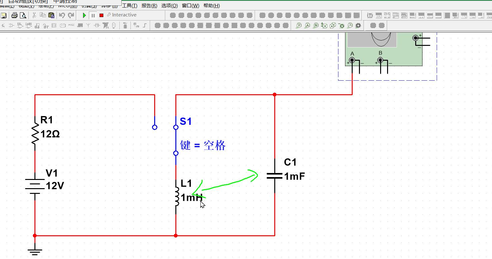

### 2025-02-18
- 电阻
  - 碳膜电阻。
  - 电阻的读法，103 10K 最后的一位数字代表的是 10的3次方。
  - e24系列电阻。
- 电子和电流的方向是相反的
- 二极管
  - 有标识的是负极

#### 2025-02-23 周末班
- 耐压值，
  - R 等于 。
  - 带字母的是拼接的，字母代表次方
  - 数字的是，最后一位是代表次方的意思。
  - 色环电阻
    - 宽的是第一位，依次读取，离电子近的是第一个位
    - 倒数第二位是次方的意思，
    - 倒数第一位是误差的意思。
- 可调电阻：电位器。多圈电位器
  - 双联电位器，单联电位器。
  - 多圈电位器，
  - 不是所有的旋转都是电位器，还有旋转编码器。（鼠标用的是编码器）（可以旋转，一直转，只要旋钮不坏）
    - 动子，定子，爆炸图
    - 光学编码器，向左转或者向右转，识别电机转动的角度
    - 伺服电机贵，转速快，步进电机便宜，转速慢。
    - 模拟电路用电位器比较多，数字电路不使用。
  - 敏感电阻：热敏电阻。
    - 过温，保险丝，正温度系数 PTC，自恢复保险丝。（比价贵，医疗，笔记本电脑，缺点：故障率比较高，智能扫地机，当扫地时候，有头发缠住了电机，需要使用，使用频繁断开的话，会坏的，故障率高。）
    - 负温度系数：用于测温。NTC,保护电路浪涌使用。
    - 快速认证群。（和浪涌都是专业名词。）
  - 光敏电阻：半导体材料做的，光变强，阻值变小。
  - 热敏电阻再高一些，热电偶温度更高
    - 玻璃管的电阻，
  - 气敏电阻：特殊气体，检测。
  - 压敏电阻：电压越高，电流越高。（检测电压使用的）过压导通的作用
  - 压力应变片电阻：里面包含有金属丝，挤压或者拉伸，电阻变小或者变大。（体重秤用的就是这种）横截面积。
  - 零殴电阻：调试用，当跳线用，降低干扰。

#### 2025-03-02
- 电容用C表示 关注：耐压，容量。电流方向充放电不一致。
- 充电完成后，和电源值是一样的。不会影响结果。影响过程，速度。
- 两个导电材质挨得很近就会形成电容
- 非线性
- 三层，上层和下层是绝缘的。
- 电容率（电介质）
- 距离越近，电容越大，绝对面积越大，电容越大。电容 = 电容面积/导电材质距离。
- 电容率目前高的电解液。
- 正负极和不区分正负极
  - 区分正负极容量比较大。不区分的正负极的容量比较小。
- 47uF以上是比较大的电容。分47uF(微法)是大电容和小容量的分水岭
- 有极性：电解电容，钽电解，铝电解
- 铝电解，有颜色的是负极，寿命短。漏电大，所有电容最差的。
- 固态电解电容，有颜色标记的是负极
- 钽电解电容，色带，有标志的是正极，价格贵。（军工使用）
- 无极性电容：
  - 种类多，根据材质区分，
  - 陶瓷电容（MLCC,使用普遍，容量大，叠了几百层，差等生中优等生，容易出现裂痕。电容短路）
  - 涤纶电容（淘汰了，老产品中用）
  - 安规电容（MKP,体积大，自愈性好，阻燃性好，金属化聚丙烯），安规行业使用《X1 X2（串联） Y（并联） 电容》，薄膜性。
  - CBB(工业上，消费类电子) 一档 薄膜电容
  - 高压瓷片（瓷片电容，电压做高了）
  - 独石电容插件的MLCC（淘汰了）
  - 穿心电容：（音频行业使用，优化失帧）
  - 电解电容，头顶有一个防炸的设置。电解电压误差20%，安规电容 5~10%，谐振电路使用误差小的 1-5%。
  - 高频，射频，军工使用云母电容。
- 超级电容：替代电池，优点不容易坏，不影响寿命。
  - 电池容量大，电容容量赶不上电池
- 特性：
  - 存能
    - 电网：把晚上发的电，使用电机把水抽到高位，白天使用水转成电能。
  - 隔直通交：能通过一部分作用
    - 当串联的时候，
    - 交流电中有直流电
    - 交流电有负极
    - 波形带有直流电。
    - 实现电路中需要的信号。
    - 电源和电源可以串联
    - 信号和信号串联
    - 电源和信号不能串联。
    - 能通过去，不代表全部都通过去。有阻碍的作用，叫做容抗。如果想多通过一些，就需要远小于负载的阻值。
    - 声音的频率20HZ ~ 20KHZ
  - 电容器两端电压不能瞬变。：容量，阻值，电流。 t 约等于 4*R*C
    - 根据电容算电阻。电容器充电，后期充电很慢。越充电流越小。（串联分压，电容电压在上升，分的电压就改变，就影响到了电流）充电时候，像是一根导线，充满的时候就是断开的。
    - 充电和放点都不是立即完成的。
    - 使用场景：单片机的复位电路
  - 电容参数
    -  容量小，耐压高，容量大，耐压低。（可以并联，提高容量，耐压相同，串联，容量减半，型号一样）
    -  耐压：高压性：高压电容，耐压越高，体积越大。（安规，薄膜）是电压 1.5 倍
    -  寿命：针对铝电解，无极性电容是无穷大的，温度降低10度，时间成倍增加。
    -  ESR 电容电阻，和频率有关系，（低频用大电容，高频用小电容，容抗）
    -  低频下，容量越大，滤波越好。
 -  损耗因数
    -  损耗为1 500uF 需要1000uF的电容。
    -  和 ESR 有直接关系。
 -  数字电桥：
    -  测量：电阻，电感，电容的工具
-  

#### 2025-03-09 电感
- 电流不变，电流方向不变。针对交流电。
- 差模电感。越是高频越有效。
- 电容：越是低频的越有效。
- 自感，互感。默认单位微亨(uh)，叠层型。
- 电阻：顶层黑色，电容：咖啡色，电感：全黑色，磁珠：全黑色。
- 空心电感，间距不一致。谐振电路，感量小。
- 使用器件：电苍蝇拍，特斯拉实验，电警棍。防身手电筒。
- 特性：
  - 储能
    - 电流不变，电流方向不变。电压方向改变。
  - 通直流阻交流
    - (p-p)工具中代表的是交流的符号。对于交流电的阻力，感抗（相当于几万的电阻）
  - 通过电感的电流不能瞬变。
    - 充满电后，压差是0V，电流是不变的。
    - 带线圈的断点的话，就形成一个反向的高压。
    - 电流方向。上底，下高。地是0V, 上面的是低的，所以是负电压。
  - 谐振电路
    - LC 并联谐振，串联谐振，交流正玄电。
    - LC 谐振公式：
    - 感性负载：电机，直流电加了一个电感。
    - 应用：手机的频率的本振频率，手机的无线充电。（小米隔空充电，没法应用，相控阵雷达先进手段）
  - 参数，选型注意电流。
    - 电感量
    - 电感电阻（DCR）
    - 允许误差 20%，（谐振电路，不允许误差大）
    - 品质因数(Q值)，大容量的使用低频中，小容量的使用高频中。值越高，品质越好。
    - 自谐振，不能让电感产生。感量越大，自谐振越低。
- 磁珠：为了过3C认证，电路有好处的。
  - 高频率有过滤噪声作用，串联使用。
  - 导线磁珠，插件磁珠，贴片磁珠。
  - 分压的结果。干扰被磁珠给吸收。
  - 经验：额定电流大于实际1-2倍的。

#### 2025-03-16 电感+继电器
##### 共模电感
- 是针对共模的。共模电阻，干扰。（开关电源），是有阻值的。
- 干扰的电流方向是同一个方向。
- 骚扰的都是共模的。共模的不一定是骚扰的。
- 有过电流的要求的，（共模滤波器）
- 关键芯片（对噪声敏感的芯片，ADC，放大器电路，）

##### 继电器
- 低压控制高压。(洗衣机的电源控制，速度不快。有0.1秒的延迟)
- 常闭触电，常开触电。
- 银合金材料，（铜容易氧化）
- 常使用交流电控制。

##### 变压器
- 只能变交流电。不能变直流。
- 高频：铁氧体
- 低频：硅钢（220V电压）
- 电压多少（取决线圈的比例 == 电压比）
- 两边靠磁场来传递能量。
- 电感和变压器区别
  - 变压器线圈方向不要求
  - 电感是连接一起的，变压器是隔离的。
  - 右手定则：
  - 变高电压电流变小。
  - 变压器同名端。
##### 扬声器
- 声音的电信号：交流电。可以左右运动。使用电，产生震动。
- 原理很像：马达电机。换向器。可以转行运动。  
  - 无刷电机：铜在外面，在定子上。转速靠程序控制。三个转子。霍尔传感器。
  - 频率，谐波。一个波形，叠加了多个正弦波。
- 大尺寸的灵敏度低，小尺寸的灵敏度高。
- 阻值：交流阻抗。
- 电源直流：信号交流，

##### 麦克风
- 咪头，咪芯，品牌：舒尔
- 线圈就多一些，耳机扬声器，线圈会少一些。既是扬声器的线圈反过来使用。
- 让震动，产生电。
- 种类
  - 动圈式麦克风, 音质好，灵敏度低，
  - 电容式麦克风，音质普通，灵敏度高。
  - 微机点式MEMS麦克风（硅麦，分数字和模拟两种，模拟先连放大，然后连ADC,然后再连芯片使用）使用，蓝牙耳机，手机。
  - 驻极体麦克风
##### 蜂鸣器
- 音调单调，通电就响，不通电不响。
- 使用报警。
- 有源式蜂鸣器，接反了不响。（已经函了驱动源）
- 无源式蜂鸣器，需要外在搭建电路使用。
- 压电陶瓷蜂鸣器。